# RA 系列 BSP 制作教程

本文主要介绍 RENESAS RA 系列开发板的 BSP 制作教程，此教程能够帮助开发者更加方便快捷的制作新的 RA 系列 BSP，更好的理解 RA 系列 BSP 的框架结构。

在 RA 系列的每个 BSP 目录中包含 RA 模板工程、board、RT-Thread 的工程配置及构建脚本等，而对接到 RT-Thread 系统的通用驱动文件则存放在`renesas\libraries\HAL_Drivers`中。这两个部分共同组成一个完整的 BSP 工程。

在 RA 系列的 BSP 中引入了瑞萨电子的**[灵活配置软件包](https://www2.renesas.cn/jp/zh/software-tool/flexible-software-package-fsp)**（下文简称 FSP）配置工具，为使用 RA 系列 ARM 微控制器的嵌入式系统设计提供简单易用且可扩展的高质量软件。FSP 包括高性能、低内存占用的业界一流的 HAL 驱动程序，具有图形化配置界面和智能代码生成器。

RA 系列 BSP 框架的主要特性如下：

- 使用 FSP 生成的 RA 模板工程，降低新 BSP 的添加难度；
- 通用的驱动文件，开发者可以方便地使用所有驱动；
- 使用 FSP 配置工具对芯片外设进行图形化配置；

## 1. BSP 框架介绍 

BSP 框架结构如下图所示：

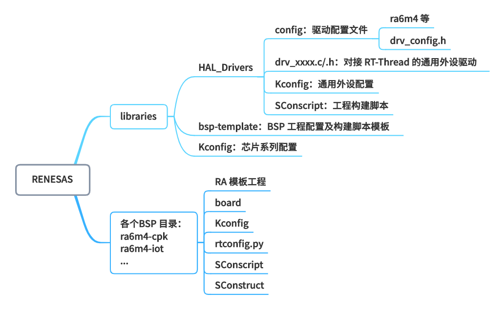

每一个 BSP 主要由两部分组成，分别是通用驱动库、特定开发板 BSP，下面的表格以 ra6m4-cpk 为例介绍这几个部分：

|项目|文件夹|说明|
| - | - | :-- |
| 通用库 | renesas\libraries\HAL_Drivers | 用于存放对接 RT-Thread 驱动框架的通用外设驱动 |
| 特定开发板 BSP | renesas\ra6m4-cpk | CPK-RA6M4 开发板的 BSP 工程 |

## 2. 知识准备

制作一个 BSP 的过程就是构建一个新系统的过程，因此想要制作出好用的 BSP，要对 RT-Thread 系统的构建过程有一定了解，需要的知识准备如下所示：

- 掌握 RA 系列 BSP 的使用方法

  了解 BSP 的使用方法，可以阅读 [BSP 说明文档](../README.md) 中使用教程表格内的文档。了解外设驱动的添加方法可以参考《外设驱动添加指南》。

- 了解 [Scons](https://www.rt-thread.org/document/site/#/development-tools/scons/scons) 工程构建方法

  RT-Thread 使用 Scons 作为系统的构建工具，因此了解 Scons 的常用命令对制作新 BSP 是基本要求。

- 了解[设备驱动框架](https://www.rt-thread.org/document/site/#/rt-thread-version/rt-thread-standard/programming-manual/device/device)

  在 RT-Thread 系统中，应用程序通过设备驱动框架来操作硬件，因此了解设备驱动框架，对添加 BSP 驱动是很重要的。

- 了解 [Kconfig](https://www.rt-thread.org/document/site/#/development-tools/kconfig/kconfig) 语法

  RT-Thread 系统通过 menuconfig 的方式进行配置，而 menuconfig 中的选项是由 Kconfig 文件决定的，因此想要对 RT-Thread 系统进行配置，需要对 kconfig 语法有一定了解。

- 熟悉 [FSP](https://www2.renesas.cn/jp/zh/software-tool/flexible-software-package-fsp) 配置工具的使用

  FSP 提供了图形化配置工具和智能代码生成器，在制作和使用 BSP 的过程中经常会用到 FSP 配置工具。

## 3. BSP 制作方法

本节以制作 CPK-RA6M4 开发板的 BSP 为例，讲解如何为一个新的开发板添加 BSP，最终制作完成的 BSP 将支持 MDK 和 scons 两种方式构建。

BSP 的制作过程分为如下步骤：

1. 创建 BSP 目录
2. 创建 RA 模板工程
3. 配置模板工程
4. 修改 Kconfig 文件
5. 修改工程构建和配置文件
6. 重新生成工程
7. 添加 GCC 格式链接脚本
8. 修改 rtconfig.py 中的编译参数

在接下来的章节中将会详细介绍这些步骤，帮助开发者创建所需要的 BSP。

### 3.1 创建 BSP 目录

- 创建 BSP 目录不需要直接创建空文件夹，只要复制 BSP 模板 `\renesas\libraries\bsp-template` 文件夹到 `\renesas` 目录并将名称修改为待添加的开发板名即可。命令可参考 **CPK-RA6M4** 的 BSP 命名为 **ra6m4-cpk**，因为 ra6m4-cpk 已经存在，所以本教程使用 **ra6m4-test** 作为新创建的 BSP 名称。

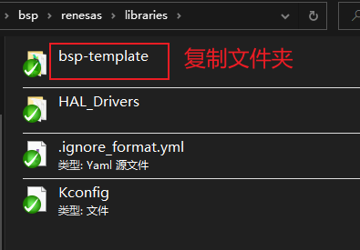 

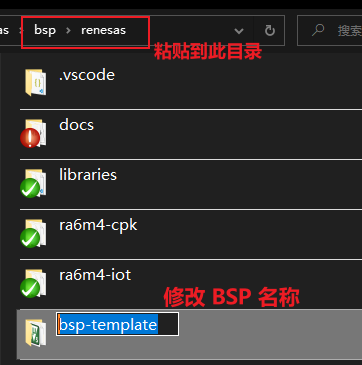 

 

### 3.2 创建 RA 模板工程

第一步是使用 FSP 来创建一个 RA 模板工程。

- 在 FSP 安装目录下找到 /eclipse/rasc.exe 双击打开，开启后会自动进入创建工程界面。

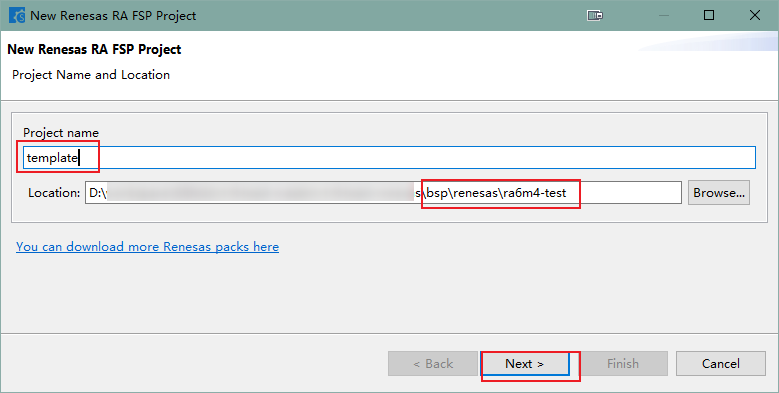 

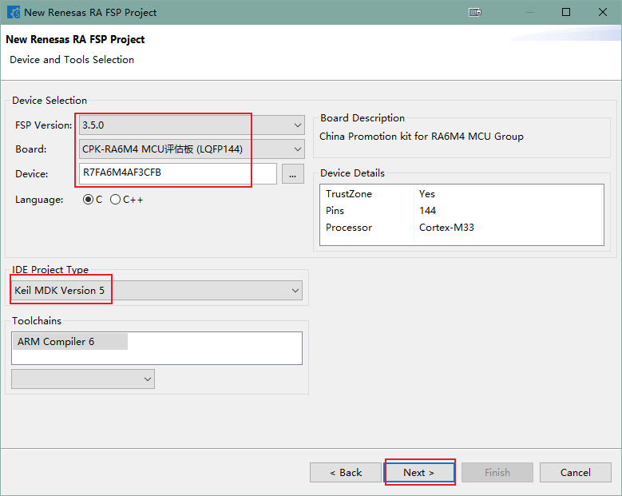 

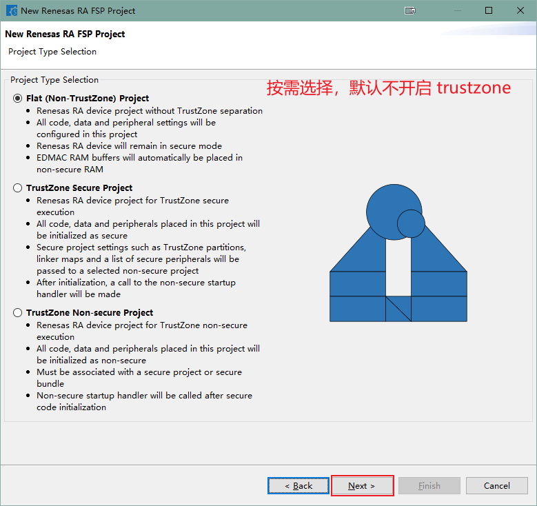 

 

 

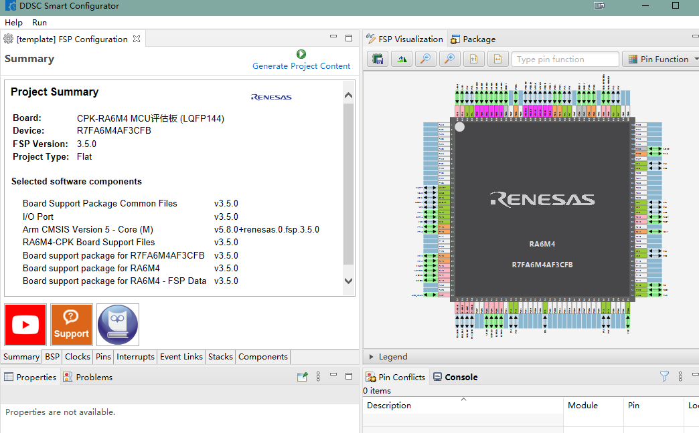 

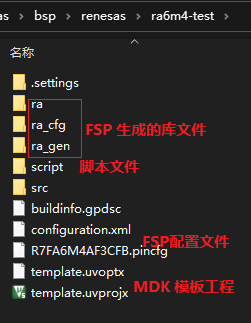 

创建完成后会得到一个 RA 模板工程和 BSP 最基本的配置文件和驱动文件，如上图所示。

### 3.3 配置模板工程

RA 模板工程创建完成后，需要做些修改并添加基础外设 GPIO、UART。

- 打开模板工程 `template.uvprojx` 

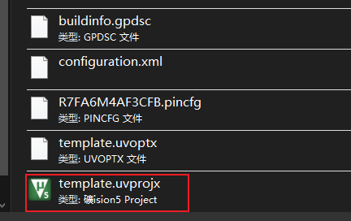 

- 修改 MDK 工程配置
> **Debug 配置：** 先截图记录下修改前的 Debug 页配置，修改 Device 后 Debug 页的部分配置会发生修改，改完 Device 后手动修改到默认配置。

 

> **Device 配置：**修改 Device 选项，根据开发板使用的具体芯片型号选择 device。

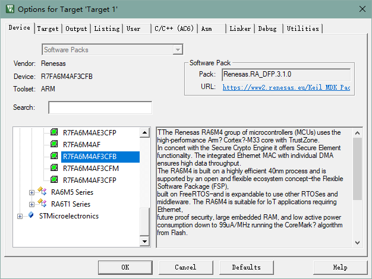 

> **Output 配置：** 修改 `Name of Exexutable`为 rtthread，勾选 `Create HEX File`，因为最终烧录的是 HEX 文件。

 

> **User 配置：**在用到 TrustZone 时，有额外调用的划分 Secure & Non-Secure 用到的一些指令，如果开发时用的都是 Flat mode 的话，这部分可以忽略。如果需要可以添加命令【cmd /c "start "Renesas" /w cmd /c ""$Slauncher\rasc_launcher.bat" "3.5.0" --gensecurebundle --compiler ARMv6 "$Pconfiguration.xml" "$L%L" 2> "%%TEMP%%\rasc_stderr.out"""】

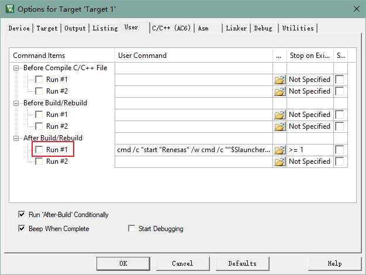 

> **C/C++ 配置：**修改编译参数选项关闭部分警告，删除“-Wextra“、”-Wconversion“、”-Wshadow ” 。
>
> 以 ra6m4-cpk 为例修改后为：-Wno-license-management -Wuninitialized -Wall -Wmissing-declarations -Wpointer-arith -Waggregate-return -Wfloat-equal

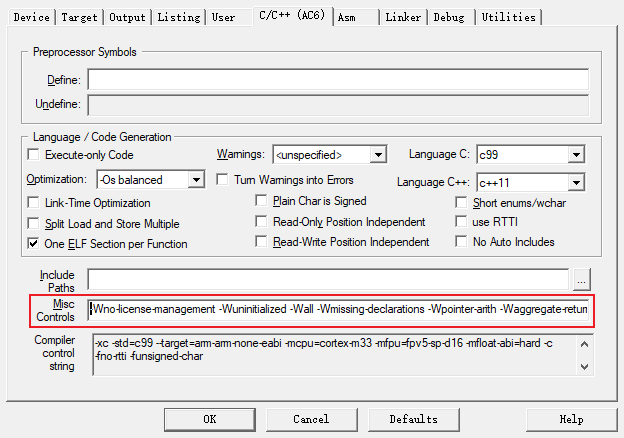  

> **Utilities 配置：**如图勾选`Use External Tool for Flash Programming`。配置完成点击 `OK` 保存配置。

 

- 从 MDK 打开 FSP

> **如何在 MDK 中打开 FSP：**
>
> 1. 打开 MDK，选择 “Tools -> Customize Tools Menu…”
> 2. 点击 “new” 图标，添加一条自定义命令: RA Smart Configurator
> 3. Command 输入工具的安装路径， 点击“…”找到安装路径下的“rasc.exe”文件并选中 (setup_fsp_xxxxx 安装目录下)
> 4. Initial Folder 输入参数: $P
> 5. Arguments 输入参数: --device $D --compiler ARMv6 configuration.xml
> 6. 点击 OK 保存命令“Tools -> RA smart Configurator”  
   
> 7. 点击添加的命令打开配置工具：**RA Smart Config**  
   

- 添加 UART 端口
> 选择 Stacks 配置页，点击 New Stack 找到 UART。  
  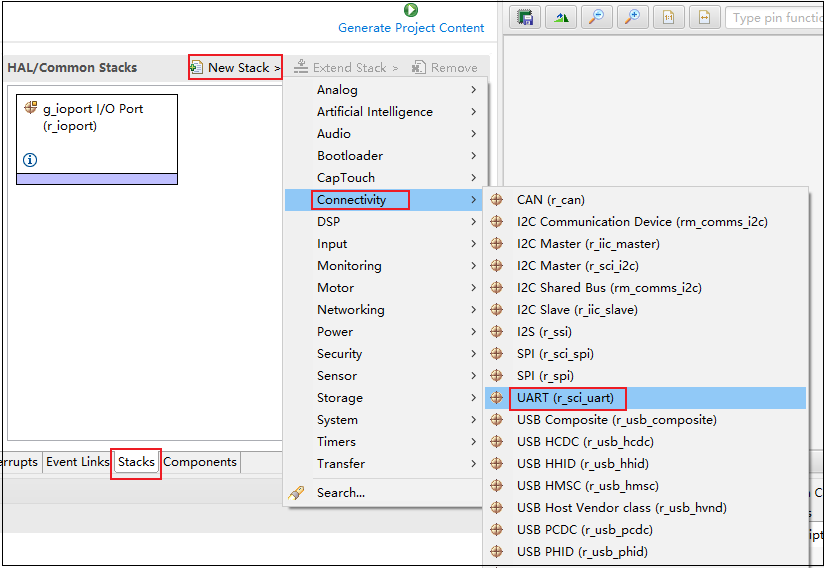 
> 确认开发板可用于 msh 的 UART 通道。配置 UART 参数，因为需要适配 RT-Thread 驱动中使用的命名所以需要修改，设置 **name** 、**channel**  、**callback** 为一致的标号。格式：channel = **X**，name = g_uart**X**、callback = user_uart**X**_callback  
  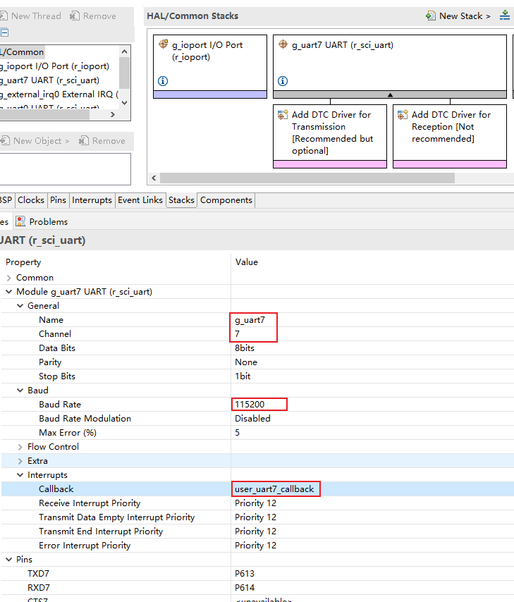 

### 3.4 修改 Kconfig 选项

在本小节中修改 `board/Kconfig` 和 `libraries/Kconfig` 文件的内容有如下两点：

- 芯片型号和系列
- BSP 上的外设支持选项

芯片系列的定义在`renesas\libraries\Kconfig` 中，修改前先确认是否存在添加的芯片系列定义，如果是一个未添加的系列，需要先添加该芯片系列的定义。芯片型号和系列的命名格式如下表所示。

| 宏定义             | 意义     | 格式               |
| ------------------ | -------- | ------------------ |
| SOC_R7FA6M4AF      | 芯片型号 | SOC_R7FAxxxxx      |
| SOC_SERIES_R7FA6M4 | 芯片系列 | SOC_SERIES_R7FAxxx |

添加芯片系列：

 

关于 BSP 上的外设支持选项，一个初次提交的 BSP 仅仅需要支持 GPIO 驱动和串口驱动即可，因此在配置选项中只需保留这两个驱动配置项，如下图所示：

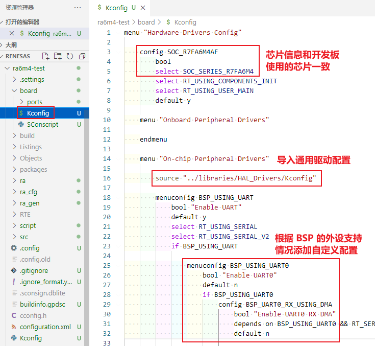 

### 3.5 修改工程构建和配置文件
- 添加驱动 config，根据不同芯片系列创建目录，按照支持情况对外设的配置进行修改。

 

​	以UART为例，添加端口的配置信息，根据不同芯片对外设的支持情况进行修改。

 

- 修改启动文件 startup.c

>  源文件路径：**ra6m4-cpk\ra\fsp\src\bsp\cmsis\Device\RENESAS\Source\startup.c**

```c
#ifdef __ARMCC_VERSION
    main();
#elif defined(__GNUC__)
    extern int entry(void);
    entry();
#endif
```

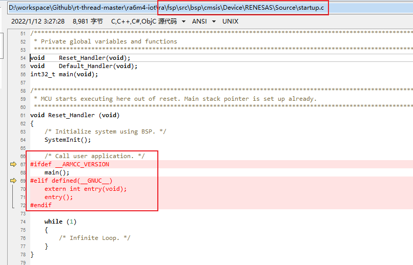 

- 修改 SRAM 大小配置

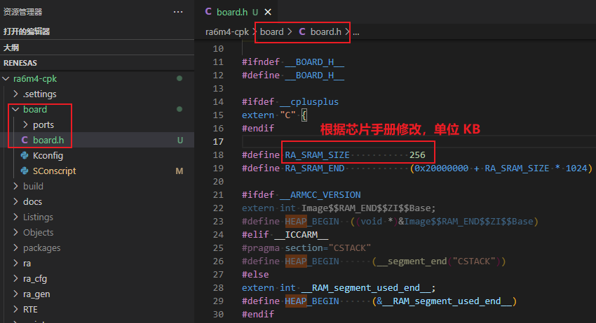 

- 修改 GPIO 中断配置

根据 BSP 使用芯片支持的 IRQ 中断情况修改配置文件。可以使用 FSP 配置工具对照查看 IO 引脚号对应的 IRQ 通道。

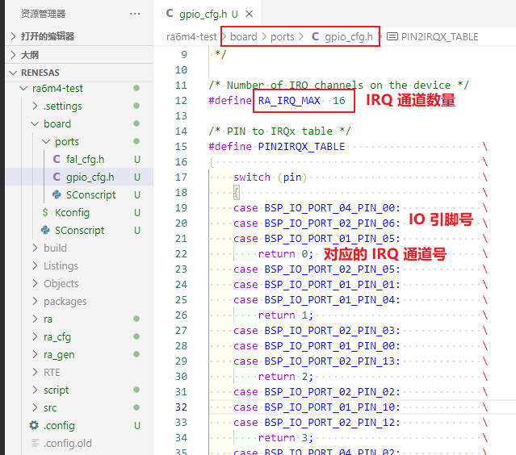 

- 修改初始应用层代码

在 RA 系列的 BSP 中，应用层代码存放在 `src/hal_entry.c` 中。使用 FSP 生成的默认应用代码需要全部替换为如下代码，如果开发板没有板载 LED 可以将 `while(1)` 中的代码删除。

```c
/*
 * Copyright (c) 2006-2021, RT-Thread Development Team
 *
 * SPDX-License-Identifier: Apache-2.0
 *
 * Change Logs:
 * Date           Author        Notes
 * 2021-10-10     Sherman       first version
 */

#include <rtthread.h>
#include "hal_data.h"
#include <rtdevice.h>

#define LED_PIN    BSP_IO_PORT_01_PIN_06 /* Onboard LED pins */

void hal_entry(void)
{
    rt_kprintf("\nHello RT-Thread!\n");

    while (1)
    {
        rt_pin_write(LED_PIN, PIN_HIGH);
        rt_thread_mdelay(500);
        rt_pin_write(LED_PIN, PIN_LOW);
        rt_thread_mdelay(500);
    }
}
```

- 修改 rtconfig.py 中的CPU参数

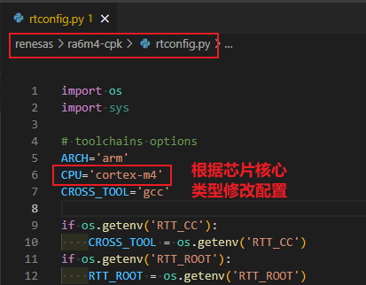 

### 3.6 重新生成工程

重新生成工程需要使用 Env 工具。

- 重新生成 rtconfig.h 文件

在 Env 界面输入命令 menuconfig 对工程进行配置，并生成新的 rtconfig.h 文件。如下图所示：

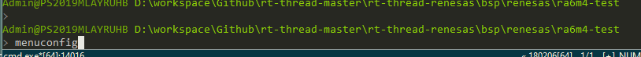 

打开 GPIO 和 console 使用的 UART 端口。

 

修改 console 输出使用的设备名称。

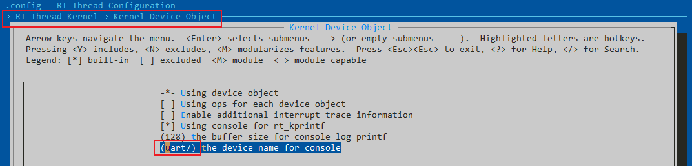 

- 生成 MDK 应用工程
下面以重新生成 MDK 工程为例，介绍如何重新生成 BSP 工程。

使用 env 工具输入命令 `scons --target=mdk5` 重新生成工程，如下图所示：

 

重新生成工程成功：

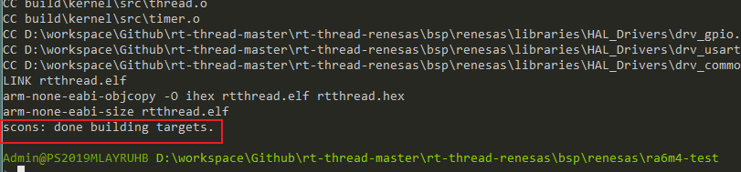 

到这一步，基于 MDK 开发的 BSP 就可以使用了。如果要使用 GCC 工具链编译还需加入 GCC 格式的链接脚本。 

### 3.7 添加 GCC 格式链接脚本

GCC 格式的链接脚本需要使用到瑞萨的 IDE 工具 e2studio。在 e2studio 中创建新的工程，步骤如下：

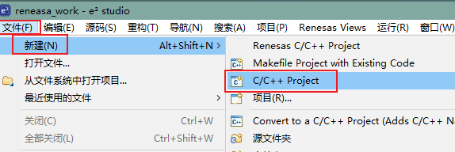 

 

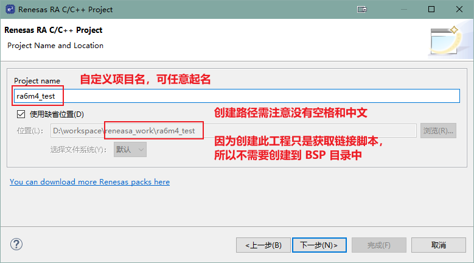 

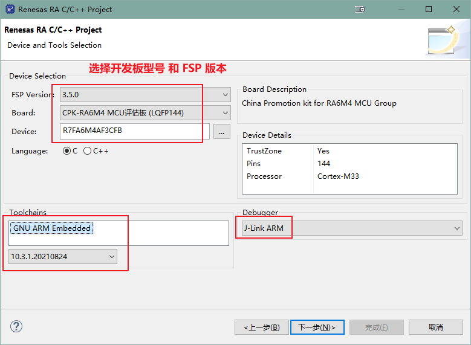 

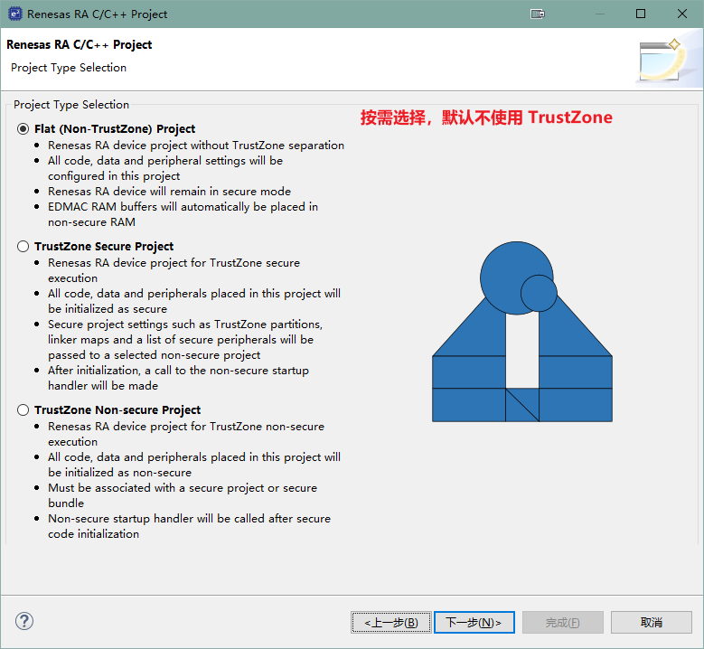 

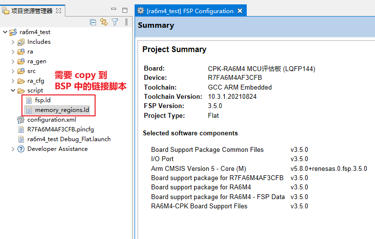 

工程创建完成后，我们需要将工程中的两个 xxx.ld 文件 copy 到 BSP 中的 script 目录下。

 

- 修改链接脚本

> 链接脚本文件路径：**ra6m4-cpk\script\fsp.ld**

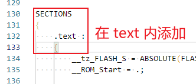 

> 将下面的代码复制到 text 段中，**注意要添加到 text{  } 括号内**

```shell
/* section information for finsh shell */
. = ALIGN(4);
__fsymtab_start = .;
KEEP(*(FSymTab))
__fsymtab_end = .;

. = ALIGN(4);
__vsymtab_start = .;
KEEP(*(VSymTab))
__vsymtab_end = .;

/* section information for initial. */
. = ALIGN(4);
__rt_init_start = .;
KEEP(*(SORT(.rti_fn*)))
__rt_init_end = .;

. = ALIGN(4);
KEEP(*(FalPartTable))
```

> 添加后如下图所示：

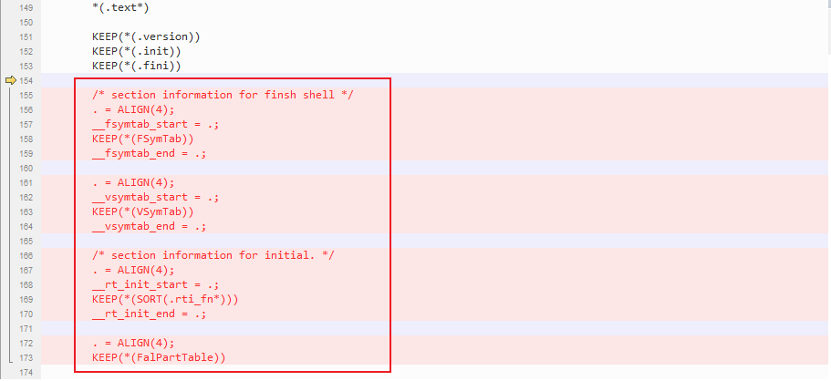 

### 3.8 修改 rtconfig.py 中的编译参数

 

除了上图的内核类型，还有编译参数的配置需要确认。相关配置项说明可查看文档中心对于 scons 工具的介绍。[跳转链接](https://www.rt-thread.org/document/site/#/development-tools/scons/scons?id=编译器选项)     

至此，一个基础的支持 GCC 和 MDK 的 BSP 工程就创建完成了，接着就可以使用 MDK 或 scons 验证开发的工程是否可编译、可运行。

感谢每一位贡献代码的开发者，RT-Thread 将与你一同成长。

## 4. 规范

本章节介绍 RT-Thread RA 系列 BSP 制作与提交时应当遵守的规范 。开发人员在 BSP 制作完成后，可以根据本规范提出的检查点对制作的 BSP 进行检查，确保 BSP 在提交前有较高的质量 。

### 4.1 BSP 制作规范

RA 的制作规范主要分为 3 个方面：工程配置，ENV 配置和 IDE 配置。在已有的 RA 系列 BSP 的模板中，已经根据下列规范对模板进行配置。在制作新 BSP 的过程中，拷贝模板进行修改时，需要注意的是不要修改这些默认的配置。BSP 制作完成后，需要对新制作的 BSP 进行功能测试，功能正常后再进行代码提交。

下面将详细介绍 BSP 的制作规范。

#### 4.1.1 工程配置

- 遵从RT-Thread 编码规范，代码注释风格统一
- main 函数功能保持一致
  - 如果有 LED 的话，main 函数里**只放一个**  LED 1HZ 闪烁的程序
- 在 `rt_hw_board_init` 中需要完成堆的初始化：调用 `rt_system_heap_init`
- 默认只初始化 GPIO 驱动和 FinSH 对应的串口驱动，不使用 DMA
- 当使能板载外设驱动时，应做到不需要修改代码就能编译下载使用
- 提交前应检查 GCC、MDK 编译器直接编译或者重新生成后编译是否成功
- 使用 `scons --dist` 命令对 BSP 进行发布，检查使用 `dist` 命令生成的工程是否可以正常使用

#### 4.1.2 ENV 配置

- 系统心跳统一设置为 1000（宏：RT_TICK_PER_SECOND）
- BSP 中需要打开调试选项中的断言（宏：RT_USING_DEBUG）
- 系统空闲线程栈大小统一设置为 256（宏：IDLE_THREAD_STACK_SIZE）
- 开启组件自动初始化（宏：RT_USING_COMPONENTS_INIT）
- 需要开启 user main 选项（宏：RT_USING_USER_MAIN）
- 默认关闭 libc（宏：RT_USING_LIBC）
- FinSH 默认只使用 MSH 模式（宏：FINSH_USING_MSH_ONLY）

#### 4.1.3 IDE 配置

- 使能下载代码后自动运行
- 使能 C99 支持
- 使能 One ELF Section per Function（MDK）
- MDK/IAR 生成的临时文件分别放到build下的 MDK/IAR 文件夹下
- MDK/GCC/IAR 生成 hex 文件名字统一成 rtthread.hex

### 4.2 BSP 提交规范

- 提交前请认真修改 BSP 的 README.md 文件，README.md 文件的外设支持表单只填写 BSP 支持的外设，可参考其他 BSP 填写。查看文档[《RA系列驱动介绍》](./RA系列驱动介绍.md)了解驱动分类。
- 提交 BSP 分为 2 个阶段提交：
  - 第一阶段：基础 BSP 包括串口驱动和 GPIO 驱动，能运行 FinSH 控制台。完成 MDK5 、IAR 和 GCC 编译器支持，如果芯片不支持某款编译器（比如MDK4）可以不用做。 BSP 的 README.md 文件需要填写第二阶段要完成的驱动。
  - 第二阶段：完成板载外设驱动支持，所有板载外设使用 menuconfig 配置后就能直接使用。若开发板没有板载外设，则此阶段可以不用完成。不同的驱动要分开提交，方便 review 和合并。
- 只提交 BSP 必要的文件，删除无关的中间文件，能够提交的文件请对照其他 BSP。
- 提交前要对 BSP 进行编译测试，确保在不同编译器下编译正常
- 提交前要对 BSP 进行功能测试，确保 BSP 的在提交前符合工程配置章节中的要求
