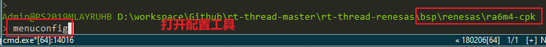
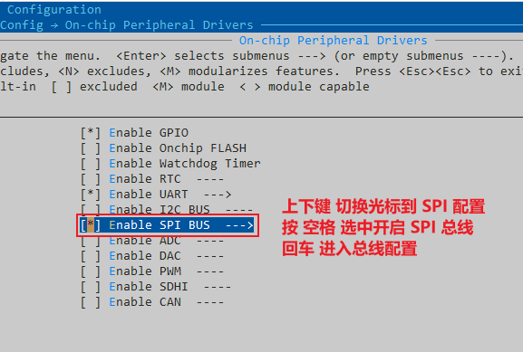
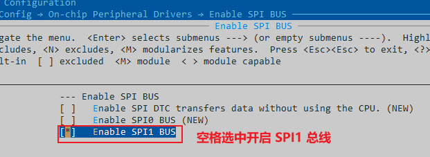
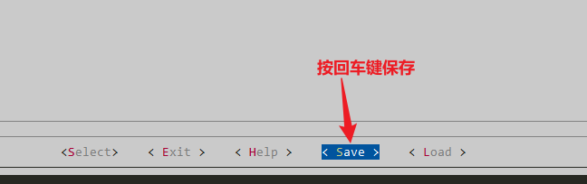
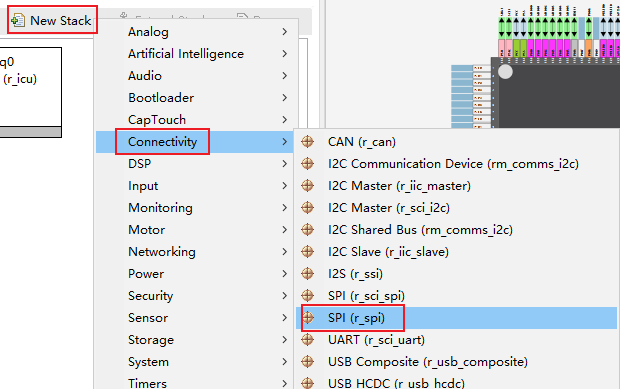
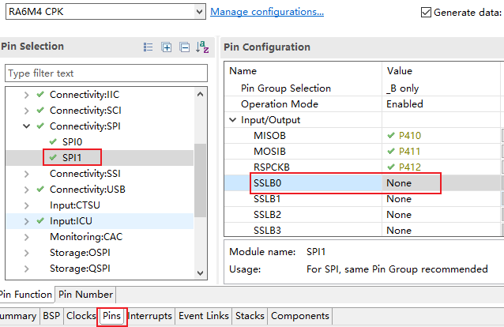
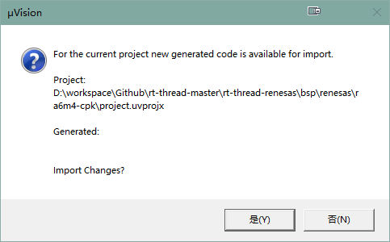
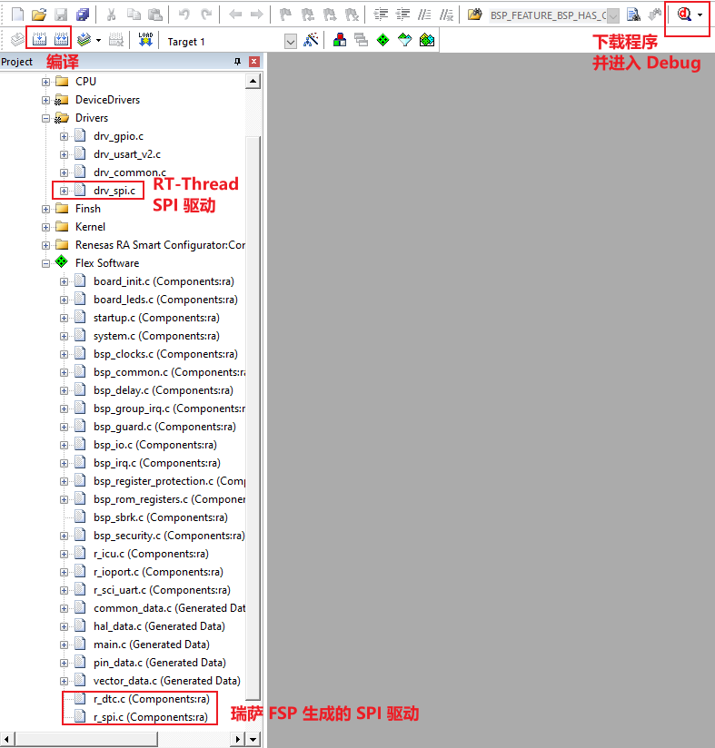
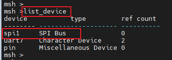

# RA系列BSP外设驱动使用教程

## 1. 简介

本文档是为需要在 RT-Thread 操作系统上使用更多开发板资源的开发者准备的。通过使用 ENV 工具对 BSP 进行配置，可以开启更多板载资源，实现更多高级功能。

主要包括以下内容：

1. 如何使用开发板上更多的板载资源
2. 如何使用更多的片上资源
3. 如何添加更多片上资源选项

## 2. 前提要求

- 学会如何使用 ENV 工具，参考：[RT-Thread env 工具用户手册](https://www.rt-thread.org/document/site/#/development-tools/env/env)
- 熟悉 [FSP](https://www2.renesas.cn/jp/zh/software-tool/flexible-software-package-fsp) 配置工具的使用

## 3. 如何使用更多的外设资源

开发板上一般有很多外设资源，如 SPI、SDIO、ADC 等，但是 BSP 工程默认没有开启这些外设驱动。RT-Thread 提供了 ENV 工具来开启或关闭 BSP 的外设驱动。本文以 RA6M4-CPK 开发板上开启 SPI 驱动为例，一步步地展示如何使用 ENV 工具对 BSP 进行配置。

### 3.1 打开配置工具

在 BSP 目录下打开 menuconfig 配置界面。

 

打开的配置工具界面如下所示：
  

通过键盘上的上下键移动光标，选中 `Hardware Drivers Config`然后按回车键进入硬件驱动配置菜单。

### 3.2 进入硬件驱动配置菜单

在硬件配置菜单里有三个选项，分别是 **板载外设配置菜单**、**片上外设配置菜单**和**扩展模块配置菜单**，使用下键切换到片上外设，按回车键进入配置菜单。

 

### 3.3 在板载外设配置菜单里开启 SPI Flash 选项

 

 

### 3.4 保存退出

然后右移光标选中 Save 按回车键保存，然后按 Esc 键退出配置工具。

 

### 3.5 生成 MDK5 工程

输入命令 `scons --target=mdk5` 重新生成 MDK5 的工程。

 

### 3.6 FSP 添加 SPI 外设

 

 

在 Pins 中配置 SPI1 端口引脚。**注意： SSLx 片选引脚设为 None，片选引脚的控制在驱动程序中由软件控制。**

配置完成，保存退出 FSP。

 

### 3.7 测试验证

回到生成的 MDK5 工程并编译。使用 FSP 配置完成后如果有新的文件添加进工程中，不会马上添加进去。需要先编译一次，如果弹出如下提醒，选择 “是” 然后再次编译即可。

 

编译成功后，点击 debug 按钮下载并进入调试页面。

 

### 3.8 查看运行结果

程序运行后，输入命令 `list_device` 可以看到名为 spi1 的总线设备，此时 SPI1 总线已经可以使用了。

 

## 4. 总结

本文以 SPI 为例介绍了外设驱动使用的操作流程，其他类型的外设如何使用和配置请查看：[RA系列使用FSP配置外设驱动.md](RA系列使用FSP配置外设驱动.md)

当开发者需要使用未开启的外设时，只要在 ENV 工具中使能相关的外设，然后在 FSP 中添加即可，重新生成的工程中就会添加对应的驱动文件。