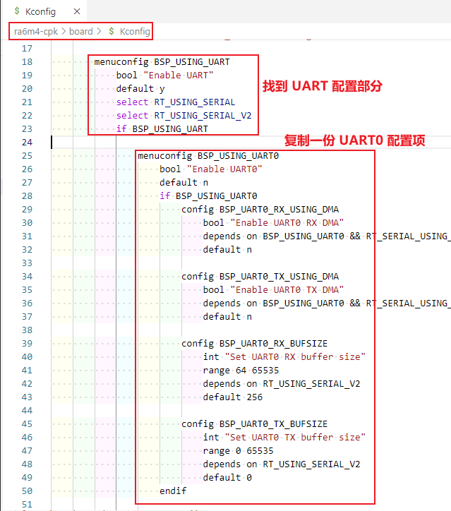
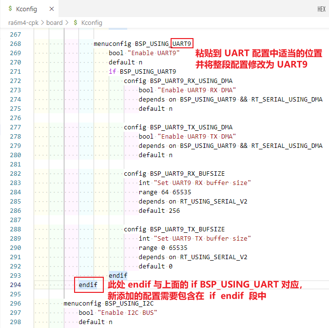
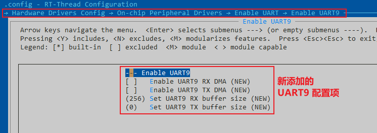
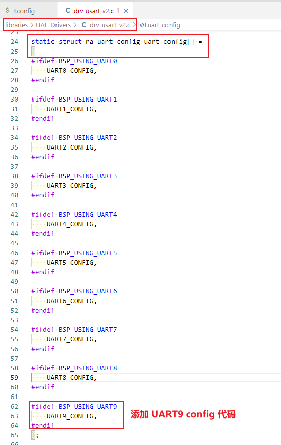
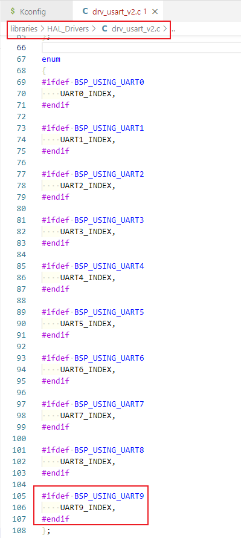
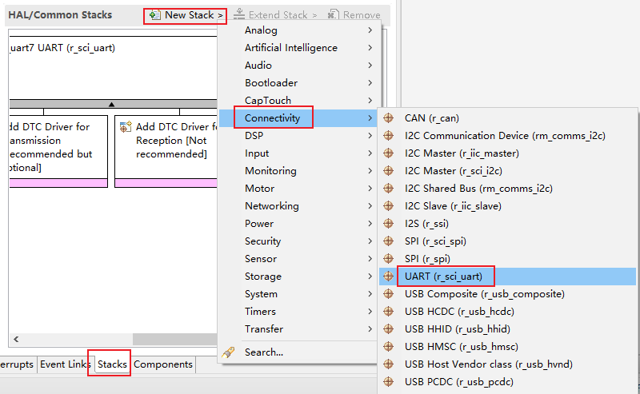
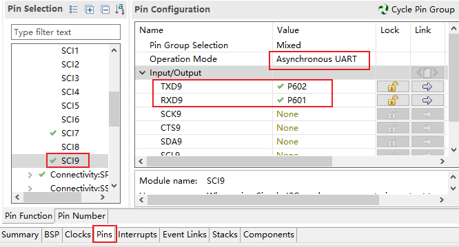

# RA 系列外设驱动添加指南

## 1. 简介

本文档是为需要给现有的 RA 系列 BSP 添加更多外设驱动的开发者准备的。通过阅读本文，开发者可以按照自己的实际情况给现有 BSP 添加自己需要的驱动。

## 2. 前提要求

- 熟练使用 ENV 工具，参考：[RT-Thread env 工具用户手册](https://www.rt-thread.org/document/site/#/development-tools/env/env)
- 熟悉 [Kconfig](https://www.rt-thread.org/document/site/#/development-tools/kconfig/kconfig) 语法
- 熟悉 [FSP](https://www2.renesas.cn/jp/zh/software-tool/flexible-software-package-fsp) 工具
- 了解 RT-Thread [设备驱动框架](https://www.rt-thread.org/document/site/#/rt-thread-version/rt-thread-standard/programming-manual/device/device) 

## 3. 如何添加更多的外设驱动选项

本章节以添加片上外设驱动为例，讲解如何为 BSP 添加更多可用驱动。如果想使用的片上外设是 `片上外设配置菜单` 里没有的，就需要开发者自己添加了。下面我们将演示如何为 ra6m4-cpk 添加 UART9 端口。

添加 UART 的外设支持需要以下步骤：

### 3.1 修改 Kconfig 文件

打开 BSP 中的 board\kconfig 文件，添加 UART9 配置。

 

 

修改完成后，在 BSP 目录下打开 ENV 工具，命令行输入 `menuconfig` 命令查看 UART9 配置是否已添加。

 

### 3.2 修改 uart_config.h 文件

Kconfig 的配置添加完成，还需要在配置文件和驱动文件中添加相应的配置。

打开 `libraries\HAL_Drivers\config\ra6m4\uart_config.h` 文件添加 UART9 配置。

 

### 3.3 修改 drv_usart_v2.h 文件

打开 `libraries\HAL_Drivers\drv_usart_v2.c`，添加如下代码：

 

 

### 3.4 测试验证

1. 在 menuconfig 中打开 UART9 并保存配置，使用 `scons --target=mdk5` 命令重新生成 MDK 工程。
2. 从 project 工程中打开 FSP 配置工具，添加 UART9 端口

 

 

3. 配置 UART9 对应的 IO 引脚，保存并退出。

 

4. 编译、debug 下载，输入 list_device 命令可以看到 uart9 设备已经注册到内核，说明设备添加成功，接下来就可以使用 UART9 端口进行通信了。

 
