# Captouch板载触摸按键配置说明

## 基础知识

电容式感应单元(CTSU2)测量传感器的静电电容。静电电容的变化由软件来确定，使CTSU能够检测手指是否与传感器接触。传感器的电极表面通常包裹有电介质薄膜，这样手指就不会直接接触电极。

如图所示，电极与周围导体之间存在静电电容(寄生电容)。由于人体是电导体，当手指靠近电极时，静电电容值会增大。

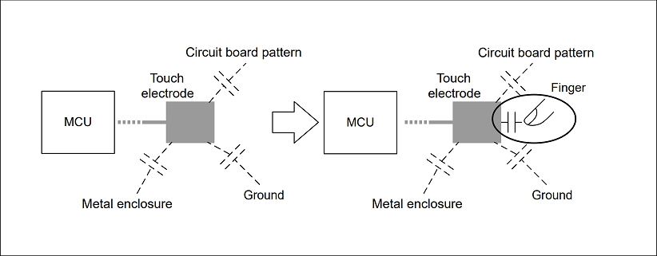 

静电电容的检测采用自电容法和互电容法。在自电容法中，CTSU检测手指和单电极之间产生的静电电容。在互容法中，使用两个电极，一个作为传输电极，另一个作为接收电极，CTSU检测当手指靠近这两个电极时产生的静电电容的变化。

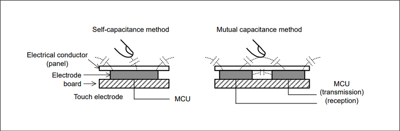 

接下来一起尝试在CPK-RA2L1这块开发板上如何使用触摸按键。

## FSP配置

首先是FSP配置。打开MDK的project工程，通过阅读README的FSP配置部分已经安装了FSP配置工具，并且在MDK中也添加了FSP的打开方式。

先打开FSP配置工具，移至“**Pins**”选项卡并打开 “**Peripherals**”条目。 在外围设备列表中，滚动到“**Input: CTSU**” 。打开配置并确保CTSU0 如下所示。 

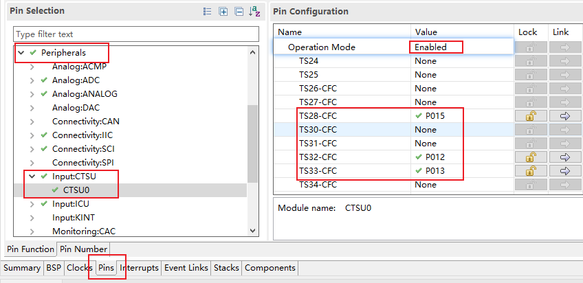 

### 创建CapTouch

然后，转到“**Stacks**”选项卡。首先，我们需要添加用于连接到触摸按键的模块。在“**HAL/Common Stacks**”窗格上，单击“**New Stack**”，然后选择“**CapTouch**”->“**Touch (rm_touch)**”。

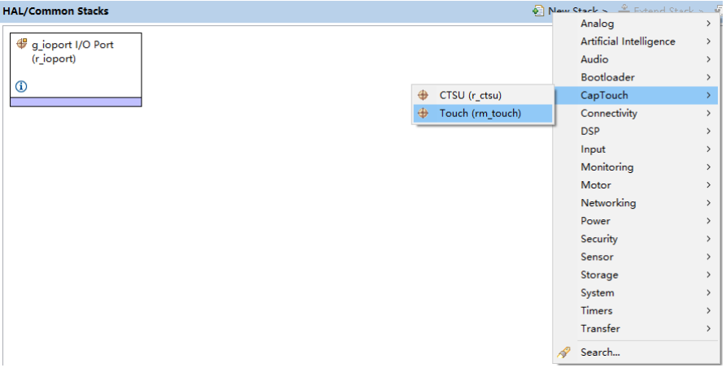 

选中创建出的rm_touch，在配置中开启UART的Tuning和monitoring功能。

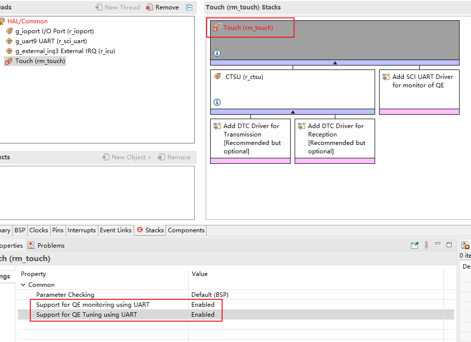 

添加UART端口用于调制过程。

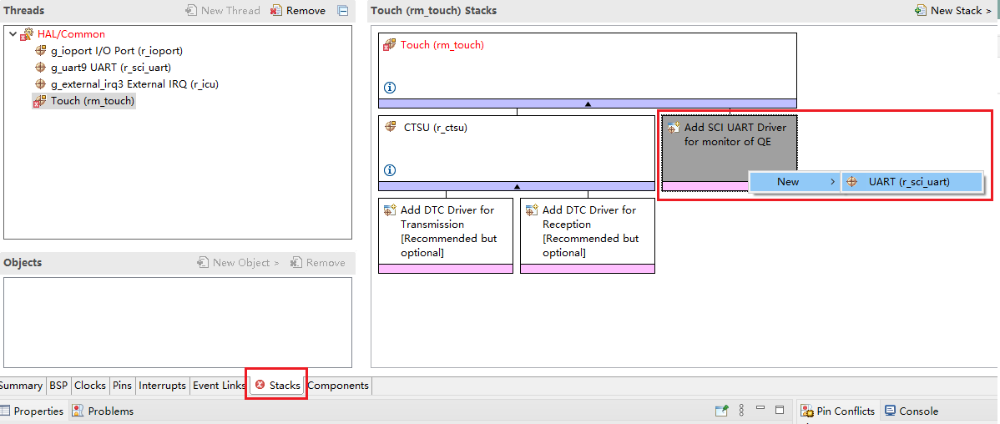 

### 添加UART端口

选中创建出的UART，这里使用UART 0来作为调制串口，如果需要使用其他串口可手动修改channel数值。

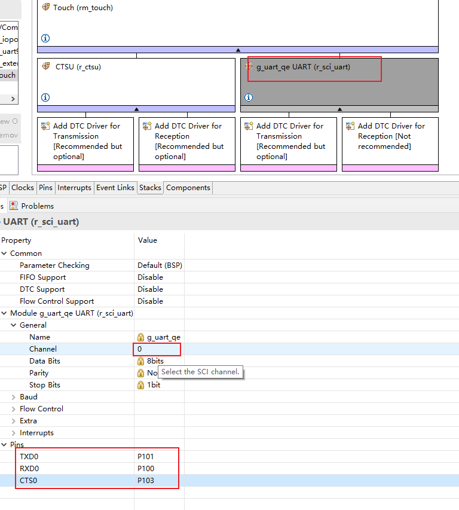 

默认的SCI0可能是SPI，需要将SCI0使用的模式修改为UART。

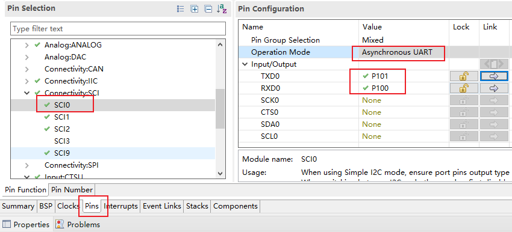 

回到stacks标签页，打开UART端口的DTC功能，并添加DTC。

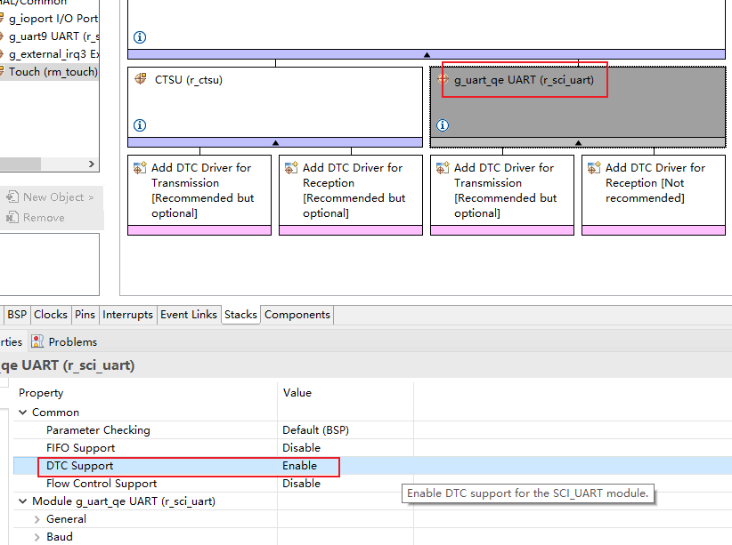 

为UART的rx和tx添加DTC支持。

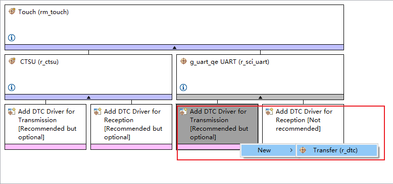 

添加完成的效果如图所示。

 

### 配置r_ctsu

接着选中r_ctsu，同样打开DTC功能，并添加DTC配置。

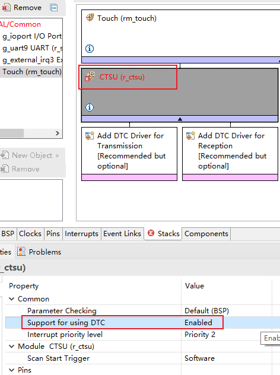 

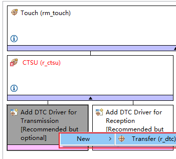 

配置完成后点击生成配置代码并将库文件加入工程。

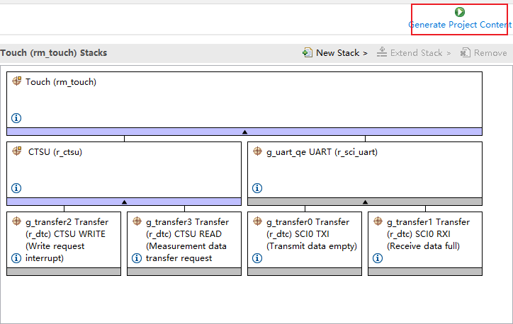 

### 编译工程

关闭FSP 编译MDK工程，第一次编译出现弹窗确认后再次编译即可。编译通过可进行后续步骤。

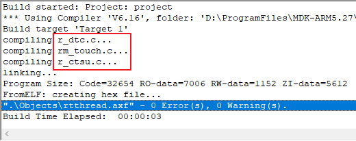 

此时FSP的配置就完成了，接下来需要使用到瑞萨 QE for Capacitive Touch 工具。

## QE for Capacitive Touch配置

[QE工具下载地址](https://www.renesas.com/cn/zh/software-tool/qe-capacitive-touch-development-assistance-tool-capacitive-touch-sensors) 下载最新版本的QE for Capacitive Touch。

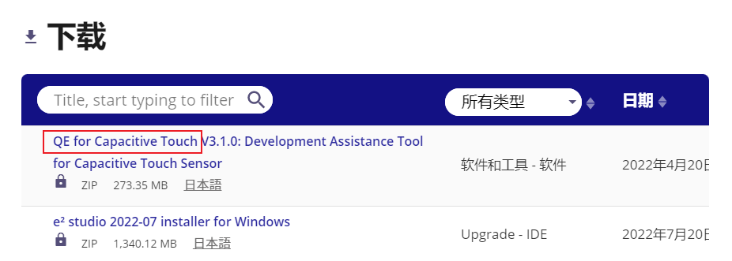 

下载完成后解压，注意解压的路径不能有中文。解压出的文件如下所示。

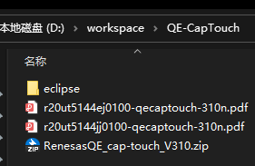 

进入目录 eclipse，找到qe-touch.exe双击打开。

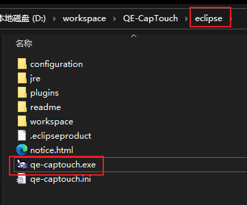 

主窗口如图所示，这里显示了QE工具使用的操作步骤，我们跟着这些步骤完成触摸按键的调制过程。最终可以实时监控按键的运行状态。

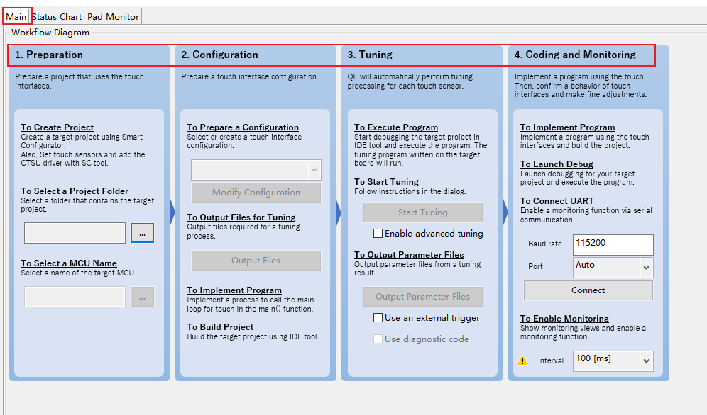 

### 第一步准备工作

选择工程目录，这里选择ra2l1-cpk的BSP工程目录。

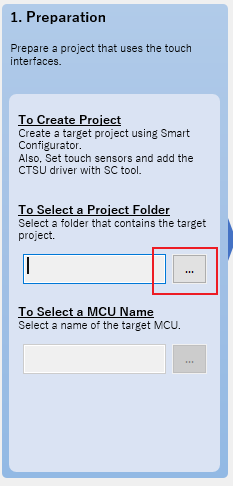 

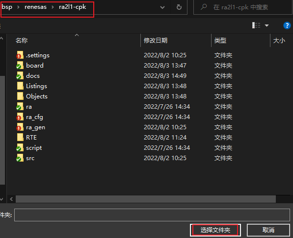 

然后选择芯片信号，注意看清楚使用的芯片型号和工具中选择的型号要对应。

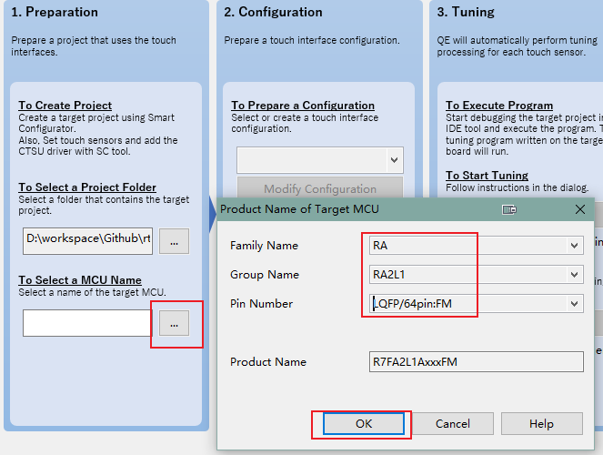 

### 第二步创建配置

选择*“**Create a new configuration**”*（创建新配置）来创建新的触摸配置。

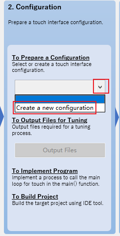 

这将打开一个新菜单窗口，显示用于创建触摸界面的默认空白画布。从画布右侧选择 *“**Button**”*（按钮）菜单项并将光标移动到画布上，将按钮添加到画布。单击鼠标左键放下按钮图标。通过向画布添加另外两个按钮来完成配置。 添加所有三个按钮后，按 ESC 键退出。 画布将类似于下图。

此时，画布下方会显示 RED X 及文本*“**There are some problems with setting**”*（设置存在一些问题）。这表明画布上的按钮没有绑定到任何 MCU 传感器引脚。 按钮（以及其他已添加了的组件）也将显示为红色，这表明它们的配置存在问题。

要在传感器焊盘和物理触摸通道引脚之间建立连接，需双击 Button00，此时将出现一个对话框。通过下拉菜单和鼠标选择 TS32 作为 MCU 传感器以分配给该按钮。 

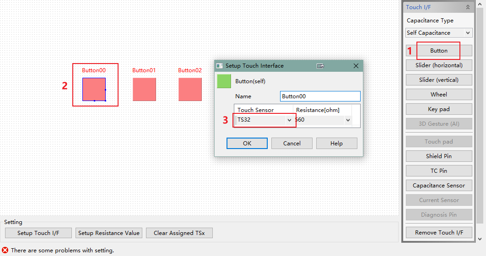 

触摸按钮配置完成后需要修改下文件名称，默认的文件名称存在不支持的字符。完成这些步骤就可以单击对话框中的*“**Create**”*（创建）配置。

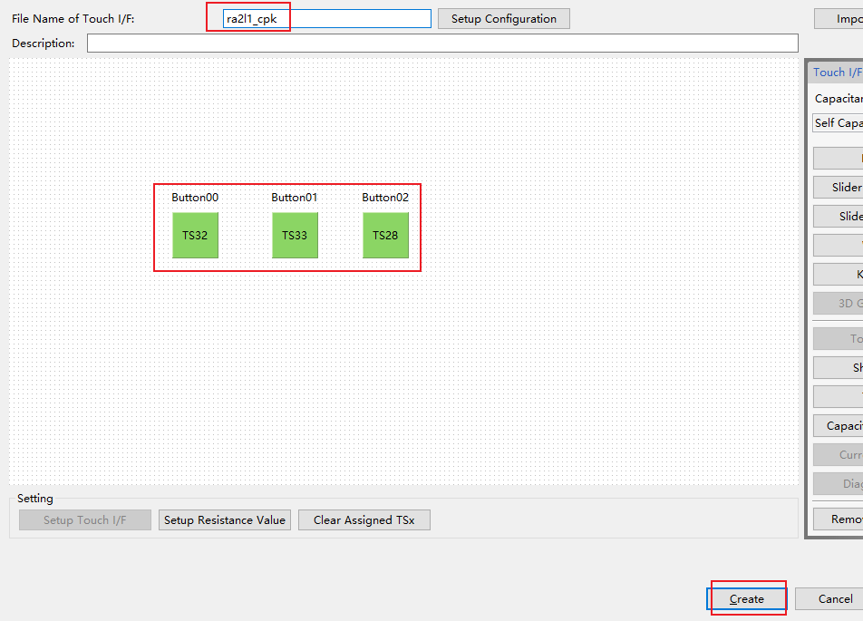 

接着选择输出配置文件，输出路径请选择`ra2l1-cpk/QE-Touch`目录。弹出的弹窗根据实际的情况选择配置。

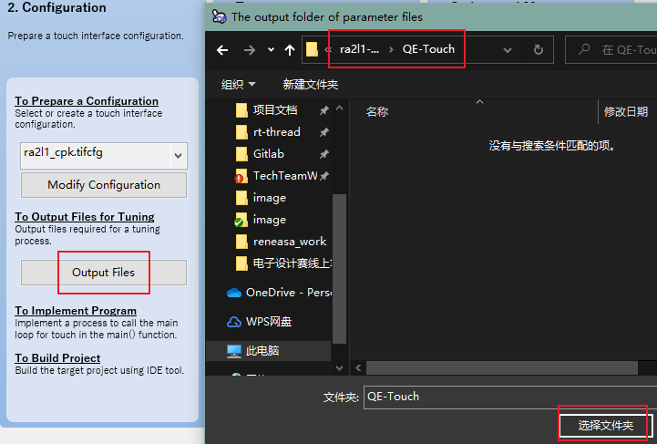 

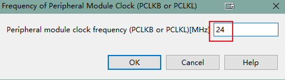 

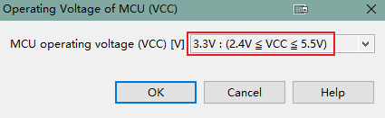 

完成此步配置后将输出如中所示的配置文件和sample代码文件。

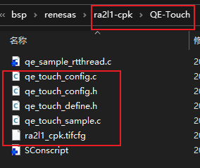 

在此目录中已经准备了一份能在RT-Thread系统中运行sample代码。在ENV工具中执行`scons --target=mdk5`命令生成MDK工程并将刚刚的配置文件和sample文件加入到工程中。

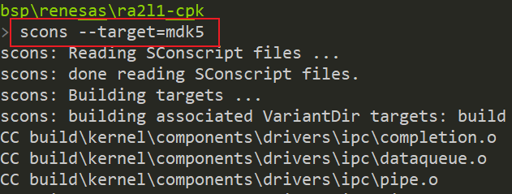 

打开创建的MDK工程并编译，然后进入debug。jlink可能会弹出选择芯片信号的窗口，输入`r7fa2l1ab`选中点击OK即可进入。

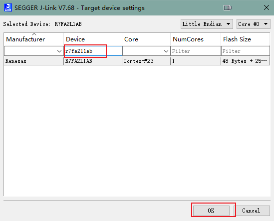 

在MDK的debug中点击run按钮全速运行程序。

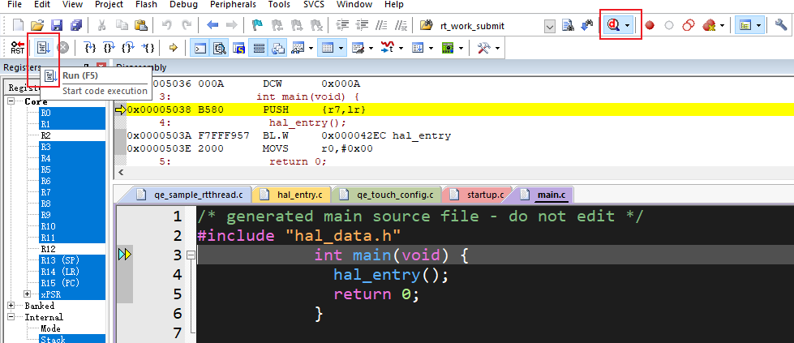 

可以看到命令行打印出日志信息，touch功能的sample已启动。

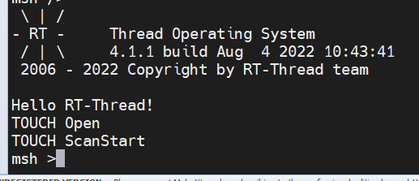 

### 第三步Tuning

回到QE工具启动Tuning过程。使用了UART0端口(P100、P101)，需要使用到USB-TTL工具连接电脑。

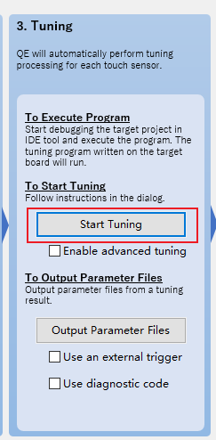 

 

 

等待自动调节过程，此过程时间可能较长请勿触碰触摸按键。

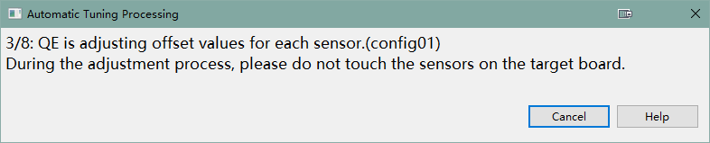 

注意：经过几个自动化步骤后，您将看到包含如下所示信息的对话框。 这是 Tuning（调节）过程的触摸灵敏度测试步骤。您可以看到传入的“触摸计数”，即在传感器上看到的电容。 如果触摸板上的传感器（此时为 BTN3、TS28），将会使条形图和触摸计数增加，这是因为我们正在更改/增加触摸传感器的电容而导致的计数上升。且 Tuning（调节）总是从最低传感器编号到最高传感器编号进行。

您需要在电极板 （BTN3/TS28）上的传感器上使用**一般的触摸力度**。当按下板上 BTN1 位置时，便会看到进度条向右进展，同时触摸计数也在增加。保持按压并点击电脑键盘上的任意键(如空格)以记录测量结果。示例如下所示。 测量结果将因显示的计数而异。对按钮 BTN1 和 BTN2 重复此过程。

 

完成后，您将看到如下所示的界面。理想情况下，使用此硬件应该会看到 1000 次或更多计数的触摸阈值。这是中间件用来确定是否发生触摸事件的检测阈值。

注意：在 Tuning（调节）过程中您可能会收到“寄生电容< 10pF”的警告。如果发生这种情况，请选中选择目标框并单击重试以尝试重新 Tuning（调节）该传感器。要注意的是，要使 CTSU/CTSU2 IP 实现最佳性能，至少需要 10pF 的负载电容。低于 10pF 的负载会导致该传感器通道上的噪声敏感。

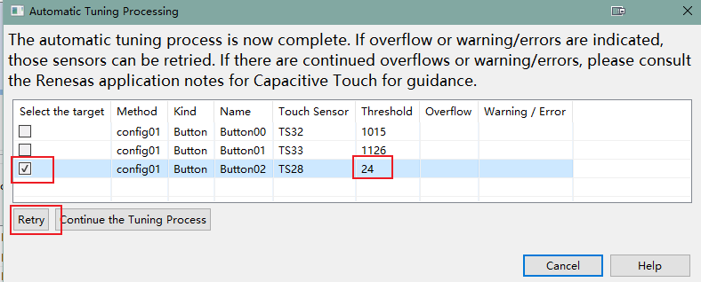 

单击对话框中的*“**Continue the Tuning Process**”*（继续调节）按钮。 这将退出 Tuning（调节）过程并与目标上的调试会话断开连接。

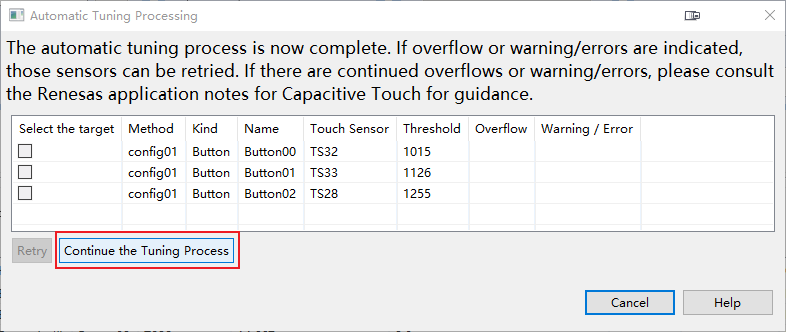 

按钮调试完成输出Tuning（调节）参数文件。单击按钮*“**Output Parameter Files**”*（输出参数文件）。部分配置代码有更新，**需要重新编译工程。然后再次更新固件**。

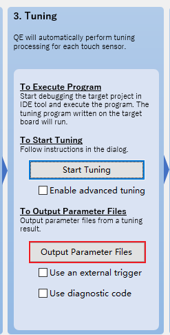 

### 第四步连接并监控状态

使用UART连接开发板监控触摸按键状态。

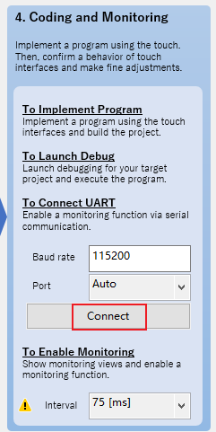 

连接成功的界面如下所示，可以点击左上角的*“**Enable Monitoring**”*开始监测。

在主窗口切换视图到 CapTouch Status Chart (QE) 可以监控图形触摸灵敏度，看到所选触摸传感器的当前计数值、参考值、阈值以及触摸传感器是打开还是关闭状态。

左下的窗口可以通过下拉菜单选择按键名称，可以通过 CapTouch Multi Status Chart (QE) 视图同时查看多个传感器以评估串扰等性能。

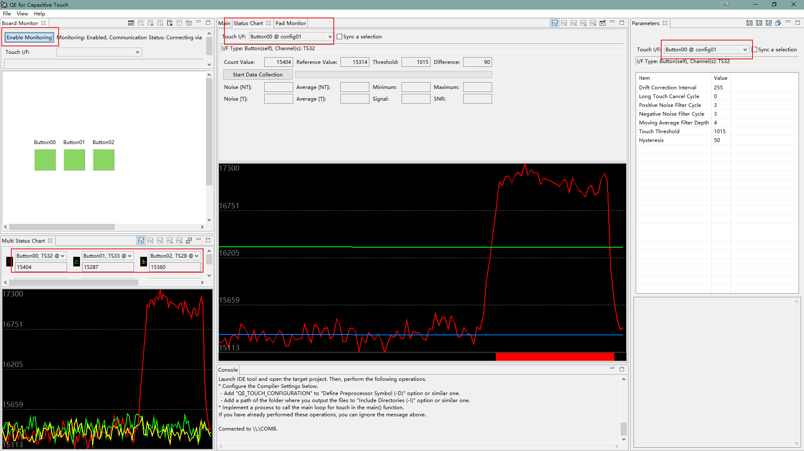 

同时在按下按钮时开发板上的蓝色LED灯会常亮，抬起则熄灭。
