# LPM低功耗配置说明

## 基础知识

低功耗的本质是系统空闲时 CPU 停止工作，中断或事件唤醒后继续工作。在 RTOS 中，通常包含一个 IDLE 任务，该任务的优先级最低且一直保持就绪状态，当高优先级任务未就绪时，OS 执行 IDLE 任务。一般地，未进行低功耗处理时，CPU 在 IDLE 任务中循环执行空指令。RT-Thread 的电源管理组件在 IDLE 任务中，通过对 CPU 、时钟和设备等进行管理，从而有效降低系统的功耗。

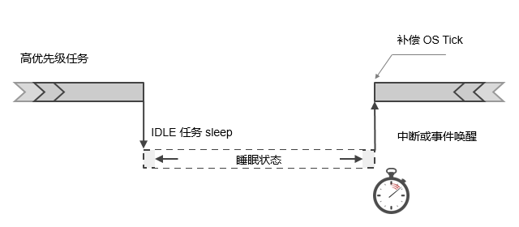 

在上图所示，当高优先级任务运行结束或被挂起时，系统将进入 IDLE 任务中。在 IDLE 任务执行后，它将判断系统是否可以进入到休眠状态（以节省功耗）。如果可以进入休眠， 将根据芯片情况关闭部分硬件模块，OS Tick 也非常有可能进入暂停状态。此时电源管理框架会根据系统定时器情况，计算出下一个超时时间点，并设置低功耗定时器，让设备能够在这个时刻点唤醒，并进行后续的工作。当系统被（低功耗定时器中断或其他唤醒中断源）唤醒后，系统也需要知道睡眠时间长度是多少，并对OS Tick 进行补偿，让系统的OS tick值调整为一个正确的值。

### [PM组件](https://www.rt-thread.org/document/site/#/rt-thread-version/rt-thread-standard/programming-manual/pm/pm)

PM组件是RT-Thread系统中针对电源管理而设计的基础功能组件， 组件采用分层设计思想，分离架构和芯片相关的部分，提取公共部分作为核心。支持多种运行模式和休眠模式的管理切换，以及低功耗定时器的管理。

PM 组件有以下特点：

- PM 组件是基于模式来管理功耗
- PM 组件可以根据模式自动更新设备的频率配置，确保在不同的运行模式都可以正常工作
- PM 组件可以根据模式自动管理设备的挂起和恢复，确保在不同的休眠模式下可以正确的挂起和恢复
- PM 组件支持可选的休眠时间补偿，让依赖 OS Tick 的应用可以透明使用
- PM 组件向上层提供设备接口，如果使用了设备文件系统组件，那么也可以用文件系统接口来访问

PM组件支持的休眠模式有：

| 模式                   |             描述                     |
| -------------------- | ---------------------------------- |
| PM_SLEEP_MODE_NONE     | 系统处于活跃状态，未采取任何的降低功耗状态  |
| PM_SLEEP_MODE_IDLE     | **空闲模式**，该模式在系统空闲时停止 CPU 和部分时钟，任意事件或中断均可以唤醒 |
| PM_SLEEP_MODE_LIGHT    | **轻度睡眠模式**，CPU 停止，多数时钟和外设停止，唤醒后需要进行时间补偿 |
| PM_SLEEP_MODE_DEEP     | **深度睡眠模式**，CPU 停止，仅少数低功耗外设工作，可被特殊中断唤醒 |
| PM_SLEEP_MODE_STANDBY  | **待机模式**，CPU 停止，设备上下文丢失(可保存至特殊外设)，唤醒后通常复位 |
| PM_SLEEP_MODE_SHUTDOWN | **关断模式**，比 Standby 模式功耗更低， 上下文通常不可恢复， 唤醒后复位 |

### RA系列LPM功能

RA2 MCU支持的LPM类型有:

- Sleep mode
- Software Standby mode 
- Snooze mode 

| 休眠模式                | 描述                                                         |
| ----------------------- | ------------------------------------------------------------ |
| LPM_MODE_SLEEP          | **睡眠模式**，CPU停止工作，但其内部寄存器的内容被保留。其他外围功能在单片机中不停止。休眠模式下可用的复位或中断会导致MCU取消休眠模式。在这种模式下，所有的中断源都可用来取消Sleep模式。 |
| LPM_MODE_STANDBY        | **软件待机模式**，CPU、大部分片上外设功能和振荡器停止运行。但是，CPU内部寄存器的内容和SRAM数据、芯片上外围功能的状态和I/O端口状态都被保留。软件待机模式可以显著降低功耗，因为大多数振荡器在这种模式下停止。 |
| LPM_MODE_STANDBY_SNOOZE | **小睡模式**，是软件待机模式的扩展，在这种模式下，有限的外设模块可以在不唤醒CPU的情况下运行。通过配置中断源，可以通过软件待机模式进入小睡模式。类似地，系统可以通过snooze模式支持的中断从snooze模式中唤醒。 |

低功耗模式转换和触发源如图所示。

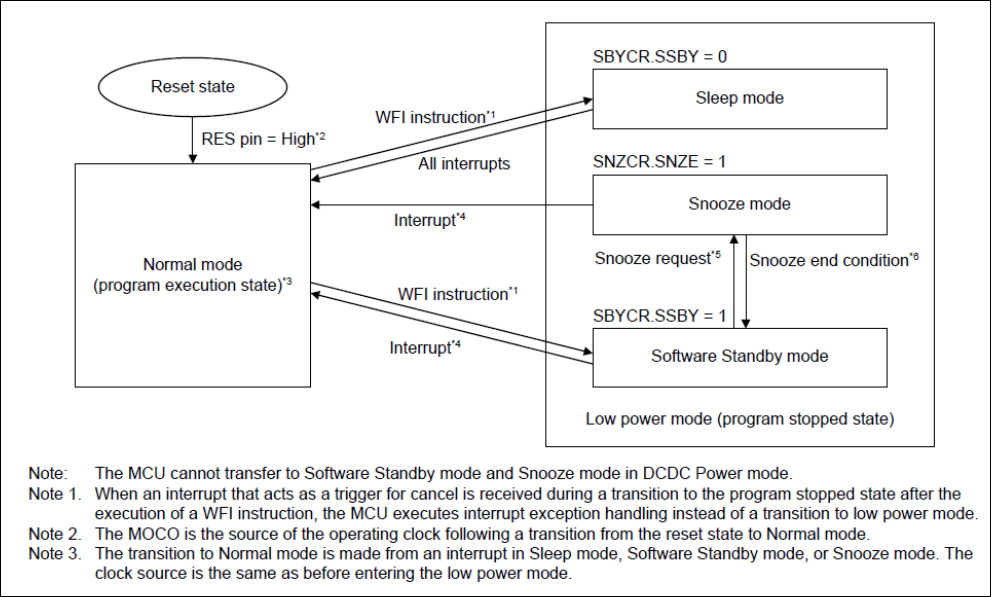

不同模式间的切换如图所示，从图中也可以看出三种模式的功耗关系是Sleep>Snooze>Standby。

RA2芯片的休眠模式对应PM组件的模式关系：

| RA2芯片                 | PM组件                |
| ----------------------- | --------------------- |
| LPM_MODE_SLEEP          | PM_SLEEP_MODE_IDLE    |
| LPM_MODE_STANDBY        | PM_SLEEP_MODE_DEEP    |
| LPM_MODE_STANDBY_SNOOZE | PM_SLEEP_MODE_STANDBY |


## 配置LPM功能

要使用RA2系列芯片的LPM功能，需要进入bsp\renesas\ra2l1-cpk目录。

- 在menuconfig中使能LPM驱动，并勾选要开启的休眠模式，然后保存配置，生成MDK5工程。

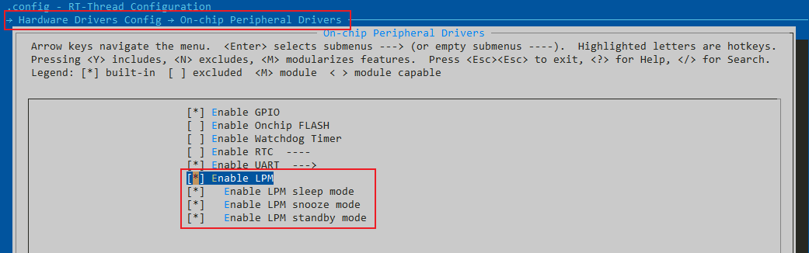

- 打开PM组件和驱动后，需要增加idle的线程栈大小，可改为1024。

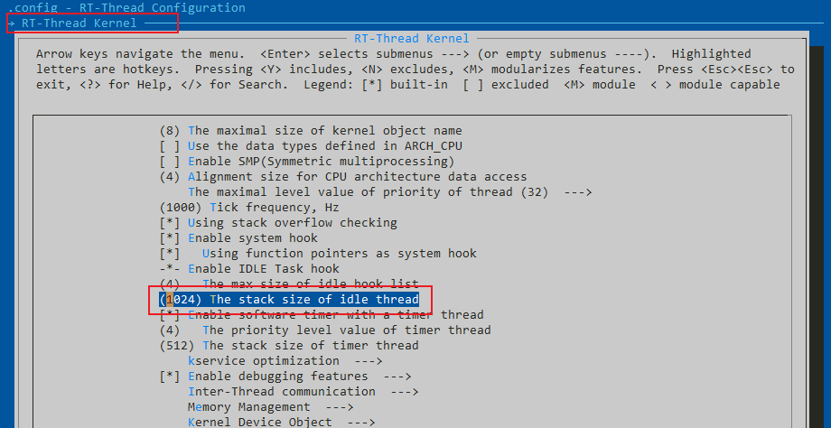 

- 打开生成的MDK5工程project.uvprojx，然后打开FSP配置工具添加LPM相关配置。下图是需要添加的stack，包括三种LPM模式的配置以及低功耗定时器AGT1。

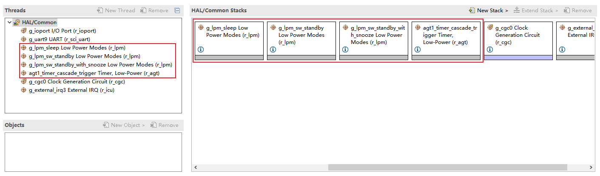

- 创建LPM如下图所示新建r_lpm，**需要根据使用的模式进行配置且不同模式要创建不同的r_lpm**。下面将分别介绍三种不同模式的配置，创建步骤就不再赘述。

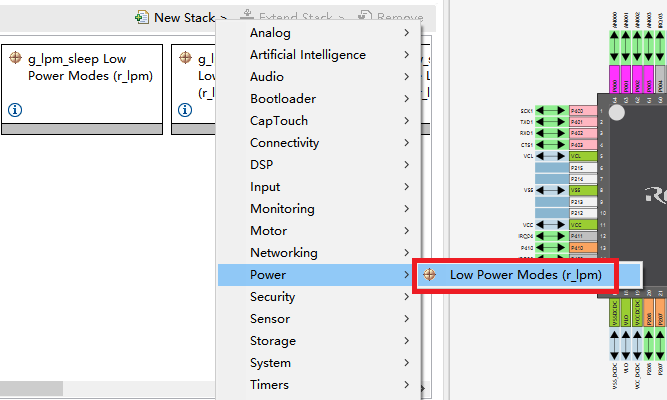 

### Sleep mode休眠模式

创建出r_lpm后需要修改Name和Low Power Mode这两个配置项。Name需要改为g_lpm_sleep，因为在驱动文件中已经定义了sleep模式对应的stack名称。Low Power Mode选择Sleep mode即可。

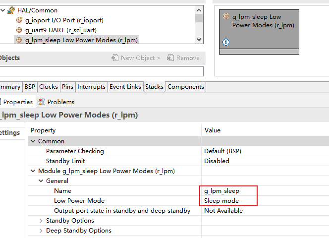 

### Standby mode软件待机模式

Name需要改为g_lpm_sw_standby。Low Power Mode选择Software Standby mode即可。

另外在此模式下还需要配置唤醒MCU的中断源，因为会使用到AGT1做为低功耗定时器所以AGT1的中断需要勾选。如果在应用中还需要其他中断源在此模式下唤醒MCU，则勾选对应选项即可。

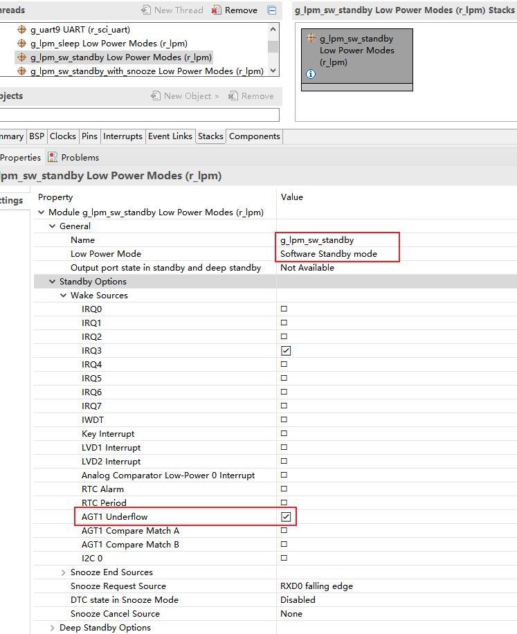 

### Snooze mode小睡模式

Name需要改为g_lpm_sw_standby_with_snooze。Low Power Mode选择Snooze mode即可。

另外在此模式下同样要配置唤醒MCU的中断源，因为会使用到AGT1做为低功耗定时器所以AGT1的中断需要勾选。如果在应用中还需要其他中断源在此模式下唤醒MCU，则勾选对应选项即可。

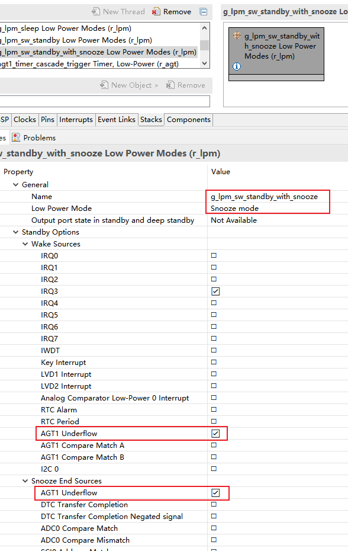 

### AGT1低功耗定时器

在驱动中使用了MCU的AGT1做为PM组件的低功耗定时器，用于在休眠状态下的系统时钟补偿。

 

完成上述配置步骤就已经把LPM低功耗模式的相关配置做完了。然后再根据应用要实现的功能配置其他外设。


## 低功耗DEMO

上文介绍了在RT-Thread的RA2L1上怎么配置LPM的不同模式，接下来就用一个小DEMO来验证下MCU在各种模式下的工作情况。

低功耗DEMO要实现的功能是，在CPK-RA2L1开发板上用S1按钮切换不同的低功耗模式，并在msh中打印出模式切换的提示信息。要实现这个功能需要在刚才的基础上添加一个低功耗的唤醒源。

### 添加配置

- 创建IRQ中断，IRQ中断选择通道3，详细配置如下。

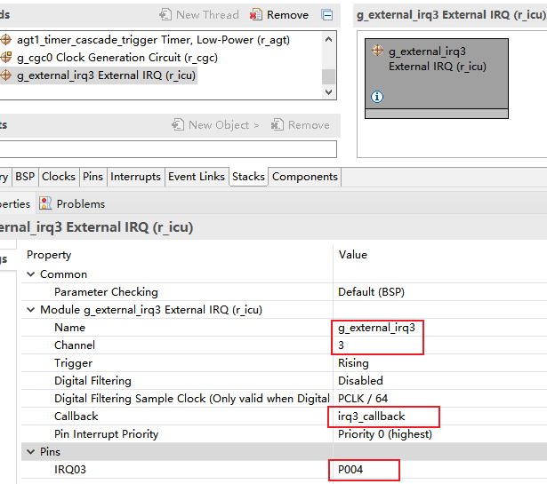 

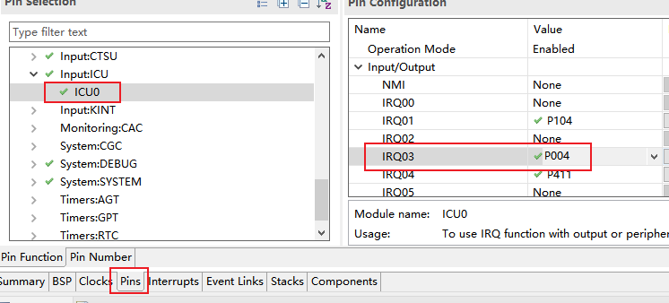 

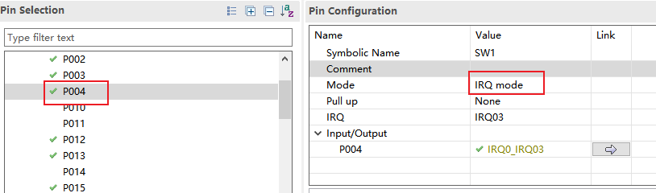 

- 在刚才的Snooze和Standby模式的配置里添加IRQ3的唤醒源

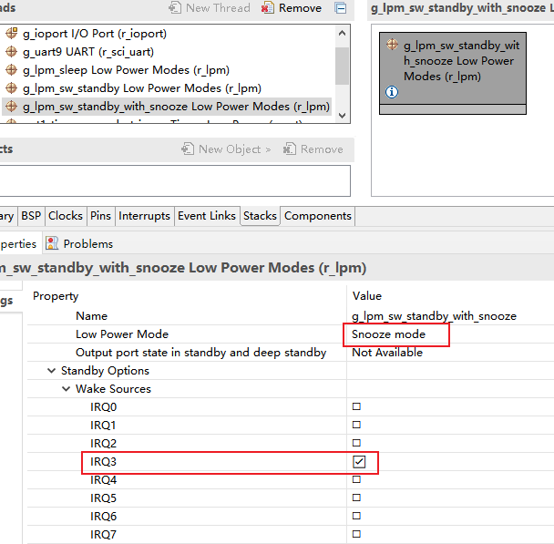 

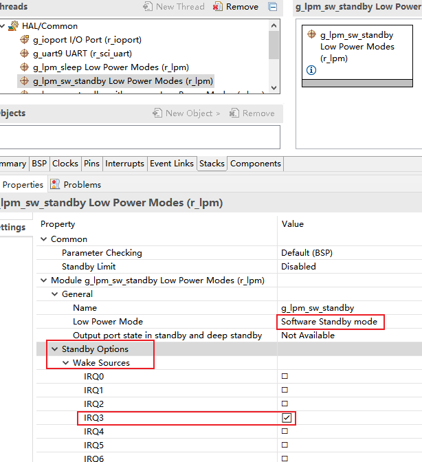 

- 然后保存并生成配置代码。

### 添加测试代码

```c
#include <rtthread.h>

#ifdef BSP_USING_LPM
#include <rtdevice.h>
#include <board.h>
#include <drivers/pm.h>

#define WAKEUP_APP_THREAD_STACK_SIZE        512
#define WAKEUP_APP__THREAD_PRIORITY         RT_THREAD_PRIORITY_MAX / 3
#define WAKEUP_EVENT_BUTTON                 (1 << 0)

static rt_event_t wakeup_event;

#define USER_INPUT  "P004"
#define LED2_PIN    "P501" /* Onboard LED pins */

void rt_lptimer_init(rt_lptimer_t  timer,
                   const char *name,
                   void (*timeout)(void *parameter),
                   void       *parameter,
                   rt_tick_t   time,
                   rt_uint8_t  flag);

rt_err_t rt_lptimer_detach(rt_lptimer_t timer);
rt_err_t rt_lptimer_start(rt_lptimer_t timer);
rt_err_t rt_lptimer_stop(rt_lptimer_t timer);

rt_err_t rt_lptimer_control(rt_lptimer_t timer, int cmd, void *arg);

static struct rt_lptimer lptimer; 

static void timeout_cb(void *parameter)
{
    rt_interrupt_enter();
    rt_kprintf("\n lptimer callback \n");
    rt_interrupt_leave();
}

static void lptimer_init(void)
{
    rt_lptimer_init(&lptimer,
                    "lpm",
                    timeout_cb,
                    (void*)&wakeup_event,
                    1000,
                    RT_TIMER_FLAG_PERIODIC);
}

static void lptimer_stop(void)
{
    rt_lptimer_stop(&lptimer);
}

static void lptimer_start(void)
{
    rt_lptimer_start(&lptimer);
}

static void led_app(void)
{
    static uint8_t key_status = 0x00;
    rt_uint32_t led2_pin = rt_pin_get(LED2_PIN);

    rt_pin_write(led2_pin, PIN_HIGH);
    switch(key_status%4)
    {
    case 0:/* IDLE */
		lptimer_stop();
        rt_pm_release(PM_SLEEP_MODE_NONE);
        rt_kprintf("\trequest:IDLE\n");
        rt_pm_request(PM_SLEEP_MODE_IDLE);
        break;
    case 1:/* DEEP */
		lptimer_stop();
		lptimer_start();
        rt_pm_release(PM_SLEEP_MODE_IDLE);
        rt_kprintf("\trequest:DEEP\n");
        rt_pm_request(PM_SLEEP_MODE_DEEP);
        break;
    case 2:/* STANDBY */
		lptimer_stop();
		lptimer_start();
        rt_pm_release(PM_SLEEP_MODE_DEEP);
        rt_kprintf("\trequest:STANDBY\n");
        rt_pm_request(PM_SLEEP_MODE_STANDBY);
        break;
    case 3:/* NONE */
		lptimer_stop();
        rt_pm_release(PM_SLEEP_MODE_STANDBY);
        rt_kprintf("\trequest:NONE\n");
        rt_pm_request(PM_SLEEP_MODE_NONE);
        break;
    default:
        break;
    }

    key_status++;
    rt_pin_write(led2_pin, PIN_LOW);
}

static void wakeup_callback(void* p)
{
    rt_event_send(wakeup_event, WAKEUP_EVENT_BUTTON);
}

void wakeup_sample(void)
{
    /* init */
    rt_uint32_t pin = rt_pin_get(USER_INPUT);
    rt_kprintf("\n pin number : 0x%04X \n", pin);
    rt_err_t err = rt_pin_attach_irq(pin, PIN_IRQ_MODE_RISING, wakeup_callback, RT_NULL);
    if (RT_EOK != err)
    {
        rt_kprintf("\n attach irq failed. \n");
    }
    err = rt_pin_irq_enable(pin, PIN_IRQ_ENABLE);
    if (RT_EOK != err)
    {
        rt_kprintf("\n enable irq failed. \n");
    }
}

static void wakeup_init(void)
{
    wakeup_event = rt_event_create("wakup", RT_IPC_FLAG_FIFO);
    RT_ASSERT(wakeup_event != RT_NULL);
    wakeup_sample();
}

static void pm_mode_init(void)
{
    rt_pm_release_all(RT_PM_DEFAULT_SLEEP_MODE);
    rt_pm_request(PM_SLEEP_MODE_NONE);
}

void pm_test_entry(void* para)
{
    /* 唤醒回调函数初始化 */
	wakeup_init();

    /* 电源管理初始化 */
    pm_mode_init();

	lptimer_init();
	
    while (1)
    {
        /* 等待唤醒事件 */
        if (rt_event_recv(wakeup_event,
                            WAKEUP_EVENT_BUTTON,
                            RT_EVENT_FLAG_AND | RT_EVENT_FLAG_CLEAR,
                            RT_WAITING_FOREVER, RT_NULL) == RT_EOK)
        {
            led_app();
        }
    }
}

int pm_test(void)
{

    rt_thread_t tid = rt_thread_create(
            "pmtest",pm_test_entry,RT_NULL,512,10,10);
    if(tid)
        rt_thread_startup(tid);

    return 0;
}
MSH_CMD_EXPORT(pm_test, pm_test);
// INIT_APP_EXPORT(pm_test);
#endif
```

将DEMO代码加入到工程中，可以直接添加到hal_entry.c或新建一个源文件。


### 测试验证

然后编译下载。开发板连接串口工具，输入`pm_test`命令启动测试DEMO。

按下S1按钮切换工作模式，在DEEP、STANDBY模式下会启动低功耗定时器，当定时唤醒后会打印出回调接口的提示信息。

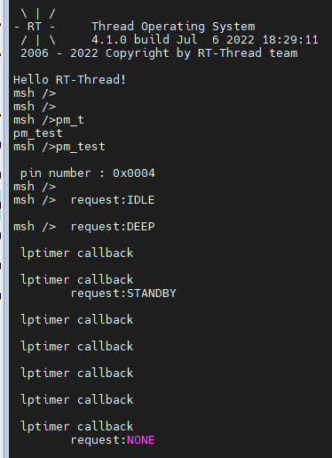 

