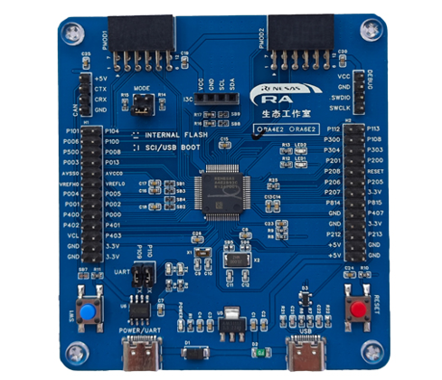

# 瑞萨 RA-Eco-RA4E2-64PIN 开发板 BSP 说明
## 简介

本文档为瑞萨  RA-Eco-RA4E2-64PIN 开发板提供的 BSP (板级支持包) 说明。通过阅读快速上手章节开发者可以快速地上手该 BSP，将 RT-Thread 运行在开发板上。

主要内容如下：

- 开发板介绍
- BSP 快速上手指南

## 开发板介绍

RA-Eco-RA4E2-64PIN-V1.0是一款基于100MHz Arm® Cortex®-M33内核架构的核心板，主控芯片为R7FA4E2B93CFM。RA4E2组是RA4系列中最新的入门级微控制器，基于带有TrustZone的100MHz Arm® Cortex®-M33内核。RA4E2 MCU提供了高性能和优化的外设功能以及最小的封装选项，包括节省空间的36引脚BGA和32引脚QFN封装。这些都满足了对成本敏感和空间受限的应用的需要。由于RA4E2具有均衡的性能、先进的外设功能和可扩展性，它为更广泛的RA系列提供了一个入门点。

开发板正面外观如下图：



该开发板常用 **板载资源** 如下：

- MCU：R7FA4E2B93CFM，100MHz，Arm Cortex®-M33 内核
- 128KB 代码闪存, 40KB SRAM
- 1个复位按键
- 1个自定义按键
- 2个LED
- 扩展接口：两个 PMOD 连接器

**更多详细资料及工具**

## 外设支持

本 BSP 目前对外设的支持情况如下：

| **片上外设** | **支持情况** | **备注** |
| :----------------- | :----------------- | :------------- |
| UART               | 支持               | UART9 为默认日志输出端口 |
| GPIO               | 支持               |                |
| I3C/I2C           | 支持               | 未验证 |
| ADC                | 支持               | 未验证 |
| DAC                | 支持               | 未验证 |
| SPI                | 支持               | 未验证 |
| FLASH              | 支持               | 未验证 |
| PWM                | 支持               | 未验证 |
| CAN FD             | 支持               | 未验证 |
| 持续更新中...      |                    |                |


## 使用说明

使用说明分为如下两个章节：

- 快速上手

  本章节是为刚接触 RT-Thread 的新手准备的使用说明，遵循简单的步骤即可将 RT-Thread 操作系统运行在该开发板上，看到实验效果 。
- 进阶使用

  本章节是为需要在 RT-Thread 操作系统上使用更多开发板资源的开发者准备的。通过使用 ENV 工具对 BSP 进行配置，可以开启更多板载资源，实现更多高级功能。

### 快速上手

本 BSP 目前仅提供 MDK5 工程。下面以 MDK5 开发环境为例，介绍如何将系统运行起来。

**硬件连接**

使用 USB 数据线连接开发板到 PC，使用 J-link 接口下载和 DEBUG 程序。使用 USB 转串口工具连接 UART9：P109(TXD)、P110(RXD)。

**编译下载**

- 编译：双击 project.uvprojx 文件，打开 MDK5 工程，编译程序。

> 注意：此工程需要使用 J-Flash Lite 工具烧录程序。建议使用 V7.50 及以上版本烧录工程。[J-Link 下载链接](https://www.segger.com/downloads/jlink/)

- 下载：打开 J-Flash lite 工具，选择芯片型号 R7FA4E2B9，点击 OK 进入工具。选择 BSP 目录下 MDK 编译出的 /object/rtthread.hex 文件，点击 Program Device 按钮开始烧录。

**查看运行结果**

下载程序成功之后，系统会自动运行并打印系统信息。

连接开发板对应串口到 PC , 在终端工具里打开相应的串口（115200-8-1-N），复位设备后，可以看到 RT-Thread 的输出信息。输入 help 命令可查看系统中支持的命令。

```bash
 \ | /
- RT -     Thread Operating System
 / | \     5.2.1 build Jul  4 2025 00:07:09
 2006 - 2024 Copyright by RT-Thread team

Hello RT-Thread!
msh >help
RT-Thread shell commands:
pin              - pin [option]
sensor_fifo      - Sensor fifo mode test function
sensor_int       - Sensor interrupt mode test function
sensor_polling   - Sensor polling mode test function
sensor           - sensor test function
reboot           - Reboot System
clear            - clear the terminal screen
version          - show RT-Thread version information
list             - list objects
help             - RT-Thread shell help
ps               - List threads in the system
free             - Show the memory usage in the system
backtrace        - print backtrace of a thread

msh >
```

**应用入口函数**

应用层的入口函数在 **bsp\ra4e2-eco\src\hal_entry.c** 中 的 `void hal_entry(void)` 。用户编写的源文件可直接放在 src 目录下。

```c
void hal_entry(void)
{
    rt_kprintf("\nHello RT-Thread!\n");

    while (1)
    {
        rt_pin_write(LED1_PIN, PIN_HIGH);
        rt_thread_mdelay(500);
        rt_pin_write(LED1_PIN, PIN_LOW);
        rt_thread_mdelay(500);
    }
}
```

## 联系人信息

在使用过程中若您有任何的想法和建议，建议您通过以下方式来联系到我们  [RT-Thread 社区论坛](https://club.rt-thread.org/)

## 贡献代码

如果您对 RA-Eco-RA4E2-64PIN 感兴趣，并且有一些好玩的项目愿意与大家分享的话欢迎给我们贡献代码，您可以参考 [如何向 RT-Thread 代码贡献](https://www.rt-thread.org/document/site/#/rt-thread-version/rt-thread-standard/development-guide/github/github)。
