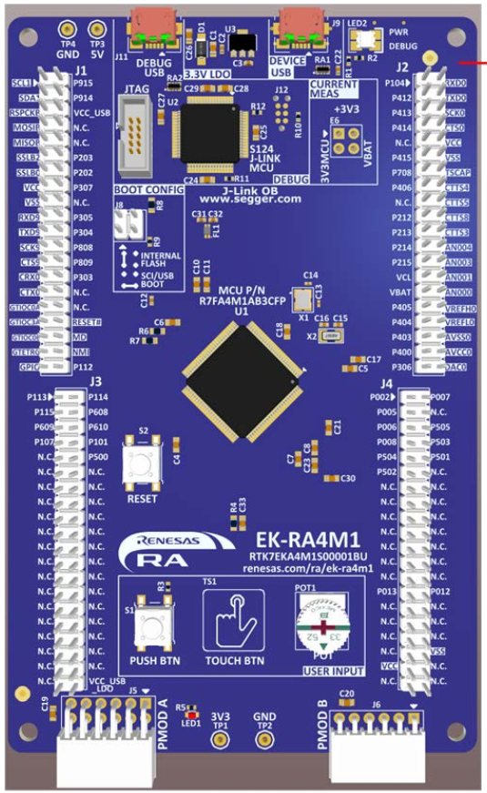
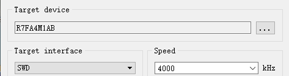
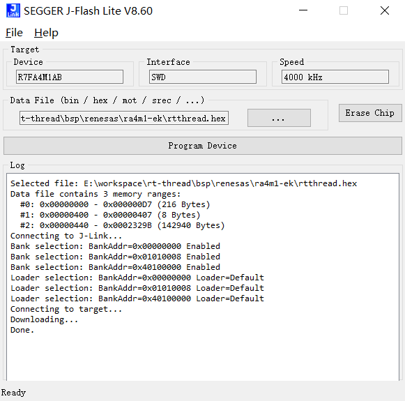

# 瑞萨 EK-RA4M1 开发板 BSP 说明

## 简介

本文档为瑞萨 EK-RA4M1 开发板提供的 BSP (板级支持包) 说明。通过阅读快速上手章节开发者可以快速地上手该 BSP，将 RT-Thread 运行在开发板上。

主要内容如下：

- 开发板介绍
- BSP 快速上手指南

## 开发板介绍

基于瑞萨 RA4M1 MCU 开发的 EK-RA4M1 MCU 评估板，通过灵活配置软件包和 IDE，可帮助用户对 RA4M1 MCU 群组的特性轻松进行评估，并对嵌入系统应用程序进行开发。

开发板正面外观如下图：



该开发板常用 **板载资源** 如下：

- MCU：R7FA4M1AB3CFP，48MHz，Arm Cortex®-M4 内核，256KB 代码闪存, 32KB SRAM
- 调试接口：板载 J-Link 接口
- 扩展接口：Arduino Uno 兼容接口

**更多详细资料及工具**

## 外设支持

本 BSP 目前对外设的支持情况如下：

| **片上外设** | **支持情况** | **备注** |
| :----------------- | :----------------- | :------------- |
| UART               | 支持               | SCI0 为默认日志输出端口 |
| GPIO               | 支持               |                |
| IIC                | 支持               | 软件           |
| WDT                | 支持               |                |
| RTC                | 支持               |                |
| ADC                | 支持               |                |
| DAC                | 支持               |                |
| SPI                | 支持               |                |
| FLASH              | 支持               |                |
| PWM                | 支持               |                |

## 快速上手

本 BSP 目前支持GCC和MDK工程，开发前请使用 USB 数据线连接开发板到 PC，使用 J-link 接口下载和 DEBUG 程序。使用 USB 转串口工具连接 SCI0：P410(TXD)、P411(RXD)。

### 编译

#### MDK

MDK工程步骤如下：

1. 在 bsp 下打开 env 工具。
2. 输入`menuconfig`命令配置工程，配置好之后保存退出。
3. 输入`pkgs --update`命令更新软件包。
4. 输入`scons --target=mdk5` 命令重新生成工程。

#### GCC

GCC工程步骤如下：

1. 在 bsp 下打开 env 工具。
2. 输入`menuconfig`命令配置工程，配置好之后保存退出。
3. 输入`pkgs --update`命令更新软件包。
4. 输入`scons` 命令即可编译工程。

### 烧录

打开 J-Flash lite 工具，选择芯片型号 R7FA4M1AB，点击 OK 进入工具。选择 BSP 目录下 编译出的 rtthread.hex 文件，点击 Program Device 按钮开始烧录。具体操作过程可参考下图步骤：





### 运行

连接开发板对应串口到 PC , 在终端工具里打开相应的串口（115200-8-1-N），复位设备后，可以看到 RT-Thread 的输出信息。输入 help 命令可查看系统中支持的命令。

```bash
 \ | /
- RT -     Thread Operating System
 / | \     5.2.2 build Sep 27 2025 17:11:21
 2006 - 2024 Copyright by RT-Thread team
[D/drv.adc] adc0 init success

Hello RT-Thread!
msh >
```

**应用入口函数**

应用层的入口函数在 **src\hal_entry.c** 中 的 `void hal_entry(void)` 。用户编写的源文件可直接放在 src 目录下。

```c
void hal_entry(void)
{
    rt_kprintf("\nHello RT-Thread!\n");
    
    rt_pin_attach_irq(rt_pin_get(USER_BUTTON_PIN), PIN_IRQ_MODE_RISING, on_button_clicked, RT_NULL);
    rt_pin_irq_enable(rt_pin_get(USER_BUTTON_PIN), PIN_IRQ_ENABLE);

    while (1)
    {
        rt_pin_write(LED_PIN, PIN_HIGH);
        rt_thread_mdelay(500);
        rt_pin_write(LED_PIN, PIN_LOW);
        rt_thread_mdelay(500);
    }
}
```

## 维护

作者：[hywing](https://github.com/hywing)

邮箱：hywing.sir@qq.com
