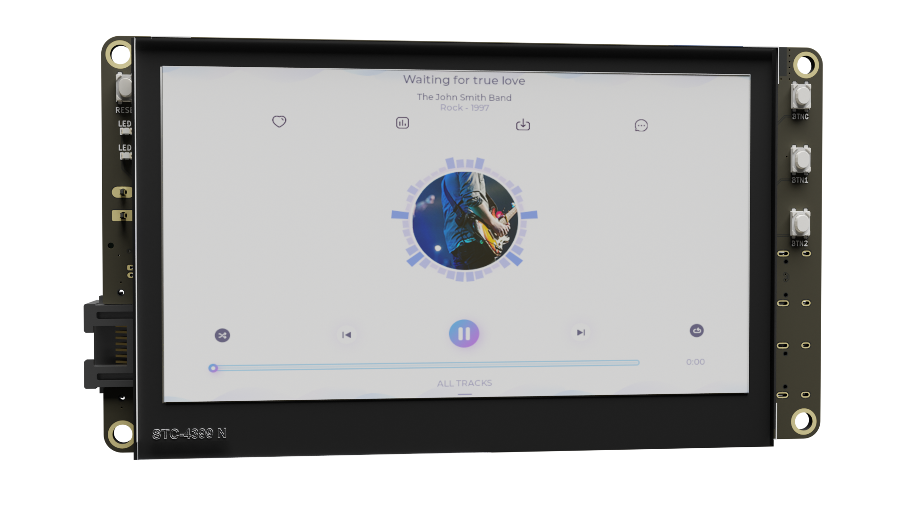
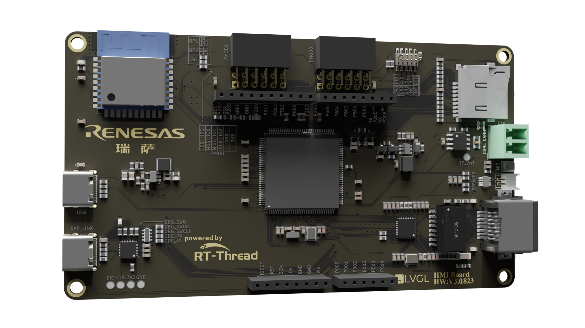

# RA6M3-HMI-Board BSP Instruction

[中文](README_ZH.md)|English

## Introduction

Get ready to dive into the world of the RA6M3-HMI-Board development board! This document provides all the juicy details on the BSP (Board Support Package) instructions. By checking out the Quick Start section, developers can hit the ground running with this BSP and have RT-Thread up and running on the development board in no time.

Here’s what you can expect to find inside:

• A comprehensive introduction to the development board 

• A handy BSP Quick Start Guide

Let’s start with an introduction to the development board. The HMI-Board board, built on the foundation of the Renesas RA6M3 MCU, is a game-changer. With its flexible software package and IDE configuration, users can easily evaluate the features of the RA6M3 MCU group and develop cutting-edge embedded system applications.

Curious about what it looks like? Check out the front view of the development board in the figure below:



The back view:



- ## Hardware Framework


  - RA6M3(R7FA6M3AH3CFB): Cortex-M4F core, 120Mhz main frequency, with 2MB Flash/640KB RAM, integrated TFT controller, 2D accelerator, and JPEG decoder.
  - 4.3 inch LCD (RGB 888)
  - On-board emulator
  - Ethernet
  - RW007 (SPI high-speed WIFI)
  - USB-Device
  - TF Card
  - CAN
  - 1 microphone, 1 speaker
  - Arduino expansion interface
  - 2 PMOD expansion interfaces
  - 4 buttons: 3 user buttons, one reset button


### Peripheral Condition

Each peripheral supporting condition for this BSP is as follows:

| **On-chip Peripheral Drivers** | **Support** | Remark                                |
| ------------------------------ | ----------- | ------------------------------------- |
| UART                           | Support     | UART9 is the default log output port. |
| GPIO                           | Support     |                                       |
| LCD                            | Support     |                                       |
| SDHI                           | Support     |                                       |
| JPEG                           | Support     |                                       |
| G2D                            | Support     |                                       |
| RW007                          | Support     |                                       |
| ETH                            | Support     |                                       |
| SPI                            | Support     |                                       |
| I2C                            | Support     |                                       |
| CAN                            | Support     |                                       |

## Instructions for Use 

The instructions for use are divided into the following two sections:

• Quick Start

This section is a user guide for newcomers to RT-Thread. By following simple steps, you can run the RT-Thread operating system on this development board and see the experimental results. 

• Advanced Use

This section is for developers who want to enable more development board resources on the RT-Thread operating system. By using the ENV tool to configure the BSP, you can enable more on-board resources and achieve more advanced functions.

## Quick Start 

This BSP currently only provides an MDK5 project. The following tutorial takes the MDK5 development environment as an example to introduce how to run the system.

**Compile and Download**

• Compile: Double-click the **project.uvprojx** file to open the MDK5 project and compile the program. 

• Download: Click the Debug button in MDK to download and debug 

**Running results**

After the program is downloaded successfully, the system will automatically run and print system information.

Connect the corresponding serial port of the development board to the PC, open the corresponding serial port (115200-8-1-N) in the terminal tool, reset the device, and you can see RT-Thread’s output information. Enter the help command can view the commands supported by the system.

```
 \ | /
- RT -     Thread Operating System
 / | \     5.0.0 build Jan  4 2023 10:14:56
 2006 - 2022 Copyright by RT-Thread team
Hello RT-Thread!
msh >
msh >help
help             - RT-Thread shell help.
ps               - List threads in the system.
free             - Show the memory usage in the system.
clear            - clear the terminal screen
version          - show RT-Thread version information
list             - list objects

msh > 
```

**Application Entry Function**

The entry function of the application layer is in **bsp\renesas\ra6m3-hmi-board\src\hal_entry.c** in `void hal_entry(void)`. Source files that you created can be placed directly in the src directory.

```
void hal_entry(void)
{
    rt_kprintf("\nHello RT-Thread!\n");

    while (1)
    {
        rt_pin_write(LED3_PIN, PIN_HIGH);
        rt_thread_mdelay(500);
        rt_pin_write(LED3_PIN, PIN_LOW);
        rt_thread_mdelay(500);
    }
}
```

### Advanced Features

**Resources & Documents**

- [Development Board Overview](https://www.renesas.com/us/en/products/microcontrollers-microprocessors/ra-cortex-m-mcus/cpk-ra6m4-evaluation-board#overview)
- [User Guide](https://www2.renesas.cn/cn/zh/document/mah/1527156?language=zh&r=1527191)
- [RA MCU](https://www.renesas.com/us/en/document/gde/1520091)
- [RA6 MCU Quick Design Guide](https://www.renesas.com/us/en/document/apn/ra6-quick-design-guide)

**ENV Configuration**

• How to use the ENV tool: [RT-Thread env tool user manual](https://www.rt-thread.io/document/site/programming-manual/env/env/). 

This BSP only enables the function of UART7 by default. If you're looking for more advanced functions such as components and software packages, ENV tool for configuration is available.

The steps are as follows:

1. Open the env tool under bsp.
2. Enter the `menuconfig` command to configure the project, and save and exit after configuration.
3. Enter the `pkgs --update` command to update the software package.
4. Enter the `scons --target=mdk5` command to regenerate the project.

## Contribute the Code

If you’re interested in the HMI-Board and have some cool projects you’d like to share with everyone, we’d love for you to contribute your code! You can check out [how to contribute to RT-Thread’s code](https://www.rt-thread.io/contribution.html). Let’s make something awesome together!