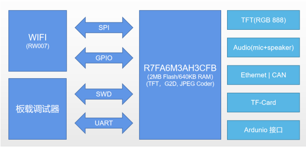

# 瑞萨 RA6M3-HMI-Board 开发板 BSP 说明

中文|[English](README.md)

## 简介

本文档为 RA6M3-HMI-Board 开发板提供的 BSP (板级支持包) 说明。通过阅读快速上手章节开发者可以快速地上手该 BSP，将 RT-Thread 运行在开发板上。

主要内容如下：

- 开发板介绍
- BSP 快速上手指南

## 开发板介绍

基于瑞萨 RA6M3 MCU 开发的 HMI-Board 评估板，通过灵活配置软件包和 IDE，可帮助用户对 RA6M3 MCU 群组的特性轻松进行评估，并对嵌入系统应用程序进行开发。

开发板正面外观如下图： 


开发板背面外观如下图： 


该开发板常用 **板载资源** 如下：



- MCU：R7FA6M3AH，120MHz，Arm Cortex®-M4 内核，2MB 代码闪存, 640KB SRAM
- RA6M3(R7FA6M3AH3CFB)：Cortex-M4F 内核，120Mhz 主频，具有 2MB Flash/640KB RAM，集成 TFT 控制器、2D 加速器和 JPEG 解码器。
- 4.3 寸 LCD (RGB 888)
- 板载仿真器
- 以太网
- RW007 (SPI 高速 WIFI)
- USB-Device
- TF Crad
- CAN
- 1路麦克风，1 路扬声器
- Arduino 扩展接口
- 2 路 PMOD 扩展接口
- 4个按键：3个用户按键，一个复位按键

**更多详细资料及工具**

## 外设支持

本 BSP 目前对外设的支持情况如下：

| **片上外设** | **支持情况** | **备注** |
| :----------------: | :----------------: | :------------- |
| UART               | 支持               | UART9 为默认日志输出端口 |
| GPIO               | 支持               |                |
| LCD          | 支持         |                          |
| SDHI | 支持 | |
| JPEG | 支持 | |
| G2D | 支持 | |
| RW007 | 支持 | |
| ETH | 支持 | |
| SPI | 支持 | |
| I2C | 支持 | |
| CAN | 支持 | |

* 注意：仓库刚拉下来是最小系统，若需添加/使能其他外设需参考：[外设驱动使用教程 (rt-thread.org)](https://www.rt-thread.org/document/site/#/rt-thread-version/rt-thread-standard/tutorial/make-bsp/renesas-ra/RA系列BSP外设驱动使用教程)

## 使用说明

使用说明分为如下两个章节：

- 快速上手

  本章节是为刚接触 RT-Thread 的新手准备的使用说明，遵循简单的步骤即可将 RT-Thread 操作系统运行在该开发板上，看到实验效果 。
- 进阶使用

  本章节是为需要在 RT-Thread 操作系统上使用更多开发板资源的开发者准备的。通过使用 ENV 工具对 BSP 进行配置，可以开启更多板载资源，实现更多高级功能。

### 快速上手

本 BSP 目前仅提供 MDK5 工程。下面以 MDK5 开发环境为例，介绍如何将系统运行起来。

**编译下载**

- 编译：双击 project.uvprojx 文件，打开 MDK5 工程，编译程序。

- 下载：点击 MDK 的 Debug 按钮进行下载调试

**查看运行结果**

下载程序成功之后，系统会自动运行并打印系统信息。

连接开发板对应串口到 PC , 在终端工具里打开相应的串口（115200-8-1-N），复位设备后，可以看到 RT-Thread 的输出信息。输入 help 命令可查看系统中支持的命令。

```bash
 \ | /
- RT -     Thread Operating System
 / | \     5.0.0 build Jan  4 2023 10:14:56
 2006 - 2022 Copyright by RT-Thread team
Hello RT-Thread!
msh >
msh >help
help             - RT-Thread shell help.
ps               - List threads in the system.
free             - Show the memory usage in the system.
clear            - clear the terminal screen
version          - show RT-Thread version information
list             - list objects

msh > 
```

**应用入口函数**

应用层的入口函数在 **bsp\renesas\ra6m3-hmi-board\src\hal_entry.c** 中 的 `void hal_entry(void)` 。用户编写的源文件可直接放在 src 目录下。

```c
void hal_entry(void)
{
    rt_kprintf("\nHello RT-Thread!\n");

    while (1)
    {
        rt_pin_write(LED3_PIN, PIN_HIGH);
        rt_thread_mdelay(500);
        rt_pin_write(LED3_PIN, PIN_LOW);
        rt_thread_mdelay(500);
    }
}
```

### 进阶使用

**资料及文档**

- [开发板官网主页](https://www2.renesas.cn/cn/zh/products/microcontrollers-microprocessors/ra-cortex-m-mcus/cpk-ra6m4-evaluation-board)
- [开发板用户手册](https://www2.renesas.cn/cn/zh/document/mah/1527156?language=zh&r=1527191)
- [瑞萨RA MCU 基础知识](https://www2.renesas.cn/cn/zh/document/gde/1520091)
- [RA6 MCU 快速设计指南](https://www2.renesas.cn/cn/zh/document/apn/ra6-quick-design-guide)

**ENV 配置**

- 如何使用 ENV 工具：[RT-Thread env 工具用户手册](https://www.rt-thread.org/document/site/#/development-tools/env/env)

此 BSP 默认只开启了 UART9 的功能，如果需使用更多高级功能例如组件、软件包等，需要利用 ENV 工具进行配置。

步骤如下：
1. 在 bsp 下打开 env 工具。
2. 输入`menuconfig`命令配置工程，配置好之后保存退出。
3. 输入`pkgs --update`命令更新软件包。
4. 输入`scons --target=mdk5` 命令重新生成工程。 

**FSP配置**

*   如何使用 FSP：[RA系列使用 FSP 配置外设驱动](https://www.rt-thread.org/document/site/#/rt-thread-version/rt-thread-standard/tutorial/make-bsp/renesas-ra/RA系列使用FSP配置外设驱动?id=ra系列使用-fsp-配置外设驱动)

目前仓库 bsp 默认使能最小体量配置，用户可通过如下步骤使能 env 外设配置：

1. 在 bsp 目录下打开 env 工具，使用 `scons --target=mdk5`命令生成 MDK 工程。
2. 打开 bsp 目录下的`project.uvprojx`文件，选择上方导航栏的 `Software Components`配置，打开后找到`Flex Software`下的`RA Configuration`旁的配置按钮，该操作会自动查找当前电脑环境下安装的 fsp 版本，选择指定版本后进入 fsp。 
    
3. 在进入 fsp 后我们可以发现，已经存在了一些已经配置完成的外设，此时我们点击`Generate Project Content`按钮即可生成所需驱动文件。
    
4. 接下来回到 env，使能所需的外设配置后保存退出即可。

## 联系人信息

在使用过程中若您有任何的想法和建议，建议您通过以下方式来联系到我们  [RT-Thread 社区论坛](https://club.rt-thread.org/)

## SDK 仓库

这是 HMI-Board 的 SDK 仓库地址：[sdk-bsp-ra6m3-hmi-board](https://github.com/RT-Thread-Studio/sdk-bsp-ra6m3-hmi-board)，该仓库包括了外设驱动以及丰富的示例工程，如果像体验官网/社区提供的开源示例请转移到该仓库进行开发。RT-Thread 主仓库只维护最新的驱动相关代码。

## 贡献代码

如果您对  RA6M3-HMI-Board 感兴趣，并且有一些好玩的项目愿意与大家分享的话欢迎给我们贡献代码，您可以参考 [如何向 RT-Thread 代码贡献](https://www.rt-thread.org/document/site/#/rt-thread-version/rt-thread-standard/development-guide/github/github)。
