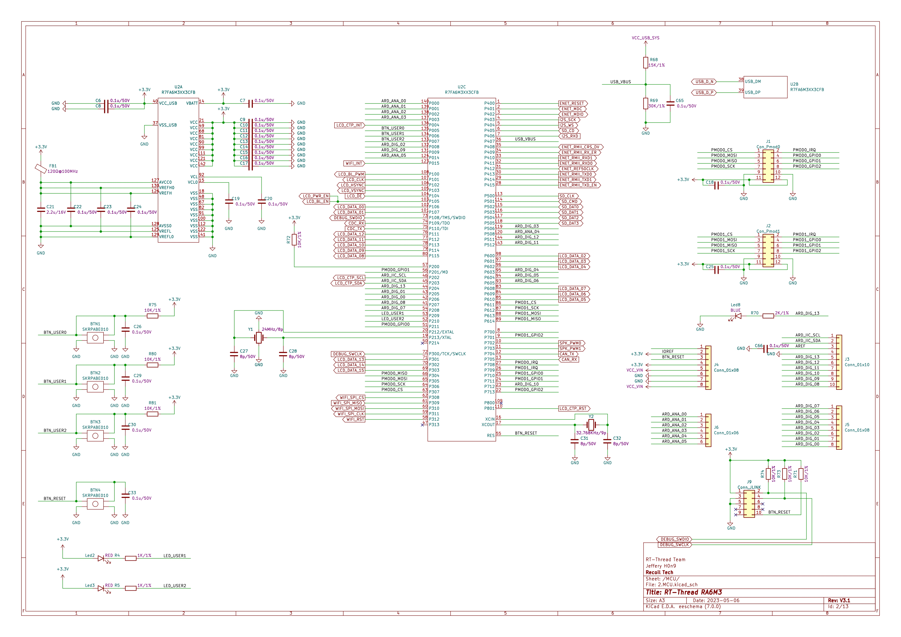

# ra6m3-hmi-board Arduino Ecosystem Compatibility Guide

**[English](README.md)** | **中文**

## 1 RTduino - Arduino Ecosystem Compatibility Layer for RT-Thread

The ra6m3-hmi-board development board has been fully adapted for the [RTduino software package](https://github.com/RTduino/RTduino), the Arduino Ecosystem compatibility layer for RT-Thread. Users can operate this BSP following Arduino programming conventions and leverage a vast array of libraries from the Arduino community, providing significant enhancement to the RT-Thread ecosystem. For more information, refer to the [RTduino Software Package Documentation](https://github.com/RTduino/RTduino).

### 1.1 Activating Arduino Ecosystem Compatibility Layer for this BSP

Enter the `menuconfig` command under the Env tool, or select RT-Thread Settings in the RT-Thread Studio IDE:

```Kconfig
Hardware Drivers Config --->
    Onboard Peripheral Drivers --->
        [*] Compatible with Arduino Ecosystem (RTduino)
```

## 2 Arduino Pin Configuration

For more information about pin layout, refer to [pins_arduino.c](pins_arduino.c) and [pins_arduino.h](pins_arduino.h).



| Arduino Pin Number | STM32 Pin Number | 5V Tolerance | Remarks |
| ------------------- | ----------------- | ------------ | ------------------------------------------- |
| 0 (D0) | P206 | Yes | Serial4-RX, default handled by RT-Thread's UART device framework uart4 |
| 1 (D1) | P205 | Yes | Serial4-TX, default handled by RT-Thread's UART device framework uart4 |
| 2 (D2) | P008 | Yes |  |
| 3 (D3) | P506 | Yes |  |
| 4 (D4) | P603 | Yes |  |
| 5 (D5) | P604 | Yes | PWM8-CH0, default handled by RT-Thread's PWM device framework pwm8 channel 0 |
| 6 (D6) | P605 | Yes | PWM8-CH0, default handled by RT-Thread's PWM device framework pwm8 channel 0 |
| 7 (D7) | P208 | Yes |  |
| 8 (D8) | P207 | Yes |  |
| 9 (D9) | P009 | Yes |  |
| 10 (D10) | P712 | Yes | PWM2-CH0, default handled by RT-Thread's PWM device framework pwm2 channel 0 |
| 11 (D11) | P512 | Yes | PWM0-CH0, default handled by RT-Thread's PWM device framework pwm0 channel 0 |
| 12 (D12) | P511 | Yes |  |
| 13 (D13) | P204 | Yes |  |
| 14 (D14) | P203 | Yes |  |
| 15 (D15) | P202 | Yes |  |
| 16 (A0) | P000 | Yes | ADC1-CH0-EXTVOL (External Voltage), default handled by RT-Thread's ADC device framework adc0 channel 0 |
| 17 (A1) | P001 | Yes | ADC1-CH1-EXTVOL (External Voltage), default handled by RT-Thread's ADC device framework adc0 channel 1 |
| 18 (A2) | P002 | Yes | ADC1-CH2-EXTVOL (External Voltage), default handled by RT-Thread's ADC device framework adc0 channel 2 |
| 19 (A3) | P003 | Yes | ADC1-CH7-EXTVOL (External Voltage), default handled by RT-Thread's ADC device framework adc0 channel 7 |
| 20 (A4) | P508 | Yes | ADC1-CH19-EXTVOL (External Voltage), default handled by RT-Thread's ADC device framework adc0 channel 20 |
| 21 (A5) | P014 | Yes | ADC1-CH5-EXTVOL (External Voltage), default handled by RT-Thread's ADC device framework adc0 channel 5 |

> Note:
> 1. RTduino currently does not support MDK; it is recommended to use the GNU GCC toolchain for compilation.
> 2. The default PWM channel for Renesas is channel 0; for detailed driver information, refer to the `bsp\renesas\libraries\HAL_Drivers\drv_pwm.c` file.