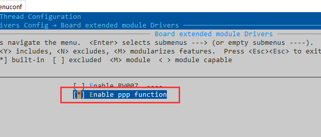
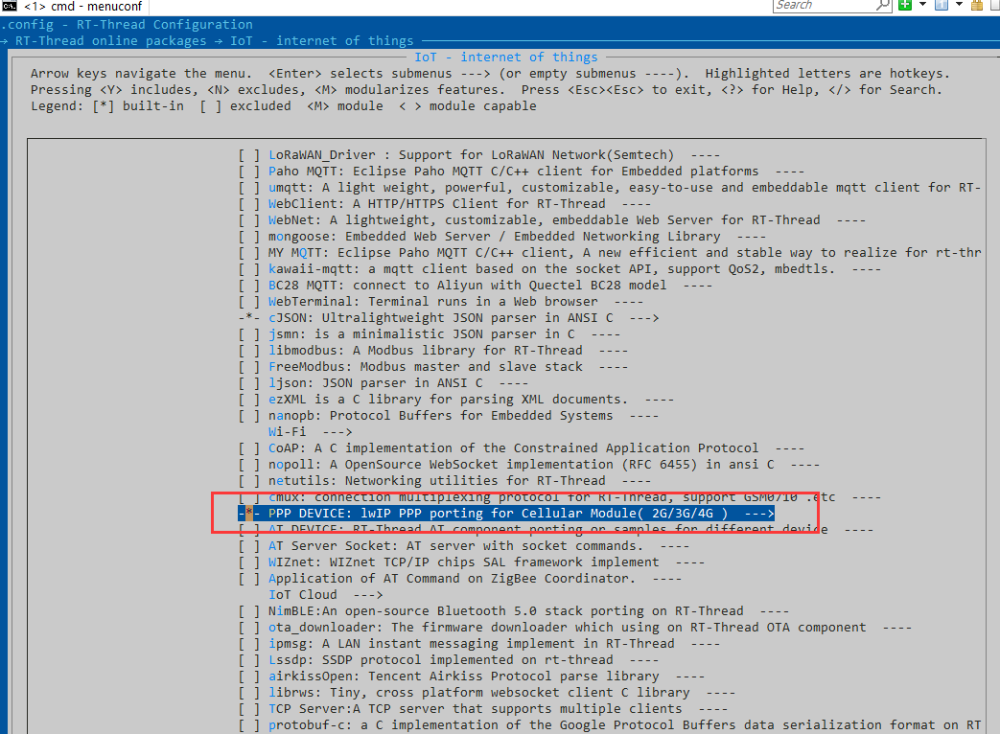
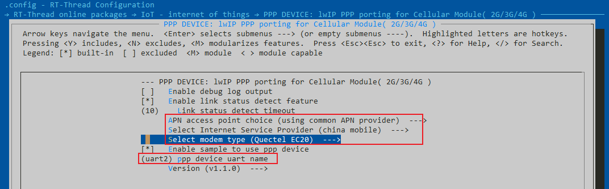
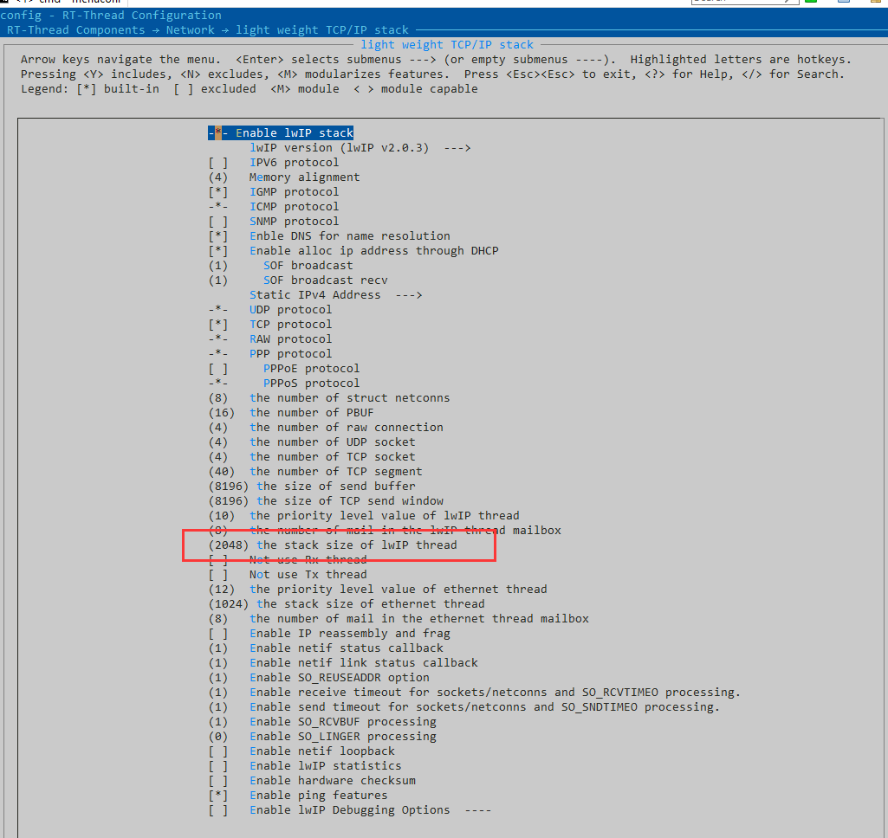
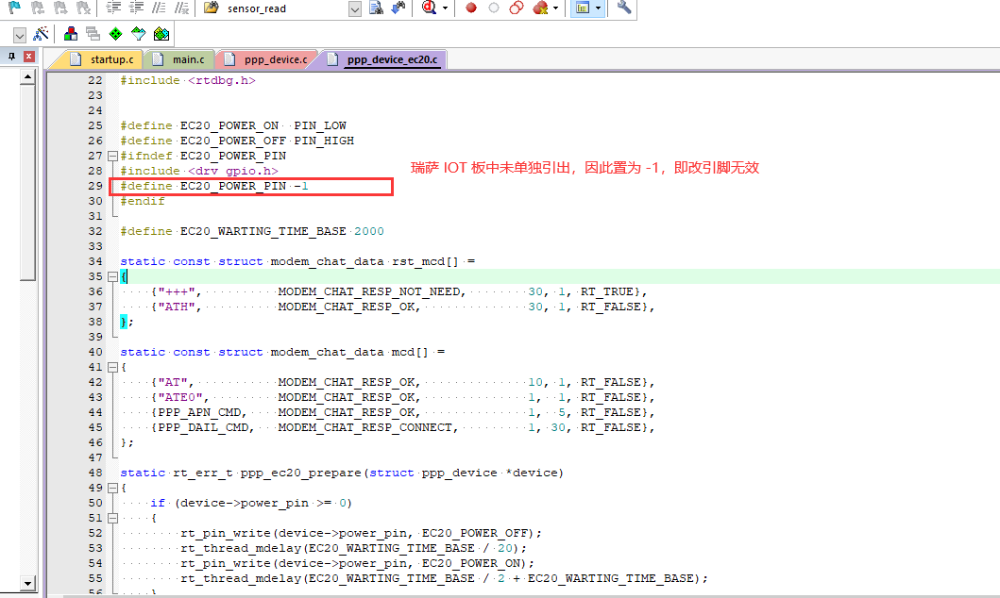
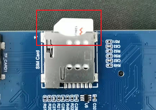
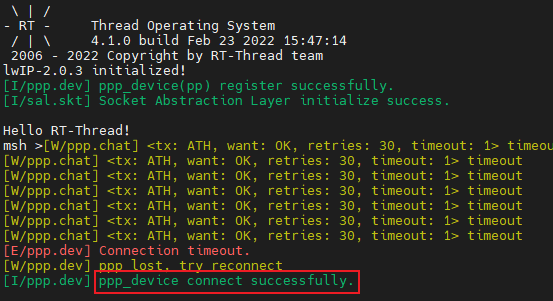
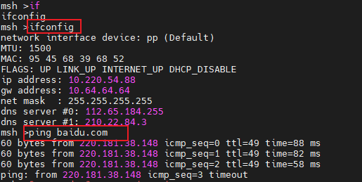

# 如何使用 PPP 功能

   PPP 入网是 4G CAT-1 模块一种除了 AT 命令联网的另一种入网方式。首先要把 PCI-E 接口的 CAT-1 板子插入板上的接口，并且同时连接天线，天线的有无与连接质量优劣一定程度上关系到连接到基站的稳定程度。

   PPP 作为一个独立的报文，需要网络协议栈来解析，从而获取数据。对于 RT-Thread 而言，lwIP 协议栈就能轻松得胜任这个工作。因此我们需要打开 lwIP 协议栈，并开启 PPP 支持。在 RT-Thread 中，我们需要使用到 PPP_Device 软件包来完成这项工作。使用 Cat -1 模块联网时，一定要插卡，手机卡，物联网卡均可；如果卡被禁用联网，则 ppp 入网会失败。

1. 在 ENV 中打开 ppp 支持。

     

2. 在 ENV 中配置 IOT 软件包，选中 PPP_Device 并进入配置。

     

3. 配置 PPP_Device ，按照你的手机卡的运行商选取 APN 接入点，以及使用的模块，配置 ```ppp device uart name``` 为 ```uart2```。

     

4. 在 ENV 中配置 lwIP 协议栈，TCPIP<> 的协议栈大小增加到 2048 以上。

     

5. 修改 ppp_device_ec20.c 的代码，因为通信模块一般由个人用户自行选配，所以引脚并不完全相符合。比如在瑞萨的板子中，EC20 的复位引脚没有单独引出而与系统复位引脚公用，因此修改为 -1。

     

6. 打开 FSP 中添加 UART2 端口，保存并退出
7. 插入 SIM 卡，要注意插卡方向
    

8. 编译，debug 下载，测试验证。

   下载完成后，需要手动按下开发板的 RESRT 按钮复位，确保芯片和模块都进行了重启。重启后需要等待一会，会自动连接。
    
   提示连接成功后，可以使用 `ifconfig` 命令查看网络状态信息，使用 `ping baidu.com` 命令测试网络连接状态。
    