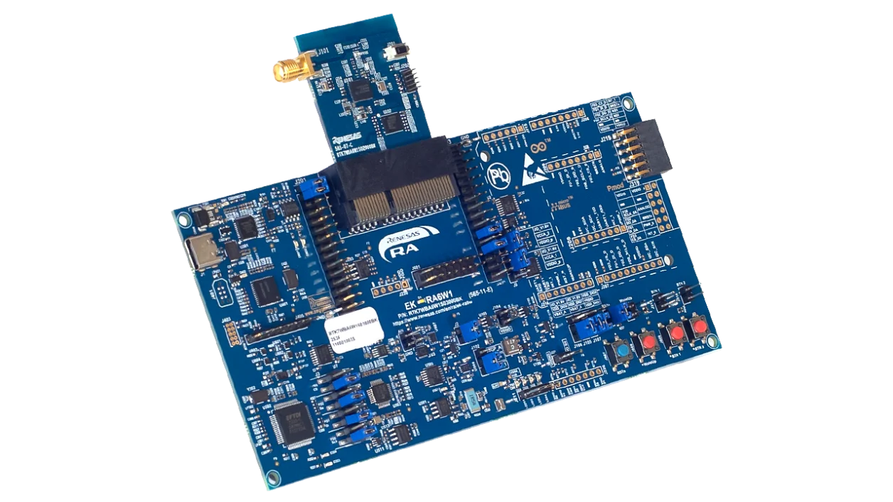

# 瑞萨 EK-RA6W1 开发板 BSP 说明

## 简介

本文档为瑞萨 EK-RA6W1 开发板提供的 BSP (板级支持包) 说明。通过阅读快速上手章节开发者可以快速地上手该 BSP，将 RT-Thread 运行在开发板上。

主要内容如下：

- 开发板介绍
- BSP 快速上手指南

## 开发板介绍

基于瑞萨 RA6W1 MCU 开发的 EK-RA6W1 MCU 评估板，通过灵活配置软件包和 IDE，可帮助用户对 RA6W1 MCU 群组的特性轻松进行评估，并对嵌入系统应用程序进行开发。

开发板正面外观如下图：

 


该开发板常用 **板载资源** 如下：

- MCU：R7SA6W1CED，160MHz，Arm Cortex®-M33内核，704KB SRAM
- 网络：Wi-Fi 6，802.11a/b/g/n/ac/ax 2.4/5GHz，1x1，20MHz，MCS9 115Mbps，OFDMA，TWT
- 板载资源：8MB QSPI Flash，8MB pSRAM，2x SPI，3x UART，2x I2C，12 位 ADC、I2S、PDM、PWM

**更多详细资料及工具**

## 外设支持

* 本 BSP 目前对外设的支持情况如下：

  | **片上外设** | **支持情况** | **备注**                 |
  | :----------: | :----------: | :----------------------- |
  |     UART     |     支持     | UART1 为默认日志输出端口 |
  |     GPIO     |     支持     |                          |

* 注意：仓库刚拉下来是最小系统，若需添加/使能其他外设需参考：[外设驱动使用教程 (rt-thread.org)](https://www.rt-thread.org/document/site/#/rt-thread-version/rt-thread-standard/tutorial/make-bsp/renesas-ra/RA系列BSP外设驱动使用教程)

## 使用说明

使用说明分为如下两个章节：

- 快速上手

  本章节是为刚接触 RT-Thread 的新手准备的使用说明，遵循简单的步骤即可将 RT-Thread 操作系统运行在该开发板上，看到实验效果 。
  
- 进阶使用

  本章节是为需要在 RT-Thread 操作系统上使用更多开发板资源的开发者准备的。通过使用 ENV 工具对 BSP 进行配置，可以开启更多板载资源，实现更多高级功能。

## ENV 编译、调试烧录

- 编译：打开ENV进入到 *rt-thread/bsp/renesas/ra6w1-ek* 目录，执行 scons 进行编译

* 下载：使用Renesas Flash Programmer 进行程序烧录，Microcontroller 选择 RA6W1, 烧录rtthread.img.bin文件，偏移为0


### 快速上手

本 BSP 目前仅提供 ENV 工程。下面以 ENV 开发环境为例，介绍如何将系统运行起来。

**硬件连接**

使用 USB 数据线连接开发板到 PC

**编译下载**

- 编译：打开ENV进入到 *rt-thread/bsp/renesas/ra6w1-ek* 目录，执行 scons 进行编译

* 下载：使用Renesas Flash Programmer 进行程序烧录，Microcontroller 选择 RA6W1, 烧录rtthread.img.bin文件，偏移为0

**查看运行结果**

下载程序成功之后，系统会自动运行并打印系统信息。

连接开发板对应串口到 PC , 在终端工具里打开相应的串口（115200-8-1-N），复位设备后，可以看到 RT-Thread 的输出信息。输入 help 命令可查看系统中支持的命令。

```bash
 \ | /
- RT -     Thread Operating System
 / | \     5.3.0 build Jul 31 2026 08:52:35
 2006 - 2024 Copyright by RT-Thread team
[I/utest] utest is initialize success.
[I/utest] total utest testcase num: (24)

Hello RT-Thread on RA6W1!
msh >help
RT-Thread shell commands:
reboot           - Reboot System
utest_list       - output all utest testcase
utest_run        - utest_run [-thread or -help] [testcase name] [loop num]
pin              - pin [option]
clear            - clear the terminal screen
version          - show RT-Thread version information
console          - console setting
list             - list objects
help             - RT-Thread shell help
ps               - List threads in the system
free             - Show the memory usage in the system
backtrace        - print backtrace of a thread

msh >

```

### 进阶使用

**资料及文档**

- [瑞萨RA6W1 MCU 基础知识](https://www.renesas.cn/zh/products/ra6w1)
- [RA6W1 MCU 使用指南](https://www.renesas.cn/zh/document/mah/ra6w1-hardware-design-guide)

**FSP 配置**

需要根据指南安装好e2studio工具，并完成指南中软件包的安装,
[软件包安装链接](https://www.renesas.com/en/document/sws/rafw-flexible-software-package?r=25578118&_gl=1*3jbk41*_gcl_au*NzAxNzk2MDQyLjE3ODM0MTk0NTE.*_ga*MTIzMjEwMzY0MS4xNzgzNDE5NDUx*_ga_D1706WVDQV*czE3ODU0OTI2NDIkbzgkZzAkdDE3ODU0OTI2NDIkajYwJGwwJGgw)
，获取 [rafw-example](https://github.com/renesas/rafw-fsp-examples.git) 并导入基础 gpio_ek_ra6w1_ep 示例，根据需求选择对应功能，并将对应生成的ra系列代码复制到对应目录

## 联系人信息

在使用过程中若您有任何的想法和建议，建议您通过以下方式来联系到我们  [RT-Thread 社区论坛](https://club.rt-thread.org/)

## 贡献代码

如果您对  EK-RA6W1 感兴趣，并且有一些好玩的项目愿意与大家分享的话欢迎给我们贡献代码，您可以参考 [如何向 RT-Thread 代码贡献](https://www.rt-thread.org/document/site/#/rt-thread-version/rt-thread-standard/development-guide/github/github)。
