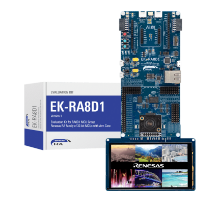

# EK-RA8D1 BSP Instruction

中文|[English](README.md)

## Introduction

Prepare for an exhilarating journey into the realm of the EK-RA8D1 development board! This guide is your treasure map, leading you to a trove of knowledge about the Board Support Package (BSP). The Quick Start section is your launchpad, propelling developers into action with the BSP, and getting RT-Thread operational on the development board faster than a speeding bullet.

Here’s a sneak peek of the adventure that awaits:

• A captivating exploration of the development board

• A practical and user-friendly BSP Quick Start Guide

## Hardware

The EK-RA8D1 evaluation board, developed based on the Renesas RA8D1 MCU, is a handy tool that allows users to easily evaluate the features of the RA8 MCU group. With flexible software package and IDE configurations, it’s a breeze to develop embedded system applications.

Here’s a sneak peek of what the front of the development board looks like:



The board comes with some commonly used **on-board resources**. Let’s dive in and explore!

- MCU：R7FA8D1BH, 480MHz, **Arm®Cortex®-M85**, 2MB Flash, 1MB SRAM
- Jlink OB
- OSPI FLASH（64MX8）
- USB-Host
- USB-Device
- CANFD
- ethernet 
- 2个PMOD+Arduino+micro BUS interface
- 3 user LED
- 3 button: 2 user button, 1 reset button

**More Details**

### Peripheral Condition

Each peripheral supporting condition for this BSP is as follows:

| **On-chip Peripheral Drivers** | **Support** | **Remark** |
| :----------------: | :----------------: | :------------- |
| UART               | Support        | UART9 is the default log output port. |
| GPIO               | Support        |                |
| USB | Support | TinyUSB |
| Camera | Support | ov2640、ov7725、ov7670... |
| SDHC | Support | 1bit、4bit |
| ADC | Support | |
| DAC | Support | |
| SPI | Support | |
| PWM | Support | |
| RTC | Support | |
| FLASH |   Support   | On board flash |
| WDT | Support | |
| IIC | Support | |

## Instructions for Use 

The instructions for use are divided into the following two sections:

• Quick Start

This section is a user guide for newcomers to RT-Thread. By following simple steps, you can run the RT-Thread operating system on this development board and see the experimental results. 

• Advanced Use

This section is for developers who want to enable more development board resources on the RT-Thread operating system. By using the ENV tool to configure the BSP, you can enable more on-board resources and achieve more advanced functions.

### Quick Start 

This BSP currently only provides an MDK5 project. The following tutorial takes the MDK5 development environment as an example to introduce how to run the system.

**Compile and Download**

• Compile: Double-click the **project.uvprojx** file to open the MDK5 project and compile the program. 

• Download: Click the Debug button in MDK to download and debug 

**Running results**

After the program is downloaded successfully, the system will automatically run and print system information.

Connect the corresponding serial port of the development board to the PC, open the corresponding serial port (115200-8-1-N) in the terminal tool, reset the device, and you can see RT-Thread’s output information. Enter the help command can view the commands supported by the system.

```bash
initialize rti_board_start:0 done

 \ | /
- RT -     Thread Operating System
 / | \     5.1.0 build Oct 30 2023 16:14:05
 2006 - 2022 Copyright by RT-Thread team
do components initialization.
initialize rti_board_end:0 done
initialize finsh_system_init:0 done

Hello RT-Thread!
msh >
```

**Entry function**

The entry function of the application layer is in **bsp\renesas\ra8d1-ek\src\hal_entry.c** in `void hal_entry(void)`. Source files that you created can be placed directly in the src directory.

```c
void hal_entry(void)
{
    rt_kprintf("\nHello RT-Thread!\n");

    while (1)
    {
        rt_pin_write(LED_PIN, PIN_HIGH);
        rt_thread_mdelay(500);
        rt_pin_write(LED_PIN, PIN_LOW);
        rt_thread_mdelay(500);
    }
}
```

### Advanced Features

**Resources & Documents**

- [Development Board Overview](https://www.renesas.com/us/en/products/microcontrollers-microprocessors/ra-cortex-m-mcus/ek-ra8d1-evaluation-kit-ra8d1-mcu-group#documents)
- [User Guide](https://www.renesas.com/us/en/document/mat/ek-ra8d1-v1-users-manual?r=25452351)
- [RA MCU](https://www.renesas.com/us/en/document/gde/1520091)

**ENV Configuration**

• How to use the ENV tool: [RT-Thread env tool user manual](https://www.rt-thread.io/document/site/programming-manual/env/env/). 

This BSP only enables the function of UART9 by default. If you're looking for more advanced functions such as components and software packages, ENV tool for configuration is available.

The steps are as follows:

1. Open the env tool under bsp.
2. Enter the `menuconfig` command to configure the project, and save and exit after configuration.
3. Enter the `pkgs --update` command to update the software package.
4. Enter the `scons --target=mdk5` command to regenerate the project. 

**FSP Configuration**

*   How to Use FSP: [Configuring Peripheral Drivers for RA Series Using FSP](https://www.rt-thread.org/document/site/#/rt-thread-version/rt-thread-standard/tutorial/make-bsp/renesas-ra/RA系列使用FSP配置外设驱动?id=ra系列使用-fsp-配置外设驱动)

The current repository's BSP is configured with the minimum footprint enabled by default. Users can enable peripheral configurations through the following steps:

1. Open the `env` tool in the BSP directory and use the `scons --target=mdk5` command to generate an MDK project.
2. Open the `project.uvprojx` file in the BSP directory, select the `Software Components` configuration in the top navigation bar, and open the configuration button next to `RA Configuration` under `Flex Software`. This operation will automatically detect the installed FSP version on the current computer. After selecting the specified version, enter FSP.
    
3. Upon entering FSP, pre-configured peripherals are already present. Click the `Generate Project Content` button to generate the required driver files.
    
4. Return to `env`, enable the necessary peripheral configurations, save, and exit.

## Contribute the Code

If you’re interested in the EK-RA8D1 and have some cool projects you’d like to share with everyone, we’d love for you to contribute your code! You can check out [how to contribute to RT-Thread’s code](https://www.rt-thread.io/contribution.html). Let’s make something awesome together!