# Titan Board 开发板 BSP 说明

**中文** | [**English**](./README.md)

## 简介

本文档为 RT-Thread Titan Board 开发板提供 BSP (板级支持包) 说明。通过阅读快速上手章节，开发者可以快速地上手该 BSP，将 RT-Thread 运行在开发板上。

主要内容如下：

- 开发板介绍
- BSP 快速上手指南

## 开发板介绍

Titan Board 开发板是 RT-Thread 推出基于瑞萨 Cortex-M85 与 Cortex-M33 双核架构 R7KA8P1 芯片，为工程师们提供了一个灵活、全面的开发平台，助力开发者在嵌入式物联网领域获得更深层次的体验。

Titan Board 搭载频率 1GHz Arm® Cortex®-M85 与 250MHz Arm® Cortex®-M33 双架构核 RA8P1 芯片。RA8P1 系列是瑞萨电子首款搭载高性能 Arm® Cortex®-M85 (CM85) 及 Helium™ 矢量扩展，并集成 Ethos™-U55 NPU 的 32 位 AI 加速微控制器 (MCU)。 该系列通过单芯片实现 256 GOPS 的 AI 性能、超过 7300 CoreMarks 的突破性 CPU 性能和先进的人工智能 (AI) 功能，可支持语音、视觉和实时分析 AI 场景。

开发板正面外观如下图：

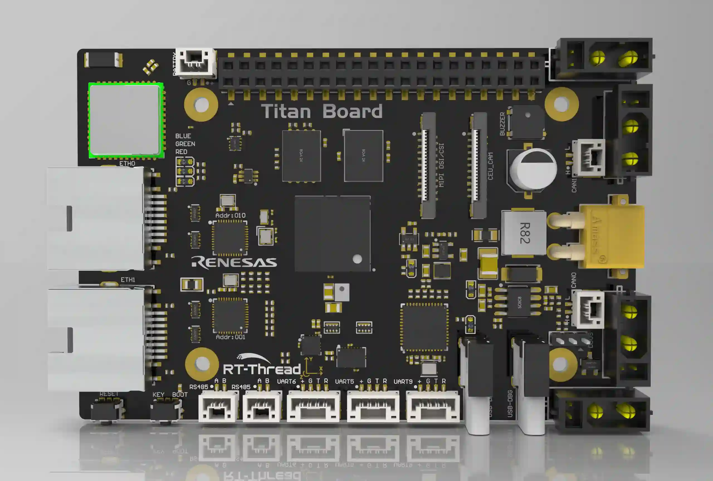

该开发板常用 **板载资源** 如下：

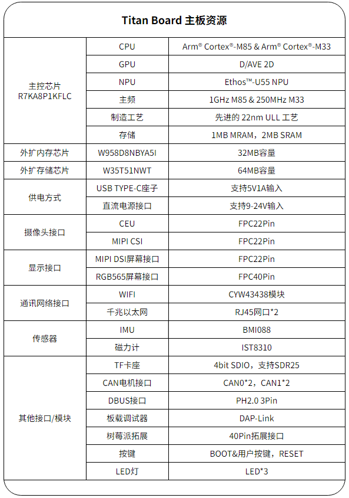

## 外设支持

本 BSP 目前对外设的支持情况如下：

| **片上外设** | **支持情况** | **组件** | **支持情况**  |
| ------------ | ------------ | -------- | ------------ |
| UART         | 支持         | LWIP     | 支持         |
| GPIO         | 支持         | TCP/UDP  | 支持         |
| HWTIMER      | 支持         | MQTT     | 支持         |
| IIC          | 支持         | TFTP     | 支持         |
| WDT          | 支持         | Telnet | 支持 |
| RTC          | 支持         | **多核通信** | **支持情况** |
| ADC          | 支持         | RPMsg-Lite | 支持 |
| DAC          | 支持         | **拓展外设** | **支持情况** |
| SPI          | 支持         | MIPI CSI Camera | 支持 |
| RS485 | 支持 | CEU Camera | 支持 |
| CANFD | 支持 | RGB LCD | 支持 |
| SDHI | 支持 | CYW43438 WIFI | 支持 |
| USB | 支持 | | |
| HyperRAM | 支持 | | |
| HyperFlash | 支持 | | |

- 注意：仓库刚拉下来是最小系统，若需添加/使能其他外设需参考：[外设驱动使用教程 (rt-thread.org)](https://www.rt-thread.org/document/site/#/rt-thread-version/rt-thread-standard/tutorial/make-bsp/renesas-ra/RA系列BSP外设驱动使用教程)

## 使用说明

使用说明分为如下两个章节：

- 快速上手

  本章节是为刚接触 RT-Thread 的新手准备的使用说明，遵循简单的步骤即可将 RT-Thread 操作系统运行在该开发板上，看到实验效果。
- 进阶使用

  本章节是为需要在 RT-Thread 操作系统上使用更多开发板资源的开发者准备的。通过使用 FSP 和 RT-Thread Settings 工具对项目进行配置，可以开启更多板载资源，实现更多高级功能。

## FSP 版本说明

本 BSP 使用的是 FSP6.2.0 版本，进行外设相关开发需要下载并安装。

- 下载链接：[rasc-6.2.0](https://github.com/renesas/fsp/releases/download/v6.2.0/setup_fsp_v6_2_0_rasc_v2025-10.exe)
- 注意：BSP默认是最小系统，若需添加/使能其他外设需参考：[外设驱动使用教程 (rt-thread.org)](https://www.rt-thread.org/document/site/#/rt-thread-version/rt-thread-standard/tutorial/make-bsp/renesas-ra/RA系列BSP外设驱动使用教程)

### 快速上手

本 BSP 目前可以直接导入到 **RT-Thread Studio v2.3.0** 中开发。下面以 RT-Thread Studio 开发环境为例，介绍如何将系统运行起来。

**安装工具链**

1. 安装编译工具链

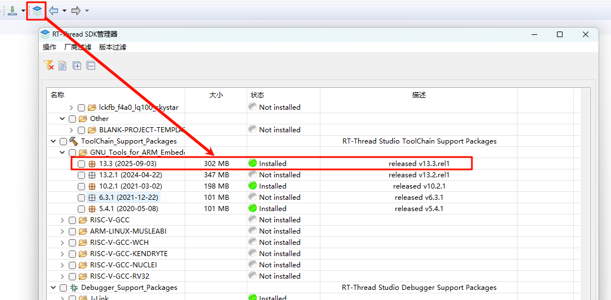

2. 调试工具

​	下载 J-Link v8.48 和 PyOCD 0.2.9。

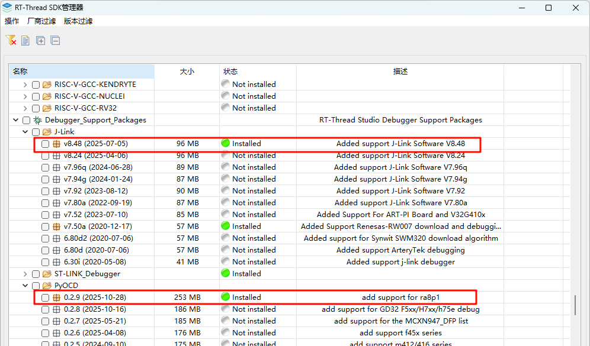

**创建工程**

1. 点击左上角 文件-->导入。

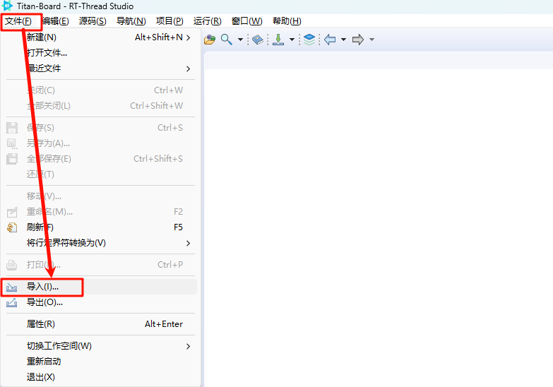

2. 选择导入 RT-Thread Bsp 到工作空间，点击“下一步”。

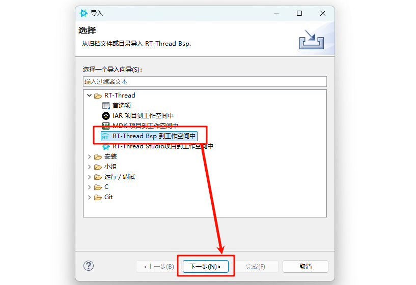

3. 选择 BSP 根目录并填写好工程信息，点击“完成”。

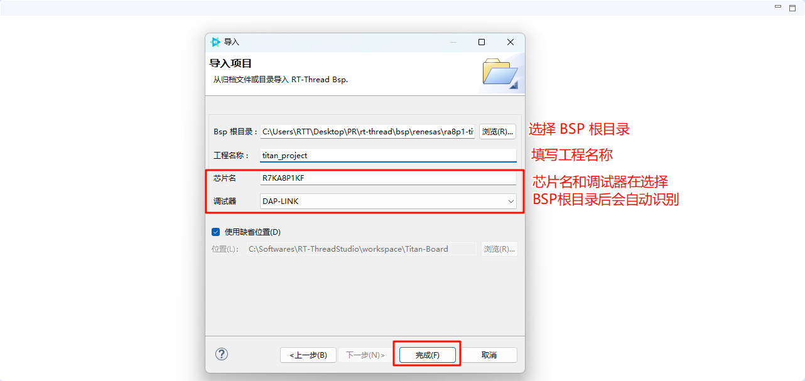

4. 基于 BSP 创建工程就完成了。

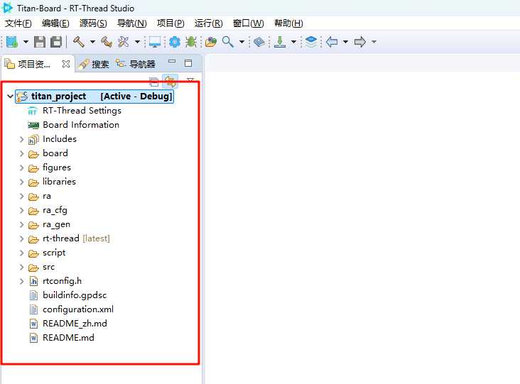

**配置工程的调试下载设置**

> **注意：有时需要修改两遍才生效。**

在”调试器“选项卡中修改调试器的配置。

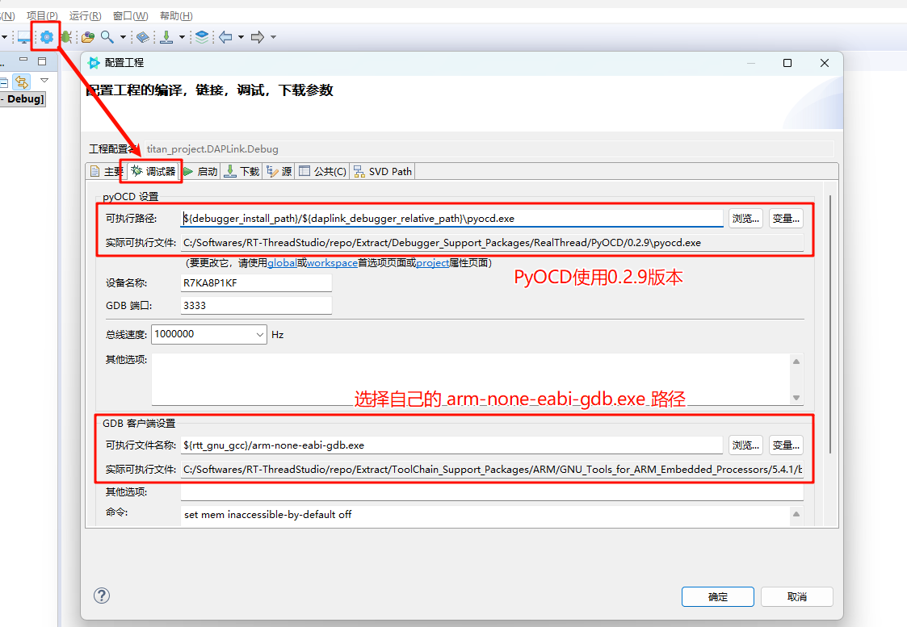

在“下载”选项卡中将烧录方式改为“烧录Hex文件”，之后点击“确定“完成配置。

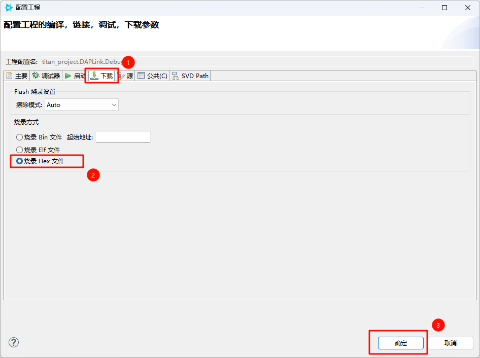

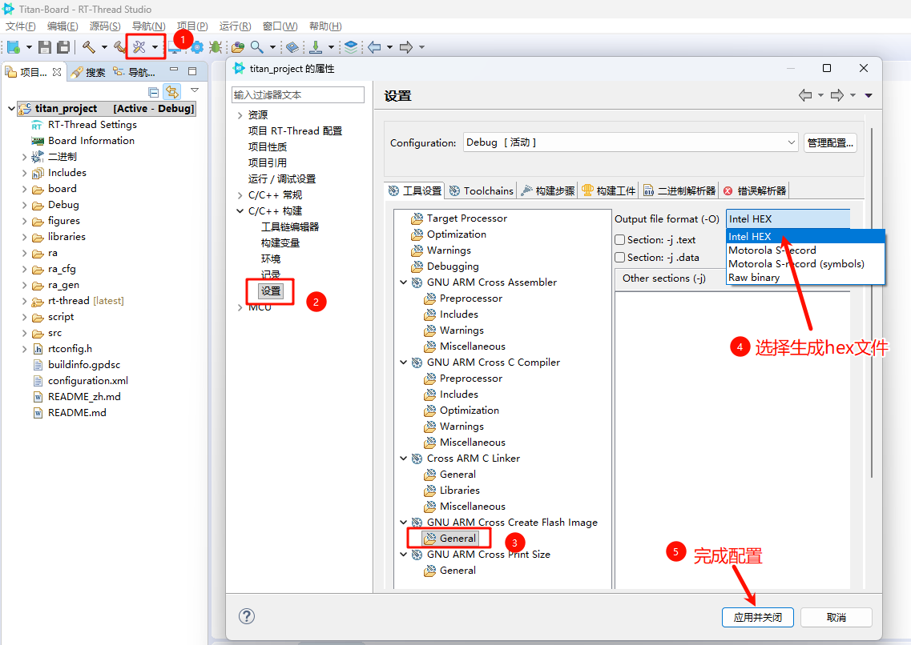

**硬件连接**

使用 USB 数据线连接开发板到 PC，使用 DAP-Link 接口下载和 DEBUG 程序。

**编译下载**

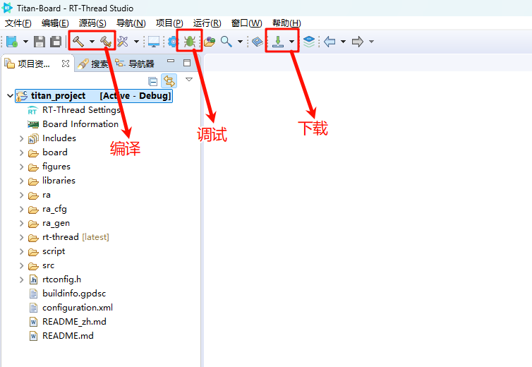

**查看运行结果**

下载程序成功之后，系统会自动运行并打印系统信息。

连接开发板对应串口到 PC , 在终端工具里打开相应的串口（115200-8-1-N），复位设备后，可以看到 RT-Thread 的输出信息。输入 help 命令可查看系统中支持的命令。

```bash
 \ | /
- RT -     Thread Operating System
 / | \     5.3.0 build Nov 27 2025 13:12:46
 2006 - 2024 Copyright by RT-Thread team

==================================================
Hello, Titan Board!
==================================================
msh >help
RT-Thread shell commands:
backtrace        - print backtrace of a thread
clear            - clear the terminal screen
version          - show RT-Thread version information
list             - list objects
help             - RT-Thread shell help
ps               - List threads in the system
free             - Show the memory usage in the system
pin              - pin [option]
reboot           - Reboot System

msh >

```

**应用入口函数**

应用层的入口函数在 **src\hal_entry.c** 中 的 `void hal_entry(void)` 。用户编写的源文件可直接放在 src 目录下。

```c
#include <rtthread.h>
#include "hal_data.h"
#include <rtdevice.h>
#include <board.h>

#define LED_PIN     BSP_IO_PORT_00_PIN_12 /* Onboard LED pins */

void hal_entry(void)
{
    rt_kprintf("\n==================================================\n");
    rt_kprintf("Hello, Titan Board!\n");
    rt_kprintf("==================================================\n");

    rt_pin_mode(LED_PIN, PIN_MODE_OUTPUT);

    while (1)
    {
        rt_pin_write(LED_PIN, PIN_HIGH);
        rt_thread_mdelay(1000);
        rt_pin_write(LED_PIN, PIN_LOW);
        rt_thread_mdelay(1000);
    }
}
```

### 进阶使用

**资料及文档**

- [开发板官网主页](https://www.rt-thread.org/document/site/#/rt-thread-version/rt-thread-standard/hw-board/ra8p1-titan-board/ra8p1-titan-board)
- [开发板数据手册](https://www.renesas.cn/zh/document/dst/25574255?r=25574019)
- [开发板硬件手册](https://www.renesas.cn/zh/document/mah/25574257?r=25574019)
- [多核开发指南](https://www.renesas.cn/zh/document/apn/developing-ra8-dual-core-mcu?r=25574019)
- [Renesas RA8P1 Group](https://www.renesas.cn/zh/document/fly/renesas-ra8p1-group?r=25574019)

**FSP 配置**

需要修改瑞萨的 BSP 外设配置或添加新的外设端口，需要用到瑞萨的 [RA 可扩展性强的配置软件包 (FSP)](https://www.renesas.cn/zh/software-tool/flexible-software-package-fsp?queryID=c20a16b5f7f3866713b62c7acb07f2fc) 配置工具。请务必按照如下步骤完成配置。配置中有任何问题可到 [RT-Thread 社区论坛](https://club.rt-thread.org/) 中提问。

1. [下载灵活配置软件包 (FSP) | Renesas](https://github.com/renesas/fsp/releases/download/v6.2.0/setup_fsp_v6_2_0_rasc_v2025-10.exe)，请使用 FSP 6.2.0 版本
2. 请参考文档：[RA系列使用FSP配置外设驱动](https://www.rt-thread.org/document/site/#/rt-thread-version/rt-thread-standard/tutorial/make-bsp/renesas-ra/RA系列使用FSP配置外设驱动?id=ra系列使用-fsp-配置外设驱动)。

* **通过导入fsp进行开发配置：**

用户可通过找到工程下的configuration.xml文件，将其导入到fsp中，即可开始配置：

选择左上角 file->open 打开配置文件

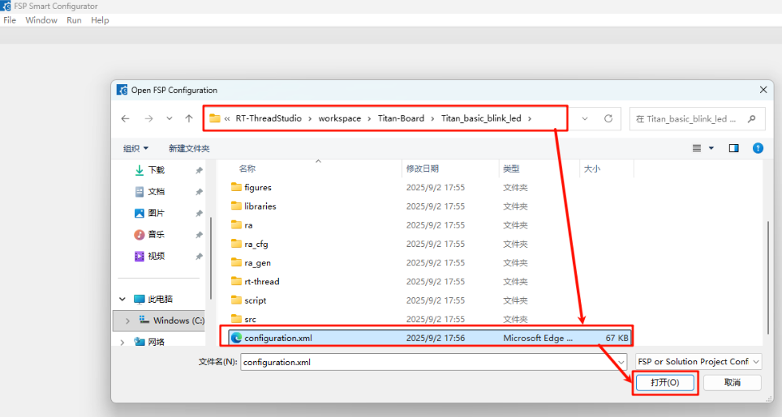

* **生成 FSP 代码：**

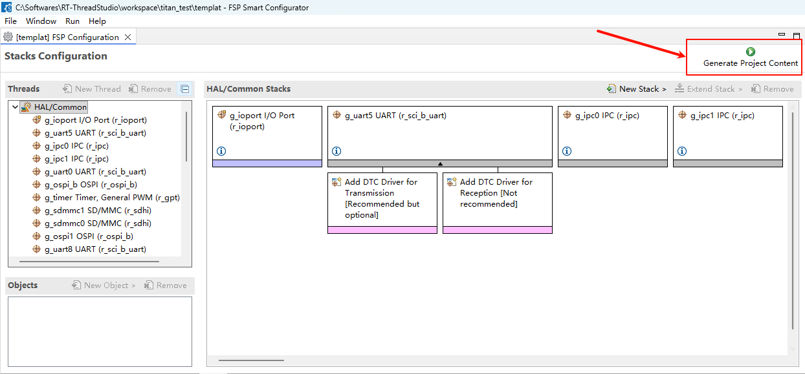

**RT-Thread Settings**

在 RT-Thread Settings 中可以对 RT-Thread 的内核、组件、软件包以及 Titan Board 的设备驱动进行配置。

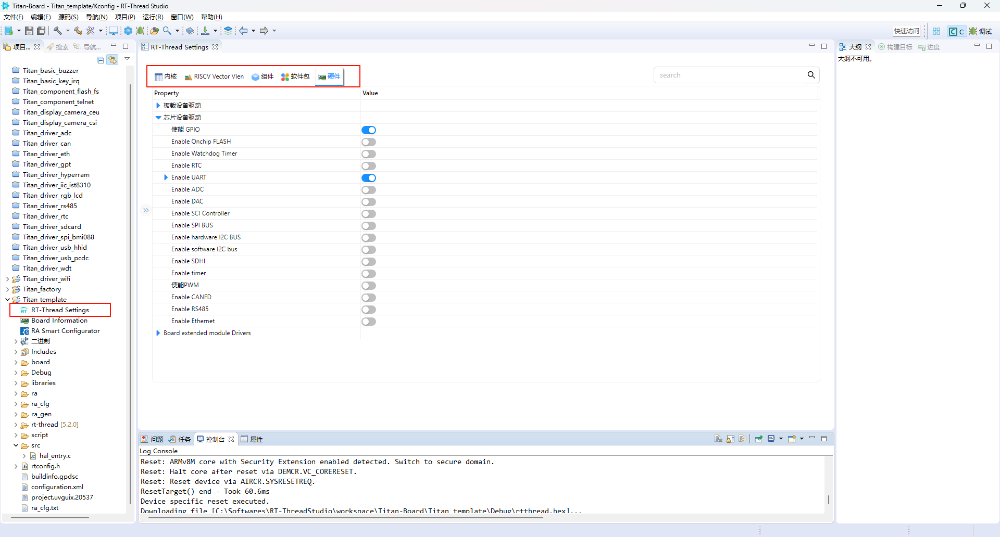

## 联系人信息

在使用过程中若您有任何的想法和建议，建议您通过以下方式来联系到我们  [RT-Thread 社区论坛](https://club.rt-thread.org/)

## 贡献代码

如果您对 Titan Board 感兴趣，并且有一些好玩的项目愿意与大家分享的话欢迎给我们贡献代码，您可以参考 [如何向 RT-Thread 代码贡献](https://www.rt-thread.org/document/site/#/rt-thread-version/rt-thread-standard/development-guide/github/github)。
