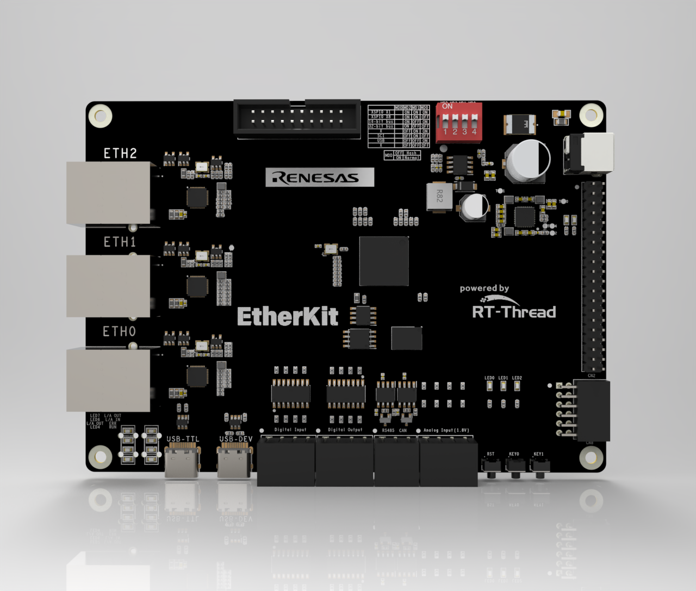

# EtherKit Development Board BSP Documentation

**English** | **[Chinese](./README_zh.md)**

## Introduction

This document provides the BSP (Board Support Package) documentation for the RT-Thread EtherKit development board. By following the Quick Start section, developers can quickly get started with this BSP and run RT-Thread on the development board.

The main contents are as follows:

- Introduction to the Development Board
- BSP Quick Start Guide

## Introduction to the Development Board

The EtherKit development board is based on the Renesas RZ/N2L and is designed to facilitate embedded system application development by offering flexible software package and IDE configurations.

The front view of the development board is shown below:



Key **onboard resources** include:

- MPU: R9A07G084M04GBG, maximum operating frequency of 400MHz, Arm Cortex®-R52 core, 128KB tightly coupled memory (with ECC), 1.5MB internal RAM (with ECC)
- Debug Interface: Onboard J-Link interface
- Expansion Interface: One PMOD connector

**More detailed information and tools**

## Peripheral Support

This BSP currently supports the following peripherals:

Here is the translated text in English, keeping the markdown format:

| **EtherCAT Solution** | **Support Status** | **EtherCAT Solution** | **Support Status** |
| --------------------- | ------------------ | --------------------- | ------------------ |
| EtherCAT_IO           | Supported          | EtherCAT_FOE          | Supported          |
| EtherCAT_EOE          | Supported          | EtherCAT_COE          | Supported          |
| **PROFINET Solution** | **Support Status** | **Ethernet/IP Solution** | **Support Status** |
| P-Net (Open source evaluation package supporting ProfiNET slave protocol stack) | Supported | EIP | Supported |
| **On-chip Peripherals** | **Support Status** | **Components**        | **Support Status** |
| UART                  | Supported          | LWIP                  | Supported          |
| GPIO                  | Supported          | TCP/UDP               | Supported          |
| HWIMER                | Supported          | MQTT                  | Supported          |
| IIC                   | Supported          | TFTP                  | Supported          |
| WDT                   | Supported          | Modbus Master/Slave Protocol | Supported |
| RTC                   | Supported          |                       |                    |
| ADC                   | Supported          |                       |                    |
| DAC                   | Supported          |                       |                    |
| SPI                   | Supported          |                       |                    |


## Usage Instructions

Usage instructions are divided into two sections:

- **Quick Start**

  This section is designed for beginners who are new to RT-Thread. By following simple steps, users can run the RT-Thread OS on the development board and observe the experimental results.

- **Advanced Usage**

  This section is for developers who need to use more of the development board's resources within the RT-Thread OS. By configuring the BSP using the ENV tool, additional onboard resources and advanced features can be enabled.

### Quick Start

This BSP currently provides GCC/IAR project support. Below is a guide using the [IAR Embedded Workbench for Arm](https://www.iar.com/products/architectures/arm/iar-embedded-workbench-for-arm/) development environment to run the system.

**Hardware Connection**

Connect the development board to the PC via a USB cable. Use the J-Link interface to download and debug the program.

**Compilation and Download**

- Navigate to the `bsp` directory and use the command `scons --target=iar` to generate the IAR project.
- Compile: Double-click the `project.eww` file to open the IAR project and compile the program.
- Debug: In the IAR navigation bar, click `Project -> Download and Debug` to download and start debugging.

**Viewing the Run Results**

After successfully downloading the program, the system will automatically run and print system information.

Connect the corresponding serial port of the development board to the PC. Open the relevant serial port (115200-8-1-N) in the terminal tool. After resetting the device, you can view the RT-Thread output. Enter the `help` command to see the list of supported system commands.

```bash
 \ | /  
- RT -     Thread Operating System  
 / | \     5.1.0 build Mar 14 2024 18:26:01  
 2006 - 2024 Copyright by RT-Thread team  

Hello RT-Thread!  
==================================================  
This is an IAR project in RAM execution mode!  
==================================================  
msh > help  
RT-Thread shell commands:  
clear            - clear the terminal screen  
version          - show RT-Thread version information  
list             - list objects  
backtrace        - print backtrace of a thread  
help             - RT-Thread shell help  
ps               - List threads in the system  
free             - Show the memory usage in the system  
pin              - pin [option]  

msh >
```

**Application Entry Function**

The entry function for the application layer is located in **src\hal_entry.c** within `void hal_entry(void)`. User source files can be placed directly in the `src` directory.

```c
void hal_entry(void)
{
    rt_kprintf("\nHello RT-Thread!\n");
    rt_kprintf("==================================================\n");
    rt_kprintf("This is an IAR project in RAM execution mode!\n");
    rt_kprintf("==================================================\n");

    while (1)
    {
        rt_pin_write(LED_PIN, PIN_HIGH);
        rt_thread_mdelay(500);
        rt_pin_write(LED_PIN, PIN_LOW);
        rt_thread_mdelay(500);
    }
}
```

### Advanced Usage

**Resources and Documentation**

- [Development Board Official Homepage](https://www.renesas.cn/zh/products/microcontrollers-microprocessors/rz-mpus/rzn2l-integrated-tsn-compliant-3-port-gigabit-ethernet-switch-enables-various-industrial-applications)
- [Development Board Datasheet](https://www.renesas.cn/zh/document/dst/rzn2l-group-datasheet?r=1622651)
- [Development Board Hardware Manual](https://www.renesas.cn/zh/document/mah/rzn2l-group-users-manual-hardware?r=1622651)
- [EtherKit_User_Manual](https://github.com/RT-Thread-Studio/sdk-bsp-rzn2l-etherkit/blob/master/docs/EtherKit_User_Manual.pdf)
- [RZ/N2L MCU Quick Start Guide](https://www.renesas.cn/zh/document/apn/rzt2-rzn2-device-setup-guide-flash-boot-application-note?r=1622651)
- [RZ/N2L Easy Download Guide](https://www.renesas.cn/zh/document/gde/rzn2l-easy-download-guide?r=1622651)
- [Renesas RZ/N2L Group](https://www.renesas.cn/zh/document/fly/renesas-rzn2l-group?r=1622651)

**FSP Configuration**

To modify Renesas BSP peripheral configurations or add new peripheral ports, the Renesas [FSP](https://www2.renesas.cn/jp/zh/software-tool/flexible-software-package-fsp#document) configuration tool is required. Please follow the steps outlined below for configuration. For any questions regarding the configuration, please visit the [RT-Thread Community Forum](https://club.rt-thread.org/).

1. [Download the Flexible Software Package (FSP) | Renesas](https://github.com/renesas/rzn-fsp/releases/download/v2.0.0/setup_rznfsp_v2_0_0_rzsc_v2024-01.1.exe), use FSP version 2.0.0.
2. To add the **"EtherKit Board Support Package"** to FSP, refer to the document [How to Import a BSP](https://www2.renesas.cn/document/ppt/1527171?language=zh&r=1527191).
3. For guidance on configuring peripheral drivers using FSP, refer to the document: [Configuring Peripheral Drivers Using FSP for RA Series](https://www.rt-thread.org/document/site/#/rt-thread-version/rt-thread-standard/tutorial/make-bsp/renesas-ra/RA-series-using-FSP-configure-peripheral-drivers?id=ra-series-using-fsp-configure-peripheral-drivers).

**ENV Configuration**

- To learn how to use the ENV tool, refer to the [RT-Thread ENV Tool User Manual](https://www.rt-thread.org/document/site/#/development-tools/env/env).

By default, this BSP only enables the UART0 functionality. To use more advanced features such as components, software packages, and more, the ENV tool must be used for configuration.

The steps are as follows:
1. Open the ENV tool in the `bsp` directory.
2. Use the `menuconfig` command to configure the project. Save and exit once the configuration is complete.
3. Run the `pkgs --update` command to update the software packages.
4. Run the `scons --target=iar` command to regenerate the project.

## Contact Information

If you have any thoughts or suggestions during usage, please feel free to contact us via the [RT-Thread Community Forum](https://club.rt-thread.org/).

## Contribute Code

If you're interested in EtherKit and have some exciting projects you'd like to share, we welcome code contributions. Please refer to [How to Contribute to RT-Thread Code](https://www.rt-thread.org/document/site/#/rt-thread-version/rt-thread-standard/development-guide/github/github).
