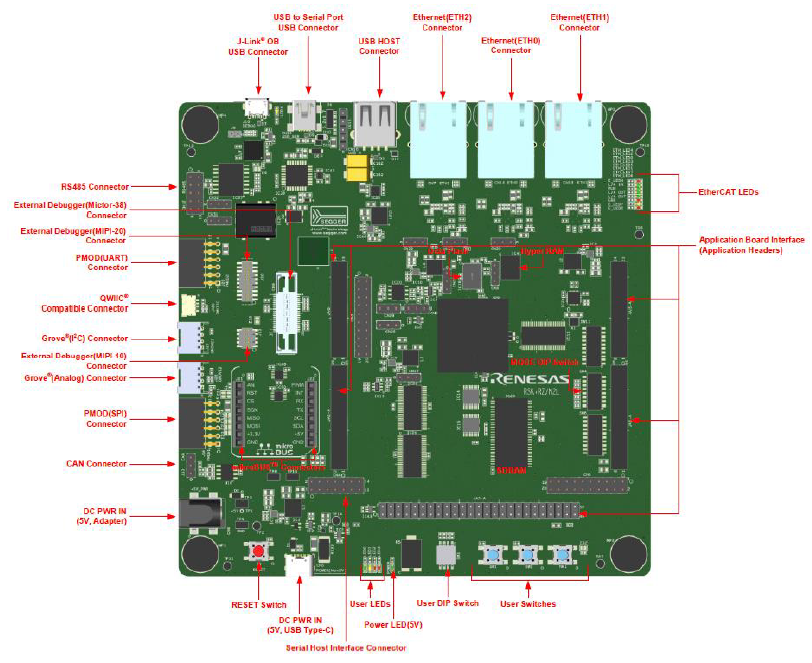

# Renesas RSK-RZN2L Development Board BSP Documentation

**English** | [**中文**](./README_zh.md)

## Introduction

This document provides the BSP (Board Support Package) for the Renesas RSK-RZN2L development board. By following the Quick Start Guide, developers can quickly get started with the BSP and run RT-Thread on the development board.

The main contents include:

- Development Board Introduction
- BSP Quick Start Guide

## Development Board Introduction

The RSK-RZN2L MCU evaluation board is based on Renesas RZ/N2L and is designed for developing embedded system applications with flexible software package configuration and IDE support.

The front appearance of the development board is shown below:



The commonly used **onboard resources** for this development board are as follows:

- MPU: R9A07G084M04GBG, maximum operating frequency of 400MHz, Arm® Cortex®-R52 with on-chip FPU (Floating Point Unit) and NEON™, 1.5 MB on-chip SRAM, Ethernet MAC, EtherCAT, USB 2.0 High-Speed, CAN/CANFD, various communication interfaces such as xSPI and ΔΣ interfaces, and security functions.
- Debug Interface: Onboard J-Link interface
- Expansion Interface: Two PMOD connectors

**More detailed information and tools**

## Peripheral Support

The current peripheral support in this BSP is as follows:

| **On-chip Peripheral** | **Support Status** | **Remarks** |
| :----------------- | :----------------- | :------------- |
| UART               | Supported          | UART0 is the default log output port |
| GPIO               | Supported          |                |
| HWIMER             | Supported          |                |
| IIC                | Supported          |                |
| WDT                | Supported          |                |
| RTC                | Supported          |                |
| ADC                | Supported          |                |
| DAC                | Supported          |                |
| SPI                | Supported          |                |
| FLASH              | Supported          |                |
| PWM                | Supported          |                |
| CAN                | Supported          |                |
| ETH                | Supported          |                |
| More updates...    |                    |                |

## Instructions

The instructions are divided into the following two sections:

- Quick Start

  This section is for beginners who are new to RT-Thread. By following simple steps, you can run the RT-Thread OS on this development board and observe the experimental results.
  
- Advanced Usage

  This section is for developers who want to use more resources on the development board with RT-Thread. Using the ENV tool to configure the BSP, you can enable more onboard resources and achieve more advanced features.

### Quick Start

Currently, this BSP only provides an IAR project. Below is an example of how to get the system running using the [IAR Embedded Workbench for Arm](https://www.iar.com/products/architectures/arm/iar-embedded-workbench-for-arm/) development environment.

**Hardware Connection**

Connect the development board to the PC using a USB data cable, and use the J-Link interface to download and debug programs.

**Compilation and Download**

- Go to the BSP directory, open ENV, and use the command `scons --target=iar` to generate the IAR project.
- Compile: Double-click the `project.eww` file to open the IAR project and compile the program.
- Debug: Click `Project->Download and Debug` in the IAR toolbar to download and start debugging.

**View Running Results**

After successfully downloading the program, the system will run automatically and print system information.

Connect the corresponding serial port of the development board to the PC. Open the corresponding serial port in a terminal tool (115200-8-1-N). After resetting the device, you can see the RT-Thread output. Enter the `help` command to view the supported commands in the system.

```bash
 \ | /
- RT -     Thread Operating System
 / | \     5.1.0 build Mar 14 2024 18:26:01
 2006 - 2024 Copyright by RT-Thread team

Hello RT-Thread!
==================================================
This is a iar project which mode is xspi0 execution!
==================================================
msh >help
RT-Thread shell commands:
clear            - clear the terminal screen
version          - show RT-Thread version information
list             - list objects
backtrace        - print backtrace of a thread
help             - RT-Thread shell help
ps               - List threads in the system
free             - Show the memory usage in the system
pin              - pin [option]

msh >
```

**Application Entry Function**

The application layer's entry function is in `src\hal_entry.c` in the `void hal_entry(void)` function. User source files can be placed directly in the `src` directory.

```c
#define LED_PIN    BSP_IO_PORT_18_PIN_2 /* Onboard LED pins */

void hal_entry(void)
{
    rt_kprintf("\nHello RT-Thread!\n");
    rt_kprintf("==================================================\n");
    rt_kprintf("This is a iar project which mode is xspi0 execution!\n");
    rt_kprintf("==================================================\n");

    while (1)
    {
        rt_pin_write(LED_PIN, PIN_HIGH);
        rt_thread_mdelay(500);
        rt_pin_write(LED_PIN, PIN_LOW);
        rt_thread_mdelay(500);
    }
}
```

### Advanced Usage

**Resources and Documentation**

- [Development Board Official Homepage](https://www.renesas.cn/zh/products/microcontrollers-microprocessors/rz-mpus/rzn2l-integrated-tsn-compliant-3-port-gigabit-ethernet-switch-enables-various-industrial-applications)
- [Development Board Data Sheet](https://www.renesas.cn/zh/document/dst/rzn2l-group-datasheet?r=1622651)
- [Development Board Hardware Manual](https://www.renesas.cn/zh/document/mah/rzn2l-group-users-manual-hardware?r=1622651)
- [RZ/N2L MCU Quick Start Guide](https://www.renesas.cn/zh/document/apn/rzt2-rzn2-device-setup-guide-flash-boot-application-note?r=1622651)
- [RZ/N2L Easy Download Guide](https://www.renesas.cn/zh/document/gde/rzn2l-easy-download-guide?r=1622651)
- [Renesas RZ/N2L Group](https://www.renesas.cn/zh/document/fly/renesas-rzn2l-group?r=1622651)

**FSP Configuration**

If you need to modify Renesas BSP peripheral configurations or add new peripheral ports, you will need to use the Renesas [FSP](https://www2.renesas.cn/jp/zh/software-tool/flexible-software-package-fsp#document) configuration tool. Please follow the steps below. If you encounter any issues during the configuration, feel free to ask on the [RT-Thread Community Forum](https://club.rt-thread.org/).

1. [Download the Flexible Software Package (FSP) | Renesas](https://github.com/renesas/rzn-fsp/releases/download/v2.0.0/setup_rznfsp_v2_0_0_rzsc_v2024-01.1.exe), please use version FSP 2.0.0.
2. Refer to the document [How to Import Board Support Package](https://www2.renesas.cn/document/ppt/1527171?language=zh&r=1527191) to add the **"RSK-RZN2L Board Support Package"** to FSP.
3. Refer to the document: [RA Series Using FSP to Configure Peripheral Drivers](https://www.rt-thread.org/document/site/#/rt-thread-version/rt-thread-standard/tutorial/make-bsp/renesas-ra/RA系列使用FSP配置外设驱动?id=ra系列使用-fsp-配置外设驱动).

**ENV Configuration**

- How to use the ENV tool: [RT-Thread ENV Tool User Manual](https://www.rt-thread.org/document/site/#/development-tools/env/env)

By default, this BSP only enables UART0. To use more advanced features like components, software packages, etc., you need to configure the BSP using the ENV tool.

Steps:
1. Open the env tool in the BSP directory.
2. Enter the `menuconfig` command to configure the project. After configuration, save and exit.
3. Enter the `pkgs --update` command to update the software packages.
4. Enter the `scons --target=iar` command to regenerate the project.

## Contact Information

If you have any thoughts or suggestions during usage, feel free to contact us via the [RT-Thread Community Forum](https://club.rt-thread.org/).

## Contribute Code

If you are interested in the RSK-RZN2L and have some exciting projects to share with the community, we welcome your code contributions. You can refer to [How to Contribute Code to RT-Thread](https://www.rt-thread.org/document/site/#/rt-thread-version/rt-thread-standard/development-guide/github/github).