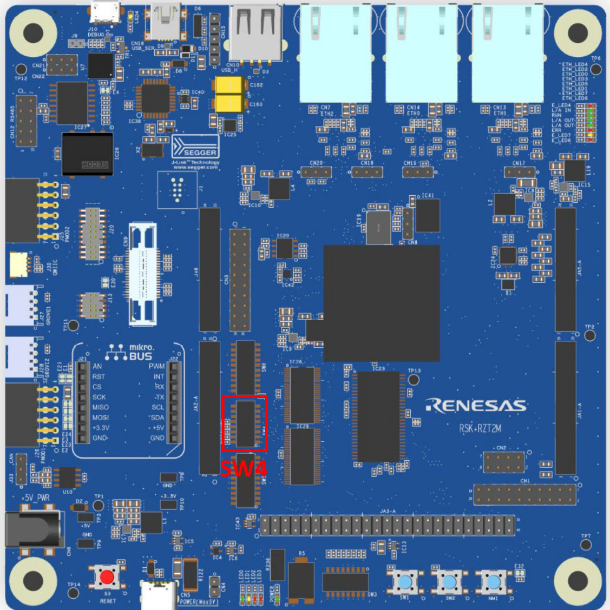

# Renesas RSK-RZT2M Development Board BSP Guide

**English** | [**中文**](./README_zh.md)

## Introduction

This document provides the Board Support Package (BSP) guide for the Renesas RSK-RZT2M development board. By reading the quick start section, developers can quickly get started with this BSP and run RT-Thread on the development board.

The main contents are as follows:

- Board introduction
- BSP quick start guide

## Board Introduction

The RSK-RZT2M MCU evaluation board, based on the Renesas RZ/T2M development, is designed to assist users in evaluating the features of the RA6M4 MCU group and developing embedded system applications through flexible configuration of software packages and IDEs.

The front appearance of the development board is as follows:



The commonly used **on-board resources** of this development board are as follows:

- MCU: R9A07G075M24GBG, with a maximum operating frequency of 800MHz, dual Arm Cortex®-R52 cores, tightly coupled memory 576KB (with ECC), internal RAM 2 MB (with ECC)
- Debug interface: On-board J-Link interface
- Expansion interface: Two PMOD connectors

**More detailed information and tools**

## Peripheral Support

The current support status of peripherals in this BSP is as follows:

| **On-chip Peripheral** | **Support Status** | **Remarks**                          |
| :--------------------- | :----------------- | :----------------------------------- |
| UART                   | Supported          | UART0 is the default log output port |
| GPIO                   | Supported          |                                      |
| HWIMER                 | Supported          |                                      |
| I2C                    | Not supported      |                                      |
| WDT                    | Not supported      |                                      |
| RTC                    | Not supported      |                                      |
| ADC                    | Not supported      |                                      |
| DAC                    | Not supported      |                                      |
| SPI                    | Not supported      |                                      |
| FLASH                  | Not supported      |                                      |
| PWM                    | Not supported      |                                      |
| CAN                    | Not supported      |                                      |
| ETH                    | Not supported      |                                      |
| More to come...        |                    |                                      |

## Usage Guide

The usage guide is divided into the following two sections:

- Quick Start

  This section is prepared for beginners who are new to RT-Thread. Follow simple steps to run the RT-Thread operating system on this development board and see experimental results.

- Advanced Usage

  This section is prepared for developers who need to utilize more development board resources on the RT-Thread operating system. By using the ENV tool to configure the BSP, more on-board resources can be enabled to achieve more advanced functionalities.

### Quick Start

Currently, this BSP only provides an IAR project. Below is an example of how to get the system up and running using [IAR Embedded Workbench for Arm](https://www.iar.com/products/architectures/arm/iar-embedded-workbench-for-arm/) development environment.

**Hardware Connection**

Connect the development board to the PC using a USB data cable and use the J-link interface for downloading and debugging programs.

**Compilation and Download**

- Navigate to the bsp directory, open ENV, and use the command `scons --target=iar` to generate an IAR project.
- Compilation: Double-click the project.eww file to open the IAR project and compile the program.
- Debugging: Click `Project->Download and Debug` on the top-left navigation bar of IAR to download and start debugging.

**Viewing Execution Results**

After successfully downloading the program, the system will automatically run and print system information.

Connect the corresponding serial port of the development board to the PC, open the terminal tool, and select the corresponding serial port (115200-8-1-N). After resetting the device, you can see the output information from RT-Thread. Enter the help command to view the supported commands in the system.

```bash
 \ | /
- RT -     Thread Operating System
 / | \     5.1.0 build Mar 14 2024 18:26:01
 2006 - 2024 Copyright by RT-Thread team

Hello RT-Thread!
==================================================
This is a iar project which mode is ram execution!
==================================================
msh >help
RT-Thread shell commands:
clear            - clear the terminal screen
version          - show RT-Thread version information
list             - list objects
backtrace        - print backtrace of a thread
help             - RT-Thread shell help
ps               - List threads in the system
free             - Show the memory usage in the system
pin              - pin [option]

msh >
```

**Application Entry Function**

The entry function of the application layer is in **src\hal_entry.c** under `void hal_entry(void)`. User-written source files can be directly placed in the src directory.

```c
void hal_entry(void)
{
    rt_kprintf("\nHello RT-Thread!\n");
    rt_kprintf("==================================================\n");
    rt_kprintf("This is a iar project which mode is ram execution!\n");
    rt_kprintf("==================================================\n");

    while (1)
    {
        rt_pin_write(LED_PIN, PIN_HIGH);
        rt_thread_mdelay(500);
        rt_pin_write(LED_PIN, PIN_LOW);
        rt_thread_mdelay(500);
    }
}
```

### Advanced Usage

**Documentation and Resources**

- [Development Board Official Page](https://www.renesas.cn/cn/zh/products/microcontrollers-microprocessors/rz-mpus/rzt2m-high-performance-multi-function-mpu-realizing-high-speed-processing-and-high-precision-control#overview)
- [Development Board Datasheet](https://www.renesas.cn/cn/zh/document/dst/rzt2m-group-datasheet?r=1574901)
- [Development Board Hardware Manual](https://www.renesas.cn/cn/zh/document/mah/rzt2m-group-users-manual-hardware?r=1574901)
- [RZ/T2M Easy Download Guide](https://www.renesas.cn/cn/zh/document/gde/rzt2m-easy-download-guide?r=1574901)
- [Renesas RZ/T2M Group](https://www.renesas.cn/cn/zh/document/fly/renesas-rzt2m-group?r=1574901)

**FSP Configuration**

To modify Renesas BSP peripheral configurations or add new peripheral ports, the Renesas [Flexible Software Package (FSP)](https://www2.renesas.cn/jp/zh/software-tool/flexible-software-package-fsp#document) configuration tool is required. Please follow the steps below for configuration. For any configuration issues, feel free to ask in the [RT-Thread Community Forum](https://club.rt-thread.org/).

1. [Download Flexible Software Package (FSP) | Renesas](https://github.com/renesas/rzn-fsp/releases/download/v1.3.0/setup_rznfsp_v1_3_0_rzsc_v2023-07.exe), please use FSP version 1.3.0.

2. Refer to the document [How to import the board support package](https://www2.renesas.cn/document/ppt/1527171?language=zh&r=1527191) on how to add the "RSK-RZT2M board support package" to FSP.
3. Refer to the document: [RA Series Using FSP to Configure Peripheral Drivers](https://www.rt-thread.org/document/site/#/rt-thread-version/rt-thread-standard/tutorial/make-bsp/renesas-ra/RA系列使用FSP配置外设驱动?id=ra系列使用-fsp-配置外设驱动).

**ENV Configuration**

- How to use the ENV tool: [RT-Thread env tool user manual](https://www.rt-thread.org/document/site/#/development-tools/env/env)

This BSP only enables the UART1 function by default. If you need to use more advanced features such as components, software packages, etc., you need to configure it using the ENV tool.

The steps are as follows:
1. Open the env tool under bsp.
2. Enter the `menuconfig` command to configure the project, save and exit after configuration.
3. Enter the `pkgs --update` command to update the software packages.
4. Enter the `scons --target=iar` command to regenerate the project.

## Contact Information

If you have any ideas or suggestions during use, we recommend contacting us through the [RT-Thread Community Forum](https://club.rt-thread.org/).

## Code Contribution

If you are interested in RSK-RZT2M and have some interesting projects to share with everyone, feel free to contribute code to us. You can refer to [How to Contribute to RT-Thread Code](https://www.rt-thread.org/document/site/#/rt-thread-version/rt-thread-standard/development-guide/github/github).