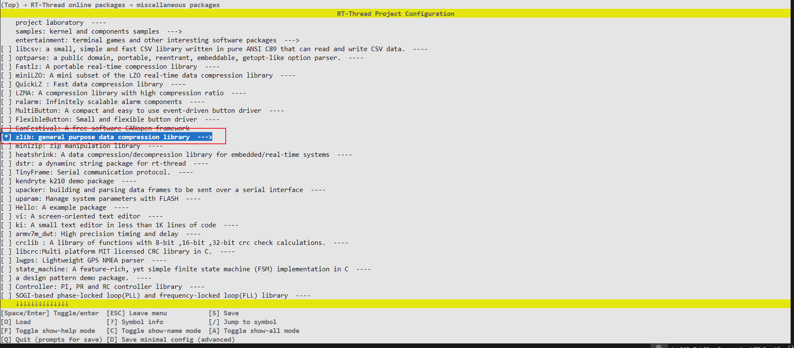
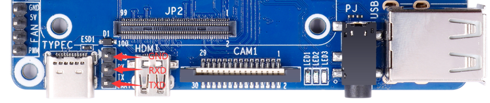
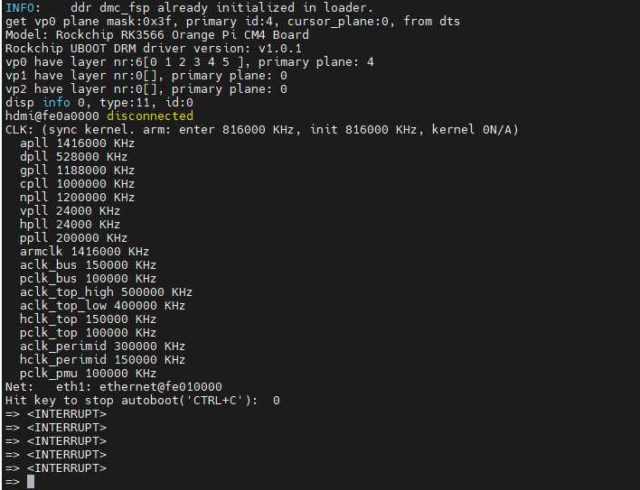

# RK3568 BSP Introduction

[中文页](./README_ZH.md) | English

## 1. Introduction

### Core Architecture

- **CPU**: Quad-core 64-bit ARM Cortex-A55
- **Process Node**: 22nm FinFET
- **Clock Speed**: Up to 1.8GHz (boost)

### Graphics Subsystem

- **GPU**: ARM Mali-G52 MP2
  - Graphics APIs:
    - OpenGL ES 3.2/2.0/1.1
    - Vulkan 1.1
  - Display Outputs:
    - HDMI 2.0b
    - eDP 1.3
    - MIPI-DSI (4 lanes)
- **Video Processing**:
  - Decoding: 4K@60fps (H.265/H.264/VP9)
  - Encoding: 1080P@60fps (H.264/H.265)

### Memory & Storage

- **RAM Support**:
  - Dual-channel LPDDR4/LPDDR4X
  - Max Capacity: 8GB
- **Storage Options**:
  - eMMC 5.1 HS400
  - SD 3.0 UHS-I
  - Optional SATA III (6Gbps)
- **High-Speed Interfaces**:
  - USB 3.0 Type-A/C
  - PCIe 2.1 (x1 lane)

### AI Acceleration

- **NPU**: 0.8 TOPS INT8
  - Framework Support:
    - TensorFlow Lite
    - MXNet
    - PyTorch Mobile

### Connectivity

- **Wired**:
  - Dual Gigabit Ethernet (RGMII)
- **Wireless**:
  - Expansion via:
    - PCIe-based WiFi6
    - USB Bluetooth 5.0

### Multimedia I/O

- **Camera Input**:
  - Dual 4-lane MIPI-CSI
  - Supports up to 13MP sensors

## 2. Compiling

Use the RT-Thread Smart dedicated toolchain to compile:

```plaintext
wget https://github.com/RT-Thread/rt-thread/releases/download/v5.2.0/aarch64-linux-musleabi_for_x86_64-pc-linux-gnu_242520-979be38cba.tar.bz2

sudo tar -xf aarch64-linux-musleabi_for_x86_64-pc-linux-gnu_242520-979be38cba.tar.bz2 -C /opt
```

After downloading, extract the toolchain to the /opt directory.Then configure your environment variables:

```plaintext
export RTT_CC="gcc"
export RTT_EXEC_PATH="/opt/aarch64-linux-musleabi_for_x86_64-pc-linux-gnu/bin/"
export RTT_CC_PREFIX="aarch64-linux-musleabi-"
export PATH="$RTT_EXEC_PATH:$PATH"
```

Navigate to the rt-thread/bsp/rockchip/rk3500 directory and enter:

```shell
scons --menuconfig
```

Select and pull the zlib package in the menu:


Then run the following commands to fetch packages and build the project:

```shell
source  ~/.env/tools/scripts/pkgs --update

scons
```

## 3. Execution

The RK3566 SoC uses different methods to install the kernel depending on the board.It is recommended to install and boot from an SD card.The following steps take the Orange Pi Compute Module 4 as an example:

Connect the serial port of the development board:


1. Open a serial terminal, select the correct serial port, and set the baud rate to 1500000.

2. Copy the generated rtthread.bin file to the SD card.

3. Power up the development board and press Ctrl + C on the keyboard to enter U-Boot command line mode.


4. Enter the following command to load and boot the Smart system:

```shell
fatload mmc 1:1 0x480000 rtthread.bin;booti 0x480000 - 0x8300000
```

```plaintext
reading rtthread.bin
1188080 bytes read in 102 ms (11.1 MiB/s)
Fdt Ramdisk skip relocation
## Flattened Device Tree blob at 0x08300000
   Booting using the fdt blob at 0x08300000
  'reserved-memory' linux,cma: addr=10000000 size=800000
  'reserved-memory' ramoops@110000: addr=110000 size=f0000
   Using Device Tree in place at 0000000008300000, end 000000000832048e
Adding bank: 0x00200000 - 0x08400000 (size: 0x08200000)
Adding bank: 0x09400000 - 0xf0000000 (size: 0xe6c00000)
Adding bank: 0x1f0000000 - 0x200000000 (size: 0x10000000)
== DO RELOCATE == Kernel from 0x00280000 to 0x00480000
Total: 107148.892 ms

Starting kernel ...

[I/rtdm.ofw] Booting RT-Thread on physical CPU 0x0
[I/rtdm.ofw] Machine model: Rockchip RK3566 Orange Pi CM4 Board
[I/rtdm.ofw] Earlycon: uart8250 at MMIO/PIO 0x00000000fe660000 (options '')
[I/rtdm.ofw] Memory node(1) ranges: 0x0000000000200000 - 0x0000000008400000
[I/rtdm.ofw] Memory node(1) ranges: 0x0000000009400000 - 0x00000000f0000000
[I/rtdm.ofw] Memory node(1) ranges: 0x00000001f0000000 - 0x0000000200000000
[I/mm.memblock] System memory:
[I/mm.memblock]            [0x0000000000200000, 0x0000000008400000]
[I/mm.memblock]            [0x0000000009400000, 0x00000000f0000000]
[I/mm.memblock]            [0x00000001f0000000, 0x0000000200000000]
[I/mm.memblock] Reserved memory:
[I/mm.memblock]            [0x0000000000110000, 0x0000000000200000]
[I/mm.memblock]            [0x0000000000480000, 0x00000000006c7000]
[I/mm.memblock]            [0x00000000006c7000, 0x00000000046c7000]
[I/mm.memblock]            [0x00000000046c7000, 0x00000000048c7000]
[I/mm.memblock]            [0x00000000048c7000, 0x00000000048e5000]
[I/mm.memblock]            [0x0000000008300000, 0x000000000831e000]
[I/mm.memblock]            [0x0000000010000000, 0x0000000010800000]
[I/mm.memblock]            [0x00000000edf00000, 0x00000000ee367400]
[I/mm.memblock]            [0x00000000eff00000, 0x00000000eff08000]
[I/mm.memblock] physical memory region [0x0000000000200000-0x0000000000480000] installed to system page
[I/mm.memblock] physical memory region [0x00000000048e5000-0x0000000008300000] installed to system page
[I/mm.memblock] physical memory region [0x000000000831e000-0x0000000008400000] installed to system page
[I/mm.memblock] physical memory region [0x0000000009400000-0x0000000010000000] installed to system page
[I/mm.memblock] physical memory region [0x0000000010800000-0x00000000edf00000] installed to system page
[I/mm.memblock] physical memory region [0x00000000ee368000-0x00000000eff00000] installed to system page
[I/mm.memblock] physical memory region [0x00000000eff08000-0x00000000f0000000] installed to system page
[I/mm.memblock] physical memory region [0x00000001f0000000-0x0000000200000000] installed to system page
[I/mm.memblock] 4191 MB memory installed to system page
[I/osi.psci] Using PSCI v1.1 Function IDs
[I/clk.rk3568] set cpu_freq to 1800000000
[I/rtdm.ofw] Console: uart0 (fiq-debugger)

 \ | /
- RT -     Thread Smart Operating System
 / | \     5.2.1 build Apr 28 2025 09:19:08
 2006 - 2024 Copyright by RT-Thread team
lwIP-2.1.2 initialized!
[I/sal.skt] Socket Abstraction Layer initialize success.
[I/utest] utest is initialize success.
[I/utest] total utest testcase num: (5)
[I/drivers.serial] Using /dev/ttyS0 as default console
Press any key to stop init process startup ... 3
Press any key to stop init process startup ... 2
Press any key to stop init process startup ... 1
Starting init ...
[I/rtdm.mnt] File system initialization done
Hi, this is RT-Thread!!
msh />I/TC: Secondary CPU 1 initializing
I/TC: Secondary CPU 1 switching to normal world boot
[I/cpu.aa64] Call cpu 1 on success
I/TC: Secondary CPU 3 initializing
I/TC: Secondary CPU 3 switching to normal world boot
I/TC: Secondary CPU 2 initializing
I/TC: Secondary CPU 2 switching to normal world boot
[I/cpu.aa64] Call cpu 3 on success
[I/cpu.aa64] Call cpu 2 on success

msh />
msh />

```
