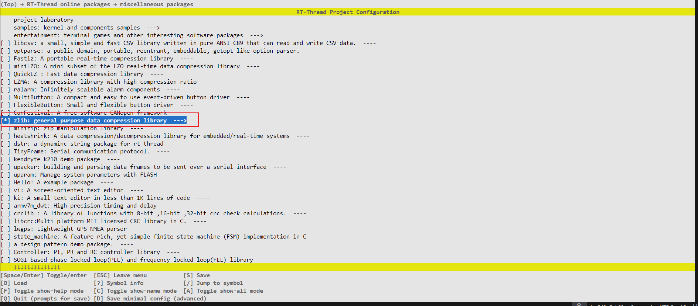
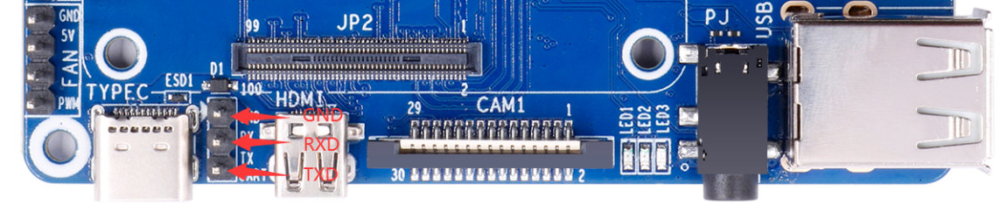
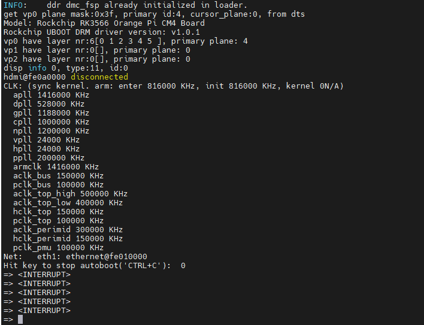

# RK3566 BSP 介绍

中文页 | [English](./README.md)

## 1. 介绍

### 核心架构

- **CPU**: 四核 64 位 Cortex-A55 处理器
- **制程工艺**: 22nm 光刻技术  
- **主频**: 最高 1.8GHz

### 图形处理

- **GPU**: Mali-G52
  - 支持 OpenGL ES 3.2/2.0/1.1
  - 支持 Vulkan 1.1
- **视频编解码**:
  - 4K@60fps 解码 (H.265/H.264/VP9)
  - 1080P@60fps 编码

### 存储与扩展

- **内存支持**:
  - LPDDR4/LPDDR4X
  - 最高 8GB 容量
- **存储接口**:
  - eMMC 5.1
  - SDIO 3.0
  - SATA 3.0 (可选)
- **高速接口**:
  - USB 3.0/2.0
  - PCIe 2.1 (1x lane)

### AI

- **NPU**: 0.8TOPS 算力
- **支持框架**:
  - TensorFlow
  - MXNet  
  - PyTorch

### 网络连接

- **有线网络**:
  - 双千兆以太网 (RGMII)
- **无线扩展**:
  - 支持 WiFi6/蓝牙模块扩展

### 多媒体接口

- **显示输出**:
  - HDMI 2.0
  - eDP 1.3
  - MIPI-DSI
- **摄像头输入**:
  - 双 MIPI-CSI
  - 支持 4K 图像处理

## 2. 编译

使用RT-Thread Smart 专用工具链进行编译:

```plaintext
wget https://github.com/RT-Thread/rt-thread/releases/download/v5.2.0/aarch64-linux-musleabi_for_x86_64-pc-linux-gnu_242520-979be38cba.tar.bz2

sudo tar -xf aarch64-linux-musleabi_for_x86_64-pc-linux-gnu_242520-979be38cba.tar.bz2  -C /opt
```

将工具链下载后,解压至/opt目录。并设置环境变量

```shell
环境变量配置为：
export RTT_CC="gcc"
export RTT_EXEC_PATH="/opt/aarch64-linux-musleabi_for_x86_64-pc-linux-gnu/bin/"
export RTT_CC_PREFIX="aarch64-linux-musleabi-"
export PATH="$RTT_EXEC_PATH:$PATH"
```

进入`rt-thread/bsp/rockchip/rk3500`目录下输入:

```plaintext
scons --menuconfig
```

选择并拉取zlib软件包


执行一下命令拉取软件包并编译

```shell
source  ~/.env/tools/scripts/pkgs --update

scons
```

## 3. 运行

RK3566 根据不同的板卡有不同的内核安装方法，建议安装到 SD 卡中，这里以Orange Pi Compute Module 4举例说明：
连接开发板串口： 


1. 打开串口工具，选择对应串口，设置波特率为1500000

2. 将上述生成好的rtthread.bin放置sd卡中

3. 开发板上电，键盘点击`ctrl + c`进入uboot命令行模式


4. 输入下述指令运行smart系统

```shell
fatload mmc 1:1 0x480000 rtthread.bin;booti 0x480000 - 0x8300000
```

```plaintext
reading rtthread.bin
1188080 bytes read in 102 ms (11.1 MiB/s)
Fdt Ramdisk skip relocation
## Flattened Device Tree blob at 0x08300000
   Booting using the fdt blob at 0x08300000
  'reserved-memory' linux,cma: addr=10000000 size=800000
  'reserved-memory' ramoops@110000: addr=110000 size=f0000
   Using Device Tree in place at 0000000008300000, end 000000000832048e
Adding bank: 0x00200000 - 0x08400000 (size: 0x08200000)
Adding bank: 0x09400000 - 0xf0000000 (size: 0xe6c00000)
Adding bank: 0x1f0000000 - 0x200000000 (size: 0x10000000)
== DO RELOCATE == Kernel from 0x00280000 to 0x00480000
Total: 107148.892 ms

Starting kernel ...

[I/rtdm.ofw] Booting RT-Thread on physical CPU 0x0
[I/rtdm.ofw] Machine model: Rockchip RK3566 Orange Pi CM4 Board
[I/rtdm.ofw] Earlycon: uart8250 at MMIO/PIO 0x00000000fe660000 (options '')
[I/rtdm.ofw] Memory node(1) ranges: 0x0000000000200000 - 0x0000000008400000
[I/rtdm.ofw] Memory node(1) ranges: 0x0000000009400000 - 0x00000000f0000000
[I/rtdm.ofw] Memory node(1) ranges: 0x00000001f0000000 - 0x0000000200000000
[I/mm.memblock] System memory:
[I/mm.memblock]            [0x0000000000200000, 0x0000000008400000]
[I/mm.memblock]            [0x0000000009400000, 0x00000000f0000000]
[I/mm.memblock]            [0x00000001f0000000, 0x0000000200000000]
[I/mm.memblock] Reserved memory:
[I/mm.memblock]            [0x0000000000110000, 0x0000000000200000]
[I/mm.memblock]            [0x0000000000480000, 0x00000000006c7000]
[I/mm.memblock]            [0x00000000006c7000, 0x00000000046c7000]
[I/mm.memblock]            [0x00000000046c7000, 0x00000000048c7000]
[I/mm.memblock]            [0x00000000048c7000, 0x00000000048e5000]
[I/mm.memblock]            [0x0000000008300000, 0x000000000831e000]
[I/mm.memblock]            [0x0000000010000000, 0x0000000010800000]
[I/mm.memblock]            [0x00000000edf00000, 0x00000000ee367400]
[I/mm.memblock]            [0x00000000eff00000, 0x00000000eff08000]
[I/mm.memblock] physical memory region [0x0000000000200000-0x0000000000480000] installed to system page
[I/mm.memblock] physical memory region [0x00000000048e5000-0x0000000008300000] installed to system page
[I/mm.memblock] physical memory region [0x000000000831e000-0x0000000008400000] installed to system page
[I/mm.memblock] physical memory region [0x0000000009400000-0x0000000010000000] installed to system page
[I/mm.memblock] physical memory region [0x0000000010800000-0x00000000edf00000] installed to system page
[I/mm.memblock] physical memory region [0x00000000ee368000-0x00000000eff00000] installed to system page
[I/mm.memblock] physical memory region [0x00000000eff08000-0x00000000f0000000] installed to system page
[I/mm.memblock] physical memory region [0x00000001f0000000-0x0000000200000000] installed to system page
[I/mm.memblock] 4191 MB memory installed to system page
[I/osi.psci] Using PSCI v1.1 Function IDs
[I/clk.rk3568] set cpu_freq to 1800000000
[I/rtdm.ofw] Console: uart0 (fiq-debugger)

 \ | /
- RT -     Thread Smart Operating System
 / | \     5.2.1 build Apr 28 2025 09:19:08
 2006 - 2024 Copyright by RT-Thread team
lwIP-2.1.2 initialized!
[I/sal.skt] Socket Abstraction Layer initialize success.
[I/utest] utest is initialize success.
[I/utest] total utest testcase num: (5)
[I/drivers.serial] Using /dev/ttyS0 as default console
Press any key to stop init process startup ... 3
Press any key to stop init process startup ... 2
Press any key to stop init process startup ... 1
Starting init ...
[I/rtdm.mnt] File system initialization done
Hi, this is RT-Thread!!
msh />I/TC: Secondary CPU 1 initializing
I/TC: Secondary CPU 1 switching to normal world boot
[I/cpu.aa64] Call cpu 1 on success
I/TC: Secondary CPU 3 initializing
I/TC: Secondary CPU 3 switching to normal world boot
I/TC: Secondary CPU 2 initializing
I/TC: Secondary CPU 2 switching to normal world boot
[I/cpu.aa64] Call cpu 3 on success
[I/cpu.aa64] Call cpu 2 on success

msh />
msh />

```
