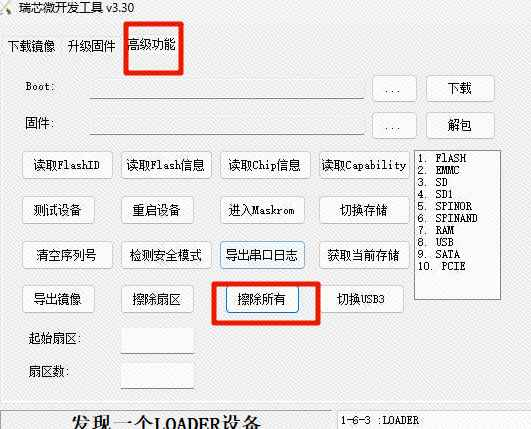
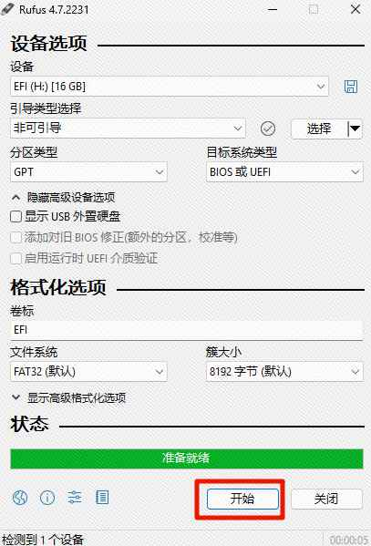

# Taishanpi-RK3566 板级支持包使用说明

中文页 | [English](./Taishanpi-RK3566_ZH.md)

## 0. 说明

此文档使用的Commit: 
- `a1c642aa3a2848b47f2a1b52679dc4ee5156f2f4`

在[原有文档](./README.md)基础上面进行了文档补充和步骤说明，丰富了一下原有内容。

## 1. 介绍

这份支持包使用说明是根据[泰山派1](https://wiki.lckfb.com/zh-hans/tspi-rk3566/)所写的一份使用指南。

[泰山派1中原理图、PCB文件和软件资料全部开源](https://wiki.lckfb.com/zh-hans/tspi-rk3566/open-source-hardware/)

在本指南中会尽可能的详细介绍使用步骤和相关注意事项。

### 1.1. 芯片介绍

`Rockchip RK3566` 是中高端 `AIOT` 芯片:

- 采用`22nm`制程工艺。
- `4`核`Cortex-A55`的`64`位CPU。
- 主频高达`1.8GHz`。
- 集成`ARM Mali-G52 GPU`
- 集成`1Tops`算力的`AI`加速器`NPU`；
- 支持`4K 60FPS`解码。
- 支持`1080P 60FPS`解码。
- 支持`5M ISP`和`HDR`。

### 1.2. 宿主机环境介绍

本次使用的是 `Ubuntu22.04.5 LTS Desktop` 运行在`VMware`中。

系统信息如下：

```bash
$ cat /etc/os-release
PRETTY_NAME="Ubuntu 22.04.5 LTS"
NAME="Ubuntu"
VERSION_ID="22.04"
VERSION="22.04.5 LTS (Jammy Jellyfish)"
VERSION_CODENAME=jammy
ID=ubuntu
ID_LIKE=debian
HOME_URL="https://www.ubuntu.com/"
SUPPORT_URL="https://help.ubuntu.com/"
BUG_REPORT_URL="https://bugs.launchpad.net/ubuntu/"
PRIVACY_POLICY_URL="https://www.ubuntu.com/legal/terms-and-policies/privacy-policy"
UBUNTU_CODENAME=jammy

```

```bash
$ lsb_release -a
No LSB modules are available.
Distributor ID: Ubuntu
Description:    Ubuntu 22.04.2 LTS
Release:        22.04
Codename:       jammy
```

`Python`版本如下：
```bash
$ python --version
Python 3.10.12
```


## 2. 环境搭建

运行下面的命令安装相关的软件包：

1. 必要工具：
```bash
sudo apt update && \
sudo apt install -y python3 python3-pip u-boot-tools device-tree-compiler
```

2. 使用`pip`安装工具：
```bash
pip3 install --user tqdm scons
```


3. 设定`python`版本：
```bash
sudo rm -rf /usr/bin/python && \
sudo ln -s /usr/bin/python3 /usr/bin/python
```


4. 下载 `RT-Thread Smart` 工具链：
```bash
wget https://download.rt-thread.org/download/rt-smart/toolchains/aarch64-linux-musleabi_for_x86_64-pc-linux-gnu_latest.tar.bz2

```

5. 解压：
```bash
sudo tar -xf aarch64-linux-musleabi_for_x86_64-pc-linux-gnu_latest.tar.bz2  -C /opt
```

5. 将工具链下载后，解压至`/opt`目录。并设置环境变量

> 直接复制全部，然后粘贴到命令行回车即可。

```bash
export RTT_CC="gcc"
export RTT_EXEC_PATH="/opt/aarch64-linux-musleabi_for_x86_64-pc-linux-gnu/bin/"
export RTT_CC_PREFIX="aarch64-linux-musleabi-"
export PATH="$RTT_EXEC_PATH:$PATH"
```

## 3. 编译

进入`rt-thread/bsp/rockchip/rk3566`目录下输入下面的命令:

进入 `menuconfig` 后直接 保存退出，生成一个 `.config` 文件：

```bash
scons --menuconfig
```

> 拉取`zlib`软件包，我们编译的时候需要用到。

```bash
source  ~/.env/tools/scripts/pkgs --update
```

开始编译：

> 或者通过 `scons --exec-path="GCC工具链路径"` 命令，在指定工具链位置的同时直接编译。

```bash
scons -j$(nproc)
```

可以看到在当前`rk3566`文件夹中正常生成`rtthread.elf`与`rtthread.bin`文件。

## 3. 运行

### 3.1. 为板子烧录镜像

因为我需要在 `Uboot` 环境中使用命令进行引导 `rtthread` 系统，所以需要烧录相关的文件。

这里我是用的内核是 [泰山派1](https://wiki.lckfb.com/zh-hans/tspi-rk3566/) 的 `Rockchip Linux5.10 SDK`:

- `Github`：https://github.com/TaishanPi

- 教程看 [宿主机构建方式](https://wiki.lckfb.com/zh-hans/tspi-rk3566/sdk-compilation/openkylin-sdk-compilation.html)

编译完成之后会在 `rockdev/` 目录下生成我们所需要的文件

将板子的所有镜像全部擦除：



然后使用`瑞芯微开发工具`烧录下面的`4`个文件：

> > 注意: 因为我们的SDK是重新进行分区的，所以使用[泰山派1](https://wiki.lckfb.com/zh-hans/tspi-rk3566/)需要下面的`4`个文件，其他板子没有测试，可以自行尝试。

- `MiniLoaderAll.bin`
- `parameter.txt`
- `uboot.img`
- `boot.img`

### 3.2. 格式化TF卡

我们需要准备一张 `TF` 卡，用来存放 `rtthread.bin` 文件。

下载 `Rufus`：https://rufus.org.cn/

设定为下列的模式，然后点击`开始`：




### 3.3. 制作boot.scr

> 这里可以直接使用当前目录下的 `boot.scr`，同样也是用下面的方式制作出来的，如果有需求可以根据下面的方法自己制作。

前面我们已经安装过 `u-boot-tools` 所以直接使用即可。

创建 `boot.cmd`，并写入下面的内容：

```bash
fatload mmc 1:1 0x480000 rtthread.bin;
fatload mmc 1:1 0x8300000 tspi-rk3566-user-v10-linux.dtb;
booti 0x480000 - 0x8300000;
```
> 系统启动需要`设备树文件DTB`，这里我们[泰山派1](https://wiki.lckfb.com/zh-hans/tspi-rk3566/)的`dtb`文件是`kernel/arch/arm64/boot/dts/rockchip/tspi-rk3566-user-v10-linux.dtb`，其他的文件有不同的名字，可以根据不同的开发板选择。不然`rtthread`就会无法启动，详情请看文档最后面的 `常见问题与解决办法`


运行生成`boot.scr`

```bash
mkimage -C none -A arm -T script -d boot.cmd boot.scr
```

### 3.4. 复制文件到TF卡

将下面三个文件复制到TF中：

- `boot.scr`
- `tspi-rk3566-user-v10-linux.dtb`
- `rtthread.bin`


### 3.5. 运行

连接[开发板串口->MoBaXterm](https://wiki.lckfb.com/zh-hans/tspi-rk3566/tool-use/debug-tools-use.html)： 

打开串口工具，选择对应串口，设置波特率为 `1500000`

因为有 `boot.scr` 会自动引导启动`rtthread`:

> 注意1：如果卡死在了 `[I/rtdm.ofw] Console: uart0 (fiq-debugger)` 那么看`常见问题与解决办法`。

> 注意2：记得每次`rtthread`启动失败(在`uboot`中引导失败后)，都应该将开发板完全断电然后在上电，清空内存。

> 注意3：如果多次自动引导失败可以手动在`uboot`界面运行 `boot.cmd` 的内容，手动引导，如果还不行，那就要考虑其他的因素了，例如TF质量问题，传输到TF卡中的文件有损坏等等等。

```bash
Hit key to stop autoboot('CTRL+C'):  0
switch to partitions #0, OK
mmc1 is current device
Scanning mmc 1:1...
Found U-Boot script /boot.scr
reading /boot.scr
197 bytes read in 3 ms (63.5 KiB/s)
## Executing script at 00c00000
reading rtthread.bin
1220848 bytes read in 104 ms (11.2 MiB/s)
reading tspi-rk3566-user-v10-linux.dtb
167469 bytes read in 17 ms (9.4 MiB/s)
Fdt Ramdisk skip relocation
No misc partition
## Flattened Device Tree blob at 0x08300000
   Booting using the fdt blob at 0x08300000
   Using Device Tree in place at 0000000008300000, end 000000000832be2c
No resource file: logo_kernel.bmp
** Unable to read file logo_kernel.bmp **
Failed to do_load
VP0 fail to load kernel logo
vp0, plane_mask:0x3f, primary-id:4, curser-id:-1
vp1, plane_mask:0x0, primary-id:0, curser-id:-1
vp2, plane_mask:0x0, primary-id:0, curser-id:-1
## reserved-memory:
  drm-logo@00000000: addr=7df00000 size=ad000
  drm-cubic-lut@00000000: addr=7ff00000 size=8000
  ramoops@110000: addr=110000 size=f0000
Adding bank: 0x00200000 - 0x08400000 (size: 0x08200000)
Adding bank: 0x09400000 - 0x80000000 (size: 0x76c00000)
board seed: Pseudo
Total: 600.154/648.331 ms

Starting kernel ...

[I/rtdm.ofw] Booting RT-Thread on physical CPU 0x0
[I/rtdm.ofw] Machine model: lckfb tspi V10 Board
[I/rtdm.ofw] Earlycon: uart8250 at MMIO/PIO 0x00000000fe660000 (options '')
[I/rtdm.ofw] Memory node(1) ranges: 0x0000000000200000 - 0x0000000008400000
[I/rtdm.ofw] Memory node(1) ranges: 0x0000000009400000 - 0x0000000080000000
[I/mm.memblock] System memory:
[I/mm.memblock]            [0x0000000000200000, 0x0000000008400000]
[I/mm.memblock]            [0x0000000009400000, 0x0000000080000000]
[I/mm.memblock] Reserved memory:
[I/mm.memblock]            [0x0000000000110000, 0x0000000000200000]
[I/mm.memblock]            [0x0000000000480000, 0x00000000006d0000]
[I/mm.memblock]            [0x00000000006d0000, 0x00000000046d0000]
[I/mm.memblock]            [0x00000000046d0000, 0x00000000048d0000]
[I/mm.memblock]            [0x00000000048d0000, 0x00000000048fa000]
[I/mm.memblock]            [0x0000000008300000, 0x000000000832a000]
[I/mm.memblock]            [0x000000007df00000, 0x000000007dfad000]
[I/mm.memblock]            [0x000000007ff00000, 0x000000007ff08000]
[I/mm.memblock] physical memory region [0x0000000000200000-0x0000000000480000] installed to system page
[I/mm.memblock] physical memory region [0x00000000048fa000-0x0000000008300000] installed to system page
[I/mm.memblock] physical memory region [0x000000000832a000-0x0000000008400000] installed to system page
[I/mm.memblock] physical memory region [0x0000000009400000-0x000000007df00000] installed to system page
[I/mm.memblock] physical memory region [0x000000007dfad000-0x000000007ff00000] installed to system page
[I/mm.memblock] physical memory region [0x000000007ff08000-0x0000000080000000] installed to system page
[I/mm.memblock] 2055 MB memory installed to system page
[I/osi.psci] Using PSCI v1.1 Function IDs
[I/clk.rk3568] set cpu_freq to 1800000000
[I/rtdm.ofw] Console: uart0 (fiq-debugger)

 \ | /
- RT -     Thread Smart Operating System
 / | \     5.2.1 build Jul 30 2025 08:58:40
 2006 - 2024 Copyright by RT-Thread team
lwIP-2.1.2 initialized!
[I/sal.skt] Socket Abstraction Layer initialize success.
[I/utest] utest is initialize success.
[I/utest] total utest testcase num: (5)
[I/drivers.serial] Using /dev/ttyS0 as default console
Press any key to stop init process startup ... 3
Press any key to stop init process startup ... 2
Press any key to stop init process startup ... 1
Starting init ...
[E/DFS.fs] mount point (/proc) already mounted!
[I/rtdm.mnt] File system initialization done
Hi, this is RT-Thread!!
msh />I/TC: Secondary CPU 1 initializing
I/TC: Secondary CPU 1 switching to normal world boot
o/[C3:2 mS[eIc/ocnpdua.raya 6C4P]U  2 inCiatlila lcipzui n1g
 n success
I/TC: Secondary CPU 2 switching to normal world boot
I/TC: Secondary CPU 3 initializing
I/TC: Secondary CPU 3 switching to normal world boot
[I/cpu.aa64] Call cpu 2 on success
[I/cpu.aa64] Call cpu 3 on success

msh />
msh />
```

## 常见问题与解决办法

### Could not find a valid device tree

我们没有加载 `.dtb` 设备树文件直接启动就会出现这样的情况：

```bash
Hit key to stop autoboot('CTRL+C'):  0
=> <INTERRUPT>
=> <INTERRUPT>
=> <INTERRUPT>
=> <INTERRUPT>
=> <INTERRUPT>
=> fatload mmc 1:1 0x480000 rtthread.bin
reading rtthread.bin
1220848 bytes read in 104 ms (11.2 MiB/s)
=> booti 0x480000 - 0x8300000
Fdt Ramdisk skip relocation
No misc partition
ERROR: Did not find a cmdline Flattened Device Tree
Could not find a valid device tree
=>
```

> 注意：记得每次`rtthread`启动失败(在`uboot`中引导失败后)，都应该将开发板完全断电然后在上电，清空内存。

然后将 `kernel/arch/arm64/boot/dts/rockchip/` 文件夹中编译之后的`.dtb`文件转移到TF卡中，然后使用 `fatload`从TF卡中加载到`0x8300000`地址然后再次跳转即可。


### 卡在 `[I/rtdm.ofw] Console: uart0 (fiq-debugger)` 无法启动

大概率和你的设备树有关系，在设备树中有一个参数很重要，需要被读取：

> 这里我贴出我的参数，我的`Debug`串口硬件是`uart2m0`

> 这个`chosen` 是重要的，如果不清楚，可以参照我这么写。

```ini
	chosen: chosen {
		bootargs = "earlycon=uart8250,mmio32,0xfe660000 console=ttyFIQ0";
	};

	fiq-debugger {
		compatible = "rockchip,fiq-debugger";
		rockchip,serial-id = <2>;
		rockchip,wake-irq = <0>;
		/* If enable uart uses irq instead of fiq */
		rockchip,irq-mode-enable = <1>;
		rockchip,baudrate = <1500000>;  /* Only 115200 and 1500000 */
		interrupts = <GIC_SPI 252 IRQ_TYPE_LEVEL_LOW>;
		pinctrl-names = "default";
		pinctrl-0 = <&uart2m0_xfer>;
		status = "okay";
	};
```