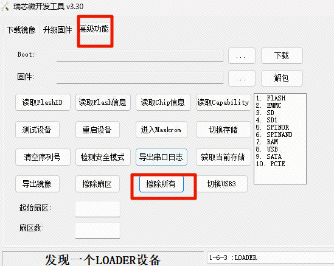
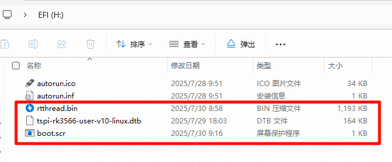

# RK3566 Board Support Package (BSP) Usage Guide

[中文页](./README_ZH.md) | English

## Code Source Statement

- The `rk3566` code originates from `bsp/rockchip/rk3500`

`Commit: a1c642aa3a2848b47f2a1b52679dc4ee5156f2f4`

Based on the[original documentation](https://github.com/RT-Thread/rt-thread/tree/master/bsp/rockchip/rk3500), this guide supplements and elaborates on the content with additional documentation and detailed step-by-step instructions.

## 1. Introduction

This support package usage guide is written based on the[ TaishanPi 1 ](https://wiki.lckfb.com/zh-hans/tspi-rk3566/)development board.

[All schematic diagrams, PCB files, and software resources for TaishanPi 1 are open-source](https://wiki.lckfb.com/zh-hans/tspi-rk3566/open-source-hardware/)

This guide provides detailed instructions and relevant precautions.

### 1.1. Chip Introduction

`Rockchip RK3566` is a mid-to-high-end `AIOT` chip:

- Manufactured using `22nm` process technology
- Quad-core `Cortex-A55` 64-bit CPU
- Clock speed up to `1.8GHz`
- Integrated `ARM Mali-G52 GPU`
- Integrated `1Tops` AI accelerator `NPU`
- Supports `4K 60FPS` decoding
- Supports `1080P 60FPS` encoding
- Supports `5M ISP` and `HDR`

### 1.2. Host Machine Environment

This guide uses `Ubuntu22.04.5 LTS Desktop` running on`VMware`.

System information:

```bash
$ cat /etc/os-release
PRETTY_NAME="Ubuntu 22.04.5 LTS"
NAME="Ubuntu"
VERSION_ID="22.04"
VERSION="22.04.5 LTS (Jammy Jellyfish)"
VERSION_CODENAME=jammy
ID=ubuntu
ID_LIKE=debian
HOME_URL="https://www.ubuntu.com/"
SUPPORT_URL="https://help.ubuntu.com/"
BUG_REPORT_URL="https://bugs.launchpad.net/ubuntu/"
PRIVACY_POLICY_URL="https://www.ubuntu.com/legal/terms-and-policies/privacy-policy"
UBUNTU_CODENAME=jammy

```

```bash
$ lsb_release -a
No LSB modules are available.
Distributor ID: Ubuntu
Description:    Ubuntu 22.04.2 LTS
Release:        22.04
Codename:       jammy
```

`Python`version:
```bash
$ python --version
Python 3.10.12
```


## 2. Environment Setup

Run the following commands to install required packages:

1. Essential tools:
```bash
sudo apt update && \
sudo apt install -y python3 python3-pip u-boot-tools device-tree-compiler
```

2. Install tools using `pip`:
```bash
pip3 install --user tqdm
```


3. Set `Python version`:
```bash
sudo rm -rf /usr/bin/python && \
sudo ln -s /usr/bin/python3 /usr/bin/python
```


4. Download `RT-Thread Smart` toolchain:
```bash
wget https://download.rt-thread.org/download/rt-smart/toolchains/aarch64-linux-musleabi_for_x86_64-pc-linux-gnu_latest.tar.bz2

```

5. Extract the toolchain:
```bash
sudo tar -xf aarch64-linux-musleabi_for_x86_64-pc-linux-gnu_latest.tar.bz2  -C /opt
```

6. Set environment variables after extraction:

```bash
export RTT_CC="gcc"
export RTT_EXEC_PATH="/opt/aarch64-linux-musleabi_for_x86_64-pc-linux-gnu/bin/"
export RTT_CC_PREFIX="aarch64-linux-musleabi-"
export PATH="$RTT_EXEC_PATH:$PATH"
```

## 3. 编译

Navigate to the `rt-thread/bsp/rockchip/rk3566` directory and run:

> This command pulls the `zlib` package required for compilation.

```bash
source  ~/.env/tools/scripts/pkgs --update
```

Start compilation:

> Alternatively, use `scons --exec-path="GCC toolchain path"` to specify the toolchain location directly.

```bash
scons -j$(nproc)
```

The `rtthread.elf` and `rtthread.bin` files will be generated in the current `rk3566` directory.

## 3. Running

### 3.1. Flashing the Board

To boot the `rtthread` system using U-Boot commands, flash the following files using the Rockchip development tool.

This guide uses the [ TaishanPi 1 ](https://wiki.lckfb.com/zh-hans/tspi-rk3566/) `Rockchip Linux5.10 SDK`:

- `Github`：https://github.com/TaishanPi

- Tutorial [Host Machine Build Method](https://wiki.lckfb.com/zh-hans/tspi-rk3566/sdk-compilation/openkylin-sdk-compilation.html)

After compilation, required files will be in the `rockdev/` directory.

Erase all existing firmware from the board:



Flash these 4 files using the Rockchip Development Tool:

> > Note: The TaishanPi 1 SDK uses a custom partition layout. Other boards may require different files.

- `MiniLoaderAll.bin`
- `parameter.txt`
- `uboot.img`
- `boot.img`

### 3.2. Formatting the TF Card

Prepare a TF card to store files.

Download `Rufus`：https://rufus.org.cn/

Configure with these settings and click "Start":


### 3.3. Creating boot.scr

> You can use the existing `boot.scr` in this directory, or create your own using the method below.

Create `boot.cmd` with the following content:

```bash
fatload mmc 1:1 0x480000 rtthread.bin;
fatload mmc 1:1 0x8300000 tspi-rk3566-user-v10-linux.dtb;
booti 0x480000 - 0x8300000;
```
> The Device Tree Blob (DTB) file is required for system startup. For TaishanPi 1, the DTB file is located at `kernel/arch/arm64/boot/dts/rockchip/tspi-rk3566-user-v10-linux.dtb`. Other boards may use different DTB files. Without the correct DTB, rtthread will fail to boot (see "Common Issues and Solutions").


Generate `boot.scr`

```bash
mkimage -C none -A arm -T script -d boot.cmd boot.scr
```

### 3.4. Copying Files to TF Card

Copy these three files to the TF card:

- `boot.scr`
- `tspi-rk3566-user-v10-linux.dtb`
- `rtthread.bin`



### 3.5. Running

Connect to the board's serial port using a tool like [MoBaXterm](https://wiki.lckfb.com/zh-hans/tspi-rk3566/tool-use/debug-tools-use.html)： 

- Select the correct serial port
- Set baud rate to `1500000`

With `boot.scr` present, the system will boot automatically:

> Note 1: If stuck at `[I/rtdm.ofw] Console: uart0 (fiq-debugger)`, see "Common Issues and Solutions".

> Note 2: After failed boot attempts, completely power cycle the board to clear memory.

> Note 3: If automatic boot fails, manually execute the `boot.cmd` content in U-Boot.

```bash
Hit key to stop autoboot('CTRL+C'):  0
switch to partitions #0, OK
mmc1 is current device
Scanning mmc 1:1...
Found U-Boot script /boot.scr
reading /boot.scr
197 bytes read in 3 ms (63.5 KiB/s)
## Executing script at 00c00000
reading rtthread.bin
1220848 bytes read in 104 ms (11.2 MiB/s)
reading tspi-rk3566-user-v10-linux.dtb
167469 bytes read in 17 ms (9.4 MiB/s)
Fdt Ramdisk skip relocation
No misc partition
## Flattened Device Tree blob at 0x08300000
   Booting using the fdt blob at 0x08300000
   Using Device Tree in place at 0000000008300000, end 000000000832be2c
No resource file: logo_kernel.bmp
** Unable to read file logo_kernel.bmp **
Failed to do_load
VP0 fail to load kernel logo
vp0, plane_mask:0x3f, primary-id:4, curser-id:-1
vp1, plane_mask:0x0, primary-id:0, curser-id:-1
vp2, plane_mask:0x0, primary-id:0, curser-id:-1
## reserved-memory:
  drm-logo@00000000: addr=7df00000 size=ad000
  drm-cubic-lut@00000000: addr=7ff00000 size=8000
  ramoops@110000: addr=110000 size=f0000
Adding bank: 0x00200000 - 0x08400000 (size: 0x08200000)
Adding bank: 0x09400000 - 0x80000000 (size: 0x76c00000)
board seed: Pseudo
Total: 600.154/648.331 ms

Starting kernel ...

[I/rtdm.ofw] Booting RT-Thread on physical CPU 0x0
[I/rtdm.ofw] Machine model: lckfb tspi V10 Board
[I/rtdm.ofw] Earlycon: uart8250 at MMIO/PIO 0x00000000fe660000 (options '')
[I/rtdm.ofw] Memory node(1) ranges: 0x0000000000200000 - 0x0000000008400000
[I/rtdm.ofw] Memory node(1) ranges: 0x0000000009400000 - 0x0000000080000000
[I/mm.memblock] System memory:
[I/mm.memblock]            [0x0000000000200000, 0x0000000008400000]
[I/mm.memblock]            [0x0000000009400000, 0x0000000080000000]
[I/mm.memblock] Reserved memory:
[I/mm.memblock]            [0x0000000000110000, 0x0000000000200000]
[I/mm.memblock]            [0x0000000000480000, 0x00000000006d0000]
[I/mm.memblock]            [0x00000000006d0000, 0x00000000046d0000]
[I/mm.memblock]            [0x00000000046d0000, 0x00000000048d0000]
[I/mm.memblock]            [0x00000000048d0000, 0x00000000048fa000]
[I/mm.memblock]            [0x0000000008300000, 0x000000000832a000]
[I/mm.memblock]            [0x000000007df00000, 0x000000007dfad000]
[I/mm.memblock]            [0x000000007ff00000, 0x000000007ff08000]
[I/mm.memblock] physical memory region [0x0000000000200000-0x0000000000480000] installed to system page
[I/mm.memblock] physical memory region [0x00000000048fa000-0x0000000008300000] installed to system page
[I/mm.memblock] physical memory region [0x000000000832a000-0x0000000008400000] installed to system page
[I/mm.memblock] physical memory region [0x0000000009400000-0x000000007df00000] installed to system page
[I/mm.memblock] physical memory region [0x000000007dfad000-0x000000007ff00000] installed to system page
[I/mm.memblock] physical memory region [0x000000007ff08000-0x0000000080000000] installed to system page
[I/mm.memblock] 2055 MB memory installed to system page
[I/osi.psci] Using PSCI v1.1 Function IDs
[I/clk.rk3568] set cpu_freq to 1800000000
[I/rtdm.ofw] Console: uart0 (fiq-debugger)

 \ | /
- RT -     Thread Smart Operating System
 / | \     5.2.1 build Jul 30 2025 08:58:40
 2006 - 2024 Copyright by RT-Thread team
lwIP-2.1.2 initialized!
[I/sal.skt] Socket Abstraction Layer initialize success.
[I/utest] utest is initialize success.
[I/utest] total utest testcase num: (5)
[I/drivers.serial] Using /dev/ttyS0 as default console
Press any key to stop init process startup ... 3
Press any key to stop init process startup ... 2
Press any key to stop init process startup ... 1
Starting init ...
[E/DFS.fs] mount point (/proc) already mounted!
[I/rtdm.mnt] File system initialization done
Hi, this is RT-Thread!!
msh />I/TC: Secondary CPU 1 initializing
I/TC: Secondary CPU 1 switching to normal world boot
o/[C3:2 mS[eIc/ocnpdua.raya 6C4P]U  2 inCiatlila lcipzui n1g
 n success
I/TC: Secondary CPU 2 switching to normal world boot
I/TC: Secondary CPU 3 initializing
I/TC: Secondary CPU 3 switching to normal world boot
[I/cpu.aa64] Call cpu 2 on success
[I/cpu.aa64] Call cpu 3 on success

msh />
msh />
```

## Common Issues and Solutions

### Could not find a valid device tree

This error occurs when booting without loading the `.dtb` device tree file:

```bash
Hit key to stop autoboot('CTRL+C'):  0
=> <INTERRUPT>
=> <INTERRUPT>
=> <INTERRUPT>
=> <INTERRUPT>
=> <INTERRUPT>
=> fatload mmc 1:1 0x480000 rtthread.bin
reading rtthread.bin
1220848 bytes read in 104 ms (11.2 MiB/s)
=> booti 0x480000 - 0x8300000
Fdt Ramdisk skip relocation
No misc partition
ERROR: Did not find a cmdline Flattened Device Tree
Could not find a valid device tree
=>
```

Solution:

1. Power cycle the board completely after failed boot attempts
2. Copy the compiled `.dtb` file from `kernel/arch/arm64/boot/dts/rockchip/` to the TF card
3. Load the `DTB` to address `0x8300000` using `fatload`
4. Execute the boot command again


### System Stuck at `[I/rtdm.ofw] Console: uart0 (fiq-debugger)`

This is typically caused by incorrect device tree configuration. The `chosen` node parameters are critical.

Example configuration for TaishanPi 1 (Debug UART: `uart2m0`):

```ini
  chosen: chosen {
    bootargs = "earlycon=uart8250,mmio32,0xfe660000 console=ttyFIQ0";
  };

  fiq-debugger {
    compatible = "rockchip,fiq-debugger";
    rockchip,serial-id = <2>;
    rockchip,wake-irq = <0>;
    /* If enable uart uses irq instead of fiq */
    rockchip,irq-mode-enable = <1>;
    rockchip,baudrate = <1500000>;  /* Only 115200 and 1500000 */
    interrupts = <GIC_SPI 252 IRQ_TYPE_LEVEL_LOW>;
    pinctrl-names = "default";
    pinctrl-0 = <&uart2m0_xfer>;
    status = "okay";
  };
```