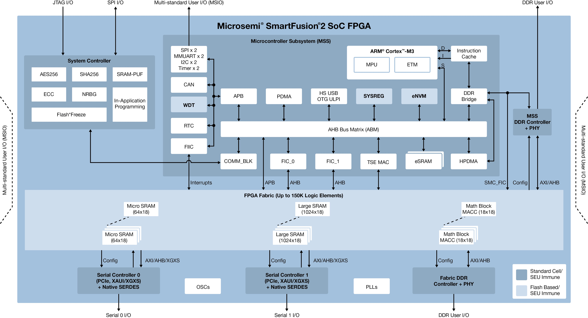
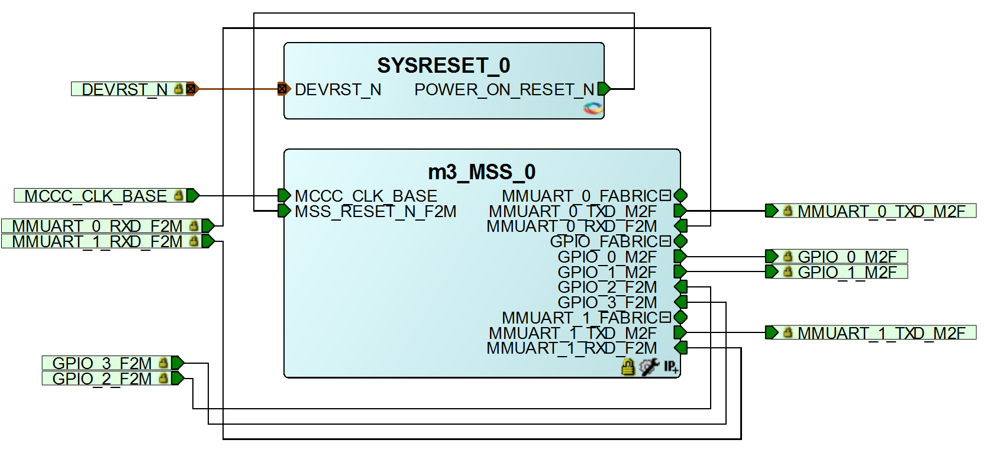
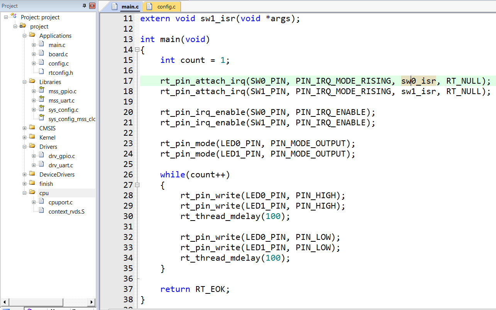
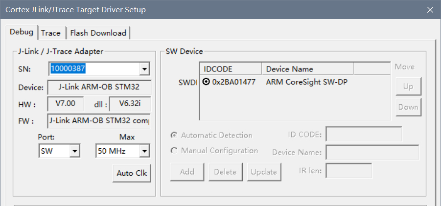
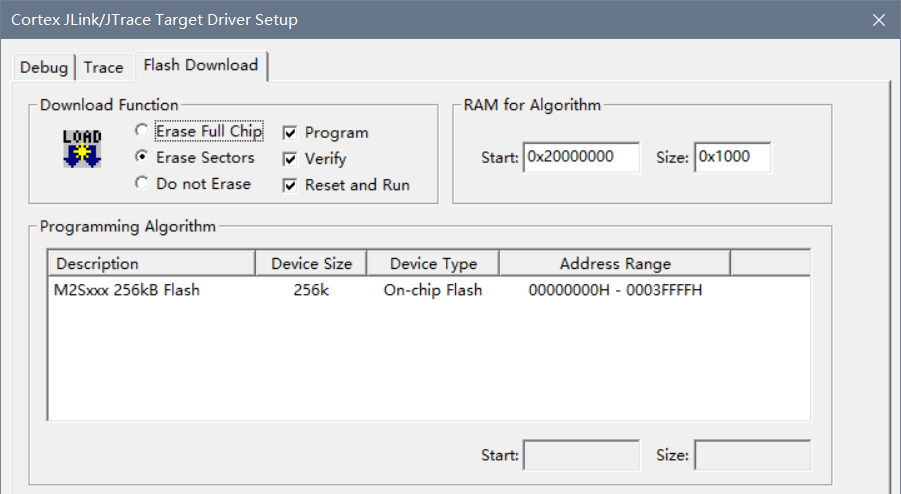
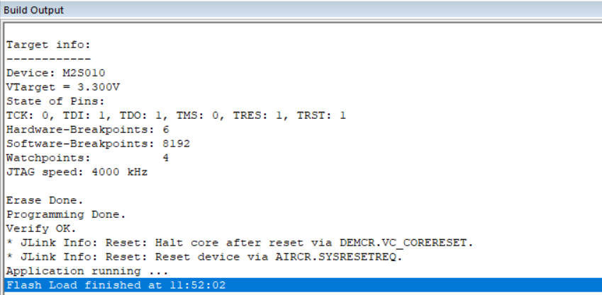
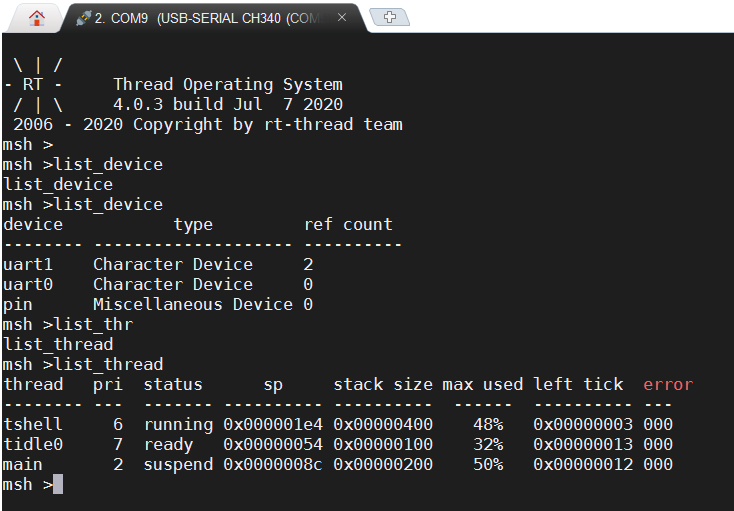

## 移植RT-Thread到Microsemi SmartFusion2系列FPGA芯片

### 1. BSP简介

移植 RT-Thread 操作系统到一款 **FPGA 芯片——M2S010** ，该芯片属于 [Microsemi](https://www.microsemi.com/)（现Microchip）SmartFusion2系列，是一款**智能混合型FPGA**，片上除了 FPGA Fabric 逻辑部分，还包括一个 **ARM® Cortex™-M3 内核的 MCU**，主频最高 166MHz ，256KB eNVM，64KB eSRAM，集成GPIO、UART、I2C、SPI、CAN、USB等基本外设。

> 关于 Microsemi，第三大 FPGA 厂商，原 Actel 半导体，2010 年，Microsemi 收购 Actel，2018 年， Microchip 收购 Microsemi。

SmartFusion2 内部框图



### 2. 外设支持

移植了 RT-Thread 内核，支持线程调度、线程间同步和通信等，目前已经完成了PIN、Serial设备驱动，FinSH组件默认使用uart0设备。

| **片上外设**      | **支持情况** |
| :----------------- | :----------: |
| GPIO              |     支持     |
| UART              |     支持     |
| SPI               |   暂不支持    |
| I2C               |   暂不支持    |
| RTC               |   暂不支持   |
| USB        |   暂不支持   |

### 3. scons构建系统

通过加入`rtconfig.py`，`SConstruct`，`SConscript`文件，可支持scons构建系统，可以输入`scons`调用env工具中包含的arm-gcc编译器构建工程，支持以下scons命令：

- `scons`：使用arm-gcc编译BSP
- `scons -c`：清除执行 scons 时生成的临时文件和目标文件。
- `scons --target=mdk4`：重新生成Keil MDK4环境下的工程。
- `scons --target=mdk5`：重新生成Keil MDK5环境下的工程。
- `scons --dist`：打包BSP工程，包括RT-Thread源码及BSP相关工程文件。

添加Kconfig文件，用于生成rtconfig.h。

### 4. 使用说明

#### 4.1 FPGA 工程设计 

FPGA 部分使用 SmartDesign 图形化设计，不需要写 HDL 代码，时钟来自外部 50M 晶体输入，PLL 倍频 100M 提供给 MCU 使用，顶层配置如下图所示：



MSS 部分仅使用到了GPIO 和UART，GPIO_0配置成输出输出模式用于驱动LED。

配置完成的 FPGA 工程文件下载：[sf2_fpga_prj.rar](https://wcc-blog.oss-cn-beijing.aliyuncs.com/Libero/RT-Thread/sf2_fpga_prj.rar)

#### 4.2 ARM 程序设计

ARM 程序使用 Keil MDK 5.26 开发，需要安装 M2S 系列芯片支持包：[Microsemi.M2Sxxx.1.0.64.pack](http://www.actel-ip.com/repositories/CMSIS-Pack/Microsemi.M2Sxxx.1.0.64.pack)

如果官网下载失败，可以到以下地址下载：[Microsemi.M2Sxxx.1.0.64.pack](https://wcc-blog.oss-cn-beijing.aliyuncs.com/Libero/RT-Thread/Microsemi.M2Sxxx.1.0.64.pack)

在官方生成的示例工程目录下，添加 RT-Thread 相关组件，并实现一些对接函数，最终的文件结构：



### 5. 下载和运行

为了能使用 ARM 调试器连接到 ARM 内核，而不是 FPGA，需要把 JTAG_SEL 引脚置为低电平。使用 ARM 调试器，如 JLink，对应连接 JTAG 口的 TMS、TCK、GND 引脚，如果连接正常，可以检测到 ARM 芯片，如下图所示：



配置对应的 Flash 编程算法：



下载完成：



如果编译 & 烧写无误，下载完成或者按下复位按键之后，会在串口上看到 RT-Thread 的启动 LOG 信息：

```c
 \ | /
- RT -     Thread Operating System
 / | \     4.0.3 build Jun  2 2020
 2006 - 2020 Copyright by rt-thread team
msh >
```



### 6. 注意事项

- FPGA 开发环境基于 Libero V11.8.2.4，向上兼容，不支持低版本 IDE。
- ARM 开发环境基于 Keil MDK 5.26，如果使用SoftConsole IDE ，需要修改 `libcpu` 内的文件。
- 调试内部 ARM 核，需要把 JTAG_SEL 拉低，否则调试器连接不上。 
- 使用 SoftConsole 开发环境可以直接使用官方的 Flash Pro 调试器进行 ARM 程序的调试。
- 内核时钟需要和 FPGA 中 MSS 配置的对应，Libero 自动生成的时钟文件，可以直接替换`bsp\smartfusion2\libraries\sys_config`文件夹下的文件 。

### 7. 参考资料

- [学习路线 - RT-Thread 文档中心](https://www.rt-thread.org/document/site/)
- [Microsemi Libero系列中文教程](https://blog.csdn.net/whik1194/article/details/102901710)

### 8. 联系我

- Github：[whik](https://github.com/whik)
- E-Mail：wangchao149@foxmail.com
