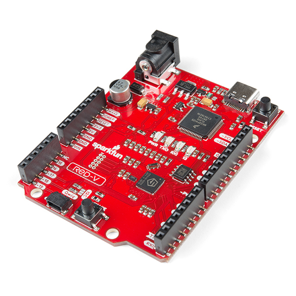
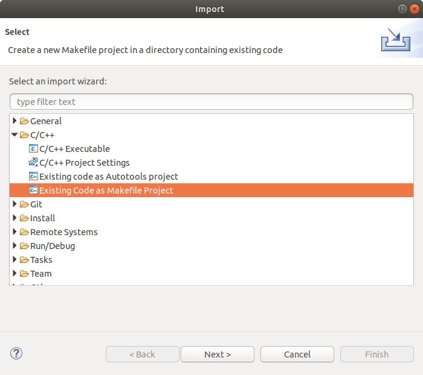
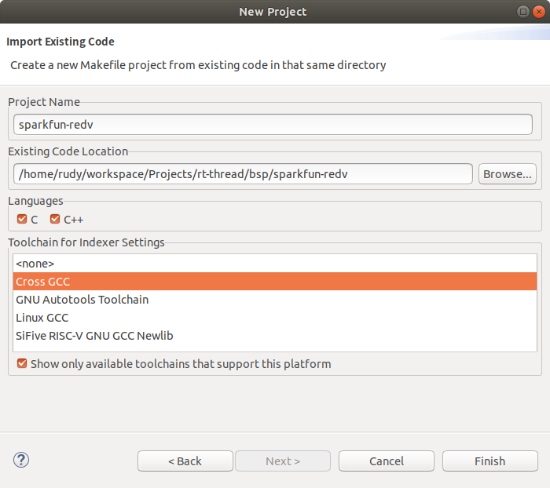
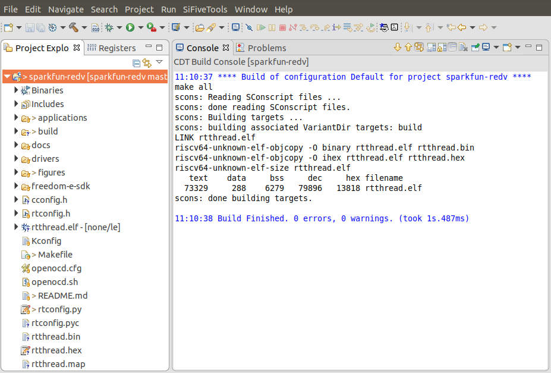
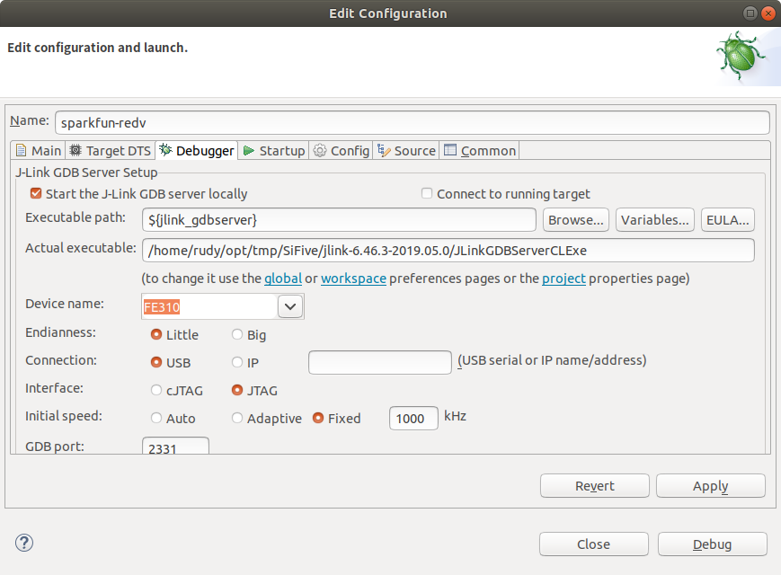
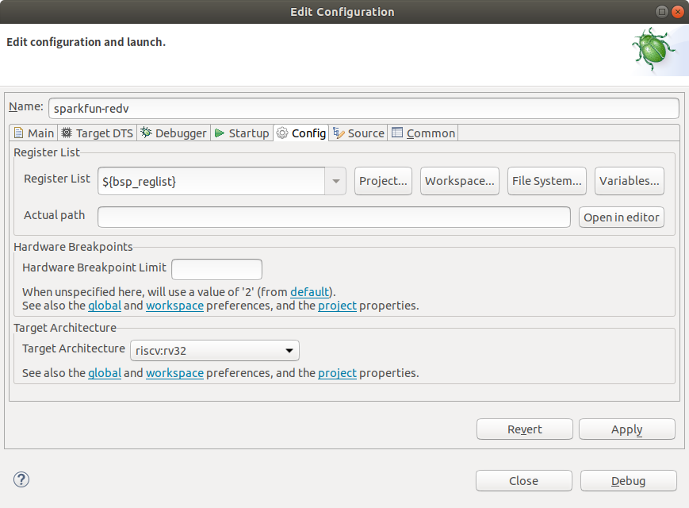
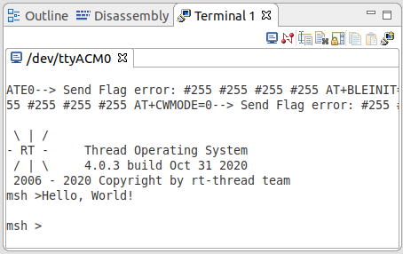

# SparkFun RED-V #

## 1 简介

[SparkFun RED-V](https://www.sparkfun.com/products/15594) 是一款基于  RISC-V 架构的低成本开源开发板，核心 SoC Freedom E310-002 (FE310) 是 SiFive 的 Freedom Everywhere 可定制 SoCs 系列 FE310 的一个升级版本（兼容 HiFive1-rev-b）。最大主频提高了一倍多达到 320MHz，具有 SiFive 的高性能32位 RV32IMAC 核心，性能测试表现很突出，达到了 1.61 DMIPs/MHz，甚至超过了 Arm Cortex-M4 内核。适用于微控制器、嵌入式、物联网和可穿戴应用等领域。



### 1.1 板载资源

| 硬件 | 描述 |
| -- | -- |
|Soc| SiFive Freedom E310 (FE310-G002) |
| 内核    | SiFive E31 RISC-V Core                                      |
| 架构       |  32-bit RV32IMAC                                         |
| 主频       | 320+ MHz                                              |
| 性能 | 1.61 DMIPs/MHz, 2.73 Coremark/MHz            |
|SRAM| 16KB |
|Flash| 32 Mbit Off-Chip (ISSI SPI Flash) |

### 1.2 特性

- 16KB L1 指令缓存
- 16KB 数据 SRAM 暂存器
- 硬件乘/除
- 调试模块
- OTP 非易失性存储器
- 片上振荡器和 PLL 产生灵活的时钟
- 外围设备，包括 UART，QSPI，PWM 和定时器
- 多个电源域+低功耗待机模式


## 2 编译说明

### 2.2 下载 Freedom Studio

[Freedom Studio](https://www.sifive.com/software) 是 SiFive 公司推出的一个集成开发环境，用来编写和调试基于 SiFive 处理器的软件。内嵌了编译好的 RISC-V GCC 工具链、OpenOCD、以及一些示例和文档。

特别地，这里以 v2019.08.1 版本进行演示：

- [FreedomStudio-2019-08-1-lin64](https://static.dev.sifive.com/dev-tools/FreedomStudio/2019.08/FreedomStudio-2019-08-1-lin64.tar.gz)
- [FreedomStudio-2019-08-1-win64](https://static.dev.sifive.com/dev-tools/FreedomStudio/2019.08/FreedomStudio-2019-08-1-win64.zip)
- [FreedomStudio-2019-08-1-mac64](https://static.dev.sifive.com/dev-tools/FreedomStudio/2019.08/FreedomStudio-2019-08-1-mac64.tar.gz)

将 Freedom Studio 解压到非中文字符且不含空格的目录下，如果是 Windows 系统，还需要打开 `FreedomStudio-2019-08-1-win64\SiFive\Drivers` 文件夹，安装驱动文件。

- HiFive1_Driver.exe
- sifive-winusb-utility.exe

### 2.3 配置工具链

工具链的默认位置为 `SiFive/riscv64-unknown-elf-gcc-8.3.0-2019.08.0/bin/` 目录。运行 Env 工具，根据实际情况，输入以下命令设置环境变量：

```shell
set RTT_EXEC_PATH=工具链的路径
set path=%path%;工具链的路径
```

例如：

```shell
set RTT_EXEC_PATH=C:\FreedomStudio-2019-08-1-win64\SiFive\riscv64-unknown-elf-gcc-8.3.0-2019.08.0\bin
set path=%path%;C:\FreedomStudio-2019-08-1-win64\SiFive\riscv64-unknown-elf-gcc-8.3.0-2019.08.0\bin
```

或者通过 `scons --exec-path="GCC工具链路径"` 命令，在指定工具链位置的同时直接编译。

### 2.4 从 Env 工具打开 IDE

在 Env 中使用 cd 命令切换到 FreedomStudio 解压后的目录中，再执行 `FreedomStudio.exe` 文件启动 IDE。例如：

```
cd C:\FreedomStudio-2019-08-1-win64
FreedomStudio.exe
```

### 2.5 导入工程

点击菜单栏左上角 `File -> Import...`，展开 `C/C++` ，选择 `Existing Code as Makefile Project` ，点击 Next 继续。



在编辑框中填入 bsp 文件所在目录，选择 `Cross GCC` ，点击 Finish 导入。



### 2.6 编译

选中要编译的工程，点击左上角的锤子图标开始编译。



当窗口输出 `Build Finished` ，左侧文件列表出现 `rtthread.elf` 文件时，即为编译成功。


## 3 烧写及执行

### 3.1 配置 Debug 参数

使用 type-c usb 数据线连接电脑与开发板。右键列表中的 `rtthread.elf` 文件，选择 `Debug As->1 As JLink launch`。

点击 Debugger 选项卡，选择设备名称 `FE310` 



点击 Config 选项卡，在 'Target Architecture' 处选择 'riscv:cv32' ，点击 Debug 开始调试。



### 3.2 运行结果

下载程序之后，连接串口（115200-N-8-1），可以看到 RT-Thread 的输出信息：



可以看到板载的蓝色 LED 灯以 1Hz 频率闪烁，按下 Tab 键可以查看 RT-Thread 内置的命令。

```
msh >
RT-Thread shell commands:
give_me_five     - Show the SiFive logo
memcheck         - check memory data
memtrace         - dump memory trace information
clear            - clear the terminal screen
version          - show RT-Thread version information
list_thread      - list thread
list_sem         - list semaphore in system
list_event       - list event in system
list_mutex       - list mutex in system
list_mailbox     - list mail box in system
list_msgqueue    - list message queue in system
list_mempool     - list memory pool in system
list_timer       - list timer in system
list_device      - list device in system
help             - RT-Thread shell help.
ps               - List threads in the system.
free             - Show the memory usage in the system.
```


## 4 驱动支持情况及计划

| 驱动 | 支持情况  |  备注  |
| ------ | ----  | :------:  |
| UART | 支持 | UART0_RX/TX：GPIO 16/17 |


## 5 联系人信息

维护人：
- [luhuadong](https://github.com/luhuadong)


## 6 参考

* [RED-V Schematic](https://cdn.sparkfun.com/assets/d/d/1/e/7/RedFive.pdf)
* [RED-V Development Guide](https://learn.sparkfun.com/tutorials/red-v-development-guide)
* [Getting Started with the SparkFun Red-V](https://www.digikey.dk/da/maker/projects/getting-started-with-the-sparkfun-red-v/a28c5ce7d21a452db4aa3f4b94f345f4)
* [Freedom E310-G002 Datasheet](https://cdn.sparkfun.com/assets/5/b/e/6/2/fe310-g002-ds.pdf)
* [Freedom E310-G002 Manual](https://cdn.sparkfun.com/assets/7/f/0/2/7/fe310-g002-manual-v19p05.pdf)
* [Freedom Studio User Manual](https://static.dev.sifive.com/dev-tools/FreedomStudio/2020.06/freedom-studio-manual-4.7.2-2020-06-0.pdf)
