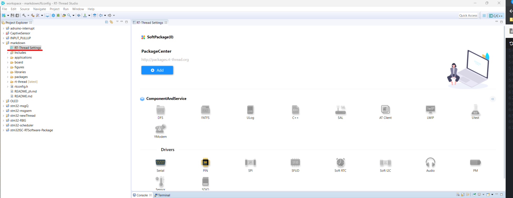
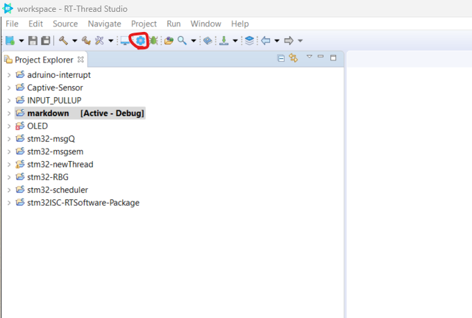
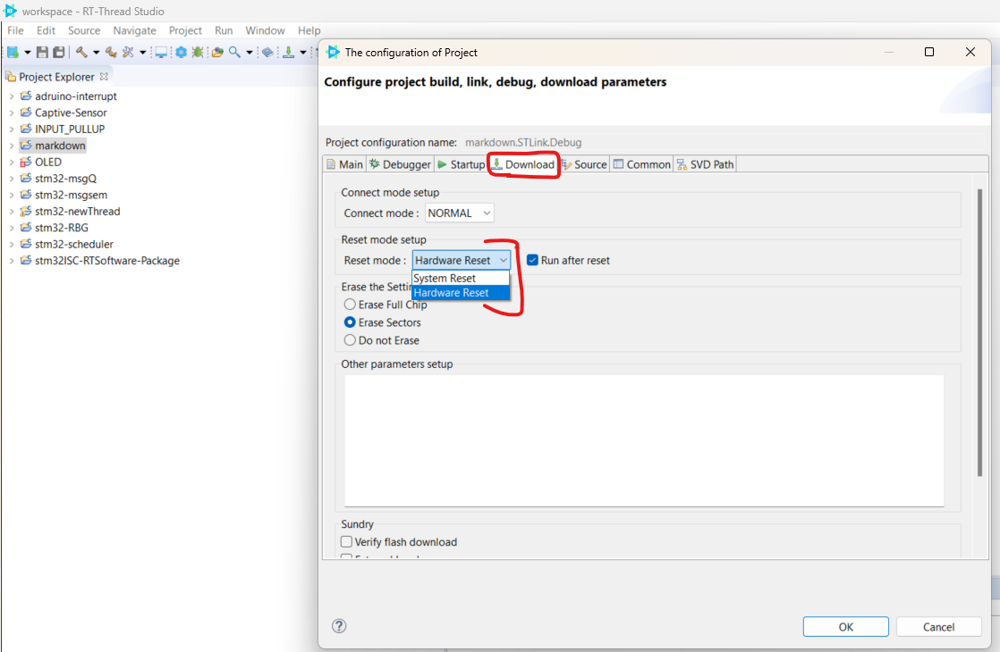

# How to create a RT-Studio project

[Download the latest RT-Thread studio](https://www.rt-thread.io/studio.html) and follow the instructions to install it on your windows machine.

This article use STM32F401-Nucleo as an example.

## 1 Create a new project

### 1.1 Go to File -> Import.

### 1.2 Select RT-Thread Bsp Project into Workspace.

### 1.3 Import Projects from BSP.

### 1.4 Browse Bsp Location to rt-threadx\bsp\stm32\stm32f401-st-nucleo, then click Select Folder.

### 1.5 Fill up the rest of the information and select ST-LINK for debugger. Then, click finish button. There will be a newly created project at the workspace. 

## 2 Tool Chain

### 2.1 Select the latest tool chain version to resolve the warning.

### 2.2 If there is no latest tool chain version, click SDK manager to download the latest version.

> Select the latest version from the RT-Thread SDK Manager window and click install packages button. After installation, click Exit SDK Manger button again.

> Then select the latest version from the Open Build Settings Dialog.

## 3 RT-Thread Setting

### 3.1 In order to configure kernel and to enable add-on software packages, click RT-Thread Settings. Then, click detail button.

### 3.2 After configuration, click save to update the latest configuration.

## 4 Compilation

### 4.1 In order to complie the project, select the project and ensure that it is [Active - Debug ] state.

### 4.2 Click compilation icon at the menu bar to compile the project.

### 4.3 Reset Mode Setup

By default, it is selected as hardware reset. After downloading the code, it is required to press the reset physical button on the board. However, this can be done automatically by selecting system reset option at the dropdown list.

To select system reset, click the configuration icon at menubar. Then, go to download tab. At the reset mode setup, you can either select hardware or system reset.

## 5 Terminal 

To access the development board, click terminal icon at the menu ba and select the correct serial port.

## 6 Additional Info 

If you need addtional information, visit to 

https://www.rt-thread.io/document/site/programming-manual/interrupt/interrupt/

## 7 Author

[Stanley Lwin](https://github.com/byte-me-stan)
