# How to make a STM32 BSP for RT-Thread

In order to allow developers to use BSP for development better and more conveniently, the RT-Thread team rearranged the existing STM32 series of BSPs and launched a new BSP framework. The new BSP framework has been greatly improved in terms of ease of use, portability, driver integrity, and code standardization. Development under the new BSP framework can greatly improve the efficiency of application development. 

The new BSP framework also introduces the CubeMX tool, which can be used to configure the peripheral pins which are used in the BSP. The CubeMX tool provides a graphical configuration interface. This graphical configuration method is more intuitive for developers. It not only allows developers to flexibly configure the resources used in the BSP, but also allows developers to understand the use of resources at a glance .

The main features of the new STM32 BSP framework are as follows: 

- Provide multiple series of BSP templates, greatly reducing the difficulty of adding new BSPs; 
- Each BSP is equipped with a complete set of driver files, so that developers can easily use all drivers; 
- Developers can use the CubeMX tool to configure the BSP graphically.

## 1. Introduction to BSP Framework 

The BSP frame structure is shown in the figure below: 

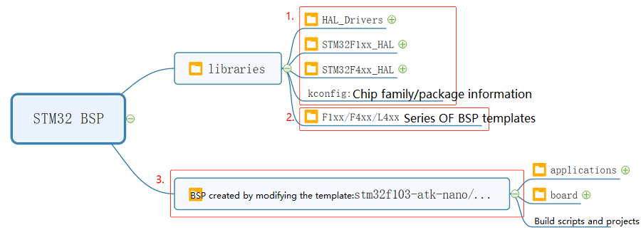

Each BSP of the STM32 series consists of three parts, namely the general library, the BSP template and the specific development board BSP. The following table uses the F1 series BSP as an example to introduce these three parts: 

| Item                                | Folder                              | Detail                                                       |
| ----------------------------------- | ----------------------------------- | :----------------------------------------------------------- |
| General library                     | stm32/libraries                     | Used to place HAL library and multi-series general peripheral driver files developed based on HAL library |
| STM32F1 series BSP project template | stm32/libraries/templates/stm32f10x | You can make more F1 series BSP by modifying this template   |
| Specific development board BSP      | stm32/stm32f103-blue-pill           | Modified on the basis of the BSP template                    |

## 2. Knowledge of background

## 3. Make a STM32 BSP for steps

Making a STM32 BSP is divided into the following five steps: 

1. Copy the generic template 
2. Use CubeMX tool to configure the project
3. Modify the Kconfig file in the BSP 
4. Modify the relevant files of the build project
5. Regenerate the project

In the following chapters, these five steps will be introduced in detail to help developers quickly create the required BSP. 

### 3.1 Copy the generic template 

The first step in making a new BSP is to copy a BSP template of the same series as the basis, and obtain a new BSP by modifying the BSP template. 

The folder structure of the F1 series BSP template used in this example is as follows: 

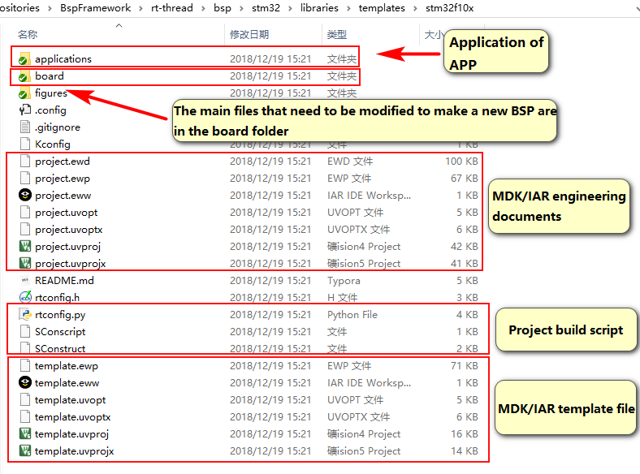

Copy the `stm32f10x` folder under the template folder and change the name of the folder to `stm32f103-blue-pill`, as shown in the following figure: 

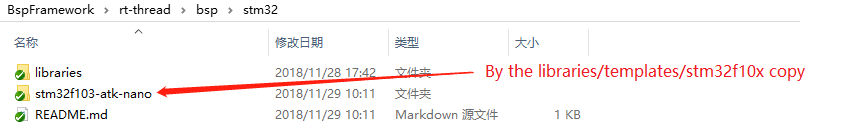

Modify the configuration file in the board folder. The modified content is shown in the following table: 

| Item                      | Instruction                                                  |
| ------------------------- | ------------------------------------------------------------ |
| CubeMX_Config （folder）  | CubeMX project                                               |
| linker_scripts （folder） | BSP link script                                              |
| board.c/h                 | System clock, GPIO initialization function, chip memory size |
| Kconfig                   | Chip series, peripheral resources                            |
| SConscript                | Chip startup file, target chip model                         |

### 3.2 Use CubeMX to configure the project 

Create a CubeMX project based on the target chip. The default CubeMX project is in the **CubeMX_Config** folder, double-click to open the `CubeMX_Config.ioc` project, as shown in the figure below: 

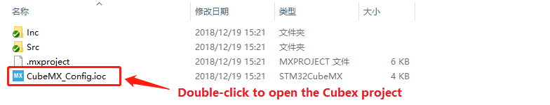

Change the chip model to STM32F103C8Tx in the CubeMX project. 

#### 3.2.1 Generate CubeMX project 

Configure the system clock, peripheral pins, etc. The steps are shown in the figure below: 

1. Turn on the external clock, set the download mode, and turn on the serial peripherals (note that only the pins of the serial peripherals need to be selected, no other parameters need to be configured): 

   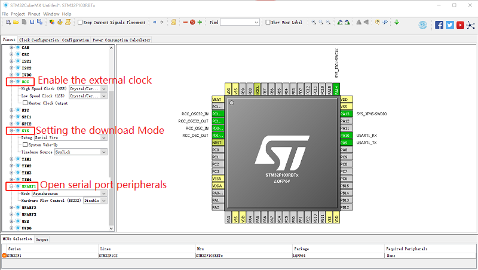

2. Configure the system clock: 

   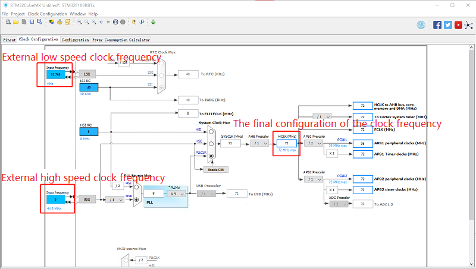

3. Set the project name and regenerate the CubeMX project at a specified address: 

   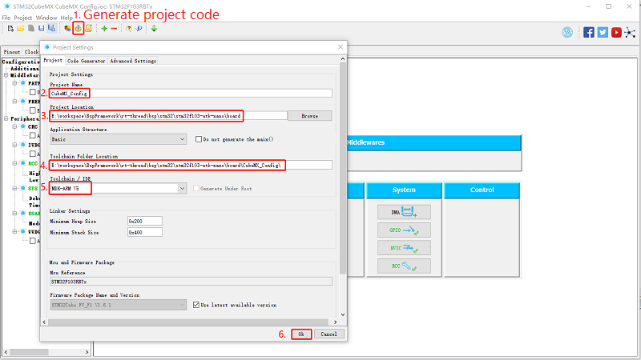

   Note: When generating the code, do not check the following options (ie: Do not let it generate a peripheral initialization as a pair of .c/.h files per perioheral.) 

   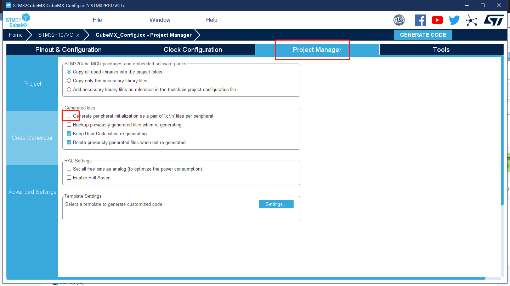

4. The final project directory structure generated by CubeMX is shown in the figure below: 

   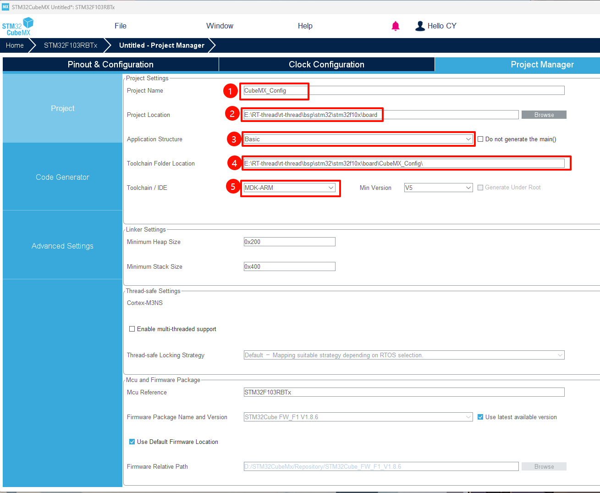

#### 3.2.2 Copy initialization function 

The function `SystemClock_Config()` is placed in the **board.c** file, which is responsible for initializing the system clock. When using the CubeMX tool to reconfigure the system clock, this function needs to be updated. This function is generated by the CubeMX tool and is placed in the file `board/CubeMX_Config/Src/main.c` by default. However, this file does not include in our project, so we need to copy this function from main.c to the board.c file. In the entire BSP making process, this function is the only function to be copied. The content of this function is as follows: 

The relevant parameters of FLASH and RAM are configured in the **board.h** file. What needs to be modified in this file is the parameters controlled by the two macros `STM32_FLASH_SIZE` and `STM32_SRAM_SIZE`. The flash size of the STM32F103C8Tx chip used in the BSP produced this time is 64k, and the size of the ram is 20k, so the file is modified as follows: 

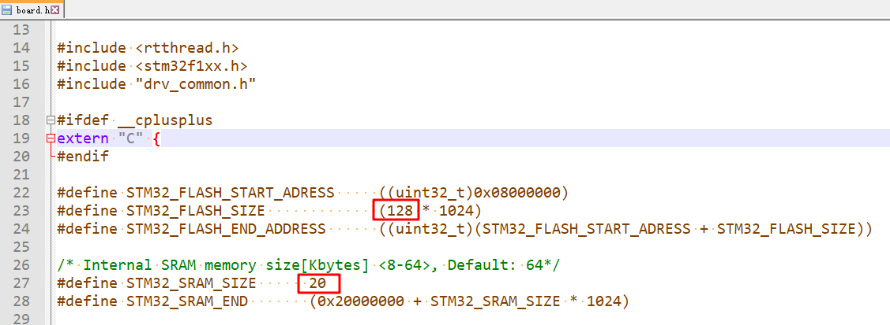

#### 3.2.3 Heap memory configuration 

Normally, a part of the memory space in the system RAM will be used as heap memory. The function of the following code is to specify the start address **HEAP_BEGIN** and end address **HEAP_END** of the heap memory under different compilers. The values of **HEAP_BEGIN** and **HEAP_END** here need to be consistent with the configuration modified in the following section [3.4.1 Modify Link Script](# 3.4.1 Modify Link Script).

In some series of chips, the chip RAM may be distributed in multiple discrete memory areas. At this time, the location of the heap memory can be in the same continuous memory area as the system memory, or it can be stored in a separate memory area. For example, on the L4 series of chips, the heap memory can be configured in a 96k memory space with a starting address of `0x20000000`, and the 32k memory space starting from `0x10000000` can be used as the system running memory. 

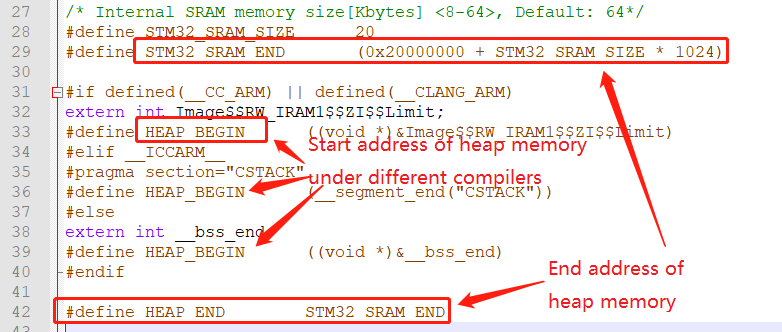

### 3.3 Modify Kconfig configuration

Modify the contents of the `board/Kconfig` file in this section as follows: 

- Chip model and series 
- Peripheral support options on BSP 

The modification of chip model and series is shown in the following table: 

| Macro Definition   | Meaning     | Format             |
| ------------------ | ----------- | ------------------ |
| SOC_STM32F103RB    | Chip model  | SOC_STM32xxx       |
| SOC_SERIES_STM32F1 | Chip series | SOC_SERIES_STM32xx |

Regarding the peripheral support options on the BSP, a BSP submitted for the first time only needs to support the GPIO driver and the serial port driver, which means only these two driver configuration items need to be retained in the configuration options, as shown in the following figure: 

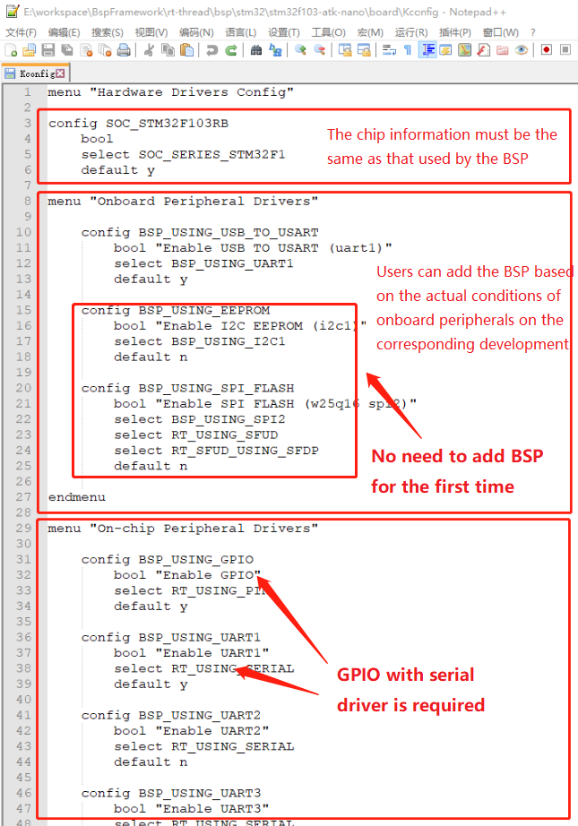

### 3.4 Modify project building related files 

#### 3.4.1 Modify the link script 

**linker_scripts** The link file is as shown in the figure below: 

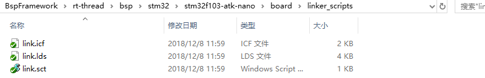

The following uses the link script link.sct used by MDK as an example to demonstrate how to modify the link script: 

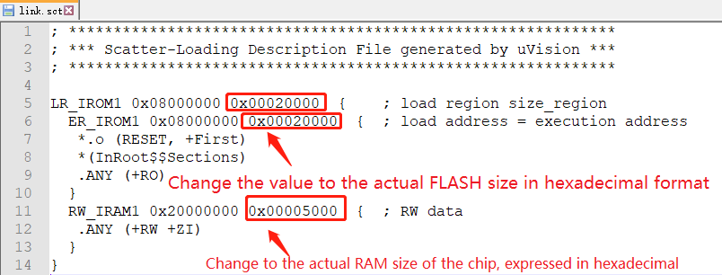

The chip used to make the BSP this time is STM32F103RB, and the FLASH is 128k, so modify the parameters of LR_IROM1 and ER_IROM1 to 0x00020000. The size of RAM is 20k, so modify the parameter of RW_IRAM1 to 0x00005000. Such a modification method is sufficient for general applications. If there are special requirements in the future, you need to modify it as required according to the syntax of the link script. When modifying the link script, you can refer to the [**3.2.3 Heap memory configuration**](# 3.2.3 Heap memory configuration) chapter to determine the BSP memory allocation. 

The other two link script files are link.icf used by IAR and link.lds used by the GCC compiler. The modification method is similar, as shown in the following figure: 

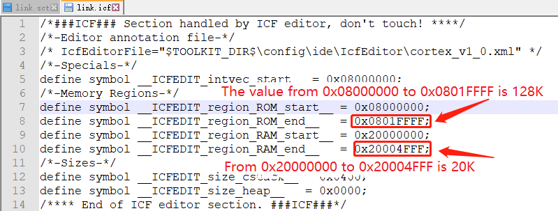

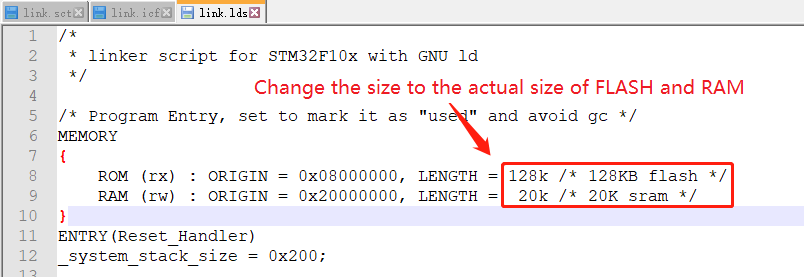

#### 3.4.2 Modify the build script 

The **SConscript** script determines the files to be added during the generation and compilation of the MDK/IAR project. 

In this step, you need to modify the chip model and the address of the chip startup file. The modification content is shown in the figure below: 

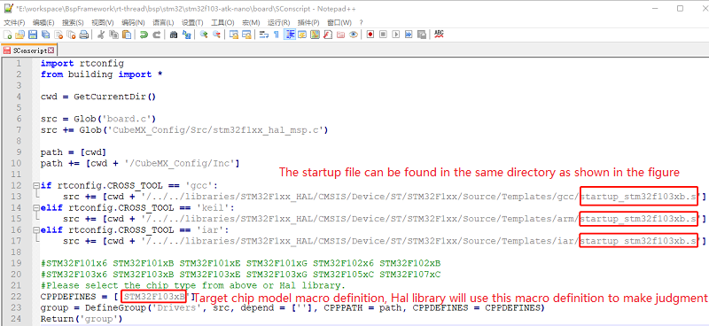

Note: If you cannot find the .s file of the corresponding series in the folder, it may be that multiple series of chips reuse the same startup file. At this time, you can generate the target chip project in CubeMX to see which startup file is used. Then modify the startup file name. 

#### 3.4.3 Modify the project template 

The **template** file is a template file for generating the MDK/IAR project. By modifying the file, you can set the chip model used in the project and the download method. The project template file of MDK4/MDK5/IAR, as shown in the figure below: 

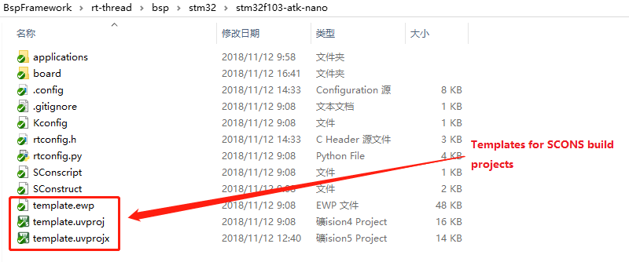

The following takes the modification of the MDK5 template as an example to introduce how to modify the template configuration: 

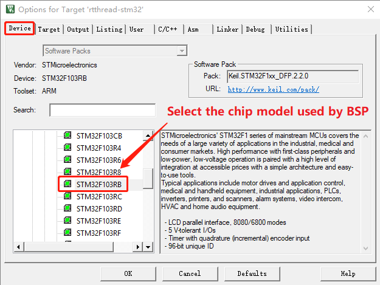

Modify the program download method: 

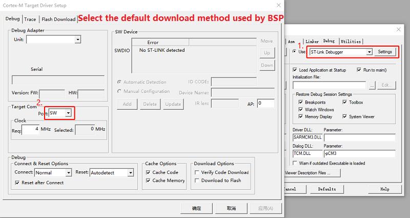

### 3.5 Regenerate the project 

Env tool is required to regenerate the project. 

#### 3.5.1 Regenerate the rtconfig.h file 

Enter the command menuconfig in the Env interface to configure the project and generate a new rtconfig.h file. As shown below: 

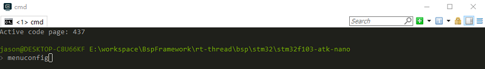

#### 3.5.2 Rebuild the MDK/IAR project 

The following takes regenerating the MDK project as an example to introduce how to regenerate the BSP project. Use the Env tool to enter the command `scons --target=mdk5` to regenerate the project, as shown in the following figure: 

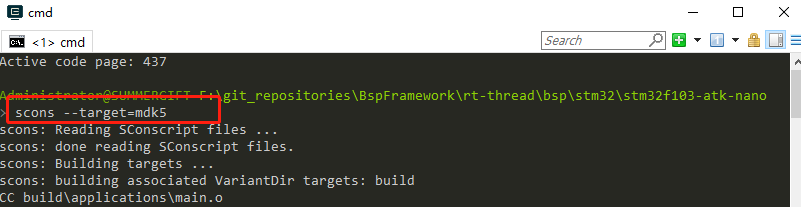

Rebuild the project successfully: 

At this point, the new BSP can be used. Next, we can use the commands `scons --target=mdk4` and `scons --target=iar` respectively to update the MDK4 and IAR projects so that the BSP becomes a complete BSP that can be submitted to GitHub (Making MDK4 project is optional). 

## 4. Specifications 

This chapter introduces the specifications that should be followed when making and submitting the RT-Thread STM32 series BSP. After the BSP is produced, the developer can check the produced BSP according to the checkpoints set out in this specification to ensure that the BSP has a higher quality before submission. 

### 4.1 Specification of making BSP

The specifications of making STM32 BSP are mainly divided into three aspects: engineering configuration, ENV configuration and IDE configuration. In the existing STM32 series BSP templates, the templates have been configured according to the following specifications. In the process of making a new BSP, when copying the template for modification, you need to be careful not to modify these default configurations. After the BSP is completed, the newly-made BSP needs to be tested for its function, and the code is submitted after the function is normal. The production specifications of the BSP will be described in detail below:

#### 4.1.1 Project configuration 

- Comply with RT-Thread coding standard, unified code comment style 

- The main function remains the same   
  - If there is an LED, **only put ONE** LED 1HZ flashing program in the main function 
- Heap initialization needs to be completed in `rt_hw_board_init`: call `rt_system_heap_init` 
- By default, only the GPIO driver and the serial port driver corresponding to FinSH are initialized, and DMA is not used 
- When the onboard peripheral driver is enabled, it should be able to compile, download and use without modifying the code
- Before submitting, check whether the three compilers of GCC/MDK/IAR are directly compiled or compiled successfully after regenerating 
- Use the `dist` command to publish the BSP and check whether the project generated by the dist command can be used normally 

#### 4.1.2 ENV configuration 

- The system heartbeat is uniformly set to 1000 (Macro: RT_TICK_PER_SECOND) 
- The assertion in the debugging option needs to be turned on in the BSP (macro: RT_USING_DEBUG) 
- The system idle thread stack size is uniformly set to 256 (Macro: IDLE_THREAD_STACK_SIZE) 
- Turn on automatic component initialization (Macro: RT_USING_COMPONENTS_INIT) 
- Need to enable the user main option (Macro: RT_USING_USER_MAIN) 
- FinSH only uses MSH mode by default (Macro: FINSH_USING_MSH_ONLY) 

#### 4.1.3 IDE configuration

- Enable automatic operation after downloading the code 
- Enable C99 support 
- Enable One ELF Section per Function (MDK)
- Temporary files generated by MDK/IAR are placed in the keil/iar folder under build
- The names of bin files generated by MDK/GCC/IAR are unified into rtthread.bin 

### 4.2 Specification of BSP submission

- Please carefully modify the README.md file of the BSP before submission. The peripheral support form of the README.md file only fills in the peripherals supported by the BSP. You can refer to other BSPs to fill in. 
- Submission of BSP is divided into two stages: 
  - The first stage: Basic BSP includes serial port driver and GPIO driver, and can run FinSH console. Completion of MDK4, MDK5, IAR and GCC compiler support, if the chip does not support a certain type of compiler (such as MDK4), you don’t need to do it.
  - The second stage: complete the onboard peripheral driver support, all onboard peripherals can be used directly after they are configured using `menuconfig`. If the development board does not have on-board peripherals, this stage don't need to be completed. Different drivers should be submitted separately to facilitate review and merging. 

- Only submit documents necessary for the BSP and delete irrelevant intermediate documents. Please check other BSPs for documents that can be submitted. 
- When submitting libraries of different series of STM32, please refer to the HAL libraries of f1/f4 series and delete redundant library files.
- Compile and test the BSP before submission to ensure that it compiles properly under different compilers.
- Perform functional tests on the BSP before submission to ensure that the BSP meets the requirements in the engineering configuration chapter before submission.

