## 如何创建新项目

***info:***

本说明以stm32f401-st-nucleo为例：

:bulb:从链接下载最新的[RT Thread代码](https://www.rt-thread.io/studio.html)，并按照说明将其安装到您的windows机器上。 

## 1创建新工程

### 1.1 导入BSP

### 1.2选择 RT-Thread Bsp Project into Workspace.

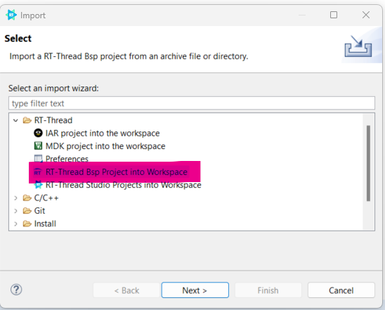

### 1.3 从BSP导入工程

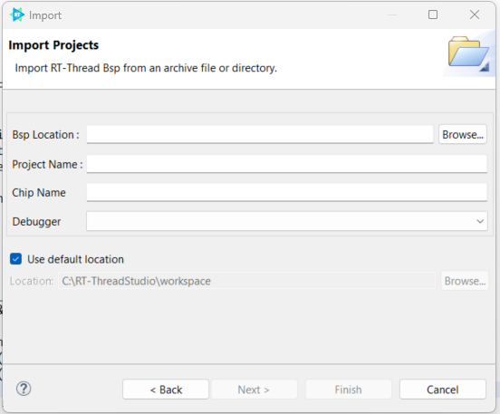

### 1.4 选择BSP路径 rt-threadx\bsp\stm32\stm32f401-st-nucleo

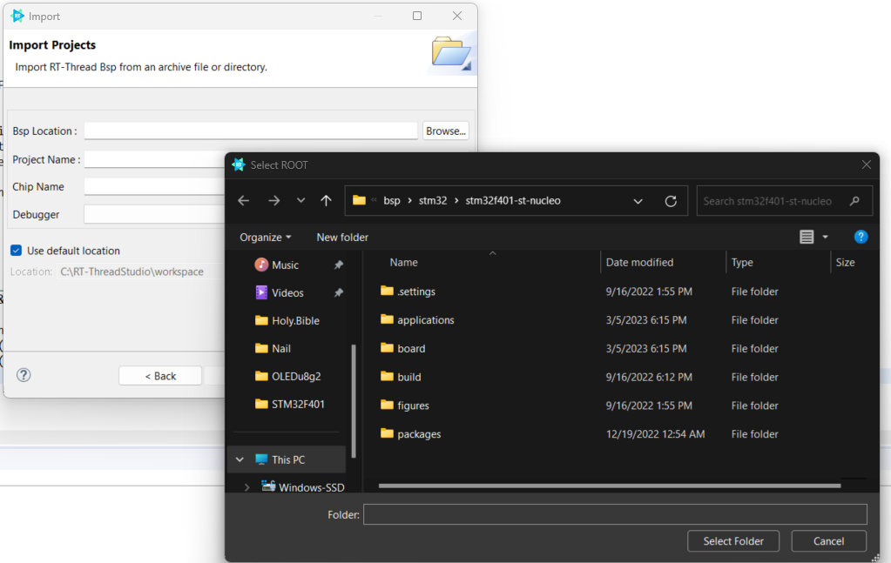

### 1.5 填写信息，选择ST-LINK作为调试器，单击“完成”按钮。工作区将有一个新创建的项目

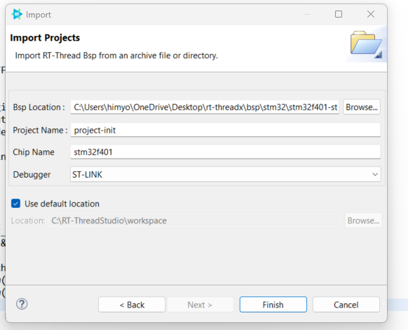

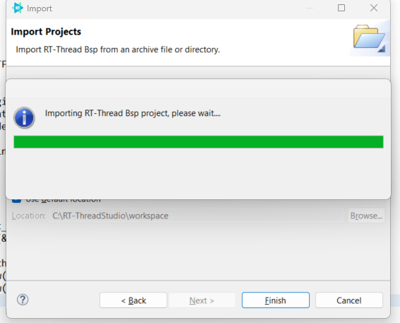

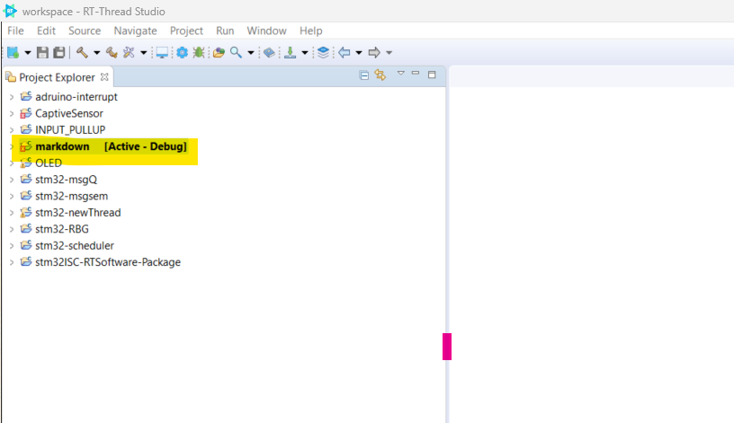

## 2 工具链

### 2.1 选择最新的工具链版本以解决警告。

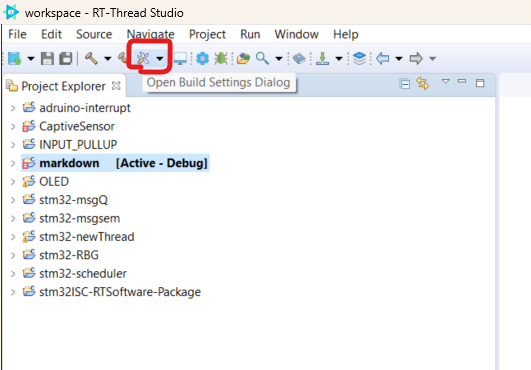

### 2.2 如果没有最新的工具链版本，请单击SDK管理器下载最新版本.

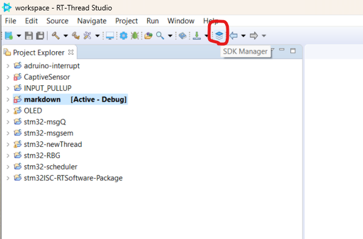

> 从“RT线程SDK管理器”窗口中选择最新版本，然后单击“安装软件包”按钮。安装完成后，再次单击“退出SDK管理器”按钮。

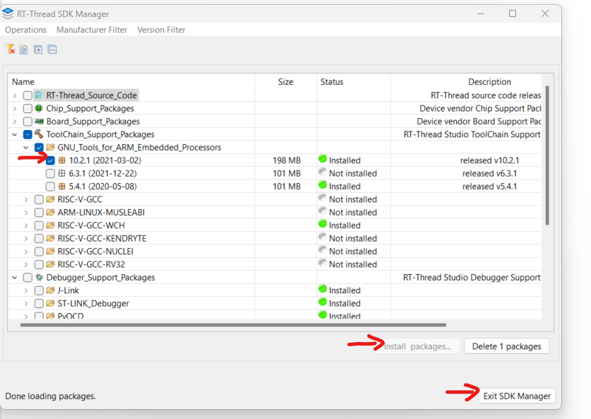

> Then select the latest version from the Open Build Settings Dialog.

## 3 RT-Thread Setting

### 3.1 然后从“打开生成设置”对话框中选择最新版本。

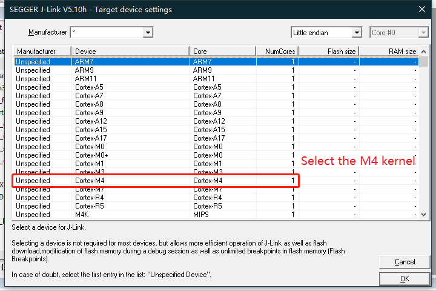

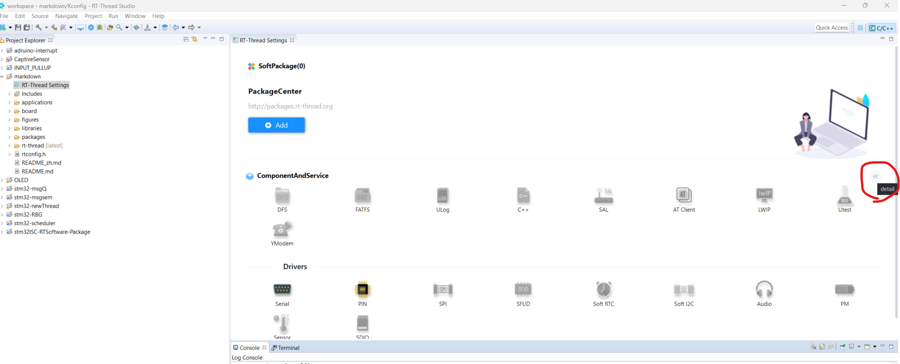

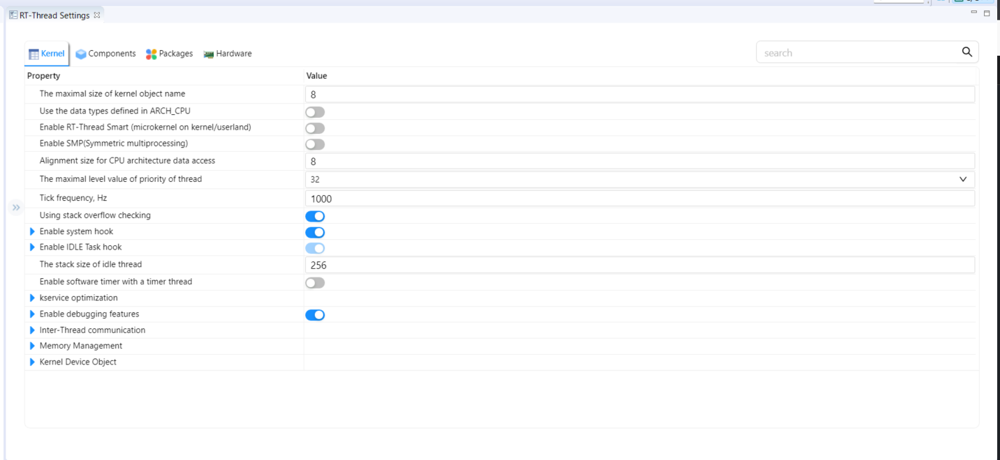

### 3.2 配置完成后，单击保存以更新最新配置。

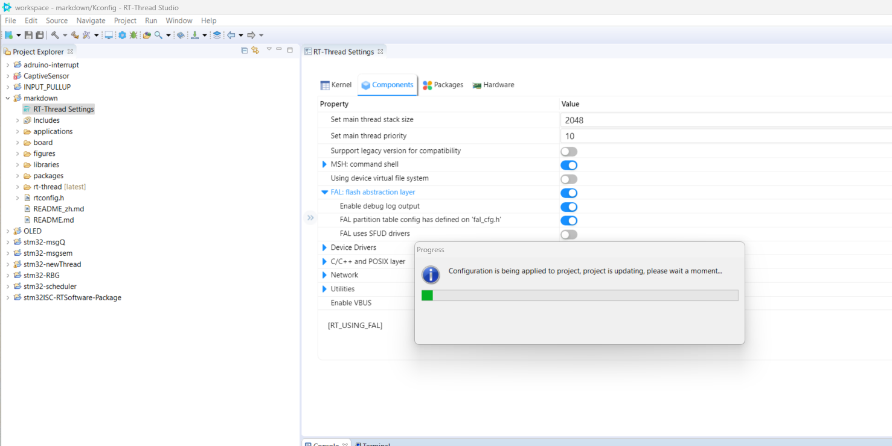

## 4 Compilation

### 4.1为了使项目复杂化，请选择项目并确保其处于[Active - Debug ] 状态。 

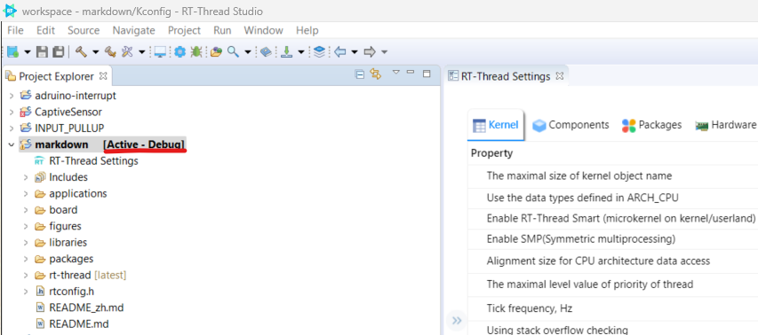

### 4.2 单击菜单栏上的编译图标以编译项目。

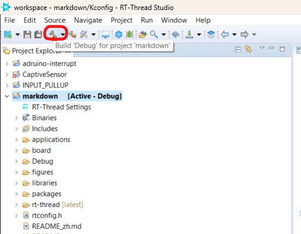

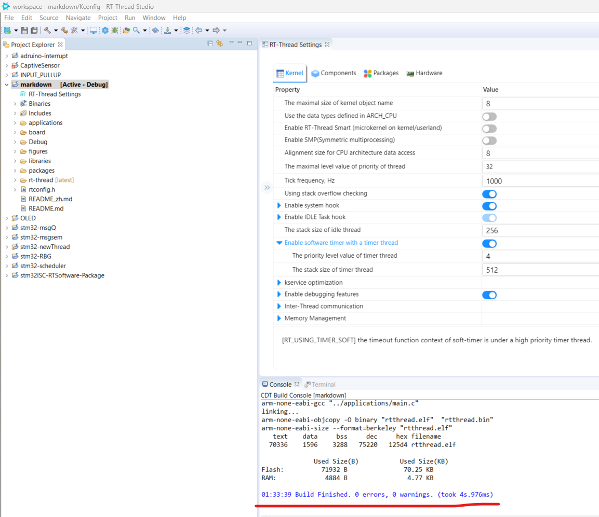

## 5 终端

连接开发板，请单击菜单ba上的终端图标，然后选择正确的串行端口。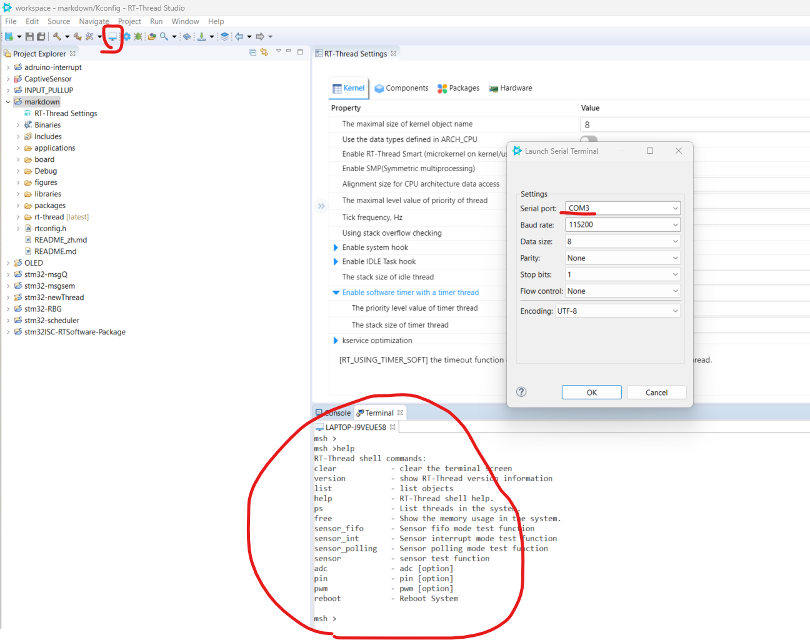

## 6 附加信息 

如果您需要其他信息，请访问： 

https://www.rt-thread.io/document/site/programming-manual/interrupt/interrupt/

## 

###### 作者：
###### Stanley Lwin [04 / 11 / 2023]
