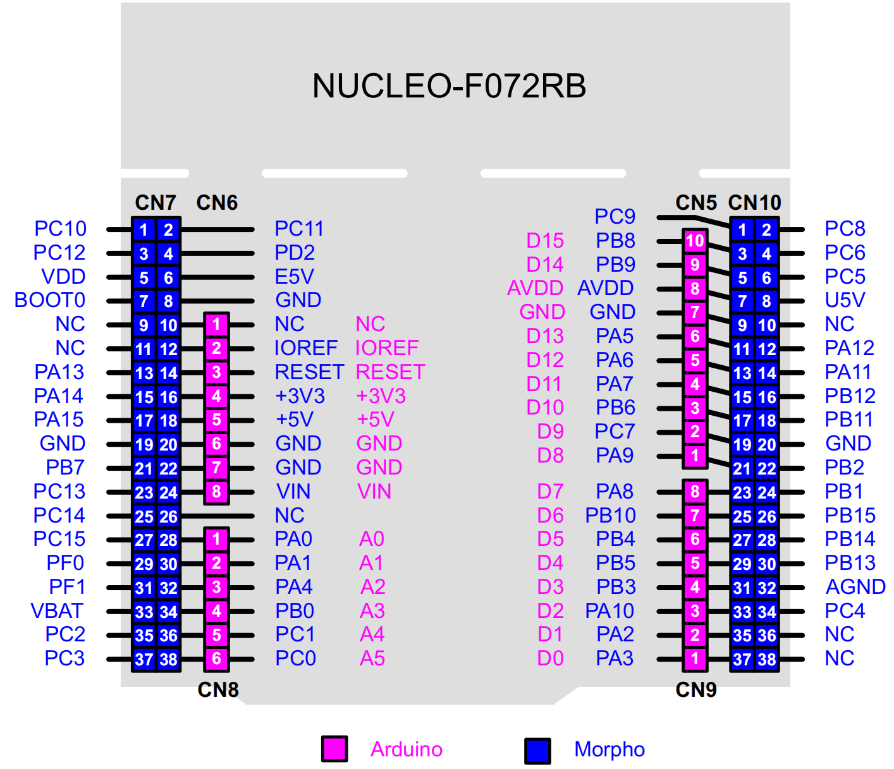

# STM32F072 Nucleo开发板的Arduino生态兼容说明

[English](README.md) | **中文**

## 1 RTduino - RT-Thread的Arduino生态兼容层

STM32F072 Nucleo开发板已经完整适配了[RTduino软件包](https://github.com/RTduino/RTduino)，即RT-Thread的Arduino生态兼容层。用户可以按照Arduino的编程习惯来操作该BSP，并且可以使用大量Arduino社区丰富的库，是对RT-Thread生态的极大增强。更多信息，请参见[RTduino软件包说明文档](https://github.com/RTduino/RTduino)。

### 1.1 如何开启针对本BSP的Arduino生态兼容层

Env 工具下敲入 menuconfig 命令，或者 RT-Thread Studio IDE 下选择 RT-Thread Settings：

```Kconfig
Hardware Drivers Config --->
    Onboard Peripheral Drivers --->
        [*] Compatible with Arduino Ecosystem (RTduino)
```

## 2 Arduino引脚排布



该BSP遵照Arduino UNO板的引脚排列方式，详见 [pins_arduino.c](pins_arduino.c) 和 [pins_arduino.h](pins_arduino.h)。

| Arduino引脚编号           | STM32引脚编号 | 5V容忍 | 备注                                            |
| --------------------- | --------- | ---- | --------------------------------------------- |
| 0 (D0)                | PA3       | 否    | Serial-Rx，默认被RT-Thread的UART设备框架uart2接管        |
| 1 (D1)                | PA2       | 否    | Serial-Tx，默认被RT-Thread的UART设备框架uart2接管        |
| 2 (D2)                | PA10      | 是    |                                               |
| 3 (D3)                | PB3       | 是    | PWM2-CH2，默认被RT-Thread的PWM设备框架pwm2接管           |
| 4 (D4)                | PB5       | 是    |                                               |
| 5 (D5)                | PB4       | 是    | PWM3-CH1，默认被RT-Thread的PWM设备框架pwm3接管           |
| 6 (D6)                | PB10      | 是    | PWM2-CH3，默认被RT-Thread的PWM设备框架pwm2接管           |
| 7 (D7)                | PA8       | 是    |                                               |
| 8 (D8)                | PA9       | 是    |                                               |
| 9 (D9)                | PC7       | 是    | PWM3-CH2，默认被RT-Thread的PWM设备框架pwm3接管           |
| 10 (D10)              | PB6       | 是    | PWM16-CHN1，默认被RT-Thread的PWM设备框架pwm16接管        |
| 11 (D11)              | PA7       | 否    | PWM17-CH1，默认被RT-Thread的PWM设备框架pwm17接管         |
| 12 (D12)              | PA6       | 否    |                                               |
| 13 (D13, LED_BUILTIN) | PA5       | 否    | 板载用户LED                                       |
| 14 (D14)              | PB9       | 是    | I2C-SDA，被RT-Thread的I2C设备框架i2c1总线接管            |
| 15 (D15)              | PB8       | 是    | I2C-SCL，被RT-Thread的I2C设备框架i2c1总线接管            |
| 16 (D16)              | PC13      | 否    | 用户按键（左侧蓝色）                                    |
| A0                    | PA0       | 否    | ADC1-CH0，默认被RT-Thread的ADC设备框架adc1接管           |
| A1                    | PA1       | 否    | ADC1-CH1，默认被RT-Thread的ADC设备框架adc1接管           |
| A2                    | PA4       | 否    | ADC1-CH4，默认被RT-Thread的ADC设备框架adc1接管           |
| A3                    | PB0       | 否    | ADC1-CH8，默认被RT-Thread的ADC设备框架adc1接管           |
| A4                    | PC1       | 否    | ADC1-CH11，默认被RT-Thread的ADC设备框架adc1接管          |
| A5                    | PC0       | 否    | ADC1-CH10，默认被RT-Thread的ADC设备框架adc1接管          |
| A6                    | --        |      | 芯片内部参考电压 ADC1-CH17，默认被RT-Thread的ADC设备框架adc1接管 |
| A7                    | --        |      | 芯片内部温度 ADC1-CH16，默认被RT-Thread的ADC设备框架adc1接管   |

> 注意：
> 
> 1. 驱动舵机和analogWrite函数要选择不同定时器发生的PWM信号引脚，由于STM32的定时器4个通道需要保持相同的频率，如果采用相同的定时器发生的PWM分别驱动舵机和analogWrite，可能会导致舵机失效。
> 2. USART2是Nucleo板的默认串口，理论应对接到了Arduino引脚编号的D0和D1，但是其实际用于串口通信，因此不允许当做普通IO来使用和操作。如果需要将D0、D1与STM32 USART2的引脚相连，需要手动焊接锡桥SB62、SB63。
> 3. Nucleo板的Arduino接口中AVDD（即AREF）默认是与VDD相连的，如果需要扩展板提供外部参考电压，需要将SB57锡桥挑开。
> 4. D10引脚是PWM反相位引脚(互补输出引脚)，但是这里**不用**考虑到占空比互补问题（CHx-20%，CHxN-80%），直接正常使用即可。

> 参考资料
> 
> 1. [STM32 Nucleo-64板用户手册](https://www.st.com/resource/en/user_manual/um1724-stm32-nucleo64-boards-mb1136-stmicroelectronics.pdf)

## 3 通信

### 3.1 I2C总线

STM32F072 Nucleo板的I2C总线是板上丝印的 `SCL/D15` 和 `SDA/D14` 引脚，这两个引脚默认是被RT-Thread I2C设备框架接管的，直接引用`#include <Wire.h>`（Arduino官方I2C头文件）即可使用。

### 3.2 SPI总线

目前本BSP不支持使用Arduino的SPI功能。

### 3.3 串口

本BSP通过 `Serial.` 方法调用 `uart2` 串口设备。详见[例程](https://github.com/RTduino/RTduino/blob/master/examples/Basic/helloworld.cpp)。
