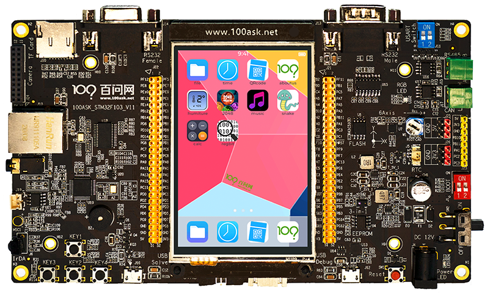

# 百问网STM32F103 PRO开发板BSP说明

## 简介

本文档是为百问网STM32F103 Pro开发板提供的BSP(板级支持包)说明。

主要内容如下：

* 开发板资源介绍
* BSP快速上手

* 进阶使用方法

通过阅读快速上手章节开发者可以快速的上手该BSP，将RT-Thread运行在开发板上。在进阶使用指南章节，将会介绍更多高级功能，帮助开发者利用RT-Thread驱动更多板载资源。

## 开发板介绍

STM32F103 Pro开发板是百问网推出的一块基于ARM Cortex-M3内核的开发板，最高主频为72MHz，该开发板具有丰富的板载资源，可以充分地发挥STM32F103ZET6这块处理器的性能。

开发板外观如下图所示：



该开发板常用**板载资源**如下：

* MCU: STM32F103ZET6，主频72MHz，512KB FLASH，64KB RAM
* 外部RAM : IS62WV51216BLL（SRAM，1MB）
* 外部FLASH: W25Q64（SPI，8MB）
* 常用外设：
  * 按键：4个，KEY1（兼具唤醒功能，PA0），KEY2（PG15），KEY3（PC13），KEY4（PE3）
  * LED：1个RGB灯，红灯（PB0），绿灯（PB1），蓝灯（PB5）
* 常用接口：USB转串口
* 调试接口：SWD

开发板更多详细信息请参考百问网[100AK STM32F103 PRO开发板介绍](https://item.taobao.com/item.htm?spm=a1z10.5-c-s.w4002-18944745104.44.5ac45a43rRV6kG&id=676044382014)。

## 外设支持

本BSP目前对外设的支持情况如下：

| 板载外设     |   支持情况   | 备注                                                         |
| ------------ | :----------: | ------------------------------------------------------------ |
| USB转串口    |     支持     | UART1                                                        |
| RGB LED      |     支持     | 红灯（PB0, TIM3 CH3），绿灯（PB1, TIM3 CH4），蓝灯（PB5, TIM3 CH2） |
| 电位器       |     支持     | ADC1/2/3 CH10                                                |
| SPI FLASH    |     支持     | W25Q64                                                       |
| EEPROM       |     支持     | 软件i2c1                                                     |
| SRAM         |     支持     | IS62WV51216BLL                                               |
| **片上外设** | **支持情况** | **备注**                                                     |
| GPIO         |     支持     | PA0, PA1... PK15 ---> PIN: 0, 1...176                        |
| UART         |     支持     | UART1/2/3                                                    |
| SPI          |     支持     | SPI1/2                                                       |
| ADC          |     支持     | ADC1/2/3                                                     |
| TIM          |     支持     | TIM2/3/4                                                     |
| PWM          |     支持     | TIM3 CH2/3/4                                                 |
| CAN          |     支持     | CAN1                                                         |

## 使用说明

使用说明分为如下两个章节：

- 快速上手

  本章节是为刚接触 RT-Thread 的新手准备的使用说明，遵循简单的步骤即可将 RT-Thread 操作系统运行在该开发板上，看到实验效果 。

- 进阶使用

  本章节是为需要在 RT-Thread 操作系统上使用更多开发板资源的开发者准备的。通过使用 ENV 工具对 BSP 进行配置，可以开启更多板载资源，实现更多高级功能。

### 快速上手

本 BSP 为开发者提供 MDK5 和 IAR 工程，并且支持 GCC 开发环境。下面以 MDK5 开发环境为例，介绍如何将系统运行起来。

#### 硬件连接

使用ST-Link调试下载器连接开发板的SWD接口，使用数据线连接开发板的调试串口，再将ST-Link和数据线的另一端连接到PC，打开电源开关。

#### 编译下载

双击 project.uvprojx 文件，打开 MDK5 工程，编译并下载程序到开发板。

> 工程默认配置使用 ST-Link 下载程序，在通过 ST-Link 连接开发板的基础上，点击下载按钮即可下载程序到开发板

#### 运行结果

下载程序成功之后，系统会自动运行，观察开发板上 LED 的运行效果，其中一个 LED 会周期性闪烁。

连接开发板对应串口到 PC , 在终端工具里打开相应的串口（115200-8-1-N），复位设备后，可以看到 RT-Thread 的输出信息:

```bash
 \ | /
- RT -     Thread Operating System
 / | \     4.1.1 build May 30 2022 17:15:31
 2006 - 2022 Copyright by RT-Thread team
msh />
```

### 进阶使用

此 BSP 默认只开启了 GPIO 和 串口1 的功能，如果需使用 ADC、Flash 等更多高级功能，需要利用 ENV 工具对BSP 进行配置，步骤如下：

1. 在 bsp 下打开 env 工具。

2. 输入`menuconfig`命令配置工程，配置好之后保存退出。

3. 输入`pkgs --update`命令更新软件包。

4. 输入`scons --target=mdk5/iar` 命令重新生成工程。

本章节更多详细的介绍请参考 [STM32 系列 BSP 外设驱动使用教程](../docs/STM32系列BSP外设驱动使用教程.md)。

## 注意事项

暂无

## 联系人信息

维护人: 

* 100ask-Alen, 邮箱:<3062056224@qq.com>