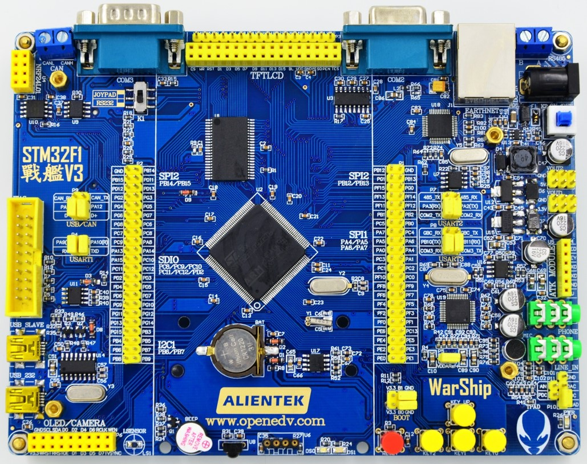

# STM32F103 正点原子战舰V3开发板 BSP 说明

## 简介

本文档为 正点原子战舰V3 开发板的 BSP (板级支持包) 说明。

主要内容如下：

- 开发板资源介绍
- BSP 快速上手
- 进阶使用方法

通过阅读快速上手章节开发者可以快速地上手该 BSP，将 RT-Thread 运行在开发板上。在进阶使用指南章节，将会介绍更多高级功能，帮助开发者利用 RT-Thread 驱动更多板载资源。

## 开发板介绍

STM32F103战舰V3，资源丰富，接口多，功能强大，性价比高，资料全，外观炫酷，布局人性化，配件丰富，配件的接口丰富，是学习嵌入式的好开发板

开发板外观如下图所示：



该开发板常用 **板载资源** 如下：

- MCU：STM32F103ZET6，主频 72MHz，512KB FLASH ，64KB RAM
- 外部 RAM：无
- 外部 FLASH：W25Q128（SPI2，128MB）、EEPROM（24c02）
- 常用外设
  - LED：2个，DS0（黄色，PB5），DS1（红色，PE5）
  - 按键：4个，K0（兼具唤醒功能，PA0），K1（PE4）, K2 (PE3) , K3 (PE2)
- 常用接口：USB 转串口、SD 卡接口、以太网接口、LCD 接口、USB SLAVE等
- 调试接口，板载的 ST-LINK SWD 下载

开发板更多详细信息请参考[正点原子] [战舰V3开发板介绍] http://www.openedv.com

## 外设支持

本 BSP 目前对外设的支持情况如下：

| **板载外设**      | **支持情况** | **备注**                              |
| :----------------- | :----------: | :------------------------------------- |
| USB 转串口        |     支持     |    UART1                              |
| **片上外设**      | **支持情况** | **备注**                               |
| GPIO              |     支持     | PA0, PA1... PG15 ---> PIN: 0, 1...111 |
| UART              |     支持     | UART1                             |
| **扩展模块**       | **支持情况** | **备注**                              |
|                   |             |                                       |

## 使用说明

使用说明分为如下两个章节：

- 快速上手

    本章节是为刚接触 RT-Thread 的新手准备的使用说明，遵循简单的步骤即可将 RT-Thread 操作系统运行在该开发板上，看到实验效果 。

- 进阶使用

    本章节是为需要在 RT-Thread 操作系统上使用更多开发板资源的开发者准备的。通过使用 ENV 工具对 BSP 进行配置，可以开启更多板载资源，实现更多高级功能。


### 快速上手

本 BSP 为开发者提供 MDK4、MDK5 和 IAR 工程，并且支持 GCC 开发环境。下面以 MDK5 开发环境为例，介绍如何将系统运行起来。

#### 硬件连接

使用数据线连接开发板到 PC，打开电源开关。

#### 编译下载

双击 project.uvprojx 文件，打开 MDK5 工程，编译并下载程序到开发板。

> 工程默认配置使用 ST-Link 仿真器下载程序，在通过 ST-Link 连接开发板的基础上，点击下载按钮即可下载程序到开发板

#### 运行结果

下载程序成功之后，系统会自动运行，两个 LED 闪烁 。

连接开发板对应串口到 PC , 在终端工具里打开相应的串口（115200-8-1-N），复位设备后，可以看到 RT-Thread 的输出信息:

```bash
 \ | /
- RT -     Thread Operating System
 / | \     4.0.1 build Mar 10 2019
 2006 - 2019 Copyright by rt-thread team
msh >
```
### 进阶使用

此 BSP 默认只开启了 GPIO 和 串口1 的功能，是个纯净版，方便大家直接使用，欢迎大家一起更新

本章节更多详细的介绍请参考 [STM32 系列 BSP 外设驱动使用教程](../docs/STM32系列BSP外设驱动使用教程.md)。

## 注意事项

- 此开发板外部高速晶振是 12MHz ;
- 建议使用USB转TTL连接到PC机 ;
- 正点原子开发板 在使用终端工具如：PuTTy、XShell 时，会出现系统不能启动的问题，推荐使用串口调试助手如：sscom

## 联系人信息

维护人:

-  [obito0](https://github.com/obito0), 邮箱：<496420502@qq.com>