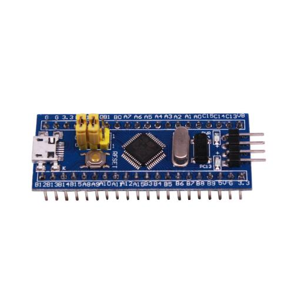
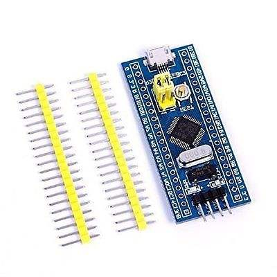

# STM32F103C8 Blue Pill BSP Introduction

## Onboard Resources

- MCU：STM32F103C8T6 @ 72MHz, 64KB FLASH , 20KB RAM
- Peripherals
  - LED：PC13
- Debug IO interface type: SWD

## Build

### Keil5 MDK

Please open`project.uvprojx` file and compile the project. 

### Keil4 MDK

Please open`project.uvproj` file and compile the project. 

## References

[STM32 Blue Pill vs Black Pill Microcontroller Boards] https://www.youtube.com/watch?v=QCdnO43RBK4&t=875s

## Maintained By

Meco Man @ rt-thread community

jiantingman@foxmail.com 

https://github.com/mysterywolf