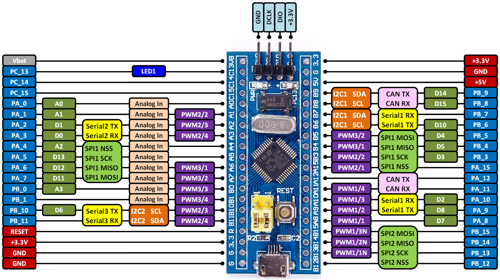
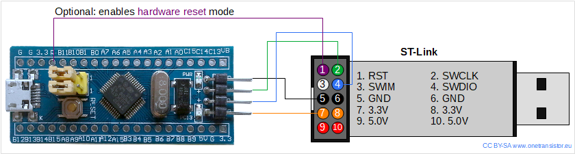
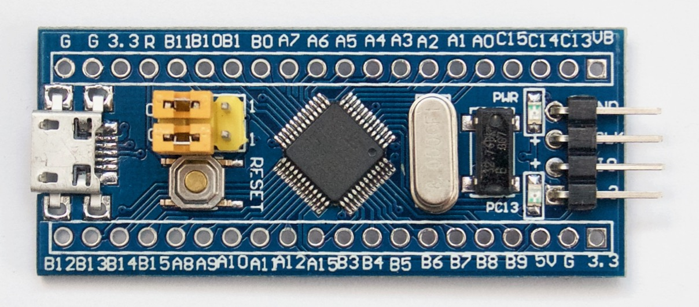
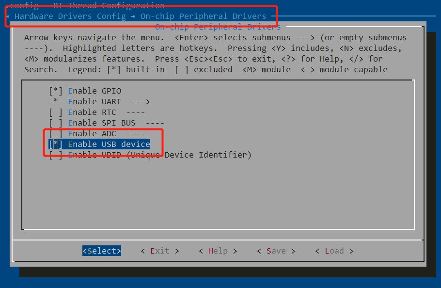
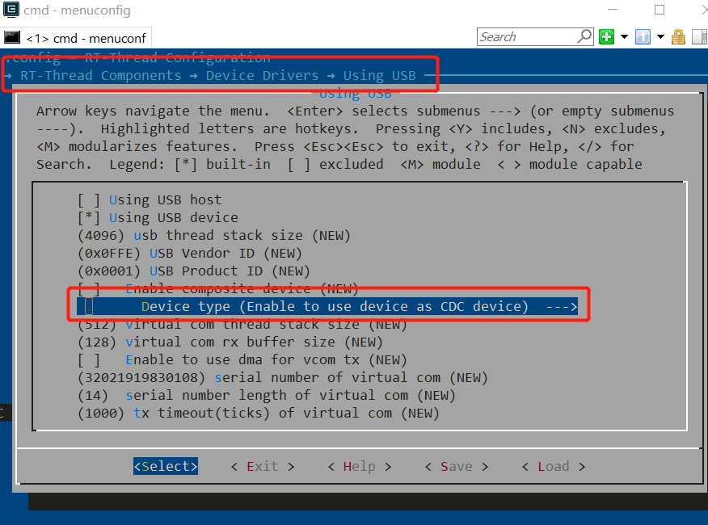
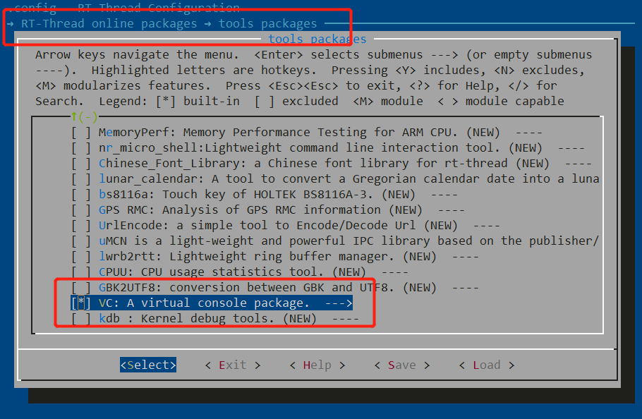
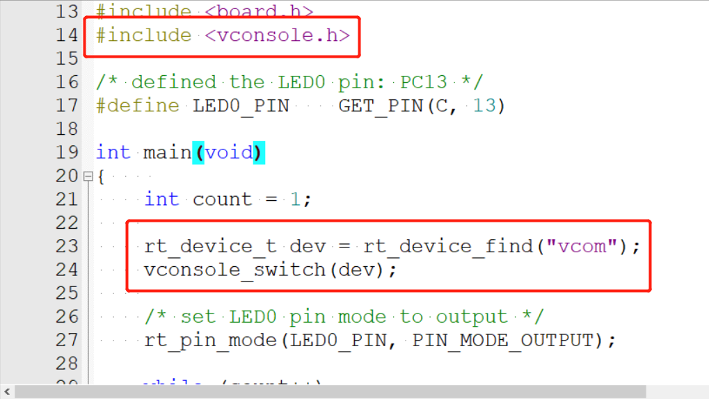

# STM32F103C8 Blue Pill Board BSP Introduction

 [[中文]](README_zh.md)

[TOC]

This document records the introduction of the BSP (board support package) provided by the RT-Thread development team for the STM32F103C8 Blue Pill development board.

The document is covered in four parts:

- Onboard Resources
- Quickly Get Started
- Advanced Features
- Read more

By reading the ***Quickly Get Started*** section developers can quickly get their hands on this BSP and run RT-Thread on the board. More advanced features will be introduced in the Advanced Features section to help developers take advantage of RT-Thread to drive more on-board resources.

Video tutorial: https://www.youtube.com/watch?v=0PwBBYXQ08g


## 1 MCU Resources

The STM32F103Cx medium-density performance line family incorporates the high-performance ARM®Cortex®-M3 32-bit RISC core operating at a 72 MHz frequency, high-speed embedded memories (Flash memory up to 128 Kbytes and SRAM up to 20 Kbytes), and an extensive range of enhanced I/Os and peripherals connected to two APB buses. All devices offer two 12-bit ADCs, three general purpose 16-bit timers plus one PWM timer, as well as standard and advanced communication interfaces: up to two I2Cs and SPIs, three USARTs, an USB and a CAN.

The devices operate from a 2.0 to 3.6 V power supply. They are available in both the –40 to +85 °C temperature range and the –40 to +105 °C extended temperature range. A comprehensive set of power-saving mode allows the design of low-power applications.
The STM32F103Cx medium-density performance line family includes devices in six different package types: from 36 pins to 100 pins. Depending on the device chosen, different sets of peripherals are included, the description below gives an overview of the complete range of peripherals proposed in this family.
These features make the STM32F103xx medium-density performance line microcontroller family suitable for a wide range of applications such as motor drives, application control, medical and handheld equipment, PC and gaming peripherals, GPS platforms, industrial applications, PLCs, inverters, printers, scanners, alarm systems, video intercoms, and HVACs.

KEY FEATURES

- ARM® 32-bit Cortex®-M3 CPU Core
  - 72 MHz maximum frequency,1.25 DMIPS/MHz (Dhrystone 2.1) performance at 0 wait state memory access
  - Single-cycle multiplication and hardware division
- Memories
  - 64 or 128 Kbytes of Flash memory
  - 20 Kbytes of SRAM
- Clock, reset and supply management
  - 2.0 to 3.6 V application supply and I/Os
  - POR, PDR, and programmable voltage detector (PVD)
  - 4-to-16 MHz crystal oscillator
  - Internal 8 MHz factory-trimmed RC
  - Internal 40 kHz RC
  - PLL for CPU clock
  - 32 kHz oscillator for RTC with calibration
- Low-power
  - Sleep, Stop and Standby modes
  - VBAT supply for RTC and backup registers
- 2 x 12-bit, 1 μs A/D converters (up to 16 channels)
  - Conversion range: 0 to 3.6 V
  - Dual-sample and hold capability
  - Temperature sensor
- DMA
  - 7-channel DMA controller
  - Peripherals supported: Timers, ADC, SPIs, I2Cs and USARTs

- Up to 80 fast I/O ports
  - 26/37/51/80 I/Os, all mappable on 16 external interrupt vectors and almost all 5 V-tolerant
- Debug mode
  - Serial wire debug (SWD) & JTAG interfaces
- 7 timers
  - Three 16-bit timers, each with up to 4 IC/OC/PWM or pulse counter and quadrature (incremental) encoder input
  - 16-bit, motor control PWM timer with dead-time generation and emergency stop
  - 2 watchdog timers (Independent and Window)
  - SysTick timer 24-bit downcounter
- Up to 9 communication interfaces
  - Up to 2 x I2C interfaces (SMBus/PMBus)
  - Up to 3 USARTs (ISO 7816 interface, LIN, IrDA capability, modem control)
  - Up to 2 SPIs (18 Mbit/s)
  - CAN interface (2.0B Active)
  - USB 2.0 full-speed interface
- CRC calculation unit, 96-bit unique ID
- Packages are ECOPACK®


## 2 Onboard Resources

- MCU：STM32F103C8T6 @72MHz, 64KB FLASH (can be extended to 128KB) , 20KB RAM

- Peripherals
  
  - LED：PC13
  
- Debug IO interface type: ST-LINK V2 (SWD)





## 3 Quickly Get Started

This BSP provides MDK4, MDK5, and IAR projects for developers and it supports the GCC development environment. Here's an example of the MDK5 development environment, to introduce how to run the system.

### 3.1 Use ST-LINK Debugger to connect the Blue Pill Board

ST-LINK driver: 

> https://www.st.com/en/development-tools/stsw-link009.html

| ST-LINK Debugger | Blue Pill 4-Pin SWD |
| :--------------: | :-----------------: |
|      SWDIO       |         IO          |
|      SWDCLK      |         CLK         |
|      VCC3.3      |       VCC3.3        |
|       GND        |         GND         |





### 3.2 Use FTDI adapter(USB to UART) to connect the Blue Pill Board's PA9(Tx) and PA10(Rx) pins

FTDI adapter driver:

> https://www.ftdichip.com/FTDrivers.htm

You can use other USB to UART adapters to replace FTDI adapter.

| FTDI adapter(USB to UART) |            Blue Pill Board            |
| :-----------------------: | :-----------------------------------: |
|            Tx             |                PA10 Rx                |
|            Rx             |                PA9 Tx                 |
|            GND            |                  GND                  |
|          VCC 3.3          | **Don't need to connect VCC 3.3 pin** |
|           VCC 5           |  **Don't need to connect VCC 5 pin**  |


### 3.3 Make sure Jumper Position (Both 0 Position)

| BOOTx | High / Low |
| :---: | :--------: |
| BOOT0 |     0      |
| BOOT1 |     0      |




### 3.4 Compile and Download

#### 3.4.1 Using RT-Studio to create and compile the project

***Please watch this tutorial video:***

- [RT-Thread RTOS Tutorial #3 | Advanced Skills - YouTube](https://www.youtube.com/watch?v=k4-ArvvIiR8)

#### 3.4.2 Using Keil-MDK or IAR to compile the project

- Double-click the `project.uvprojx` file to open the MDK-Keil5 project  (**NOT** `template.uvprojx` file)
- Click the “option for target” button
  - Debug: Choose "ST-LINK Debugger" and Click "Setting" button:
    - Port: choose "SW (Serial Wire)"
    - Flash Download: check "Reset and Run"

- Compile and download the program to the board


### 3.5 Running Results

After the program is successfully downloaded, the system runs automatically. Observe the running results of the LED on the development board, and you will see the LED is flashing periodically.

The COM port connects to **USART1 (PA9-Tx, PA10-Rx) by default**, and when the corresponding serial port (**115200**-8-1-N) is opened in the terminal tool, the output information of RT-Thread can be seen when the device is reset:

```shell
 \ | /
- RT -     Thread Operating System
 / | \     4.0.0 build Dec 21 2018
 2006 - 2018 Copyright by rt-thread team
msh >
```


### 3.6 Terminal tool - PuTTy 

If you have no terminal tool software available, you can download ***PuTTy***:

>  https://www.chiark.greenend.org.uk/~sgtatham/putty/latest.html


These two videos will show you how to use PuTTy:

> https://www.youtube.com/watch?v=ab4ilbsteWU
>
> https://www.youtube.com/watch?v=dO-BMOzNKcI


### 3.7 Peripheral Condition

Each peripheral supporting condition for this BSP is as follows:

| **On-board Peripherals** | **Support** | **Remark**                                                   |
| ------------------------ | ----------- | ------------------------------------------------------------ |
| LED                      | √           | PC13                                                         |
| USB Virtual Serial Port  | √           | USB CDC                                                      |
| **On-chip Peripherals**  | **Support** | **Remark**                                                   |
| GPIO                     | √           |                                                              |
| UART                     | √           | USART1 / USART2                                              |
| SPI                      | √           | SPI1                                                         |
| I2C                      | √           | software simulate                                            |
| USB                      | √           | USB Device                                                   |
| ADC                      | √           | ADC1 IN1                                                     |
| RTC                      | √           | Support for external crystal oscillator and internal low-speed clocks |
| PWM                      |             |                                                              |
| FLASH                    |             |                                                              |
| IWG                      |             |                                                              |
| UID                      | √           | STM32 Unique Device Identifier                               |


### 3.8 MDK-Keil5 Simulator

 If you haven't had a real Blue Pill Board yet, you may use MDK-Keil5 simulator to simulate to run RT-Thread on Blue Pill Board. Please Double-click the `project.uvprojx` file to open the MDK-Keil5 project  (**NOT** `template.uvprojx` file).


## 4 **Advanced Features**

This BSP only enables GPIO and USART1 by default. If you need more advanced features such as SPI, ADC, or to add software packages, you need to configure the BSP with RT-Thread [ENV tool](https://www.rt-thread.io/download.html?download=Env), as follows:

1. Open the ENV tool under the specific BSP folder, eg: *bsp/stm32/stm32f103-blue-pill* ;
2. Enter `menuconfig` command to configure the project, then save and exit;
3. Enter `pkgs --update` command to update the package;
4. Enter `scons --target=mdk4/mdk5/iar` command to regenerate the project.

Learn how to use RT-Thread ENV, click [Here](https://github.com/RT-Thread/rt-thread/blob/master/documentation/env/env.md).


### 4.1 How to use USB virtual com as a console device

**Step 1: Enable USB device.**




**Step 2: Enable USB Device Driver and enable to use device as CDC device.**




**Step 3: Select vconsole (virtual console) software package.**




**Step 4: Add these codes in main function which is located in 'Applications' folder.**

```c
#include <vconsole.h>

rt_device_t dev = rt_device_find("vcom");
vconsole_switch(dev);
```




**Step 5: Download the new program to your blue pill board.** 

Re-plug the USB cable and you will find a new serial (virtual com, 115200, 8-N-1) device in your computer. Then, you can use the USB instead of the UART-USB adapter as a console and send commands through USB cable. If you reset or reboot the blue pill board, you'll still need to re-plug the USB cable. 


### 4.2 How to extend Blue Pill board’s Flash space

According to ST official datasheet, STM32F103C8 has 64KB of Flash. However, STM32F103C8 and STM32F103CB use the same type of silicon die, which means STM32F103C8 also has 128KB ROM in theory, but ST locked the high 64KB. Basically, to force the debugger to download program can unlock the high 64KB. There is a good news that **Keil5 / IAR / RT-Studio will help you to unlock the Blue Pill Board high 64KB block** if you use this Blue Pill Board BSP as a template to create your project. You just need to press the "Flash Download" button as usual. What you only need to remember is that Blue Pill board has 128KB of Flash rather than 64KB.


## 5 Read more

- [[STM32 Blue Pill Board Schematic]](https://stm32duinoforum.com/forum/images/c/c1/wiki_subdomain/Vcc-gnd.com-STM32F103C8-schematic.pdf)
- [[STM32 Blue Pill vs Black Pill Microcontroller Boards]](https://www.youtube.com/watch?v=QCdnO43RBK4&t=875s)
- [[STM32F103C8 datasheet]]( https://www.st.com/resource/en/datasheet/stm32f103c8.pdf)
- [[STM32F103C8 More Information (ST official)]](https://www.st.com/en/microcontrollers-microprocessors/stm32f103c8.html#overview)
- [[RT-Thread document center]](https://www.rt-thread.io/document/site/introduction/introduction/)


## 6 Maintained By

[Meco Man](https://github.com/mysterywolf) @ RT-Thread Community

jiantingman@foxmail.com 

