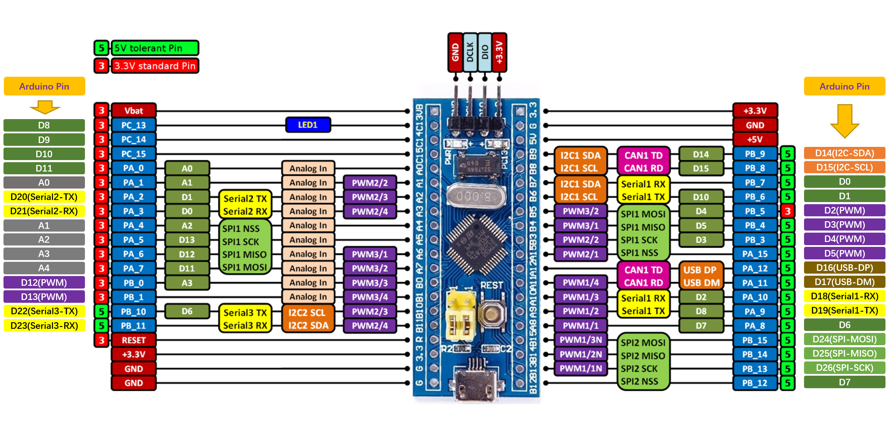

# STM32F103 Blue-Pill开发板的Arduino生态兼容说明

## 1 RTduino - RT-Thread的Arduino生态兼容层

STM32F103 Blue-Pill开发板已经完整适配了[RTduino软件包](https://github.com/RTduino/RTduino)，即RT-Thread的Arduino生态兼容层。用户可以按照Arduino的编程习惯来操作该BSP，并且可以使用大量Arduino社区丰富的库，是对RT-Thread生态的极大增强。更多信息，请参见[RTduino软件包说明文档](https://github.com/RTduino/RTduino)。

### 1.1 如何开启针对本BSP的Arduino生态兼容层

Env 工具下敲入 menuconfig 命令，或者 RT-Thread Studio IDE 下选择 RT-Thread Settings：

```Kconfig
Hardware Drivers Config --->
    Onboard Peripheral Drivers --->
        [*] Support Arduino
```

## 2 Arduino引脚排布



该BSP遵照Arduino UNO板的引脚排列方式，并扩展增加了Blue-pill自身的板载资源功能引脚。详见 `pins_arduino.c`

| Arduino引脚编号 | STM32引脚编号 | 5V容忍 | 备注                                           |
| ----------- | --------- | ---- | -------------------------------------------- |
| 0 (D0)      | PB7       | 是    |                                              |
| 1 (D1)      | PB6       | 是    |                                              |
| 2 (D2)      | PB5       | 否    | PWM3-CH2（定时器3发生）                             |
| 3 (D3)      | PB4       | 是    | PWM3-CH1（定时器3发生）                             |
| 4 (D4)      | PB3       | 是    | PWM2-CH2（定时器2发生）                             |
| 5 (D5)      | PA15      | 是    | PWM2-CH1（定时器2发生）                             |
| 6 (D6)      | PA8       | 是    |                                              |
| 7 (D7)      | PB12      | 是    |                                              |
| 8 (D8)      | PC13      | 否    |                                              |
| 9 (D9)      | PC14      | 否    |                                              |
| 10 (D10)    | PC15      | 否    |                                              |
| 11 (D11)    | PA0       | 否    |                                              |
| 12 (D12)    | PB0       | 否    | PWM3-CH3（定时器3发生）                             |
| 13 (D13)    | PB1       | 否    | PWM3-CH4（定时器3发生）                             |
| A0          | PA1       | 否    | ADC1-CH1                                     |
| A1          | PA4       | 否    | ADC1-CH4                                     |
| A2          | PA5       | 否    | ADC1-CH5                                     |
| A3          | PA6       | 否    | ADC1-CH6                                     |
| A4          | PA7       | 否    | ADC1-CH7                                     |
| A5          | --        |      | 芯片内部参考电压 ADC                                 |
| A6          | --        |      | 芯片内部温度 ADC                                   |
| --          | PB9       | 是    | I2C-SDA，被RT-Thread的I2C设备框架i2c1总线接管，不可当做普通IO  |
| --          | PB8       | 是    | I2C-SCL，被RT-Thread的I2C设备框架i2c1总线接管，不可当做普通IO  |
| --          | PA12      | 是    | USB-DP，被TinyUSB接管，不可当做普通IO                   |
| --          | PA11      | 是    | USB-DM，被TinyUSB接管，不可当做普通IO                   |
| --          | PA10      | 是    | UART1-RX，被RT-Thread的UART设备框架uart1接管，不可当做普通IO |
| --          | PA9       | 是    | UART1-TX，被RT-Thread的UART设备框架uart1接管，不可当做普通IO |
| --          | PA2       | 否    | UART2-TX，被RT-Thread的UART设备框架uart2接管，不可当做普通IO |
| --          | PA3       | 否    | UART2-RX，被RT-Thread的UART设备框架uart2接管，不可当做普通IO |
| --          | PB10      | 是    | UART3-TX，被RT-Thread的UART设备框架uart3接管，不可当做普通IO |
| --          | PB11      | 是    | UART3-RX，被RT-Thread的UART设备框架uart3接管，不可当做普通IO |
| --          | PB15      | 是    | SPI-MOSI，SPI功能尚未完全实现                         |
| --          | PB14      | 是    | SPI-MISO，SPI功能尚未完全实现                         |
| --          | PB13      | 是    | SPI-SCK ，SPI功能尚未完全实现                         |

> 注意：
> 
> 1. 驱动舵机和analogWrite函数要选择不同定时器发生的PWM信号引脚，由于STM32的定时器4个通道需要保持相同的频率，如果采用相同的定时器发生的PWM分别驱动舵机和analogWrite，可能会导致舵机失效。
