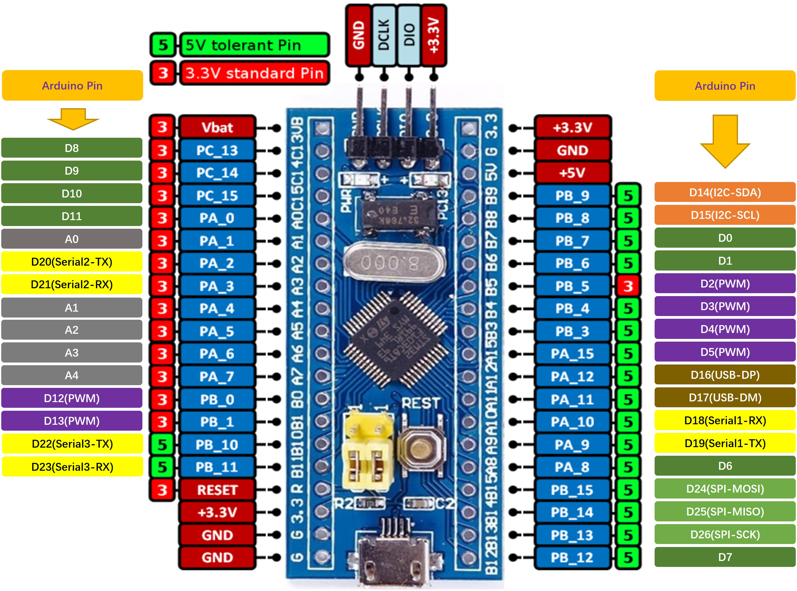

# STM32F103 Blue-Pill开发板的Arduino生态兼容说明

[English](README.md) | **中文**

## 1 RTduino - RT-Thread的Arduino生态兼容层

STM32F103 Blue-Pill开发板已经完整适配了[RTduino软件包](https://github.com/RTduino/RTduino)，即RT-Thread的Arduino生态兼容层。用户可以按照Arduino的编程习惯来操作该BSP，并且可以使用大量Arduino社区丰富的库，是对RT-Thread生态的极大增强。更多信息，请参见[RTduino软件包说明文档](https://github.com/RTduino/RTduino)。

### 1.1 如何开启针对本BSP的Arduino生态兼容层

Env 工具下敲入 menuconfig 命令，或者 RT-Thread Studio IDE 下选择 RT-Thread Settings：

```Kconfig
Hardware Drivers Config --->
    Onboard Peripheral Drivers --->
        [*] Compatible with Arduino Ecosystem (RTduino)
```

## 2 Arduino引脚排布

更多引脚布局相关信息参见 [pins_arduino.c](pins_arduino.c) 和 [pins_arduino.h](pins_arduino.h)。



| Arduino引脚编号         | STM32引脚编号 | 5V容忍 | 备注                                                                        |
| ------------------- | --------- | ---- | ------------------------------------------------------------------------- |
| 0 (D0)              | PB7       | 是    |                                                                           |
| 1 (D1)              | PB6       | 是    |                                                                           |
| 2 (D2)              | PB5       | 否    | PWM3-CH2，默认被RT-Thread的PWM设备框架pwm3接管                                       |
| 3 (D3)              | PB4       | 是    | PWM3-CH1，默认被RT-Thread的PWM设备框架pwm3接管                                       |
| 4 (D4)              | PB3       | 是    | PWM2-CH2，默认被RT-Thread的PWM设备框架pwm2接管                                       |
| 5 (D5)              | PA15      | 是    | PWM2-CH1，默认被RT-Thread的PWM设备框架pwm2接管                                       |
| 6 (D6)              | PA8       | 是    |                                                                           |
| 7 (D7, SS)          | PB12      | 是    | SPI片选默认引脚                                                                 |
| 8 (D8, LED_BUILTIN) | PC13      | 否    | 板载用户LED                                                                   |
| 9 (D9)              | PC14      | 否    |                                                                           |
| 10 (D10)            | PC15      | 否    |                                                                           |
| 11 (D11)            | PA0       | 否    |                                                                           |
| 12 (D12)            | PB0       | 否    | PWM3-CH3，默认被RT-Thread的PWM设备框架pwm3接管                                       |
| 13 (D13)            | PB1       | 否    | PWM3-CH4，默认被RT-Thread的PWM设备框架pwm3接管                                       |
| 14 (D14)            | PB9       | 是    | I2C-SDA，默认被RT-Thread的I2C设备框架i2c1总线接管                                      |
| 15 (D15)            | PB8       | 是    | I2C-SCL，默认被RT-Thread的I2C设备框架i2c1总线接管                                      |
| 16 (D16)            | PA12      | 是    | USB-DP，默认被 [TinyUSB软件包](https://github.com/RT-Thread-packages/tinyusb) 接管 |
| 17 (D17)            | PA11      | 是    | USB-DM，默认被 [TinyUSB软件包](https://github.com/RT-Thread-packages/tinyusb) 接管 |
| 18 (D18)            | PA10      | 是    | Serial-Rx，默认被RT-Thread的UART设备框架uart1接管                                    |
| 19 (D19)            | PA9       | 是    | Serial-Tx，默认被RT-Thread的UART设备框架uart1接管                                    |
| 20 (D20)            | PA2       | 否    | Serial2-Tx，默认被RT-Thread的UART设备框架uart2接管                                   |
| 21 (D21)            | PA3       | 否    | Serial2-Rx，默认被RT-Thread的UART设备框架uart2接管                                   |
| 22 (D22)            | PB10      | 是    | Serial3-Tx，默认被RT-Thread的UART设备框架uart3接管                                   |
| 23 (D23)            | PB11      | 是    | Serial3-Rx，默认被RT-Thread的UART设备框架uart3接管                                   |
| 24 (D24)            | PB15      | 是    | SPI-MOSI，默认被RT-Thread的SPI设备框架spi2接管                                       |
| 25 (D25)            | PB14      | 是    | SPI-MISO，默认被RT-Thread的SPI设备框架spi2接管                                       |
| 26 (D26)            | PB13      | 是    | SPI-SCK ，默认被RT-Thread的SPI设备框架spi2接管                                       |
| 27 (A0)             | PA1       | 否    | ADC1-CH1，默认被RT-Thread的ADC设备框架adc1接管                                       |
| 28 (A1)             | PA4       | 否    | ADC1-CH4，默认被RT-Thread的ADC设备框架adc1接管                                       |
| 29 (A2)             | PA5       | 否    | ADC1-CH5，默认被RT-Thread的ADC设备框架adc1接管                                       |
| 30 (A3)             | PA6       | 否    | ADC1-CH6，默认被RT-Thread的ADC设备框架adc1接管                                       |
| 31 (A4)             | PA7       | 否    | ADC1-CH7，默认被RT-Thread的ADC设备框架adc1接管                                       |
| 32 (A5)             | --        |      | 芯片内部参考电压 ADC，默认被RT-Thread的ADC设备框架adc1接管                                   |
| 33 (A6)             | --        |      | 芯片内部温度 ADC，默认被RT-Thread的ADC设备框架adc1接管                                     |

> 注意：
> 
> 1. 如果同时驱动舵机和调度analogWrite函数要选择不同定时器发生的PWM信号引脚，由于STM32的定时器4个通道需要保持相同的频率，如果采用相同的定时器发生的PWM分别驱动舵机和analogWrite，可能会导致舵机失效。

## 3 通信

### 3.1 I2C (Wire.h)

I2C总线是 `D14` 和 `D15` 引脚，这两个引脚默认是被RT-Thread I2C设备框架接管的，直接引用`#include <Wire.h>`（Arduino官方I2C头文件）即可使用。

### 3.2 SPI

SPI总线是 `D24` 、`D25` 和 `D26` 引脚，这三个引脚默认是被RT-Thread SPI设备框架接管的，直接引用`#include <SPI.h>`（Arduino官方SPI头文件）即可使用。此外，还使用到了片选引脚(SS)，默认为 `D7`。

### 3.3 串口

默认支持通过 `Serial.` 方法调用 `uart1` 串口设备；通过 `Serial2.` 方法调用 `uart2` 串口设备；通过 `Serial3.` 方法调用 `uart3` 串口设备。详见[例程](https://github.com/RTduino/RTduino/blob/master/examples/Basic/helloworld.cpp)。

### 3.4 USB虚拟串口

本BSP支持USB虚拟串口，如果需要使用，可以手动使能。详见[例程](https://github.com/RTduino/RTduino/tree/master/examples/USBSerial)。

```Kconfig
RT-Thread online packages --->
    Arduino libraries --->
        [*] RTduino: Arduino Ecological Compatibility Layer
            [*] Enable USB Serial
```
