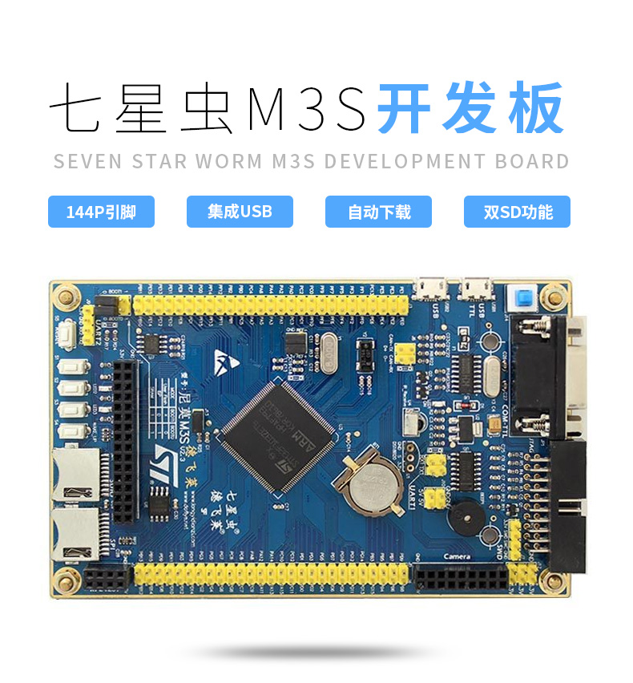

# STM32F103 德飞莱-尼莫 M3S 开发板 BSP 说明

## 简介

本文档是石河子大学陈庭伟同学为 STM32F103 德飞莱-尼莫 M3S 开发板提供的 BSP (板级支持包) 说明。

主要内容如下：

- 开发板资源介绍
- BSP 快速上手
- 进阶使用方法

通过阅读快速上手章节开发者可以快速地上手该 BSP，将 RT-Thread 运行在开发板上。在进阶使用指南章节，将会介绍更多高级功能，帮助开发者利用 RT-Thread 驱动更多板载资源。

## 开发板介绍

STM32F103 德飞莱-尼莫 M3S 是徳飞莱推出的一款基于 ARM Cortex-M3 内核的开发板，最高主频为 72Mhz，该开发板具有丰富的板载资源，可以充分发挥 STM32F103 的芯片性能。

开发板外观如下图所示：



该开发板常用 **板载资源** 如下：

- MCU：STM32F103ZET6，主频 72MHz，512KB FLASH ，64KB RAM
- 外部 RAM：型号24C02，2KB
- 外部 FLASH：型号W25Q64，8MB
- 常用外设
  - LED：2个，LED2（红色，PE5），LED3（红色，PB5）
  - 按键：4个，S1（PE4），S2（PE3），S3（PE2），S4（兼具唤醒功能，PA0）
- 常用接口：USB 转串口、SD 卡接口、RS232 接口、LCD 接口、NRF24L01接口等
- 调试接口，标准 JTAG/SWD

开发板更多详细信息请参考徳飞莱的 [STM32F103-尼莫M3S 开发板介绍](https://item.taobao.com/item.htm?spm=a1z10.1-c.w4004-1022655459.10.44ae4d22Wa8UIo&id=44835368405)。

## 外设支持

本 BSP 目前对外设的支持情况如下：

| **板载外设** | **支持情况** | **备注** |
| :-----: | :-----: | :-----: |
| SDCARD | 支持 |  |
| SPI FLASH | 支持 | W25Q64，8MB |
| EEPRAM | 支持 | 24c02，2KB |
| **片上外设** | **支持情况** | **备注** |
| GPIO  | 支持 |  |
| USART | 支持 | USART1 |
| SDIO | 支持 |  |
| SPI | 支持 | SPI1/2/3 |
| I2C | 支持 | 软件I2C |
| FLASH | 支持 | 已适配 [FAL](https://github.com/RT-Thread-packages/fal) |
| **扩展模块** | **支持情况** | **备注** |
| NRF24L01 | 支持 | 根据实际板子接线情况修改 NRF24L01 软件包中的 `NRF24L01_CE_PIN` 和 `NRF24_IRQ_PIN` 的宏定义，以及 SPI 设备名 |

## 使用说明

使用说明分为如下两个章节：

- 快速上手

    本章节是为刚接触 RT-Thread 的新手准备的使用说明，遵循简单的步骤即可将 RT-Thread 操作系统运行在该开发板上，看到实验效果 。

- 进阶使用

    本章节是为需要在 RT-Thread 操作系统上使用更多开发板资源的开发者准备的。通过使用 ENV 工具对 BSP 进行配置，可以开启更多板载资源，实现更多高级功能。


### 快速上手

本 BSP 为开发者提供 MDK4、MDK5 和 IAR 工程，并且支持 GCC 开发环境。下面以 MDK5 开发环境为例，介绍如何将系统运行起来。

#### 硬件连接

使用数据线连接开发板到 PC，打开电源开关。

#### 编译下载

双击 project.uvprojx 文件，打开 MDK5 工程，编译并下载程序到开发板。

> 工程默认配置使用 st-link 仿真器下载程序，在通过 st-link 连接开发板的基础上，点击下载按钮即可下载程序到开发板

#### 运行结果

下载程序成功之后，系统会自动运行，LED 闪烁。

连接开发板对应串口到 PC , 在终端工具里打开相应的串口（115200-8-1-N），复位设备后，可以看到 RT-Thread 的输出信息:

```bash
 \ | /
- RT -     Thread Operating System
 / | \     4.0.1 build Apr  9 2019
 2006 - 2019 Copyright by rt-thread team
msh >
```
### 进阶使用

此 BSP 默认只开启了 GPIO 和 串口1 的功能，如果需使用 SD 卡、Flash 等更多高级功能，需要利用 ENV 工具对BSP 进行配置，步骤如下：

1. 在 bsp 下打开 env 工具。

2. 输入`menuconfig`命令配置工程，配置好之后保存退出。

3. 输入`pkgs --update`命令更新软件包。

4. 输入`scons --target=mdk4/mdk5/iar` 命令重新生成工程。

本章节更多详细的介绍请参考 [STM32 系列 BSP 外设驱动使用教程](../docs/STM32系列BSP外设驱动使用教程.md)。

## 注意事项

- 这款开发板使用终端工具 SecureCRT 来打开串口会出现系统不能启动的问题，推荐使用 XCOM V2.0。

## 联系人信息

维护人:

-  [WillianChan](https://github.com/willianchanlovegithub)