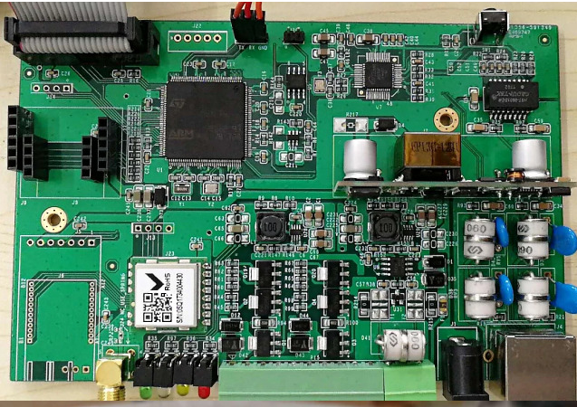

# STM32F103 硬十 iBox BSP 说明

## 简介

本文档为 STM32F103 硬件十万个为什么 iBox 开发板的 BSP (板级支持包) 说明。

主要内容如下：

- 开发板资源介绍
- BSP 快速上手
- 进阶使用方法

通过阅读快速上手章节开发者可以快速地上手该 BSP，将 RT-Thread 运行在开发板上。在进阶使用指南章节，将会介绍更多高级功能，帮助开发者利用 RT-Thread 驱动更多板载资源。

## 开发板介绍

硬十的iBox开发板是一款基于 ARM Cortex-M3 内核的开发板，是一群硬件匠人潜心打造的物联网开源硬件，最高主频 72MHz,含有丰富的板载资源，可以充分发挥 STM32F103 的芯片性能。

开发板外观如下图所示：



该开发板常用 **板载资源** 如下：

- MCU：STM32F103ZE，主频 72MHz，512KB FLASH ，64KB RAM
- 外部 RAM：无
- 外部 FLASH：无
- 常用外设
  - LED：3个，D7（黄色，PE10），D6（绿色，PE9）,D43(白色，PE12)
  - 按键：1个，sw1(PE15)
  - 外部看门狗 1个 U5 (PG6)
- 常用接口：串口、I2C、SPI接口等
- 调试接口，标准 JTAG/SWD

开发板更多详细信息请参考【硬十】 [iBox 开发板介绍](http://www.hw100k.com/forum.php?mod=viewthread&tid=3441&extra=page%3D2) 。

## 外设支持

本 BSP 目前对外设的支持情况如下：

| **板载外设**      | **支持情况** | **备注**                              |
| :----------------- | :----------: | :------------------------------------- |
| 以太网            |    支持      |  W5500   使用 SPI2                    |
| RS485             |    支持      |  MAX485  使用 UART4                   |
| LoRa              |    支持      |  利尔达  LSD4RF-2F717N30 使用 SPI1    |
| **片上外设**      | **支持情况** | **备注**                              |
| GPIO              |     支持     | PA0, PA1... PG15 ---> PIN: 0, 1...144 |
| UART              |     支持     | UART1                                 |
| SPI               |   暂不支持   |                                       |
| I2C               |     支持     | 软件 I2C (J14)                        |
| RTC               |     支持     | 支持外部晶振和内部低速时钟 |
| ADC               |     支持     | ADC1_CHANEL_10, ADC1_CHANNEL_11       |
| PWM               |   暂不支持   |                                       |
| IWG               |    支持      | 命令：iwdg_sample wdt                 |
| FLASH             |    支持      | 已适配 FAL                            |
| **扩展模块**      | **支持情况** | **备注**                              |
| WIFI  ESP8266     |    支持      | 硬十 ESP-02   使用 UART3              |

## 使用说明

使用说明分为如下两个章节：

- 快速上手

    本章节是为刚接触 RT-Thread 的新手准备的使用说明，遵循简单的步骤即可将 RT-Thread 操作系统运行在该开发板上，看到实验效果 。

- 进阶使用

    本章节是为需要在 RT-Thread 操作系统上使用更多开发板资源的开发者准备的。通过使用 ENV 工具对 BSP 进行配置，可以开启更多板载资源，实现更多高级功能。


### 快速上手

本 BSP 为开发者提供 MDK4、MDK5 和 IAR 工程，并且支持 GCC 开发环境。下面以 MDK5 开发环境为例，介绍如何将系统运行起来。

#### 硬件连接

使用USB转串口线，其中开发板上 Tx 接 串口线 TXD, 开发板 Rx 接 串口线 RXD ,再将串口线接到 PC，接通12V外接电源，接上 Jlink 仿真器。

#### 编译下载

双击 project.uvprojx 文件，打开 MDK5 工程，编译并下载程序到开发板。

> 工程默认配置使用 JLink 仿真器下载程序，在通过 JLink连接开发板的基础上，点击下载按钮即可下载程序到开发板

#### 运行结果

下载程序成功之后，系统会自动运行，观察开发板上 LED 的运行效果，其中一个电源指示灯红灯常亮，绿色 LED 会周期性闪烁。

连接开发板对应串口到 PC , 在终端工具里打开相应的串口（115200-8-1-N），复位设备后，可以看到 RT-Thread 的输出信息:

```bash
 \ | /
- RT -     Thread Operating System
 / | \     4.0.0 build Jan 11 2019
 2006 - 2018 Copyright by rt-thread team
msh >
```
### 进阶使用

此 BSP 默认只开启了 GPIO 和 串口1 的功能，如果需使用以太网、WIFI 等更多高级功能，需要利用 ENV 工具对BSP 进行配置，步骤如下：

1. 在 bsp 下打开 env 工具。

2. 输入`menuconfig`命令配置工程，配置好之后保存退出。

3. 输入`pkgs --update`命令更新软件包。

4. 输入`scons --target=mdk4/mdk5/iar` 命令重新生成工程。

本章节更多详细的介绍请参考 [STM32 系列 BSP 外设驱动使用教程](../docs/STM32系列BSP外设驱动使用教程.md)。

## 注意事项

- 此开发板外部高速晶振是 12MHz ;
- 使用 WIFI ESP8266 , 需将 CH_PD (PG1) 引脚拉高 ; 
- 使用 W5500,需插上网线 ; 
- 测试 Lora 模块，可直接使用 sx12xx 软件包 ;
- 使用 MAX485, 可使用 软件包中 串口例程，增加收发使能引脚的控制 ;

## 联系人信息

维护人:

-  [XiaojieFan](https://github.com/XiaojieFan), 邮箱：<dingo1688@126.com>
