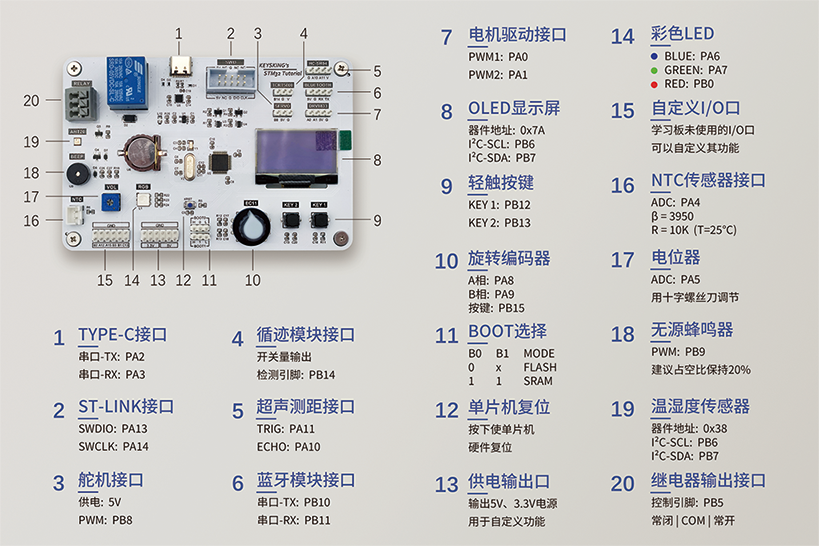

# Keysking STM32学习板BSP说明

## 简介

本文档是为Keysking学习板提供的BSP(板级支持包)说明。

主要内容如下：

* 开发板资源介绍

* BSP快速上手

* 进阶使用

通过阅读快速上手章节开发者可以快速的上手该BSP，将RT-Thread运行在开发板上。在进阶使用指南章节，将会介绍更多高级功能，帮助开发者利用RT-Thread驱动更多板载资源。

## 开发板介绍

Keysking学习板是B站UP主Keysking推出的一块基于ARM Cortex-M3内核的开发板，MCU型号为STM32F103C8T6，最高主频为72MHz。

开发板主要内容如下图所示：



该开发板常用**板载资源**如下：

* MCU: STM32F103C8T6，主频72MHz，64KB FLASH，20KB RAM

* 常用外设可参考图示

* 常用接口：USB转串口

* 调试接口：SWD

开发板更多详细信息以及配套视频教程请参考[波特律动官网](https://docs.baud-dance.com/)。

## 外设支持

本BSP目前对外设的支持情况如下：

| 板载外设                               | 支持情况     | 备注                                         |
| ---------------------------------- |:--------:| ------------------------------------------ |
| USB转串口                             | 支持       | UART2(用作finsh)                             |
| 旋转编码器                              | 支持       | A相(PA8),B相(PA9),按键(PB15)                   |
| OLED                               | 支持       | I2C1，0x7A                                  |
| LED                                | 支持       | GPIO or PWM: Blue(PA6)，Green(PA7)，Red(PB0) |
| 无源蜂鸣器                              | 支持       | PWM4_CH4                                   |
| 电位器                                | 支持       | ADC1_IN5                                   |
| 温湿度传感器                             | 支持       | I2C1，0x38                                  |
| **片上外设**                           | **支持情况** | **备注**                                     |
| GPIO                               | 支持       |                                            |
| UART                               | 支持       | UART2,3                                    |
| PWM                                | 支持       | PWM2,3,4                                   |
| ADC                                | 支持       | ADC1                                       |
| **预留外设接口**                         | **支持情况** | **备注**                                     |
| SERVO                              | 支持       | PWM4_CH3                                   |
| DRV8833                            | 支持       | PWM2_CH1&2                                 |
| BLUETOOTH                          | 支持       | UART3                                      |
| TCRT5000                           |          |                                            |
| HC-SR04超声波                         |          |                                            |
| NTC传感器 | 支持       | ADC1_IN4                                   |

## 使用说明

使用说明分为如下两个章节：

- 快速上手
  本章节是为刚接触 RT-Thread 的新手准备的使用说明，遵循简单的步骤即可将 RT-Thread 操作系统运行在该开发板上，看到实验效果 。

- 进阶使用
  本章节是为需要在 RT-Thread 操作系统上使用更多开发板资源的开发者准备的。通过使用 ENV 工具对 BSP 进行配置，可以开启更多板载资源，实现更多高级功能。

### 快速上手

本 BSP 为开发者提供 MDK5 和 IAR 工程，并且支持 GCC 开发环境。下面以 MDK5 开发环境为例，介绍如何将系统运行起来。

**请注意！！！**

在执行编译工作前请先打开ENV执行以下指令（该指令用于拉取必要的HAL库及CMSIS库，否则无法通过编译）：

```bash
pkgs --update
```

#### 硬件连接

使用ST-Link调试下载器连接开发板的SWD接口，再将ST-Link的另一端连接到PC，然后将Mini开发板插入PC的USB口。

#### 编译下载

双击 project.uvprojx 文件，打开 MDK5 工程，编译并下载程序到开发板。

> 工程默认配置使用 ST-Link 下载程序，在通过 ST-Link连接开发板的基础上，点击下载按钮即可下载程序到开发板

#### 运行结果

下载程序成功之后，系统会自动运行，观察开发板上 LED 的运行效果，其中一个 LED 会周期性闪烁。

连接开发板对应串口到 PC , 在终端工具里打开相应的串口（115200-8-1-N），复位设备后，可以看到 RT-Thread 的输出信息:

```bash
 \ | /
- RT -     Thread Operating System
 / | \     4.1.1 build May 30 2022 17:15:31
 2006 - 2022 Copyright by RT-Thread team
msh />
```

### 进阶使用

此 BSP 默认只开启了 GPIO 和 串口2 的功能，如果需使用更多高级功能，需要利用 ENV 工具对BSP 进行配置，步骤如下：

1. 在 bsp 下打开 env 工具。

2. 输入`menuconfig`命令配置工程，配置好之后保存退出。

3. 输入`pkgs --update`命令更新软件包。

4. 输入`scons --target=mdk5/iar` 命令重新生成工程。

本章节更多详细的介绍请参考 [STM32 系列 BSP 外设驱动使用教程](../docs/STM32系列BSP外设驱动使用教程.md)。

## 注意事项

STM32F103C8T6的Flash在官方文档中的大小是64KB，但是其实该芯片与F103RBT6硬件上是一模一样的。RBT6出厂时完整测试了128KB的Flash情况，而C8T6厂商只保证前64KB是正常运行的。

在链接脚本中，本开发板的Flash与其他C8T6的BSP保持一致，都设置为128KB（只有64的话稍微多点功能就不够用了，并且超过64KB的部分也是可以烧录进芯片的，具体能用多少看运气）

为了保证绝对稳定，可以注意编译结果是否小于64KB。如果遇到功能问题也可以看看是不是这里出问题了。

## 联系人信息

维护人: 

* qianjiuyuan, 邮箱:<qianjiuyuan05@qq.com>
