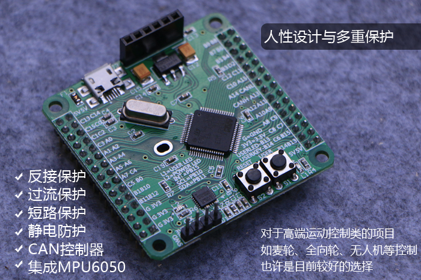

# BSP README 模板

## 简介

本文档为 minibalance 开发板的 BSP (板级支持包) 说明。

主要内容如下：

- 开发板资源介绍
- BSP 快速上手
- 进阶使用方法

通过阅读快速上手章节开发者可以快速地上手该 BSP，将 RT-Thread 运行在开发板上。在进阶使用指南章节，将会介绍更多高级功能，帮助开发者利用 RT-Thread 驱动更多板载资源。

## 开发板介绍

【minibalance “平衡小车之家”的开发板，256KB FLASH，所有的IO全部引出，板载MPU6050陀螺仪和加速度计，配备CAN控制器，自恢复保险丝】

开发板外观如下图所示：



该开发板常用 **板载资源** 如下：

- MCU：STM32F103RCT6，主频 72MHz，256KB FLASH ，48KB RAM
- 常用外设
  - LED：1个，L1（红色，PB13）
  - 按键：2个，S1（用户自定义按键，PB14），S2（复位）
- 常用接口：USB 转串口、OLED 接口、CAN 接口等
- 调试接口: SWD

## 外设支持

本 BSP 目前对外设的支持情况如下：

| **板载外设**      | **支持情况** | **备注**                             |
| :---------------- | :----------: | :-------------------------------------|
| USB 转串口        |     支持     |                                       |
| CAN               |   暂不支持   | 即将支持                              |
| IMU6050           |   暂不支持   | 即将支持                              |
| **片上外设**      | **支持情况** | **备注**                             |
| GPIO              |     支持     | 全部引出                              |
| UART              |     支持     | UART1                                 |
| SPI               |     支持     | SPI1/x/x                              |
| I2C               |     支持     | 软件 I2C                              |
| PWM               |   暂不支持   | 即将支持                              |
| **扩展模块**      | **支持情况** | **备注**                             |
| OLED 模块         |   暂不支持   | 即将支持                              |
| PS2 模块          |   暂不支持   | 即将支持                              |
| BTN电机驱动 模块  |   暂不支持   | 即将支持                              |
| BT04蓝牙 模块     |   暂不支持   | 即将支持                              |

## 使用说明

使用说明分为如下两个章节：

- 快速上手

    本章节是为刚接触 RT-Thread 的新手准备的使用说明，遵循简单的步骤即可将 RT-Thread 操作系统运行在该开发板上，看到实验效果 。

- 进阶使用

    本章节是为需要在 RT-Thread 操作系统上使用更多开发板资源的开发者准备的。通过使用 ENV 工具对 BSP 进行配置，可以开启更多板载资源，实现更多高级功能。


### 快速上手

本 BSP 为开发者提供 MDK4、MDK5 和 IAR 工程，并且支持 GCC 开发环境。下面以 MDK5 开发环境为例，介绍如何将系统运行起来。

#### 硬件连接

使用数据线连接开发板到 PC，打开电源开关。

#### 编译下载

双击 project.uvprojx 文件，打开 MDK5 工程，编译并下载程序到开发板。

> 工程默认配置使用 xxx 仿真器下载程序，在通过 xxx 连接开发板的基础上，点击下载按钮即可下载程序到开发板

#### 运行结果

下载程序成功之后，系统会自动运行，【这里写开发板运行起来之后的现象，如：LED 闪烁等】。

连接开发板对应串口到 PC , 在终端工具里打开相应的串口（115200-8-1-N），复位设备后，可以看到 RT-Thread 的输出信息:

```bash
 \ | /
- RT -     Thread Operating System
 / | \     4.0.2 build Oct 10 2019
 2006 - 2019 Copyright by rt-thread team
msh >
```

### 进阶使用

此 BSP 默认只开启了 GPIO 和 串口1 的功能，如果需使用更多高级功能，需要利用 ENV 工具对BSP 进行配置，步骤如下：

1. 在 bsp 下打开 env 工具。

2. 输入`menuconfig`命令配置工程，配置好之后保存退出。

3. 输入`pkgs --update`命令更新软件包。

4. 输入`scons --target=mdk4/mdk5/iar` 命令重新生成工程。

本章节更多详细的介绍请参考 [STM32 系列 BSP 外设驱动使用教程](../docs/STM32系列BSP外设驱动使用教程.md)。

## 注意事项

- 学习rt-thread使用

## 联系人信息

维护人:

-  [尹启睿](https://github.com/incarry), 邮箱：<yinqirui9@foxmail.com>