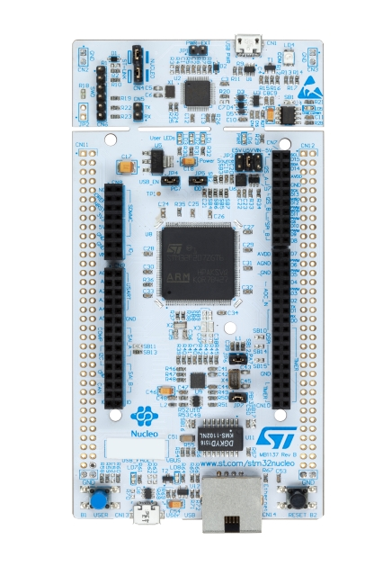

# BSP README 模板

## 简介

本文档为 STM32F207 Nucleo-144 开发板的 BSP (板级支持包) 说明。

主要内容如下：

- 开发板资源介绍
- BSP 快速上手
- 进阶使用方法

通过阅读快速上手章节开发者可以快速地上手该 BSP，将 RT-Thread 运行在开发板上。在进阶使用指南章节，将会介绍更多高级功能，帮助开发者利用 RT-Thread 驱动更多板载资源。

## 开发板介绍

STM32 Nucleo-144 是 ST 官方推出的开发板，搭载 STM32F207ZG 芯片，基于 ARM Cortex-M3 内核，最高主频 120 MHz，具有丰富的板载资源，可以充分发挥 STM32F207ZG 的芯片性能。

开发板外观如下图所示：



该开发板常用 **板载资源** 如下：

- MCU：STM3207ZG，主频 120MHz，1MB FLASH ，128KB RAM
- 常用外设
  - LED：3个，LD1（绿色，PB0），LD2（蓝色，PB7），LD3（红色，PB14）
  - 按键：2 个，USER and RESET 。
- 常用接口：USB 转串口、以太网接口、Arduino Uno 和 ST morpho 两类扩展接口
- 调试接口，标准 JTAG/SWD

快速入门：[Getting started with STM32 Nucleo board software development tools](https://www.st.com/resource/en/user_manual/dm00105928-getting-started-with-stm32-nucleo-board-software-development-tools-stmicroelectronics.pdf)

原理图下载：[STM32 Nucleo (144 pins) schematics](https://www.st.com/resource/en/schematic_pack/nucleo_144pins_sch.zip)

*更多相关信息资料见 ST 官网详情页：[STM32 Nucleo-144 development board with STM32F207ZG MCU](https://www.st.com/content/st_com/en/products/evaluation-tools/product-evaluation-tools/mcu-mpu-eval-tools/stm32-mcu-mpu-eval-tools/stm32-nucleo-boards/nucleo-f207zg.html)*

## 外设支持

本 BSP 目前对外设的支持情况如下：

| **板载外设**      | **支持情况** | **备注**                              |
| :----------------- | :----------: | :------------------------------------- |
| USB 转串口        |     支持     |                                       |
| 以太网            |     暂不支持     |                                       |
| **片上外设**      | **支持情况** | **备注**                              |
| GPIO              |     支持     | PA0, PA1... PH1 ---> PIN: 0, 1...144 |
| UART              |     支持     | UART3                          |
| SPI               |     暂不支持     |                               |
| I2C               |     暂不支持     |                               |
| RTC               |   暂不支持   |                               |
| PWM               |   暂不支持   |                               |
| USB Device        |   暂不支持   |                               |
| USB Host          |   暂不支持   |                               |
| IWG               |   暂不支持   |                               |

## 使用说明

使用说明分为如下两个章节：

- 快速上手

    本章节是为刚接触 RT-Thread 的新手准备的使用说明，遵循简单的步骤即可将 RT-Thread 操作系统运行在该开发板上，看到实验效果 。

- 进阶使用

    本章节是为需要在 RT-Thread 操作系统上使用更多开发板资源的开发者准备的。通过使用 ENV 工具对 BSP 进行配置，可以开启更多板载资源，实现更多高级功能。


### 快速上手

本 BSP 为开发者提供 MDK4、MDK5 和 IAR 工程，并且支持 GCC 开发环境。下面以 MDK5 开发环境为例，介绍如何将系统运行起来。

#### 硬件连接

使用数据线连接开发板到 PC，打开电源开关。

#### 编译下载

双击 project.uvprojx 文件，打开 MDK5 工程，编译并下载程序到开发板。

> 工程默认配置使用 xxx 仿真器下载程序，在通过 xxx 连接开发板的基础上，点击下载按钮即可下载程序到开发板

#### 运行结果

下载程序成功之后，系统会自动运行，红色 LD3 会周期性闪烁。。

USB 虚拟 COM 端口默认连接串口 3，在终端工具里打开相应的串口（115200-8-1-N），复位设备后，可以看到 RT-Thread 的输出信息:

```bash
 \ | /
- RT -     Thread Operating System
 / | \     4.0.3 build Apr 12 2021
 2006 - 2021 Copyright by rt-thread team
msh >

```
### 进阶使用

此 BSP 默认只开启了 GPIO 和 串口3 的功能，更多高级功能需要利用 ENV 工具对 BSP 进行配置，步骤如下：

1. 在 bsp 下打开 env 工具。

2. 输入`menuconfig`命令配置工程，配置好之后保存退出。

3. 输入`pkgs --update`命令更新软件包。

4. 输入`scons --target=mdk4/mdk5/iar` 命令重新生成工程。

本章节更多详细的介绍请参考 [STM32 系列 BSP 外设驱动使用教程](../docs/STM32系列BSP外设驱动使用教程.md)。

## 注意事项

- 关于 pin 序号规则，与旧 bsp 使用封装管脚序号不同，在新的 stm32 bsp 框架中，统一采用顺序编号的方式，对 GPIO 驱动进行管理，在移植旧 bsp 时特别要注意这点。

  pin 序号与引脚名对应关系如下表：

  | STM32 引脚名 | 管脚序号 pin |
  | ------------ | ------------ |
  | PA0 - PA15   | 0 - 15       |
  | PB0 - PB15   | 16 - 31      |
  | PC0 - PC15   | 32 - 47      |
  | PD0 - ...    | 48 - ...     |


## 联系人信息

维护人:

-  [wanghaijing](https://github.com/whj4674672) ，邮箱：<whj4674672@163.com>