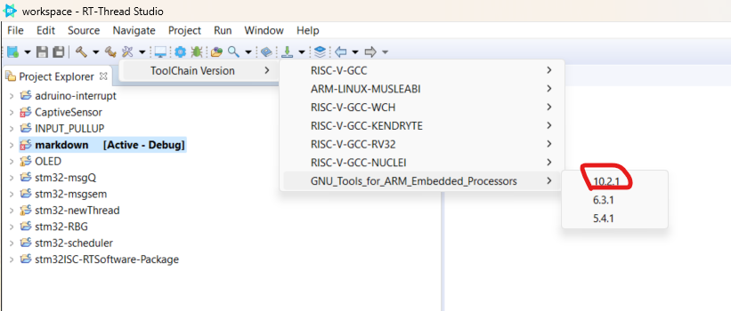

## [STM32F401] How to create a new project

***info:***
:bulb: Download the latest RT-Thread studio from link -
https://www.rt-thread.io/studio.html 
and follow the instructions to install it on your windows machine. 

## 1 Create a new project

### 1.1 Go to File -> Import.

### 1.2 Select RT-Thread Bsp Project into Workspace.

### 1.3 Import Projects from BSP.

### 1.4 Browse Bsp Location to rt-threadx\bsp\stm32\stm32f401-st-nucleo, then click Select Folder.

### 1.5 Fill up the rest of the information and select ST-LINK for debugger. Then, click finish button. There will be a newly created project at the workspace. 

## 2 Tool Chain

### 2.1 Select the latest tool chain version to resolve the warning.

### 2.2 If there is no latest tool chain version, click SDK manager to download the latest version.

> Select the latest version from the RT-Thread SDK Manager window and click install packages button. After installation, click Exit SDK Manger button again.

> Then select the latest version from the Open Build Settings Dialog.

## 3 RT-Thread Setting

### 3.1 In order to configure kernel and to enable add-on software packages, click RT-Thread Settings. Then, click detail button.

### 3.2 After configuration, click save to update the latest configuration.

## 4 Compilation

### 4.1 In order to complie the project, select the project and ensure that it is [Active - Debug ] state.

### 4.2 Click compilation icon at the menu bar to compile the project.

## 5 Terminal 

To access the development board, click terminal icon at the menu ba and select the correct serial port.

## 6 Additional Info 

If you need addtional information, visit to 

https://www.rt-thread.io/document/site/programming-manual/interrupt/interrupt/

## 

###### Author
###### Stanley Lwin [04 / 11 / 2023]