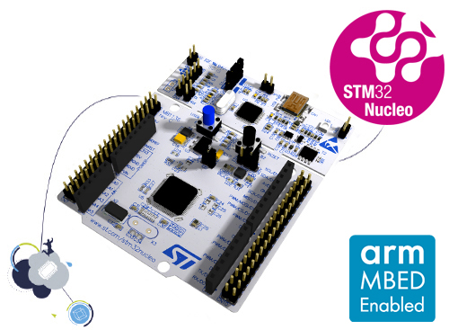

# STM32F401 Nucleo-64 开发板 BSP 说明

## 简介

本文档为 STM32F401 Nucleo-64 开发板的 BSP (板级支持包) 说明。

主要内容如下：

- 开发板资源介绍
- BSP 快速上手
- 进阶使用方法

通过阅读快速上手章节开发者可以快速地上手该 BSP，将 RT-Thread 运行在开发板上。在进阶使用指南章节，将会介绍更多高级功能，帮助开发者利用 RT-Thread 驱动更多板载资源。

## 开发板介绍

STM32 Nucleo-64 是 ST 官方推出的开发板，搭载 STM32F401RE 芯片，基于 ARM Cortex-M4 内核，最高主频 84 MHz，具有丰富的板载资源，可以充分发挥 STM32F401RE 的芯片性能。

开发板外观如下图所示：



STM32F401 Nucleo-64 开发板常用 **板载资源** 如下：

- MCU：STM32F401RET6，主频 84MHz，512KB FLASH ，96KB RAM
- 常用外设
  - LED：3 个，USB communication (LD1), user LED (LD2), power LED (LD3) 。
  - 按键：2 个，USER and RESET 。
- 常用接口：USB 转串口、Arduino Uno 和 ST morpho 两类扩展接口
- 调试接口：板载 ST-LINK/V2-1 调试器。

快速入门：[Getting started with STM32 Nucleo board software development tools](https://www.st.com/resource/en/user_manual/dm00105928.pdf)

原理图下载：[STM32 Nucleo (64 pins) schematics](https://www.st.com/resource/en/schematic_pack/nucleo_64pins_sch.zip)

*更多相关信息资料见 ST 官网详情页：[STM32 Nucleo-64 development board with STM32F401RE MCU](https://www.st.com/zh/evaluation-tools/nucleo-f401re.html)*

## 外设支持

本 BSP 目前对外设的支持情况如下：

| **片上外设**   | **支持情况** |               **备注**                 |
| :------------ | :----------: | :-----------------------------------: |
| GPIO          |     支持     | PA0, PA1... PH1 ---> PIN: 0, 1...63    |
| UART          |     支持     |              UART2                     |
| SPI           |     支持     |              SPI1                      |

## 使用说明

使用说明分为如下两个章节：

- 快速上手

    本章节是为刚接触 RT-Thread 的新手准备的使用说明，遵循简单的步骤即可将 RT-Thread 操作系统运行在该开发板上，看到实验效果 。

- 进阶使用

    本章节是为需要在 RT-Thread 操作系统上使用更多开发板资源的开发者准备的。通过使用 ENV 工具对 BSP 进行配置，可以开启更多板载资源，实现更多高级功能。


### 快速上手

本 BSP 为开发者提供 MDK5 和 IAR 工程，并且支持 GCC 开发环境。下面以 MDK5 开发环境为例，介绍如何将系统运行起来。

#### 硬件连接

使用 Type-A to Mini-B 线连接开发板和 PC 供电，红色 LED LD3 (PWR) 和 LD1 (COM) 会点亮。

#### 编译下载

双击 project.uvprojx 文件，打开 MDK5 工程，编译并下载程序到开发板。

> 工程默认配置使用 ST-LINK 下载程序，点击下载按钮即可下载程序到开发板。

#### 运行结果

下载程序成功之后，系统会自动运行，观察开发板上 LED 的运行效果，红色 LD3 和 LD1 常亮、绿色 LD2 会周期性闪烁。

USB 虚拟 COM 端口默认连接串口 2，在终端工具里打开相应的串口（115200-8-1-N），复位设备后，可以看到 RT-Thread 的输出信息:

```bash
 \ | /
- RT -     Thread Operating System
 / | \     4.0.1 build Mar  7 2019
 2006 - 2019 Copyright by rt-thread team
msh >
```
### 进阶使用

此 BSP 默认只开启了 GPIO 和 串口 2 的功能，更多高级功能需要利用 ENV 工具对 BSP 进行配置，步骤如下：

1. 在 BSP 下打开 env 工具。

2. 输入 `menuconfig` 命令配置工程，配置好之后保存退出。

3. 输入 `pkgs --update` 命令更新软件包。

4. 输入 `scons --target=mdk4/mdk5/iar` 命令重新生成工程。

本章节更多详细的介绍请参考 [STM32 系列 BSP 外设驱动使用教程](../docs/STM32 系列 BSP 外设驱动使用教程. md)。

## 注意事项

关于 pin 序号规则，与旧 bsp 使用封装管脚序号不同，在新的 stm32 bsp 框架中，统一采用顺序编号的方式，对 GPIO 驱动进行管理，在移植旧 bsp 时特别要注意这点。

pin 序号与引脚名对应关系如下表：

| STM32 引脚名  | 管脚序号 pin |
|--------------|--------------|
| PA0 - PA15   | 0 - 15       | 
| PB0 - PB15   | 16 - 31      | 
| PC0 - PC15   | 32 - 47      |
| PD0 - ...    | 48 - ...     |  

## 联系人信息

维护人:

- [shaoguoji](https://github.com/shaoguoji) ，邮箱：<752147916@qq.com>