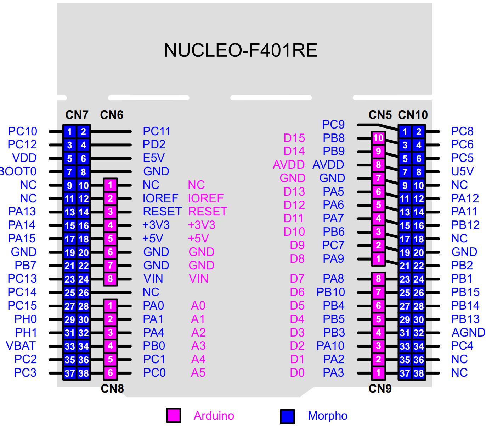

# STM32F401 Nucleo开发板的Arduino生态兼容说明

## 1 RTduino - RT-Thread的Arduino生态兼容层

STM32F401 Nucleo开发板已经完整适配了[RTduino软件包](https://github.com/RTduino/RTduino)，即RT-Thread的Arduino生态兼容层。用户可以按照Arduino的编程习惯来操作该BSP，并且可以使用大量Arduino社区丰富的库，是对RT-Thread生态的极大增强。更多信息，请参见[RTduino软件包说明文档](https://github.com/RTduino/RTduino)。

### 1.1 如何开启针对本BSP的Arduino生态兼容层

Env 工具下敲入 menuconfig 命令，或者 RT-Thread Studio IDE 下选择 RT-Thread Settings：

```Kconfig
Hardware Drivers Config --->
    Onboard Peripheral Drivers --->
        [*] Support Arduino
```

## 2 Arduino引脚排布



该BSP遵照Arduino UNO板的引脚排列方式。详见 `pins_arduino.c`

| Arduino引脚编号 | STM32引脚编号 | 备注                                                         |
| --------------- | ------------- | ------------------------------------------------------------ |
| 0 (D0)          | --            | 该引脚在UNO板中为串口RX引脚，不可当做普通IO                  |
| 1 (D1)          | --            | 该引脚在UNO板中为串口TX引脚，不可当做普通IO                  |
| 2 (D2)          | PA10          |                                                              |
| 3 (D3)          | PB3           | PWM（定时器2发生）                                           |
| 4 (D4)          | PB5           |                                                              |
| 5 (D5)          | PB4           | PWM（定时器3发生）                                           |
| 6 (D6)          | PB10          | PWM（定时器2发生）                                           |
| 7 (D7)          | PA8           |                                                              |
| 8 (D8)          | PA9           |                                                              |
| 9 (D9)          | PC7           | PWM（定时器3发生）                                           |
| 10 (D10)        | PB6           | SPI1-CS，被RT-Thread的SPI设备框架spi1总线接管，不可当做普通IO |
| 11 (D11)        | PA7           | SPI1-MOSI，被RT-Thread的SPI设备框架spi1总线接管，不可当做普通IO |
| 12 (D12)        | PA6           | SPI1-MISO，被RT-Thread的SPI设备框架spi1总线接管，不可当做普通IO |
| 13 (D13)        | PA5           | SPI1-SCK，被RT-Thread的SPI设备框架spi1总线接管，不可当做普通IO |
| 14 (D14)        | PB9           | I2C1-SDA，被RT-Thread的I2C设备框架i2c1总线接管，不可当做普通IO |
| 15 (D15)        | PB8           | I2C1_SCL，被RT-Thread的I2C设备框架i2c1总线接管，不可当做普通IO |
| 16 (D16)        | PC13          | Nucleo板载用户按键（左侧蓝色）                               |
| A0              | PA0           | ADC                                                          |
| A1              | PA1           | ADC                                                          |
| A2              | PA4           | ADC                                                          |
| A3              | PB0           | ADC                                                          |
| A4              | PC1           | ADC                                                          |
| A5              | PC0           | ADC                                                          |
| A6              | --            | 芯片内部参考电压 ADC                                         |
| A7              | --            | 芯片内部温度 ADC                                             |

> 注意：
>
> 1. 驱动舵机和analogWrite函数要选择不同定时器发生的PWM信号引脚，由于STM32的定时器4个通道需要保持相同的频率，如果采用相同的定时器发生的PWM分别驱动舵机和analogWrite，可能会导致舵机失效。
> 2. USART2是Nucleo板的默认串口，理论应对接到了Arduino引脚编号的D0和D1，但是其实际用于串口通信，因此不允许当做普通IO来使用和操作。如果需要将D0、D1与STM32 USART2的引脚相连，需要手动焊接锡桥SB62、SB63。
> 3. Nucleo板的Arduino接口中AVDD（即AREF）默认是与VDD相连的，如果需要扩展板提供外部参考电压，需要将SB57锡桥挑开。

> 参考资料
>
> 【1】[STM32 Nucleo板官方手册](https://www.st.com/resource/en/user_manual/um1724-stm32-nucleo64-boards-mb1136-stmicroelectronics.pdf)

## 3 I2C总线

STM32F401 Nucleo板的I2C总线是板上丝印的 `SCL/D15` 和 `SDA/D14` 引脚，这两个引脚是被RT-Thread I2C设备框架接管的，不需要直接操控这两个引脚，直接引用`#include <Wire.h>`（Arduino官方I2C头文件）即可使用。

## 4 SPI总线

STM32F401 Nucleo板的SPI总线是板上丝印的 `SCK/D13`、`MISO/D12`、`MOSI/D11`引脚，这3个引脚是被RT-Thread SPI设备框架接管的，不需要直接操控这3个引脚，直接引用`#include <SPI.h>`（Arduino官方SPI头文件）即可使用。按照Arduino的编程标准，用户需要自行控制片选信号。

