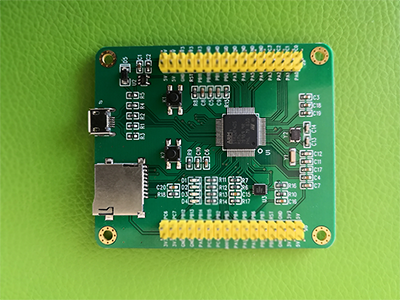

# STM32F405 三木电子开发板 BSP 说明

## 简介

本文档为 SM1432F405 开发板的 BSP (板级支持包) 说明。

主要内容如下：

- 开发板资源介绍
- BSP 快速上手
- 进阶使用方法

通过阅读快速上手章节开发者可以快速地上手该 BSP，将 RT-Thread 运行在开发板上。在进阶使用指南章节，将会介绍更多高级功能，帮助开发者利用 RT-Thread 驱动更多板载资源。

## 开发板介绍

SM1432F405 是三木电子推出的一款基于 ARM Cortex-M4 内核的开发板，最高主频为 168Mhz，该开发板配置USB通信接口,SD卡存储接口,io扩展,按键等,方便扩展多种模块。

开发板型号:SM1432F405

开发板外观如下图所示：



该开发板常用 **板载资源** 如下：

- MCU：STM32F405RG，主频 168MHz，1024KB FLASH ，196KB RAM
- 常用外设
  - LED：4个，D1（绿色，PC4），D2（蓝色，PA8）,D3（黄色，PC5）,D4（红色，PA10）
  - 按键：2个，K1(复位），K2（用户按键,PA13）
- 常用接口：USB接口、SD 卡接口，IO扩展口,三轴加速度传感器

## 外设支持

本 BSP 目前对外设的支持情况如下：

| **板载外设**      | **支持情况** | **备注**                              |
| :----------------- | :----------: | :------------------------------------- |
| USB               |     暂不支持     |                                       |
| SD卡              |    暂不支持   |                                       |
|     MMA7660三轴加速度传感器      |  暂不支持   | 即将支持                              |
| LED              |    暂不支持   |即将支持                                       |
| **片上外设**      | **支持情况** | **备注**                              |
| GPIO              |     支持     | PA0..PA15，PB0..PB15,PC0..PC5 ---> PIN: 0..37 |
| UART              |     支持     | UART2                             |
| SPI               |   暂不支持    | 即将支持                              |
| I2C               |   暂不支持    | 即将支持                              |
| SDIO              |   暂不支持   | 即将支持                              |
| RTC               |   暂不支持   | 即将支持                              |
| PWM               |   暂不支持   | 即将支持                              |
| USB Device        |   暂不支持   | 即将支持                              |
| USB Host          |   暂不支持   | 即将支持                              |
| **扩展模块**      | **支持情况** | **备注**                              |
|     W5500 模块      |  暂不支持   | 即将支持                              |
|     OLED 模块      |  暂不支持   | 即将支持                              |
|     蜂鸣器 模块      |  暂不支持   | 即将支持                              |
|     旋转编码器模块      |  暂不支持   | 即将支持                              |
|     TM1638A数码管显示模块      |  暂不支持   | 即将支持                              |
|     TM1638B数码管显示模块      |  暂不支持   | 即将支持                              |
|     步进电机模块      |  暂不支持   | 即将支持                              |
|     直流电机模块      |  暂不支持   | 即将支持                              |
|     光照传感器模块      |  暂不支持   | 即将支持                              |
|     温湿度传感器模块      |  暂不支持   | 即将支持                              |


## 使用说明

使用说明分为如下两个章节：

- 快速上手

    本章节是为刚接触 RT-Thread 的新手准备的使用说明，遵循简单的步骤即可将 RT-Thread 操作系统运行在该开发板上，看到实验效果 。

- 进阶使用

    本章节是为需要在 RT-Thread 操作系统上使用更多开发板资源的开发者准备的。通过使用 ENV 工具对 BSP 进行配置，可以开启更多板载资源，实现更多高级功能。


### 快速上手

本 BSP 为开发者提供 MDK4、MDK5 和 IAR 工程，并且支持 GCC 开发环境。下面以 MDK5 开发环境为例，介绍如何将系统运行起来。

#### 硬件连接

使用数据线连接开发板到 PC，打开电源开关。

#### 编译下载

方式一:

双击 project.uvprojx 文件，打开 MDK5 工程，编译并下载程序到开发板。

> 工程默认配置使用JLINK仿真器下载程序，在通过JLINK仿真器连接开发板的基础上，点击下载按钮即可下载程序到开发板

方式二:

> 在ENV工具中,使用scons命令进行编译,生成.bin文件,然后使用Jlink仿真器下载到开发板中

#### 运行结果

下载程序成功之后，系统会自动运行。

连接开发板对应串口到 PC , 在终端工具里打开相应的串口（115200-8-1-N），复位设备后，可以看到 RT-Thread 的输出信息:

```bash
 \ | /
- RT -     Thread Operating System
 / | \     4.0.0 build Feb 13 2019
 2006 - 2018 Copyright by rt-thread team
msh >
```
### 进阶使用

此 BSP 默认只开启了 GPIO 和 串口2 的功能，如果需使用 SD 卡 等更多高级功能，需要利用 ENV 工具对BSP 进行配置，步骤如下：

1. 在 bsp 下打开 env 工具。

2. 输入`menuconfig`命令配置工程，配置好之后保存退出。

3. 输入`pkgs --update`命令更新软件包。

4. 输入`scons --target=mdk4/mdk5/iar` 命令重新生成工程。

本章节更多详细的介绍请参考 [STM32 系列 BSP 外设驱动使用教程](../docs/STM32系列BSP外设驱动使用教程.md)。

## 注意事项

暂无

## 联系人信息

维护人:

-  [sunlichao](https://github.com/slcmcu/rt-thread), 邮箱：<sun-lichao@163.com>