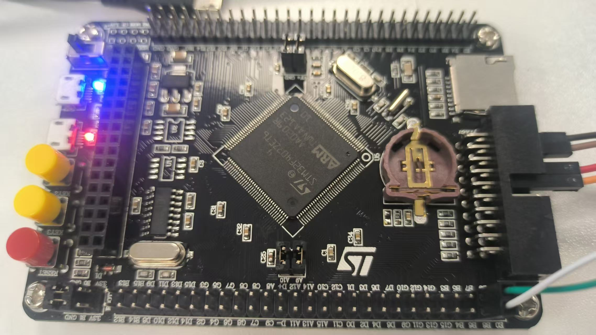

# STM32F407-Industrial-Board 开发板 BSP 说明

## 简介

本文档为 **工控F407迷你板**（本仓库 `stm32f407-industrial-board` BSP）的使用说明。

主要内容如下：

- 开发板资源介绍
- BSP 快速上手
- 进阶使用方法

通过阅读快速上手章节，可将 RT-Thread 运行在开发板上；进阶章节介绍如何通过 ENV / CubeMX 扩展更多外设。

## 开发板介绍

本 BSP 面向 **STM32F407ZET6**（LQFP144，512 KB Flash，192 KB SRAM）。支持 SWD 下载与 USB 虚拟串口。板上还预留外部 SPI Flash、TF 卡座及温湿度、姿态等传感器接口）。

开发板外观如下图所示：



该开发板常用 **板载资源** 如下：

- MCU：STM32F407ZET6，主频 168 MHz，512 KB Flash，192 KB SRAM
- 调试 / 串口：SWD + USB 转串口
- LED：LED1（PF10）、LED2（PF9）
- 按键：KEY0（PA0）、KEY1（PE4）
- 其它：TF 卡槽、传感器接口等

## 外设支持

本 BSP 目前对外设的支持情况如下：

| **板载外设** | **支持情况** | **备注** |
| :----------- | :----------: | :------- |
| DAPLink 虚拟串口 | 支持 | USART1：PB6 (TX)、PB7 (RX)，115200-8-1-N，控制台设备 `uart1` |
| LED | 支持 | PF10、PF9中交替闪烁 |
| 按键 | 支持 | KEY0 PA0（上升沿）、KEY1 PE4（下降沿），中断打印演示 |

## 使用说明

使用说明分为如下两个章节：

- **快速上手**：面向初次使用 RT-Thread 的开发者。
- **进阶使用**：通过 ENV、CubeMX 启用更多外设。

### 快速上手

本 BSP 提供 MDK5 工程，并支持通过 `scons` 生成 GCC / IAR 工程。以下以 MDK5 为例。

**请注意！！！**

编译前请在 BSP 目录打开 ENV，执行（用于拉取 HAL / CMSIS 等软件包，否则无法编译）：

```bash
pkgs --update
```

#### 硬件连接

使用 ST-Link 连接开发板与 PC（供电、下载或CH340G）。

#### 编译下载

双击 `project.uvprojx` 打开 MDK5 工程，编译并下载。

#### 运行结果

下载成功后程序自动运行：**LED1 / LED2 约 2 Hz 交替闪烁**；按下 KEY0 / KEY1 可在串口看到按键提示。

PC 端打开对应 COM 口（**115200-8-1-N**），复位后可见 RT-Thread 启动信息，例如：

```bash
 \ | /
- RT -     Thread Operating System
 / | \     5.x.x build ...
 2006 - 2024 Copyright by rt-thread team
Hello RT-Thread!
msh >
```

### 进阶使用

默认仅开启 **GPIO** 与 **UART1**。若需 SD 卡、外部 Flash、更多串口等：

1. 在 BSP 目录打开 ENV。
2. 执行 `menuconfig` 配置并保存。
3. 执行 `pkgs --update` 更新软件包。
4. 执行 `scons --target=mdk5`（或 `mdk4` / `iar`）重新生成工程。

更多说明请参考 [STM32 系列 BSP 外设驱动使用教程](../docs/STM32系列BSP外设驱动使用教程.md)。

## 注意事项

**调试串口（USART1）引脚**

| 信号 | 引脚 |
| ---- | ---- |
| TX | PB6 |
| RX | PB7 |

## 联系人信息

维护人:

-  [hywing](https://github.com/hywing)
