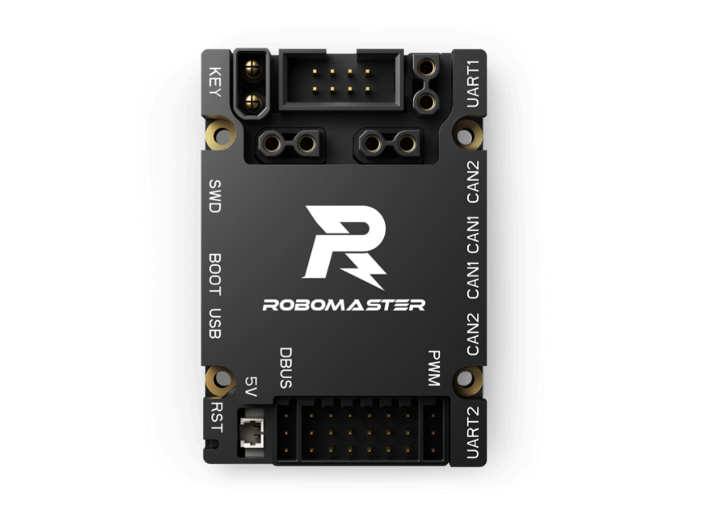

# STM32F407 Robomaster 开发板C型 BSP 说明

## 简介

本文档为 STM32F407 Robomaster 开发板C型 的 BSP (板级支持包) 说明。

主要内容如下：

- 开发板资源介绍
- BSP 快速上手
- 进阶使用方法

通过阅读快速上手章节开发者可以快速地上手该 BSP，将 RT-Thread 运行在开发板上。在进阶使用指南章节，将会介绍更多高级功能，帮助开发者利用 RT-Thread 驱动更多板载资源。

## 开发板介绍

Robomaster 开发板C型 是大疆创新科技有限公司推出的一款基于 ARM Cortex-M4 内核的开发板。开发板主控芯片为 STM32F407IGH6TR，最高主频为 168Mhz，拥有丰富的扩展接口和通信接口。板载IMU传感器，可配合RoboMaster出品的M3508、 M2006直流无刷减速电机、UWB模块以及妙算等产品使用，亦可配合DJI飞控SDK使用。

开发板外观如下图所示：



> 开发板 C 型具有如下外设：

该开发板常用 **板载资源** 如下：

- MCU：STM32F407IGH6TR, 主频 168MHz, 1024KB FLASH, 192KB RAM(含64KB CCM RAM)
- 常用外设
  - 三色 LED：LED_R(PH12), LED_G(PH11), LED_B(PH11), 
  - 按键：KEY(PA0)
  - 电压检测：ADC_BAT(PF10)
- 常用接口：UART 接口、CAN 总线接口、PWM 接口
- 调试接口：SWD


开发板的用户手册：[RoboMaster 开发板 C 型用户手册.pdf](https://rm-static.djicdn.com/tem/35228/RoboMaster%20%20%E5%BC%80%E5%8F%91%E6%9D%BF%20C%20%E5%9E%8B%E7%94%A8%E6%88%B7%E6%89%8B%E5%86%8C.pdf)

开发板更多详细信息请参考 RoboMaster官网：[RoboMaster开发板 C 型](https://www.robomaster.com/zh-CN/products/components/general/development-board-type-c/info) 

## 外设支持

本 BSP 目前对外设的支持情况如下：

| **板载外设** | **支持情况** | **备注**                             |
| :----------- | :----------: | :----------------------------------- |
| BMI088       |   暂不支持   | 六轴惯性测量单元（有软件包）            |
| IST8310      |   暂不支持   | 三轴磁力计                           |
| **片上外设** | **支持情况** | **备注**                             |
| GPIO         |     支持     | PA0, PA1... PH1 ---> PIN: 0, 1...144 |
| UART         |     支持     | UART1(FinSH),  UART3(DBUS),  UART6          |
| CAN          |     支持    | CAN1, CAN2                           |
| PWM          |   支持   | TIM1(CH1/2/3/4), TIM4(CH3), TIM5(CH1/2/3), TIM8(CH1/2/3) |
| SPI          |   支持   | SPI2 |
| IIC          |   支持   | 模拟IIC(SDA-->PF0, SCL-->PF1) |

## 使用说明

使用说明分为如下两个章节：

- 快速上手

    本章节是为刚接触 RT-Thread 的新手准备的使用说明，遵循简单的步骤即可将 RT-Thread 操作系统运行在该开发板上，看到实验效果 。

- 进阶使用

    本章节是为需要在 RT-Thread 操作系统上使用更多开发板资源的开发者准备的。通过使用[ENV 工具](https://docs.rt-thread.org/#/development-tools/env/env)对 BSP 进行配置，可以开启更多板载资源，实现更多高级功能。


### 快速上手

本 BSP 为开发者提供 MDK5 和 IAR 工程，并且支持 GCC 开发环境。下面以 MDK5 开发环境为例，介绍如何将系统运行起来。

#### 硬件连接

将准备好的 ST-Link/JLink/DapLink 与开发板连接，开发板上的调试接口为 MX1.25 4Pin。C板上没有电源指示灯，供电可以选用：调试接口的 3.3V 输入，micro USB 接口供电，XT30 电源输入。 

#### 编译下载

双击 project.uvprojx 文件，打开 MDK5 工程，编译并下载程序到开发板。

> 工程默认配置使用 ST-LINK 下载程序，点击下载按钮即可下载程序到开发板。

#### 运行结果

下载程序成功之后，系统会自动运行，观察开发板上 LED 的运行效果，LED 会以蓝光进行周期性闪烁。

此 BSP 的 FinSH 默认使用串口 1 ( C 板外壳上标有 UART2 的 4Pin 接口)，在终端工具里打开相应的串口（115200-8-1-N），复位设备后，可以看到 RT-Thread 的输出信息:

```bash
 \ | /
- RT -     Thread Operating System
 / | \     4.1.1 build Jul 29 2022 23:31:38
 2006 - 2022 Copyright by RT-Thread team
msh >
```
> 终端工具推荐使用 [MobaXterm](https://mobaxterm.mobatek.net/) 或 [Xshell](https://www.netsarang.com/en/free-for-home-school/)，均有免费的个人版本

### 进阶使用

此 BSP 默认只开启了 GPIO 和 UART1(丝印为 UART2 4pin 接口) 的功能，更多高级功能需要利用 ENV 工具对 BSP 进行配置，步骤如下：

1. 在 BSP 下打开 env 工具。

2. 输入 `menuconfig` 命令配置工程，配置好之后保存退出。

3. 输入 `pkgs --update` 命令更新软件包。

4. 输入 `scons --target=mdk4/mdk5/iar` 命令重新生成工程。

本章节更多详细的介绍请参考 [STM32 系列 BSP 外设驱动使用教程](../docs/STM32 系列 BSP 外设驱动使用教程. md)。

## 注意事项

- 部分外设需通过 XT30 或 USB 接口供电才能正常使用，包括 CAN、舵机5V供电、IMU恒温电路等
- 目前 scons 支持生成 cmake 配置文件，可以使用 CLion 进行 C板 的程序开发，推荐同学们尝试。详细步骤可参见：[在 Clion 中调试 rt-thread 工程](https://club.rt-thread.org/ask/article/2840.html)，C板的 openOCD 配置文件推荐选用 `stm32f4discovery.cfg` ，并将该配置文件的最后一行改为 `reset_config none`

## 联系人信息

维护人:

- [crazt](https://github.com/CraztTnspt) ，邮箱：<crazt@foxmail.com>
- [Meng](https://github.com/Meng2025) ，邮箱：<m@njust.edu.cn>

