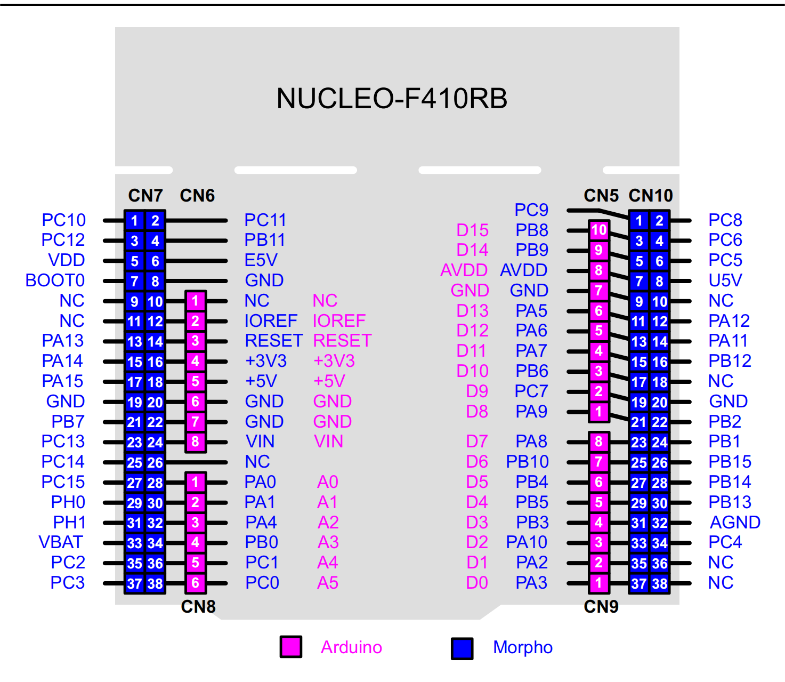

# The Arduino Compatible for STM32F410 Nucleo Board

**English** | [中文](README_zh.md)

## 1 RTduino - Arduino Ecosystem Compatibility Layer for RT-Thread

STM32F410 Nucleo board has support [RTduino](https://github.com/RTduino/RTduino). Users can use Arduino APIs, third party libraries and programming method to program on the board.

### 1.1 How to Enable RTduino

Please go to the [RTduino repository](https://github.com/RTduino/RTduino) to see the details.

```Kconfig
Hardware Drivers Config --->
    Onboard Peripheral Drivers --->
        [*] Compatible with Arduino Ecosystem (RTduino)
```

# 2 Arduino Pinout



This board complies with Arduino UNO pins layout. For more details, please take a look at: [pins_arduino.c](pins_arduino.c) and [pins_arduino.h](pins_arduino.h).

| Arduino Pin           | STM32 Pin | 5V Tolerate | Note                                                                                          |
| --------------------- | --------- | ----------- | --------------------------------------------------------------------------------------------- |
| 0 (D0)                | PA3       | Yes         | Serial-Rx. Token over by RT-Thread UART device by default                                     |
| 1 (D1)                | PA2       | Yes         | Serial-Tx. Token over by RT-Thread UART device by default                                     |
| 2 (D2)                | PA10      | Yes         | PWM1-CH3. Token over by RT-Thread PWM device by default                                       |
| 3 (D3)                | PB3       | Yes         |                                                                                               |
| 4 (D4)                | PB5       | Yes         |                                                                                               |
| 5 (D5)                | PB4       | Yes         |                                                                                               |
| 6 (D6)                | PB10      | Yes         |                                                                                               |
| 7 (D7)                | PA8       | Yes         |                                                                                               |
| 8 (D8)                | PA9       | Yes         | PWM1-CH2. Token over by RT-Thread PWM device by default                                       |
| 9 (D9)                | PC7       | Yes         |                                                                                               |
| 10 (D10)              | PB6       | Yes         |                                                                                               |
| 11 (D11)              | PA7       | Yes         | PWM1-CH1N. Token over by RT-Thread PWM device by default                                      |
| 12 (D12)              | PA6       | Yes         |                                                                                               |
| 13 (D13, LED_BUILTIN) | PA5       | Yes         | USER LED                                                                                      |
| 14 (D14)              | PB9       | Yes         | I2C-SDA. Token over by RT-Thread I2C device by default                                        |
| 15 (D15)              | PB8       | Yes         | I2C-SCL. Token over by RT-Thread I2C device by default                                        |
| 16 (D16)              | PC13      | Yes         | USER Button                                                                                   |
| A0                    | PA0       | Yes         | ADC1-CH0. Token over by RT-Thread ADC device by default                                       |
| A1                    | PA1       | Yes         | ADC1-CH1. Token over by RT-Thread ADC device by default                                       |
| A2                    | PA4       | Yes         | ADC1-CH4. Token over by RT-Thread ADC device by default                                       |
| A3                    | PB0       | Yes         | ADC1-CH8. Token over by RT-Thread ADC device by default                                       |
| A4                    | PC1       | Yes         | ADC1-CH11. Token over by RT-Thread ADC device by default                                      |
| A5                    | PC0       | Yes         | ADC1-CH10. Token over by RT-Thread ADC device by default                                      |
| A6                    | --        |             | On-chip internal voltage sensor. ADC1-CH17. Token over by RT-Thread ADC device by default     |
| A7                    | --        |             | On-chip internal temperature sensor. ADC1-CH16. Token over by RT-Thread ADC device by default |

> Notice:
> 
> 1. Don't use a same hardware timer to drive PWM (analogRead) and servos at same time, because hardware timers can only generate a same frequency for 4 PWM channels. Otherwise, it could cause a failure when drive servos.

> References
> 
> 1. [STM32 Nucleo-64 user manual](https://www.st.com/resource/en/user_manual/um1724-stm32-nucleo64-boards-mb1136-stmicroelectronics.pdf)

## 3 Communication

### 3.1 I2C Bus

I2C bus is `SCL/D15` and `SDA/D14` pins. Users can directly include the `#include <Wire.h>`, which is the Arduino official I2C header file, to use the I2C bus.

### 3.2 SPI Bus

This board doesn't support Arduino SPI header file and functions.

### 3.3 Serial

This board supports to use `Serial.` method to operate `uart2` device. See [example](https://github.com/RTduino/RTduino/blob/master/examples/Basic/helloworld.cpp).
