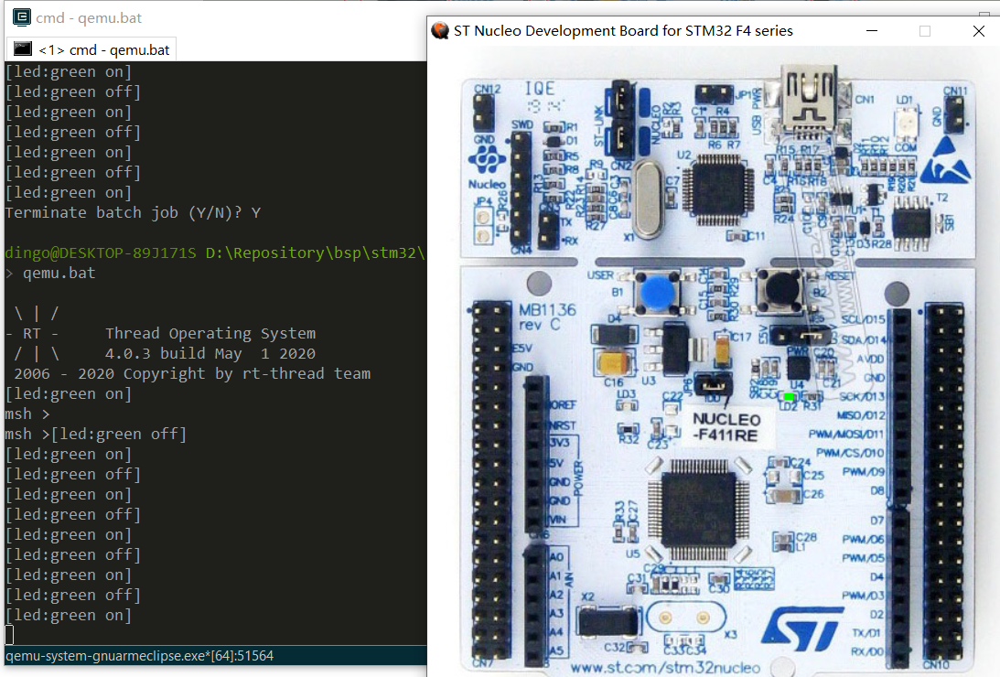

# QEMU/STM32F411-Nucleo-64开发板 BSP 说明

## 简介

QEMU/STM32F411-Nucleo-64是QEMU模拟器针对ST  STM32F411-Nucleo开发板进行软件模拟的指令级虚拟机。

主要是提供给开发者一定的便利，能够使用、验证一定的功能。

本文档介绍 STM32F411-Nucleo-64 开发板  提供的 BSP (板级支持包) 说明。

目前QEMU 版本是基于[xPack QEMU Arm v2.8.0-8](https://github.com/xpack-dev-tools/qemu-arm-xpack/releases/)

## 开发板介绍

探索者 STM32F411-Nucleo-64 是意法半导体推出的一款基于 ARM Cortex-M4 内核的开发板，最高主频为 100Mhz，该开发板具有丰富的板载资源，可以充分发挥 STM32F411RE 的芯片性能。

开发板外观如下图所示：


该开发板常用 ** 板载资源 ** 如下：

- MCU：STM32F411RET6，主频 100MHz，512KB FLASH ，128KB RAM。
- 常用外设
  - LED：3 个，USB communication (LD1), user LED (LD2), power LED (LD3) 。
  - 按键，2 个，USER and RESET 。
- 常用接口：USB 支持 3 种不同接口：虚拟 COM 端口、大容量存储和调试端口。
- 调试接口，板载 ST-LINK/V2-1 调试器。

开发板更多详细信息请参考意法半导体 [STM32F411-Nucleo-64 开发板介绍](https://www.st.com/en/evaluation-tools/nucleo-f411re.html)。

## 外设支持

本 BSP 目前对外设的支持情况如下：

| **片上外设** | **支持情况** |               **备注**                |
| :------------ | :----------: | :-----------------------------------: |
| GPIO         |     支持     | PA0, PA1... PH1 ---> PIN: 0, 1...63 |
| UART         |     支持     |              UART2 Console            |
| SDIO | 支持 | 参考qemu-vexpress-a9 实现，非真正的stm32 sdio 外设 |


## 使用说明

使用说明分为如下两个章节：

- 快速上手

    本章节是为刚接触 RT-Thread 的新手准备的使用说明，遵循简单的步骤即可将 RT-Thread 操作系统运行在该开发板上，看到实验效果 。

- 进阶使用

    本章节是为需要在 RT-Thread 操作系统上使用更多开发板资源的开发者准备的。通过使用 ENV 工具对 BSP 进行配置，可以开启更多板载资源，实现更多高级功能。


### 快速上手

本 BSP 为开发者提供VScode工程，支持 GCC 开发环境。下面以 VScode开发环境为例，介绍如何将系统运行起来。

#### QEMU环境下载及配置 

1. 使用本BSP, 开发者目前需要下载对应的QEMU 可执行环境，[下载地址](https://gitee.com/Gerryfan/qemu_gnu_armeclipse)
2. 将下载下来的xPacks 文件夹放在磁盘上一个位置,示例是放在ENV 工具的的QEMU 文夹夹下 `E:\env\tools\qemu`
3. 将此bsp 下的 qemu.bat  qemu-dbg.bat 中 qemu-system-gnuarmeclipse 执行路径 修改成 上一步保存的地址，即完成qemu 环境配置。 

#### 编译

1. 在 BSP 下打开 env 工具 。
2. 输入`scons` 命令进行编译 。

#### 运行结果

输入 `qemu.bat`  命令 观察开发板上 LED 的运行效果，绿色 LD2 会周期性闪烁。

ENV 工具中 可以看到 RT-Thread 的输出信息:

```bash
 \ | /
- RT -     Thread Operating System
 / | \     4.0.3 build May  1 2020
 2006 - 2020 Copyright by rt-thread team
 msh >
```


### 进阶使用

​	对于vscode 的使用 可参考 文档中心的 [**使用VS Code调试RT-Thread**](https://www.rt-thread.org/document/site/tutorial/qemu-network/qemu_vscode/qemu_vscode/)

​	下面简单介绍 可以上手的体验的几个例子：

1. 在 main.c 中 增加如下代码 可实现 按键中断触发控制 LED 亮灭 。

   ```
   /* defined the KEY pin: PC13 */
   #define USER_KEY_PIN           GET_PIN(C,13)
   void irq_callback(void *args)
   {
           rt_kprintf("user key is pressed \n");
           if(rt_pin_read(LED0_PIN) == PIN_LOW)
             rt_pin_write(LED0_PIN,PIN_HIGH);
           else
           {
               rt_pin_write(LED0_PIN,PIN_LOW);
           }
           
   }
   rt_pin_mode(USER_KEY_PIN, PIN_MODE_INPUT_PULLUP);
   rt_pin_attach_irq(USER_KEY_PIN,PIN_IRQ_MODE_FALLING,irq_callback,(void *)USER_KEY_PIN);
    rt_pin_irq_enable(USER_KEY_PIN,PIN_IRQ_ENABLE);
   ```

2. 按如下配置  使用 sd卡 文件系统测试例子。

   使用env 配置工具 配置 `Hardware Drivers Config`    ->  `Board extended module Drivers`   使能 `Enable SDCARD (pl180)`  。

   编译运行后，即显示如下效果：

   ```
    \ | /
   - RT -     Thread Operating System
    / | \     4.0.3 build May  3 2020
    2006 - 2020 Copyright by rt-thread team
   [I/SDIO] SD card capacity 65536 KB.
   
    mount is start
   file system initialization done!
   msh />
   ```

   

## 注意事项

1. 目前版本qemu 还不支持硬件浮点运算，所以rtconfig.py gcc  编译选项中改为软件方式  `-mfloat-abi=soft `。

2. sd 设备 目前qemu  模拟的不是 真实的stm32 sdio 设备 ， qemu  中 sd 卡设备  参考的是 qemu-vexpress-a9 的实现方式 。
3. 目前时钟配置 暂不支持使用 。

## 联系人信息

维护人:

- [XiaojieFan](https://github.com/XiaojieFan) ，邮箱：<dingo1688@126.com>