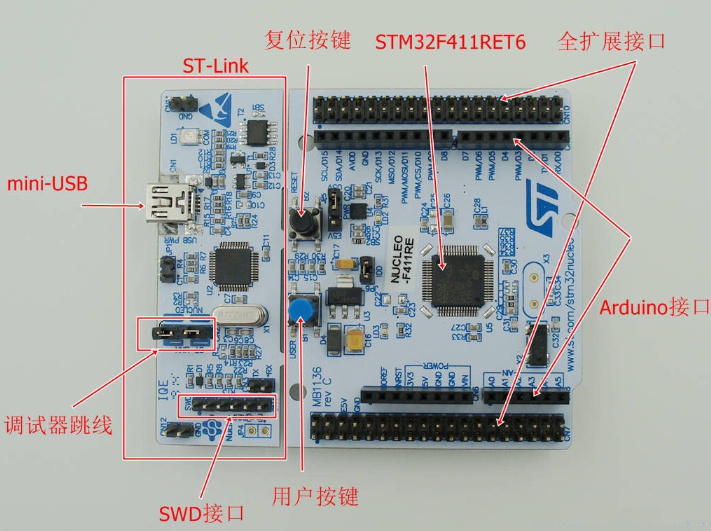
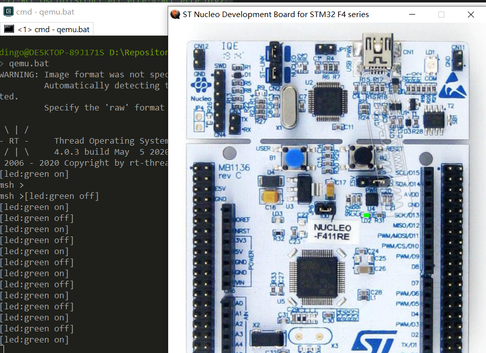

# STM32F411-Nucleo-64 开发板 BSP 说明

## 简介

本文档为 RT-Thread 开发团队为 STM32F411-Nucleo-64 开发板提供的 BSP (板级支持包) 说明。

主要内容如下：

- 开发板资源介绍
- BSP 快速上手
- 进阶使用方法

通过阅读快速上手章节开发者可以快速地上手该 BSP，将 RT-Thread 运行在开发板上。在进阶使用指南章节，将会介绍更多高级功能，帮助开发者利用 RT-Thread 驱动更多板载资源。

## 开发板介绍

探索者 STM32F411-Nucleo-64 是意法半导体推出的一款基于 ARM Cortex-M4 内核的开发板，最高主频为 100Mhz，该开发板具有丰富的板载资源，可以充分发挥 STM32F411RE 的芯片性能。

开发板外观如下图所示：



该开发板常用 ** 板载资源 ** 如下：

- MCU：STM32F407ZGT6，主频 100MHz，512KB FLASH ，128KB RAM。
- 常用外设
  - LED：3 个，USB communication (LD1), user LED (LD2), power LED (LD3) 。
  - 按键，2 个，USER and RESET 。
- 常用接口：USB 支持 3 种不同接口：虚拟 COM 端口、大容量存储和调试端口。
- 调试接口，板载 ST-LINK/V2-1 调试器。

开发板更多详细信息请参考意法半导体 [STM32F411-Nucleo-64 开发板介绍](https://www.st.com/en/evaluation-tools/nucleo-f411re.html)。

## 外设支持

本 BSP 目前对外设的支持情况如下：

| **片上外设** | **支持情况** |               **备注**                |
| :------------ | :----------: | :-----------------------------------: |
| GPIO         |     支持     | PA0, PA1... PH1 ---> PIN: 0, 1...63 |
| UART         |     支持     |              UART2             |

## 使用说明

使用说明分为如下两个章节：

- 快速上手

    本章节是为刚接触 RT-Thread 的新手准备的使用说明，遵循简单的步骤即可将 RT-Thread 操作系统运行在该开发板上，看到实验效果 。

- 进阶使用

    本章节是为需要在 RT-Thread 操作系统上使用更多开发板资源的开发者准备的。通过使用 ENV 工具对 BSP 进行配置，可以开启更多板载资源，实现更多高级功能。


### 快速上手

本 BSP 为开发者提供 MDK5 和 IAR 工程，并且支持 GCC 开发环境。下面以 MDK5 开发环境为例，介绍如何将系统运行起来。

#### 硬件连接

使用 Type-A to Mini-B 线连接开发板和 PC 供电，红色 LED LD3 (PWR) 和 LD1 (COM) 会点亮。

#### 编译下载

双击 project.uvprojx 文件，打开 MDK5 工程，编译并下载程序到开发板。

> 工程默认配置使用 ST-LINK 下载程序，点击下载按钮即可下载程序到开发板。

#### 运行结果

下载程序成功之后，系统会自动运行，观察开发板上 LED 的运行效果，红色 LD3 和 LD1 常亮、绿色 LD2 会周期性闪烁。

USB 虚拟 COM 端口默认连接串口 2，在终端工具里打开相应的串口（115200-8-1-N），复位设备后，可以看到 RT-Thread 的输出信息:

```bash
 \ | /
- RT -     Thread Operating System
 / | \     3.1.1 build Nov 19 2018
 2006 - 2018 Copyright by rt-thread team
msh >
```
### 进阶使用

此 BSP 默认只开启了 GPIO 和 串口 2 的功能，更多高级功能需要利用 ENV 工具对 BSP 进行配置，步骤如下：

1. 在 BSP 下打开 env 工具。

2. 输入 `menuconfig` 命令配置工程，配置好之后保存退出。

3. 输入 `pkgs --update` 命令更新软件包。

4. 输入 `scons --target=mdk4/mdk5/iar` 命令重新生成工程。

本章节更多详细的介绍请参考 [STM32 系列 BSP 外设驱动使用教程](../docs/STM32 系列 BSP 外设驱动使用教程. md)。

# QEMU使用说明

在没有硬件开发板情况下，为便于使用和调试验证一定的功能，可以使用QEMU 模拟器来 实现 。

目前此版本 QEMU 模拟器 支持 GPIO , UART 外设(作为控制台) 及 文件系统 验证功能 ，使用vscode 进行 相关调试开发 。

QEMU 的使用可参考文档中心 [QEMU调试](https://www.rt-thread.org/document/site/tutorial/qemu-network/qemu_vscode/qemu_vscode/)

目前QEMU 版本是基于[xPack QEMU Arm v2.8.0-8](https://github.com/xpack-dev-tools/qemu-arm-xpack/releases/)

# QEMU使用步骤

## QEMU环境下载及配置

1. 开发者目前需要下载对应的QEMU 可执行环境，[下载地址](https://gitee.com/Gerryfan/qemu_gnu_armeclipse)

2. 将下载下来的xPacks 文件夹放在磁盘上一个位置,示例是放在ENV 工具的的QEMU 文夹夹下 `E:\env\tools\qemu`

3. 复制 bsp/qemu-vexpress-a9  中的 .vscode 文件夹，qemu.bat  qemu-dbg.bat 

4. 修改 qemu.bat 中 ` E:\env\tools\qemu\xPacks\@xpack-dev-tools\qemu-arm\2.8.0-8.1\.content\bin\qemu-system-gnuarmeclipse --board NUCLEO-F411RE --image rtthread.elf -sd sd.bin `

5. 修改qemu-dbg.bat `start E:\env\tools\qemu\xPacks\@xpack-dev-tools\qemu-arm\2.8.0-8.1\.content\bin\qemu-system-gnuarmeclipse  --board NUCLEO-F411RE --mcu STM32F411RE  --image rtthread.elf  -S -s -sd sd.bin`

6. 将rtconfig.py 中 浮点相关编译选项改为 软实现 `-mfloat-abi=soft`  。

7. 注释掉 board.c 中 SystemClock_Config(void)  函数中内容 ，使其成为空函数，因为目前版本qemu 暂不支持时钟配置。

   

   ## 编译及运行

   1. 在ENV 工具中 使用 `scons `  命令编译。
   2. 编译成功后，在ENV 工具中输入 `qemu.bat` 命令 开始运行 qemu ,显示效果为 绿色LED 灯 周期性闪烁 。

   

# QEMU进阶使用

1. scode 调试功能 可参考 文档中心的 [**使用VS Code调试RT-Thread**](https://www.rt-thread.org/document/site/tutorial/qemu-network/qemu_vscode/qemu_vscode/)

2. 在 main.c 中 增加如下代码 可实现 按键中断触发控制 LED 亮灭 。

   ```
   /* defined the KEY pin: PC13 */
   #define USER_KEY_PIN           GET_PIN(C,13)
   void irq_callback(void *args)
   {
           rt_kprintf("user key is pressed \n");
           if(rt_pin_read(LED0_PIN) == PIN_LOW)
             rt_pin_write(LED0_PIN,PIN_HIGH);
           else
           {
               rt_pin_write(LED0_PIN,PIN_LOW);
           }
           
   }
   rt_pin_mode(USER_KEY_PIN, PIN_MODE_INPUT_PULLUP);
   rt_pin_attach_irq(USER_KEY_PIN,PIN_IRQ_MODE_FALLING,irq_callback,(void *)USER_KEY_PIN);
    rt_pin_irq_enable(USER_KEY_PIN,PIN_IRQ_ENABLE);
   ```

3. 文件系统使用及测试。

   ① 复制 bsp/qemu-vexpress-a9   drivers 文件夹下 drv_sdio.c drv_sdio.h SConscript  三个文件到  新建文件夹drivers 下 。

   ② 复制 bsp/qemu-vexpress-a9  applications 文件夹下 mnt.c 到 applications 下 。

   ③ 修改 applications 下 SConscript , 将 src 下 增加 mnt.c 。

   ④ 修改 board 下 Kconfig 文件 ，在最后增加 qemu 相关 配置

   ```
   menu "Board extended module Drivers"
   
   endmenu
   
   menu "Board USE QEMU"
       config BSP_USING_SDCARD
   
           bool "Enable SDCARD (pl180)"
   
           select RT_USING_SDIO
   
           select RT_USING_DFS
   
           select RT_USING_DFS_ELMFAT
   
           default n
   
   endmenu 
   
   endmenu
   ```

   ⑤ ENV 工具下 配置 使能 `BSP_USING_SDCARD `   保存后 ，使用 `Scons `  命令编译。

   ⑥ ENV 工具下 运行 `qemu.bat`  显示如下 结果：

   ```
    \ | /
   - RT -     Thread Operating System
    / | \     4.0.3 build May  3 2020
    2006 - 2020 Copyright by rt-thread team
   [I/SDIO] SD card capacity 65536 KB.
   file system initialization done!
   msh />
   ```

   

   

   

## 注意事项

1. qemu sd 设备 目前qemu  模拟的不是 真实的stm32 sdio 设备 ， qemu  中 sd 卡设备  参考的是 qemu-vexpress-a9 的实现方式 。

## 联系人信息

维护人:

- [misonyo](https://github.com/misonyo) ，邮箱：<misonyo@foxmail.com>
- [XiaojieFan](https://github.com/XiaojieFan) ，邮箱：[dingo1688@126.com](mailto:dingo1688@126.com)