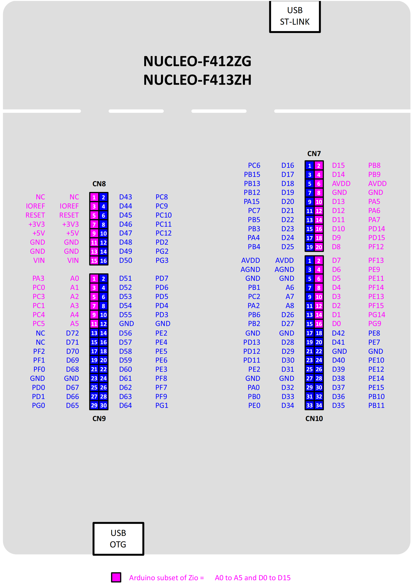

# STM32F412 Nucleo开发板的Arduino生态兼容说明

## 1 RTduino - RT-Thread的Arduino生态兼容层

STM32F412 Nucleo开发板已经完整适配了[RTduino软件包](https://github.com/RTduino/RTduino)，即RT-Thread的Arduino生态兼容层。用户可以按照Arduino的编程习惯来操作该BSP，并且可以使用大量Arduino社区丰富的库，是对RT-Thread生态的极大增强。更多信息，请参见[RTduino软件包说明文档](https://github.com/RTduino/RTduino)。

### 1.1 如何开启针对本BSP的Arduino生态兼容层

Env 工具下敲入 menuconfig 命令，或者 RT-Thread Studio IDE 下选择 RT-Thread Settings：

```Kconfig
Hardware Drivers Config --->
    Onboard Peripheral Drivers --->
        [*] Compatible with Arduino Ecosystem (RTduino)
```

## 2 Arduino引脚排布



该BSP遵照Arduino UNO板的引脚排列方式。详见 `pins_arduino.c`

| Arduino引脚编号 | STM32引脚编号 | 5V容忍 | 备注                                     |
| ----------- | --------- | ---- | -------------------------------------- |
| 0 (D0)      | PG9       | 是    | Serial-Rx，默认被RT-Thread的UART设备框架uart3接管 |
| 1 (D1)      | PG14      | 是    | Serial-tx，默认被RT-Thread的UART设备框架uart3接管 |
| 2 (D2)      | PF15      | 是    |                                        |
| 3 (D3)      | PE13      | 是    | PWM（定时器1发生）                            |
| 4 (D4)      | PF14      | 是    |                                        |
| 5 (D5)      | PE11      | 是    | PWM（定时器1发生）                            |
| 6 (D6)      | PE9       | 是    | PWM（定时器1发生）                            |
| 7 (D7)      | PF13      | 是    |                                        |
| 8 (D8)      | PF12      | 是    |                                        |
| 9 (D9)      | PD15      | 是    | PWM（定时器4发生）                            |
| 10 (D10)    | PD14      | 是    | PWM（定时器4发生）                            |
| 11 (D11)    | PA7       | 是    | PWM（定时器14发生）                           |
| 12 (D12)    | PA6       | 是    |                                        |
| 13 (D13)    | PA5       | 是    |                                        |
| 14 (D14)    | PB9       | 是    | 默认为I2C1-SDA，被RT-Thread的I2C设备框架i2c1总线接管 |
| 15 (D15)    | PB8       | 是    | 默认为I2C1-SCL，被RT-Thread的I2C设备框架i2c1总线接管 |
| 16 (D16)    | PC13      | 是    | 板载用户按键（左侧蓝色）                           |
| 17 (D17)    | PB0       | 是    | 板载用户LED1 (LED_BUILTIN)                 |
| 18 (D18)    | PB7       | 是    | 板载用户LED2                               |
| 19 (D19)    | PB14      | 是    | 板载用户LED3                               |
| A0          | PA3       | 是    | ADC                                    |
| A1          | PC0       | 是    | ADC                                    |
| A2          | PC3       | 是    | ADC                                    |
| A3          | PC1       | 是    | ADC                                    |
| A4          | PC4       | 是    | ADC                                    |
| A5          | PC5       | 是    | ADC                                    |
| A6          | --        |      | 芯片内部参考电压 ADC                           |
| A7          | --        |      | 芯片内部温度 ADC                             |

> 注意：
> 
> 1. 驱动舵机和analogWrite函数要选择不同定时器发生的PWM信号引脚，由于STM32的定时器4个通道需要保持相同的频率，如果采用相同的定时器发生的PWM分别驱动舵机和analogWrite，可能会导致舵机失效。
> 2. Nucleo板的Arduino接口中AVDD（即AREF）默认是与VDD相连的，如果需要扩展板提供外部参考电压，需要将SB57锡桥挑开。

> 参考资料
> 
> 【1】[STM32 Nucleo-144板官方手册](https://www.st.com/resource/en/user_manual/um1974-stm32-nucleo144-boards-mb1137-stmicroelectronics.pdf)

## 3 通信

### 3.1 I2C总线

I2C总线是板上丝印的 `SCL/D15` 和 `SDA/D14` 引脚，这两个引脚默认是被RT-Thread I2C设备框架接管的，直接引用`#include <Wire.h>`（Arduino官方I2C头文件）即可使用。

### 3.2 SPI总线

目前本BSP不支持使用Arduino的SPI功能。

### 3.3 串口

本BSP通过 `Serial.` 方法调用 `uart3` 串口设备。详见[例程](https://github.com/RTduino/RTduino/blob/master/examples/Basic/helloworld.cpp)。
