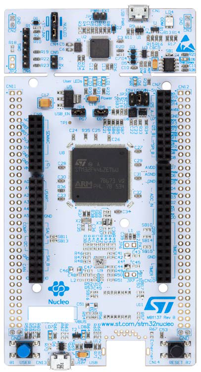

# NUCLEO-F413ZH 开发板 BSP 说明

## 简介

本文档为 RT-Thread 开发团队为 NUCLEO-F413ZH 开发板的 BSP (板级支持包) 说明。

主要内容如下：

- 开发板资源介绍
- BSP 快速上手
- 进阶使用方法

通过阅读快速上手章节开发者可以快速地上手该 BSP，将 RT-Thread 运行在开发板上。在进阶使用指南章节，将会介绍更多高级功能，帮助开发者利用 RT-Thread 驱动更多板载资源。

## 开发板介绍

探索者 NUCLEO-F413ZH 是意法半导体推出的一款基于 ARM Cortex-M4 内核的开发板，最高主频为 100Mhz，该开发板具有丰富的板载资源，可以充分发挥 NUCLEO-F413ZH 的芯片性能。

开发板外观如下图所示：



该开发板常用 **板载资源** 如下：

- MCU：STM32F413ZH，主频 100MHz，1536KB FLASH ，320KB RAM
- 常用外设
  - LED：8个，user LED (JP5跳帽需连接)(黄色，PB0，LD1；蓝色，PB7，LD2；红色，PB14，LD3), USB communication (LD4), over current (LD5), power LED (黄色，LD6), USB FAULT (LD7), VBUS (LD8)。
  - 按键：2个，B1（USER，PC13），B2（RESET）
- 常用接口：USB 支持 3 种不同接口：虚拟 COM 端口、大容量存储和调试端口等。
- 调试接口，板载 ST-LINK/V2-1 调试器。

开发板更多详细信息请参考意法半导体 [NUCLEO-F413ZH 开发板介绍](https://www.st.com/content/st_com/en/products/evaluation-tools/product-evaluation-tools/mcu-mpu-eval-tools/stm32-mcu-mpu-eval-tools/stm32-nucleo-boards/nucleo-f413zh.html)。

## 外设支持

本 BSP 目前对外设的支持情况如下：

| **板载外设** | **支持情况** | **备注**                              |
| :------------ | :----------: | :-----------------------------------: |
|STLINK TO USART|     支持    |                  UART3                 |

| **片上外设** | **支持情况** |               **备注**                |
| :------------ | :----------: | :-----------------------------------: |
| GPIO         |     支持     |                                        |
| UART         |     支持     |              UART2/3                   |
| SPI          |     支持     |              SPI2                      |
| I2C          |     支持     |              I2C1(软件模拟)            |
| TIMER        |     支持     |              TIM11/13/14               |
| PWM          |     支持     |              PWM2_CH4                  |
| ADC          |     支持     |              ADC1_IN5                  |
| RTC          |     支持     |     支持外部晶振和内部低速时钟         |
| WDT          |     支持     |             独立看门狗                 |
| Onchip Flash |     支持     |             片上Flash                  |
| USB OTG_FS   |     支持     |         OTGFS as USB device            |
| Onchip Flash |     支持     |             片上Flash                  |
| USB Device   |     支持     |         OTGFS as USB device            |
| RNG          |     支持     |       Random Number Generator          |
| UDID         |     支持     |     Unique Device Identifier           |

## 使用说明

使用说明分为如下两个章节：

- 快速上手

    本章节是为刚接触 RT-Thread 的新手准备的使用说明，遵循简单的步骤即可将 RT-Thread 操作系统运行在该开发板上，看到实验效果 。

- 进阶使用

    本章节是为需要在 RT-Thread 操作系统上使用更多开发板资源的开发者准备的。通过使用 ENV 工具对 BSP 进行配置，可以开启更多板载资源，实现更多高级功能。


### 快速上手

本 BSP 为开发者提供 MDK4、MDK5 和 IAR 工程，并且支持 GCC 开发环境。下面以 MDK5 开发环境为例，介绍如何将系统运行起来。

#### 硬件连接

使用 Type-A to Micro-B 线连接开发板和 PC 供电，黄色 LED LD6 (PWR) 和 LD4 (COM) 会点亮。

#### 编译下载

双击 project.uvprojx 文件，打开 MDK5 工程，编译并下载程序到开发板。

> 工程默认配置使用 板载ST-LINK 仿真器下载程序，在通过 Micro USB线 连接开发板的基础上，点击下载按钮即可下载程序到开发板

#### 运行结果

下载程序成功之后，系统会自动运行，在JP5跳帽连接时，观察开发板上LD1的运行效果，黄色LED会周期性闪烁。

连接开发板对应串口到 PC , 在终端工具里打开相应的串口（115200-8-1-N），复位设备后，可以看到 RT-Thread 的输出信息:

```bash
 \ | /
- RT -     Thread Operating System
 / | \     4.0.3 build Apr 28 2020
 2006 - 2020 Copyright by rt-thread team
msh >
```
### 进阶使用

此 BSP 默认只开启了 GPIO 和 UART3 的功能，更多高级功能需要利用 ENV 工具对 BSP 进行配置，步骤如下：

1. 在 bsp 下打开 env 工具。

2. 输入`menuconfig`命令配置工程，配置好之后保存退出。

3. 输入`pkgs --update`命令更新软件包。

4. 输入`scons --target=mdk4/mdk5/iar` 命令重新生成工程。

本章节更多详细的介绍请参考 [STM32 系列 BSP 外设驱动使用教程](../docs/STM32系列BSP外设驱动使用教程.md)。

## 注意事项

暂无

## 联系人信息

维护人:

- [flybreak](https://github.com/XYX12306) ，邮箱：<2669599387@qq.com>