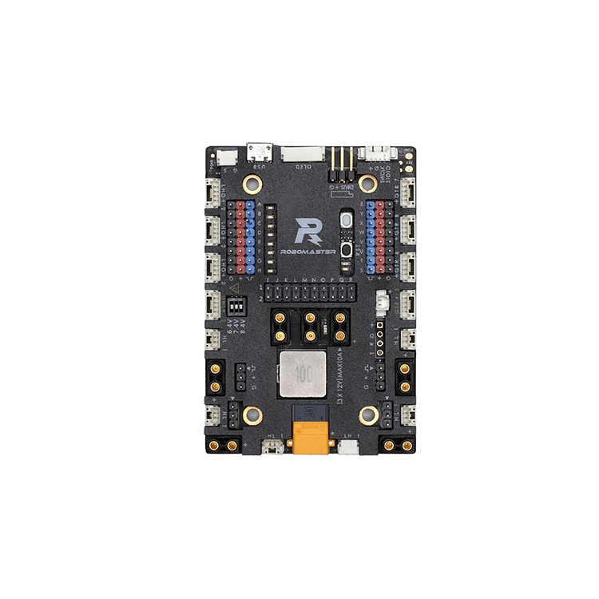

# STM32F427 RoboMaster A板 BSP 说明

## 简介

本文档为 RoboMaster A板 开发板的 BSP (板级支持包) 说明。

主要内容如下：

- 开发板资源介绍
- BSP 快速上手
- 进阶使用方法

通过阅读快速上手章节开发者可以快速地上手该 BSP，将 RT-Thread 运行在开发板上。在进阶使用指南章节，将会介绍更多高级功能，帮助开发者利用 RT-Thread 驱动更多板载资源。

## 开发板介绍

RoboMaster开发板套件是一款面向机器人DIY的开源主控套件。开发板主控芯片为STM32F427IIH6，拥有丰富的扩展接口和通信接口，板载IMU传感器，可配合RoboMaster出品的M3508、 M2006直流无刷减速电机、UWB模块以及妙算等产品使用，亦可配合DJI飞控SDK使用，配件丰富。

开发板外观如下图所示：



该开发板常用 **板载资源** 如下：

- MCU：STM32f427IIH6，主频 180MHz，2048KB FLASH ，256KB RAM(含64KB CCM RAM未使用)
- 常用外设
  - LED：2个，D10（红色，PE11），D9（绿色，PE14）
  - 按键：1个，KEY（PB2）
- 常用接口：SD 卡接口 OLED接口 
- 调试接口，标准 JTAG/SWD

开发板更多详细信息请参考 RoboMaster官网 [RoboMaster A板开发板介绍](https://www.robomaster.com/zh-CN/products/components/general/development-board)。

## 外设支持

本 BSP 目前对外设的支持情况如下：

| **板载外设**      | **支持情况** | **备注**                              |
| :----------------- | :----------: | :------------------------------------- |
| SD卡              |   支持   |                                       |
| CAN               |   支持   |    需通过24vXT30接口或usb接口供电          |
| **片上外设**      | **支持情况** | **备注**                              |
| GPIO              |     支持     | PA0, PA1... PK15 ---> PIN: 0, 1...176 |
| UART              |     支持     | UART1/3/6/7/8                         |
| SPI               |   暂不支持   | SPI5                                  |
| I2C               |   暂不支持   |                                       |
| SDIO              |   暂不支持   | 即将支持                              |
| RTC               |    不支持    |                                       |
| PWM               |   暂不支持   | 即将支持                              |
| **扩展模块**      | **支持情况** | **备注**                              |
| 无                |...           |  ...

## 使用说明

使用说明分为如下两个章节：

- 快速上手

    本章节是为刚接触 RT-Thread 的新手准备的使用说明，遵循简单的步骤即可将 RT-Thread 操作系统运行在该开发板上，看到实验效果 。

- 进阶使用

    本章节是为需要在 RT-Thread 操作系统上使用更多开发板资源的开发者准备的。通过使用 ENV 工具对 BSP 进行配置，可以开启更多板载资源，实现更多高级功能。


### 快速上手

本 BSP 为开发者提供 MDK5 和 IAR 工程，并且支持 GCC 开发环境。下面以 MDK5 开发环境为例，介绍如何将系统运行起来。

#### 硬件连接

使用usb或j-link连接开发板到 PC。

#### 编译下载

双击 project.uvprojx 文件，打开 MDK5 工程，编译并下载程序到开发板。

> 工程默认配置使用 xxx 仿真器下载程序，在通过 xxx 连接开发板的基础上，点击下载按钮即可下载程序到开发板

#### 运行结果

下载程序成功之后，系统会自动运行，绿色LED灯闪烁 。

连接开发板对应串口到 PC , 在终端工具里打开相应的串口（115200-8-1-N），复位设备后，可以看到 RT-Thread 的输出信息:

```bash
 \ | /
- RT -     Thread Operating System
 / | \     4.0.2 build Sep  1 2019
 2006 - 2019 Copyright by rt-thread team
msh >
```
### 进阶使用

此 BSP 默认只开启了 GPIO 和 串口6 的功能，如果需使用 SD 卡、Flash 等更多高级功能，需要利用 ENV 工具对BSP 进行配置，步骤如下：

1. 在 bsp 下打开 env 工具。

2. 输入`menuconfig`命令配置工程，配置好之后保存退出。

3. 输入`pkgs --update`命令更新软件包。

4. 输入`scons --target=mdk4/mdk5/iar` 命令重新生成工程。

本章节更多详细的介绍请参考 [STM32 系列 BSP 外设驱动使用教程](../docs/STM32系列BSP外设驱动使用教程.md)。

## 注意事项

- 1. 由于本开发板的电源设计较为复杂。使用本开发板时，**强烈建议您通过24v直流XT30接口(上图中下方黄色电源接口) 进行供电** ，此时红色电源指示灯(位于黑色按键下方)会亮起。否则可能导致部分板载外设（例如CAN通信）因无法上电而无法正常使用，详情请参见官方提供的原理图。

## 联系人信息

维护人:
- [a1012112796](https://github.com/a1012112796)